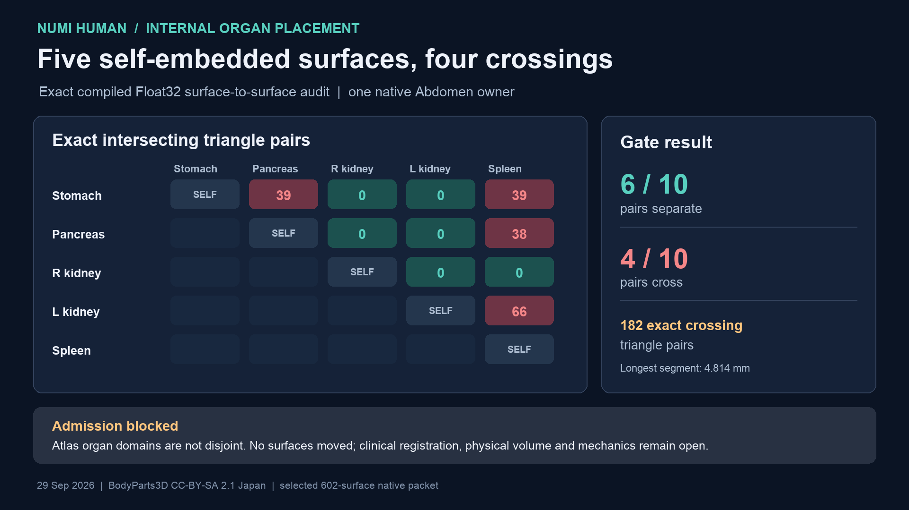

# Compiled abdominal organ separation gate - 29 September 2026

The selected native Human anatomy packet has five source-named whole-organ
representations that are each a **single closed, oriented, exactly
self-intersection-free compiled surface**: stomach, pancreas, right kidney,
left kidney and spleen. Those per-surface results do **not** imply that the
five domains are separate. A new source-bound exact pairwise audit checks
all ten unordered pairs in their shared native Abdomen frame.



| Compiled organ pair | Exact crossing triangle pairs | Longest detected intersection segment |
| --- | ---: | ---: |
| Stomach - pancreas | 39 | 2.029 mm |
| Stomach - spleen | 39 | 4.814 mm |
| Pancreas - spleen | 38 | 2.708 mm |
| Left kidney - spleen | 66 | 2.286 mm |
| Other six pairs | 0 | Their closed domains pass exact outside/outside parity |

All 182 positive triangle pairs contain a segment or polygon intersection;
none is classified as a lone point contact. A separate
[transverse witness](media/abdominal-organ-separation-20260929/transverse-witness-v1.json)
uses an independent double-precision edge/plane and barycentric calculation
to confirm one strict crossing in each failed organ pair. The complete counts
come from exact rational predicates on the emitted Float32 metre coordinates.
The audit therefore **fails** the five-organ separation gate. It writes the
[full receipt](media/abdominal-organ-separation-20260929/receipt-v1.json) and
exits 2 by design; the failed result must not be promoted to a physical
volume, non-overlapping organs, or clinically correct registration.

The five source members are FJ2564, FJ1895, FJ3147, FJ3145 and FJ2561.
Their source IDs, hashes, 579-surface baseline, 602-surface selected packet,
independently audited native source-rest packet/pose, prior exact-quotient
census and current per-surface embeddedness are checked before any pair
result is accepted. All five surfaces have native body index 7 (Abdomen), so
one common rigid pose cannot remove or create a crossing. The triangles were
not moved, clipped, capped or reclassified. The caudate liver lobe is not
included as a whole liver: its exact source type is an organ component.

This covers ten pairs among five named organ representations, not all 579
anatomy surfaces, aggregate/descendant overlaps, connected lumens, cartilage,
skin enclosure, or moving/deforming organ contact. The source atlas has a
measured placement conflict that requires independently justified
registration or replacement anatomy before those four domain relationships
can be admitted. Minimizing crossings alone would not establish clinical
position, shape or tissue boundaries.

Reproduce with the pinned retained inputs (expected exit 2):

```sh
PYTHONPATH=src OPENBLAS_NUM_THREADS=1 .venv-mujoco312/bin/python \
  -m numilab_human.abdominal_organ_separation \
  --baseline-payload Build/whole-visceral-coverage-20260929/payload.verified/source-organ-family-anatomy.nhanatomy \
  --selected-payload Docs/media/right-eye-laterality-20260929/candidate/right-eye-laterality-candidates.nhanatomy \
  --selected-manifest Docs/media/right-eye-laterality-20260929/candidate/right-eye-laterality-candidates.manifest.json \
  --selected-report Docs/media/whole-body-embeddedness-20260929/selected-surface-gate.json \
  --census-archive Docs/media/whole-body-embeddedness-20260929/quotient-census.tar.gz \
  --native-audit Docs/media/right-eye-laterality-20260929/native-selected-audit.json \
  --native-pack Build/right-eye-laterality-cleanup-20260929/native/source-rest/views/myosim-fullbody-articulated-bodyparts-bones-source-torso-anatomy-focus-body-20.mrvpack \
  --pose Docs/media/right-eye-laterality-20260929/native/myosim-fullbody-articulated-bodyparts-bones-source-torso-anatomy-focus-body-20.torso-anatomy-poses.json \
  --output Docs/media/abdominal-organ-separation-20260929/receipt-v1.json
```
