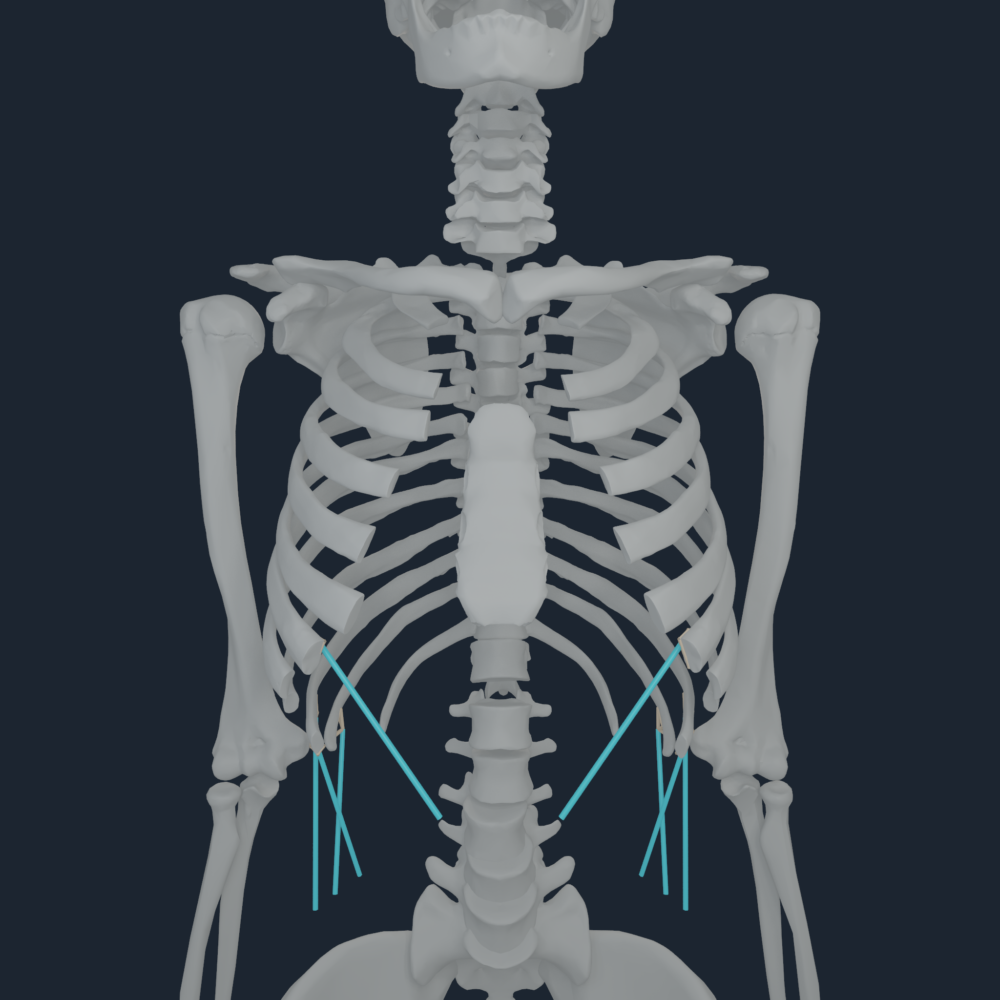
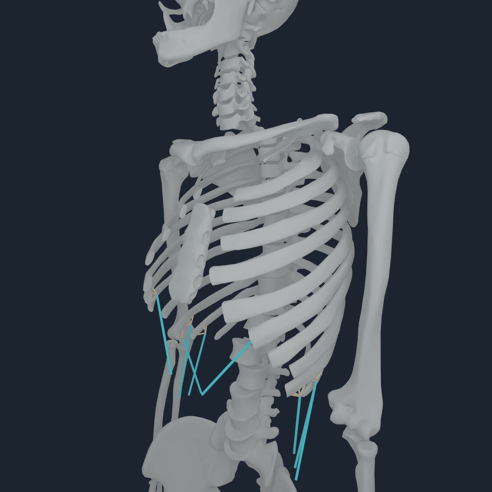
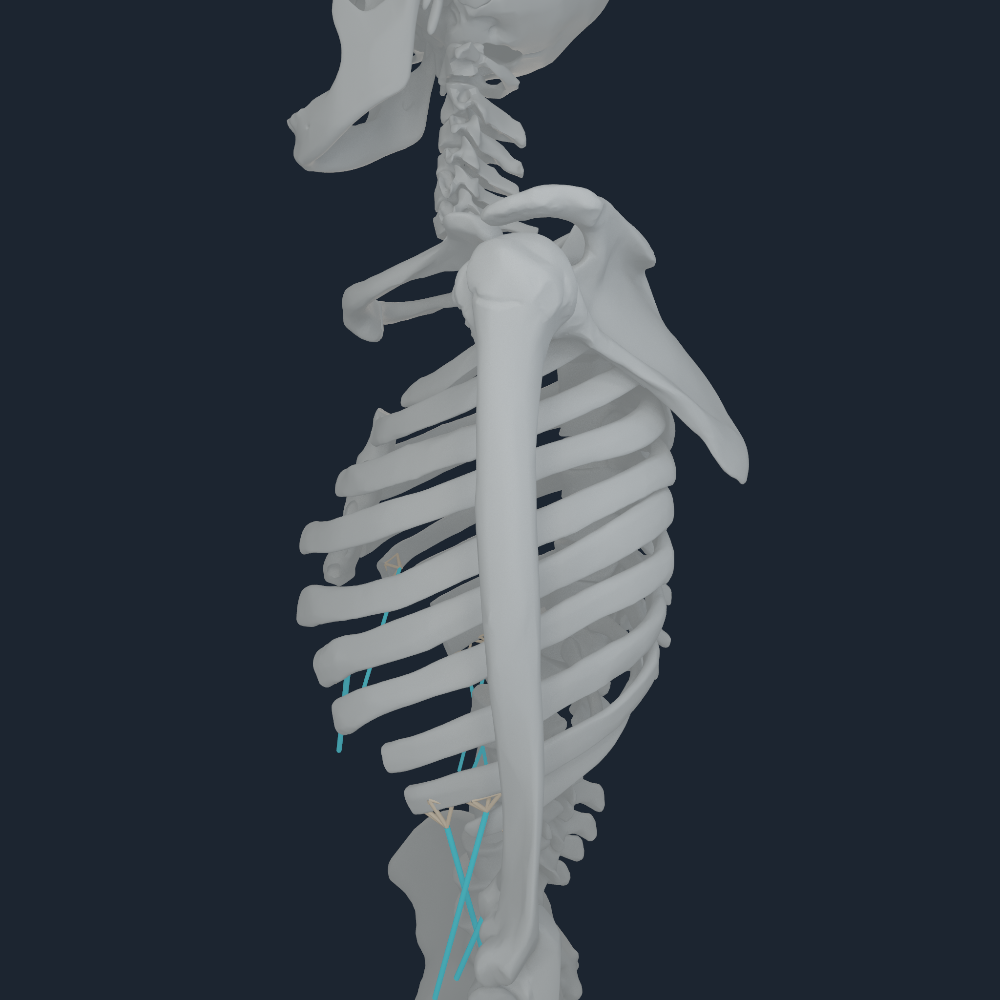
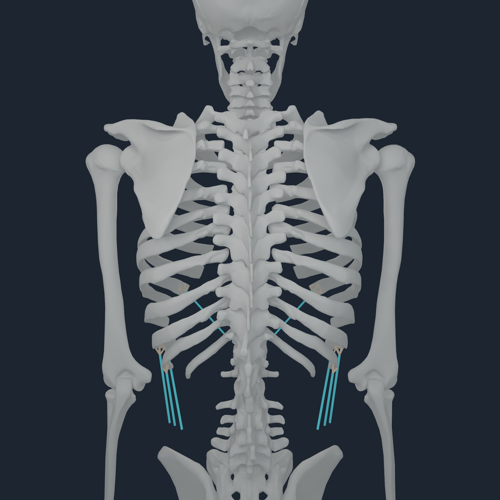

# Abdominal source-component entheses v1

## Result

The compiler no longer guesses a rib from an ambiguous `torso` body name. It
joins each of the 20 unresolved abdominal endpoints to its audited nearest
triangle on pinned MyoSim `torso_geom_13_ribcage_s`, resolves that triangle's
exact connected component, and reuses the promoted source-rib-to-BodyParts3D
correspondence. The resulting classification is:

| Exact source class | Endpoints | Mechanical disposition |
| --- | ---: | --- |
| lateral rib component | 10 | eight admitted envelopes; EO3 bilateral remain distance-gated candidates |
| anterior thorax non-rib component | 8 | exact point law pending costal-cartilage/sternum/fascia mechanics |
| source-model non-bone | 2 | exact point law pending soft-tissue ownership |

The source atlas gives the two EO4 sides slightly different nearest component
classes. A sub-millimetre nearest-surface tie is not enough authority to make
one side bone-owned and the other non-bone, so both remain point-owned. The
receipt moves no endpoint and adds no joint.

## Newly admitted force-transfer laws

The exact admitted set is bilateral EO1 insertion, EO5 origin, EO6 origin, and
IO5 origin on ribs 7, 10, 11, and 10 respectively. Seven pass the existing
topology-aware support search directly. `IO5_l` is recovered by a deterministic
32-candidate exact-surface stencil, not by gate relaxation:

| `IO5_l` measure | Value |
| --- | ---: |
| BodyParts3D member | left rib 10, `FJ3225` |
| source-to-surface distance | `11.1678626 mm` |
| patch radius | `11.4541754 mm` |
| sampled total-force amplification | `3.1650397` |
| force residual | `1.12e-15` |
| moment residual | `3.96e-17 m` |
| endpoint migration | `0 mm` |

The ordinary 12 mm distance, 12 mm patch radius, 4.0 amplification, force, and
moment gates are unchanged. The broader support stencil adds connected-vertex
3-D extrema but every node remains on the exact owning bone surface.

## Determinism and compiled coverage

Two independent compiles are byte-identical:

| Artifact | SHA-256 |
| --- | --- |
| registration receipt | `554971c3c67951a6de47a9b6315e887a9403e5d84c8cd33348580b01566d95db` |
| `NHBONES1` | `9791203ec0abee93670c7eafe9f991939ff249cd7076e91b717f2ebc6f97c163` |
| `NHTENDON3` | `8e585d82256e1a25e270395c984ca9d793a9def28c8f9e3f282ccb607687e640` |
| tendon manifest | `dc41673fd5b0bfc993d6b0bdc00bdd6eefeca4b1a1d48bec390428fd017c9f57` |

The promoted payload contains 832 mechanical endpoint laws: 628 distributed
envelopes, including 18 route-private migrated envelopes, and 204 exact source
point laws. Surface coverage is 75.480769%; maximum admitted sampled force
amplification remains 3.9272869 and maximum migration remains 17.2616479 mm.

## Apple M4 Pro execution and visual review

The exact paired payload passes the native reference probe on Apple M4 Pro:

| Gate | Result |
| --- | ---: |
| CPU force residual | `7.31036e-05 N` |
| CPU moment residual | `7.11716e-06 N m` |
| Metal max force residual | `0.000244141 N` |
| Metal max moment residual | `8.12571e-06 N m` |
| Metal nodal-force parity error | `0.000119714 N` |
| Metal tendon replay | byte-identical |

  
  
  
  

All four 2048 px frames were inspected directly. The eight tan envelopes remain
on their intended inferior rib surfaces and the bilateral source routes meet
them without a side swap or detached fan. The visual manifest and raw M4 probe
transcripts are retained beside the frames.

## Evidence boundary and next mechanics owner

These are executable tendon-force transfer laws, not deformable tendons or a
clinical enthesis atlas. The cyan strands are exact source route centrelines.
The eight anterior non-rib sites must transfer through explicit costal
cartilage/sternum/fascia mechanics; attaching them to the nearest rib would be
an anatomical error. Bilateral EO3 are the only new rib-registration candidates.
The 11 pre-existing conditioning failures remain point laws because the wider
exact-surface search could not satisfy the existing amplification gate.

The full standing solve still reports `balanced=false`. This increment proves
ownership, force/moment conservation, deterministic replay, and four-angle
placement only.
