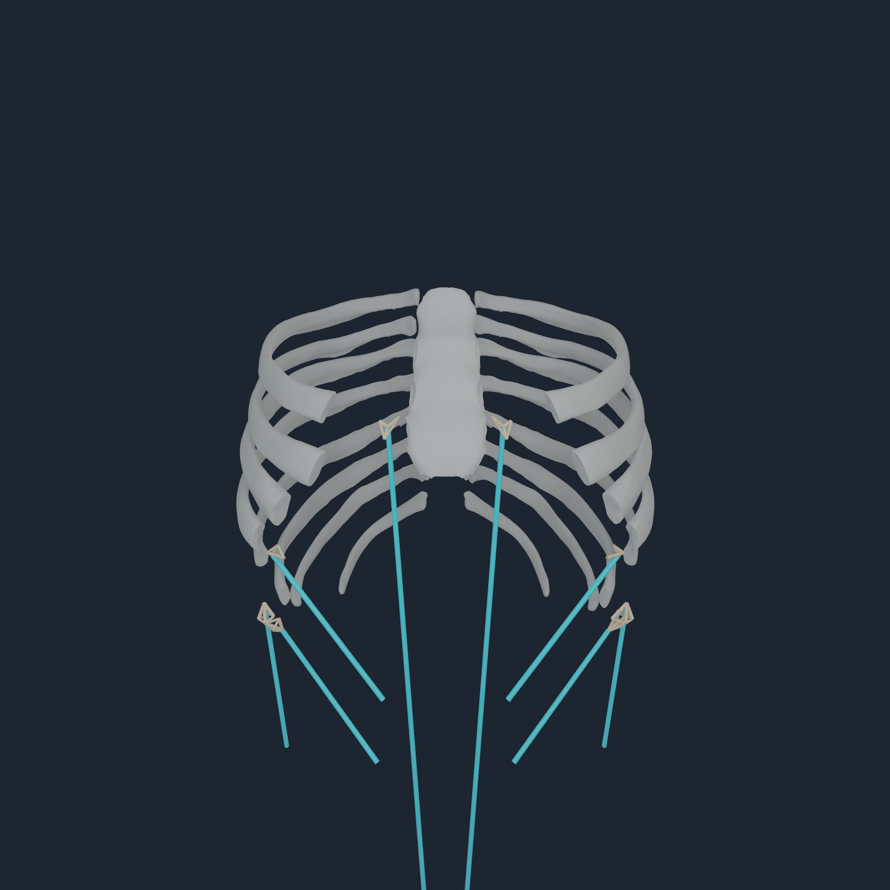
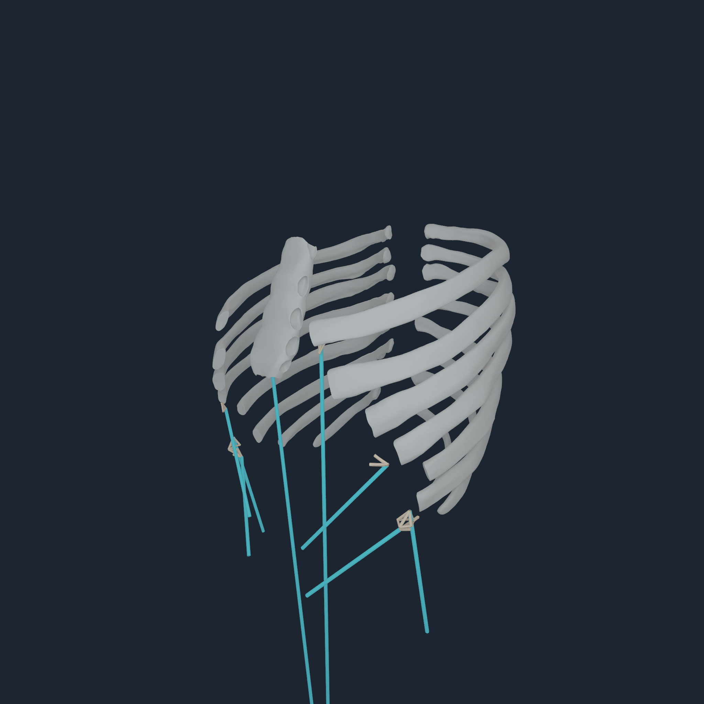
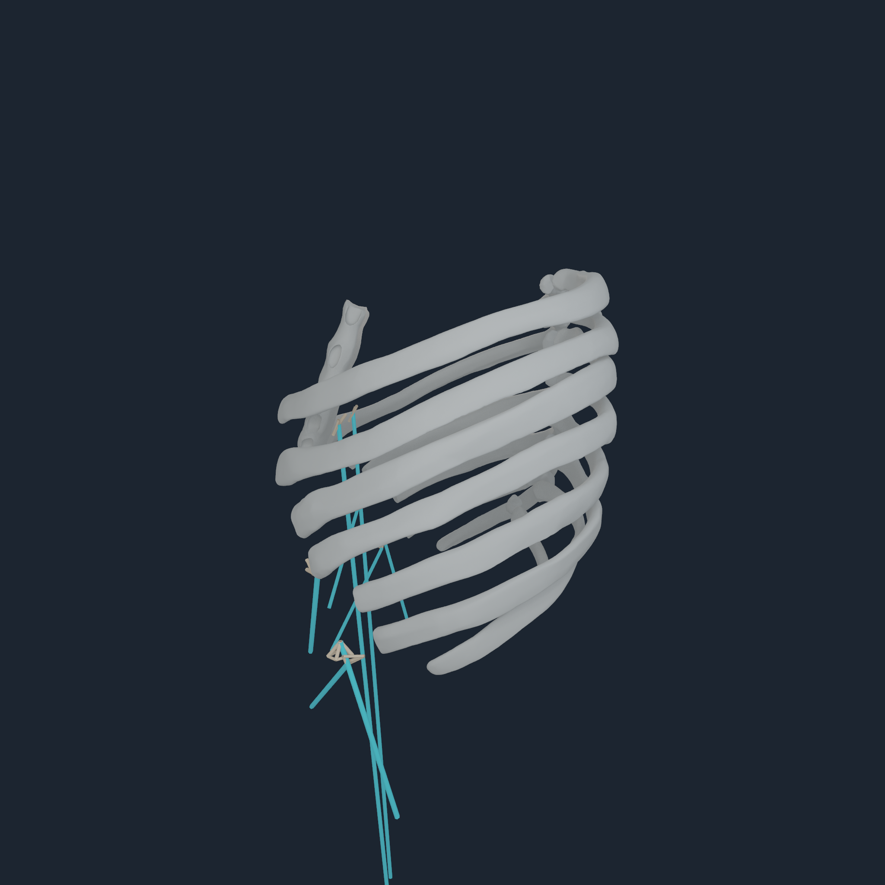
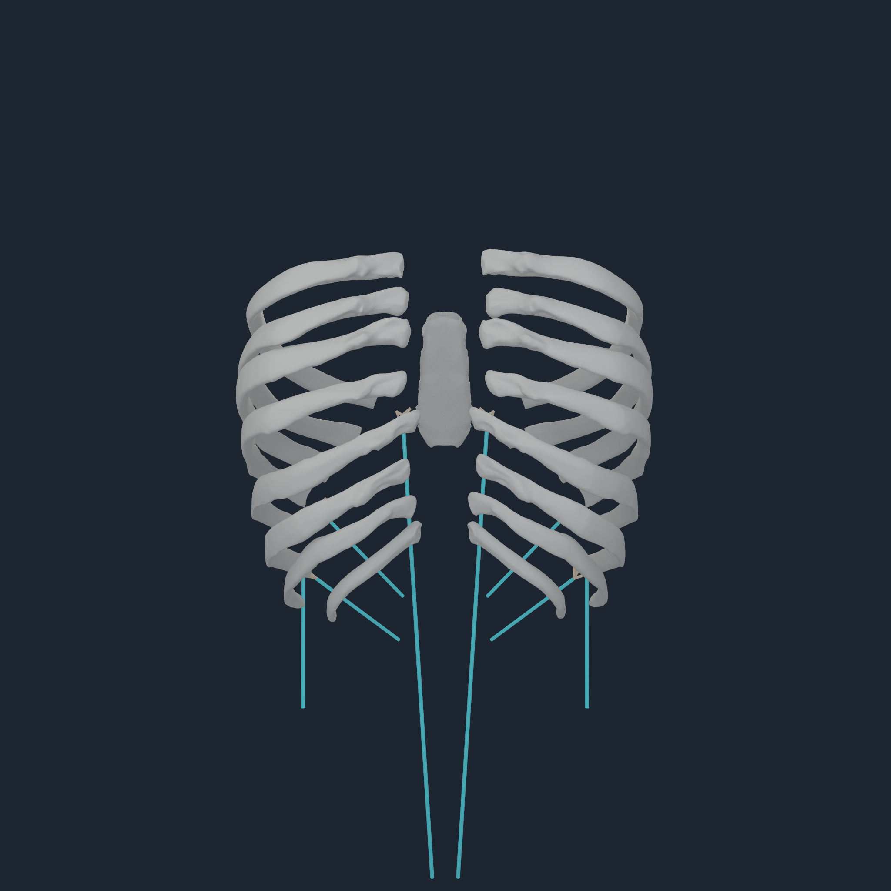

# Anterior thorax composite force transfer v3

## Result

Eight abdominal endpoints that previously remained exact point laws now use
force- and moment-conserving four-node envelopes on their exact pinned MyoSim
thorax components. They are bilateral rectus abdominis insertions plus the
`EO2`, `EO4`, and `IO4` thorax-side endpoints.

The compiler reports these as
`registered_source_composite_surface_distributed_envelope`. It does not call
the surface bone, costal cartilage, sternum, fascia, or a material model. The
source `ribcage_s` mesh joins multiple anterior thorax tissues and does not
provide that tissue identity. Preserving the composite label is more accurate
than redirecting the endpoints to a nearby BodyParts3D rib or cartilage.

## Source and anatomy decision

Seven endpoints resolve to exact connected component 1, a closed 723-vertex,
1,450-triangle anterior thorax surface. Left `EO4` resolves to component 17, a
closed 92-vertex, 180-triangle surface. Both component identity and canonical
vertex/triangle content are pinned in the v2 abdominal receipt.

The named BodyParts3D sternum and 14 costal-cartilage meshes were tested in the
same registered torso frame. `EO2` is about 9.0--9.1 mm from seventh costal
cartilage and `IO4` is about 12.0--12.2 mm away, but rectus abdominis is
13.8--17.7 mm from the closest named cartilage/sternum and `EO4` is about
27.9 mm from seventh cartilage. BodyParts3D 4.0 has named costal cartilage only
through level 7. Applying one cartilage label or moving a rib therefore fails
the bilateral and anatomical-preservation tests.

The source review did not find a superior freely accessible, source-authored
abdominal aponeurosis mesh that composes cleanly with this model. Z-Anatomy is
largely derived from BodyParts3D and the reviewed SPL abdominal atlas does not
provide this terminal connective-tissue segmentation. BodyParts3D remains the
named atlas; the exact MyoSim component remains the endpoint geometry
authority. See the [BodyParts3D archive](https://dbarchive.biosciencedbc.jp/data/bodyparts3d/LATEST/README.html),
[Z-Anatomy source description](https://github.com/Z-Anatomy/Models-of-human-anatomy/blob/master/Readme.md),
and [SPL Abdominal Atlas](https://www.openanatomy.org/atlas-pages/atlas-spl-abdomen.html).

## Unchanged mechanical gates

| Endpoint | Component | Distance | Patch radius | Force amplification |
| --- | ---: | ---: | ---: | ---: |
| `rect_abd_r` insertion | 1 | `0.116441 mm` | `9.483225 mm` | `1.002220` |
| `rect_abd_l` insertion | 1 | `0.116442 mm` | `9.483225 mm` | `1.002220` |
| `EO2_r` origin | 1 | `3.254521 mm` | `11.717635 mm` | `1.815267` |
| `EO2_l` origin | 1 | `3.254521 mm` | `11.717633 mm` | `1.815266` |
| `EO4_r` origin | 1 | `8.234923 mm` | `8.769176 mm` | `2.526536` |
| `EO4_l` origin | 17 | `7.825670 mm` | `9.968444 mm` | `2.999043` |
| `IO4_r` origin | 1 | `7.600262 mm` | `8.871224 mm` | `2.434372` |
| `IO4_l` origin | 1 | `7.600252 mm` | `8.871228 mm` | `2.251424` |

Every endpoint remains below the existing 12 mm distance and patch gates and
the 4.0 sampled-force-amplification gate. Force residuals are below
`9e-16`; moment residuals are below `1.5e-17 m`; endpoint migration is zero.
Two independent compiles are byte-identical.

Current artifact fingerprints:

| Artifact | SHA-256 |
| --- | --- |
| v3 registration receipt | `2e3ea4d809fe66f30d5725c4de2863a32af733a439900d57aca979d7243973ee` |
| `NHBONES1` | `a13a3318d72657aadfc64c84e29543be448e35ee3f92352145f5c0af5b29ab99` |
| `NHTENDON3` | `7ac100609a0ff14ce88f5bc0141bc32dcc5b24e8a9b8a42c9968067a8e52e3be` |
| tendon manifest | `3376281de67c1ea939cc68f90e29f974656295dc1b3d47c884ebff32ecf3e3f7` |
| registration worklist | `2e92e8a3f0acd2435bc736317af2eabfaa3ae71657288ad7a7539254eefb6c3e` |

Coverage is now 638 distributed surface envelopes and 194 point laws. Exactly
628 envelopes terminate on registered BodyParts3D bones; two use the EO3
source-rib fallback and eight use the separately typed anterior-thorax
composite surface.

## Apple M4 Pro execution

Runtime revision `864a65c916c1d52318e263469f673d3336d696b6` accepts the
exact payload:

| Gate | Result |
| --- | ---: |
| endpoint transfers | `832` |
| distributed envelopes | `638` |
| exact point laws | `194` |
| Metal force residual | `0.000244141 N` |
| Metal moment residual | `8.12571e-06 N m` |
| Metal nodal parity error | `0.000119714 N` |
| Metal replay | byte-identical |
| persistent accepted steps | `128` |
| persistent terminal transfers | `106,496` |
| persistent envelope transfers | `81,664` |
| persistent point transfers | `24,832` |
| borrowed consumer | exact same-command-buffer snapshot |
| injected rejection | prior accepted result preserved |
| direct rigid-state effect | bitwise-identical output-only; no direct joint torque |
| persistent replay | bitwise |

The controller remains `balanced=false`; this is attachment-transfer and
transaction evidence, not assistance-free standing.

## Four-angle diagnostic inspection

  
  
  
  

All four original 2048 px frames were inspected. Every cyan route terminates
continuously in its tan four-node envelope with correct bilateral placement.
The views deliberately show only sternum and ribs 5--12 as BodyParts context.
The exact composite source geometry is not yet rendered, so some patches
correctly appear in the cartilage/aponeurosis space rather than on a grey bone.
These are mechanics diagnostics, not realistic presentation renders.

The raw [reference probe](media/numi-human-anterior-thorax-composite-v3-2048/m4-reference-probe.txt),
[persistent probe](media/numi-human-anterior-thorax-composite-v3-2048/m4-persistent-stand-probe.txt),
[visual probe](media/numi-human-anterior-thorax-composite-v3-2048/m4-visual-probe.txt),
visual manifest, frames, and checksums are retained together.

## Deformable-owner boundary

This increment establishes the exact load boundary needed by a future
deformable costal-margin/aponeurosis body. It is still a terminal
force-transfer law. It does not create a tissue volume, constitutive response,
contact, damage, breathing mechanics, or two-way tissue reaction.

The next production step is not another bone offset. It is to preserve these
closed component surfaces in a native attachment-surface payload, classify
their named BodyParts overlap and missing lower-costal extent, generate a
converged volumetric or MPM discretization, and replace—not duplicate—the
corresponding rigid `J^T` force share when returning tissue reactions.
