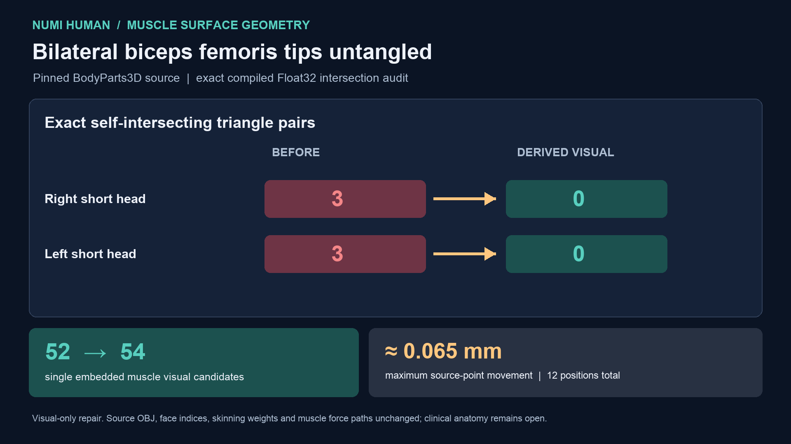

# Bilateral biceps femoris short-head visual tip untangle — 29 September 2026

The pinned BodyParts3D `FJ1444` and `FJ1444M` source OBJ members each contain
three exact self-intersecting triangle pairs near one tip. This is present in
the source geometry and in the previous compiled NHTISS4 packet. A separately
identified **derived visual candidate** now moves two exactly coincident
source-point groups per side across their local source face planes. It changes
six point records per surface, by at most approximately **0.065 mm**, and does
not change the original OBJ files or triangle indices.



Both derived meshes remain single, closed, oriented surfaces and have **zero
exact self-intersecting triangle pairs** in their emitted Float32 geometry.
The [full 150-surface v4 exact census](media/muscle-surface-embeddedness-20260929/receipt-v4.json)
raises single embedded muscle visual candidates from **52 to 54 of 148**.
The remaining muscle and tendon states are 60 closed self-intersecting,
two open/nonmanifold intersecting and four open/nonmanifold without detected
intersections; no tendon is an admitted closed volume.

The [source-bound delta receipt](media/biceps-tip-visual-untangle-20260929/receipt-v1.json)
compares the complete old and new 30 MB packets built against the **same**
registration. Their headers, all 150 surface records, every body binding,
every triangle index, every skinning weight and every non-target vertex
record are byte-identical. Exactly 32 vertex records differ: six positions
and normals on 16 records per side (including those six). A separate delta
verifier replays the point-group displacement from the exact source member
hashes, then checks the emitted Float32 positions and all 150 prior/current
census rows. The minimum local triangle-area ratio is about 0.862; the
minimum old/new face normal cosine is about 0.917. No face collapses or flips.

This removes one measured bilateral **visual mesh defect**, not an anatomical
validation. The two derived source shapes are not independently registered
against medical images. No muscle route, attachment force, tissue material,
contact, physical volume or sustained standing result is changed. A fresh
native rendered pose was not captured while another Metal solver owned the GPU;
the board's 10-second standing clip predates this geometry. The exact native
rendering and loaded-contact gates remain open.

Reproduce from the retained source and matching registration:

```sh
NUMI_HUMAN_PYTHON="$PWD/.venv-mujoco312/bin/python" \
PYTHONPATH=Sources/myosim/checkout OPENBLAS_NUM_THREADS=1 \
  .numi/commands/human myosim-bodyparts-fullbody-muscle-surface-payload \
  --sources Sources \
  --registration Build/anatomy-orientation-20260929/final.registration.json \
  --artifact Build/myosim-fullbody \
  --output Build/biceps-tip-visual-untangle-20260929/matched
PYTHONPATH=src OPENBLAS_NUM_THREADS=1 .venv-mujoco312/bin/python \
  -m numilab_human.muscle_surface_embeddedness \
  --payload Build/biceps-tip-visual-untangle-20260929/matched/bodyparts3d-myosim-fullbody-muscle-surfaces.nhtissue \
  --manifest Build/biceps-tip-visual-untangle-20260929/matched/bodyparts3d-myosim-fullbody-muscle-surfaces.manifest.json \
  --output Build/biceps-tip-visual-untangle-20260929/embeddedness-matched-v4.json
PYTHONPATH=src OPENBLAS_NUM_THREADS=1 .venv-mujoco312/bin/python \
  -m numilab_human.muscle_tip_visual_delta \
  --old-payload Build/tendon-harmonic-boundary-20260929/full/bodyparts3d-myosim-fullbody-muscle-surfaces.nhtissue \
  --old-manifest Build/tendon-harmonic-boundary-20260929/full/bodyparts3d-myosim-fullbody-muscle-surfaces.manifest.json \
  --old-census Docs/media/muscle-surface-embeddedness-20260929/receipt-v3.json \
  --new-payload Build/biceps-tip-visual-untangle-20260929/matched/bodyparts3d-myosim-fullbody-muscle-surfaces.nhtissue \
  --new-manifest Build/biceps-tip-visual-untangle-20260929/matched/bodyparts3d-myosim-fullbody-muscle-surfaces.manifest.json \
  --new-census Build/biceps-tip-visual-untangle-20260929/embeddedness-matched-v4.json \
  --source-root Sources \
  --output Docs/media/biceps-tip-visual-untangle-20260929/receipt-v1.json
```
