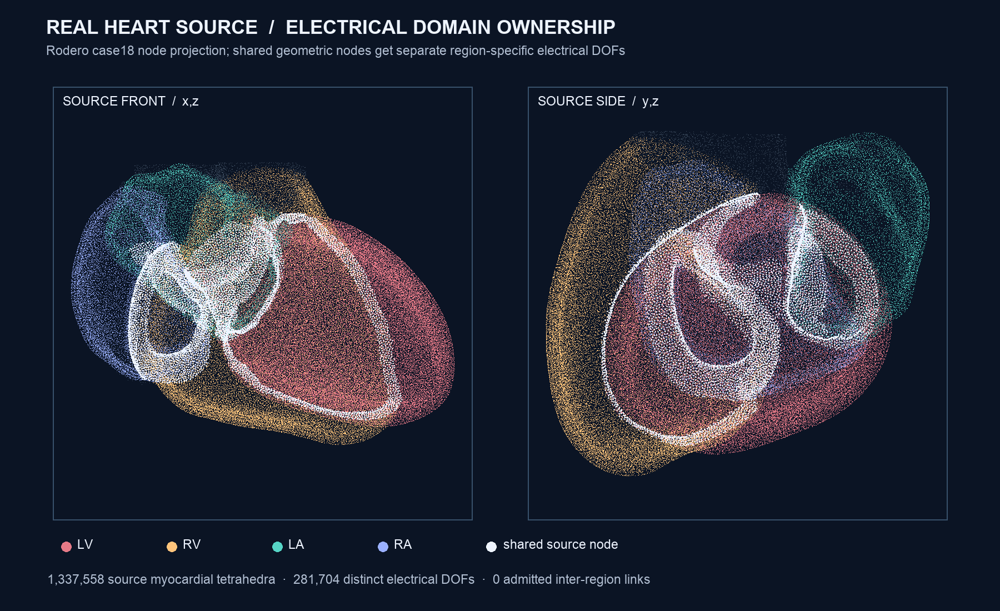

# Region-owned cardiac electrical geometry reference

The retained Rodero case18 heart mesh now has a source-bound **passive electrical
geometry reference**. It uses all 1,337,558 source myocardial tetrahedra
(labels 1–4), the original node positions and fibre/sheet fields, and assigns
281,704 electrical degrees of freedom keyed by **(myocardial region, source
node)**. An independent verifier checks every key and the entire region volume
against the pinned 300,965-node / 1,470,083-tetrahedron source asset.

This closes a specific ownership hazard. The four myocardial regions share
geometric nodes. Reusing one electrical value per source node would silently
connect regions at sites where the source has no admitted conduction law:

| Region pair | Shared geometric nodes |
| --- | ---: |
| LV / RV | 2,631 |
| LV / LA | 1,550 |
| LV / RA | 253 |
| RV / LA | 0 |
| RV / RA | 2,290 |
| LA / RA | 701 |

These are pairwise counts; nodes in three regions appear more than once. The
274,315 unique physical source nodes therefore expand to 281,704 electrical
DOFs, with 7,389 additional region-specific identities. **No inter-region
electrical edge is admitted.** This is deliberately fail-closed at the atrial,
ventricular and valve interfaces; it does not assert that real myocardium has
no conduction there. Septal, AV and Purkinje connections require explicit
source and physiological evidence before they can be added.



The image is a two-view point projection of the actual CT-derived source
nodes. White points have more than one myocardial region identity. It is a
geometry/ownership visualization, not simulated voltage or activation.

## What executed

The reference computes linear-tetrahedron gradients and geometric lumped
capacity on each region. It derives an orthonormal fibre/sheet/normal basis
from the **unchanged** source vectors and measures the three unit-direction
energy contributions. Their sum agrees with the unit isotropic finite-element
energy. A deterministic, positive, *dimensionless* source-coordinate probe
then takes one conservative passive diffusion step in each isolated region.
The step parameter has units of m²; no conductivity, capacitance, voltage or
physical time was inferred.

| Region | Source tetrahedra | Electrical DOFs | Geometric capacity | Probe energy drop | Relative measure error |
| --- | ---: | ---: | ---: | ---: | ---: |
| LV | 722,773 | 139,642 | 87.6857 mL | 0.2459% | 1.39e-16 |
| RV | 374,761 | 81,066 | 45.0249 mL | 0.1762% | 0 |
| LA | 113,895 | 28,639 | 14.2927 mL | 0.0314% | 0 |
| RA | 126,129 | 32,357 | 15.7912 mL | 0.9032% | 0 |

Each region's mass-like geometric measure is conserved, energy decreases,
and recomputing the candidate field is bitwise identical. These are **offline
numerical checks**, not evidence of a physiological action potential or a
beating heart. The run used the local Apple M4 CPU on macOS 26.6, took 1.89 s,
and peaked at 1.011 GB resident memory with zero swaps. It performed **zero
physical or native electrical steps**. The source Rodero mesh import and
hydraulic Shi–Hose/CVSim steps remain distinct evidence lineages.

The [producer result](media/cardiac-electrical-reference-20260930/summary.json),
[independent source/DOF gate](media/cardiac-electrical-reference-20260930/independent-gate.json),
[source-node IDs](media/cardiac-electrical-reference-20260930/electrical-dof-source-nodes.u32le),
and [region labels](media/cardiac-electrical-reference-20260930/electrical-dof-region-labels.u32le)
are hash-bound. The gate independently rebuilds the DOF ordering and four
regional geometric volumes from the retained source tetrahedra. It rejected a
wrong-region DOF even when that binary and its declared hash were changed
together. The analytic nonorthogonal-tetrahedron and shared-node tests pass;
the focused cardiac selection passed **31 tests and 22 subtests**.

Reproduce with the [pinned cardiac wall asset](CARDIAC_WALL_ANATOMY_20260912.md)
present under `Build/cardiac-electrical-source-20260930/asset`:

```sh
PYTHONPATH=src OPENBLAS_NUM_THREADS=1 .venv-mujoco312/bin/python \
  -m numilab_human.cardiac_electrical_reference \
  --output-dir Build/cardiac-electrical-reference-20260930

PYTHONPATH=src OPENBLAS_NUM_THREADS=1 .venv-mujoco312/bin/python \
  -m numilab_human.cardiac_electrical_gate \
  --output Build/cardiac-electrical-reference-20260930/independent-gate.json
```

The source asset manifest is byte-identical to the [published Rodero import
manifest](media/cardiac-wall-anatomy-20260912/manifest.json). Rodero et al.
case18 is CC BY 4.0. No new biological input was invented. Native accepted
state, ionic currents, stimulus, conduction velocities/tensors, chamber and
Purkinje coupling, calibrated activation, electromechanical force feedback,
ECG observables, held-out human data, blood-flow interaction and real heartbeat
qualification all remain open.
