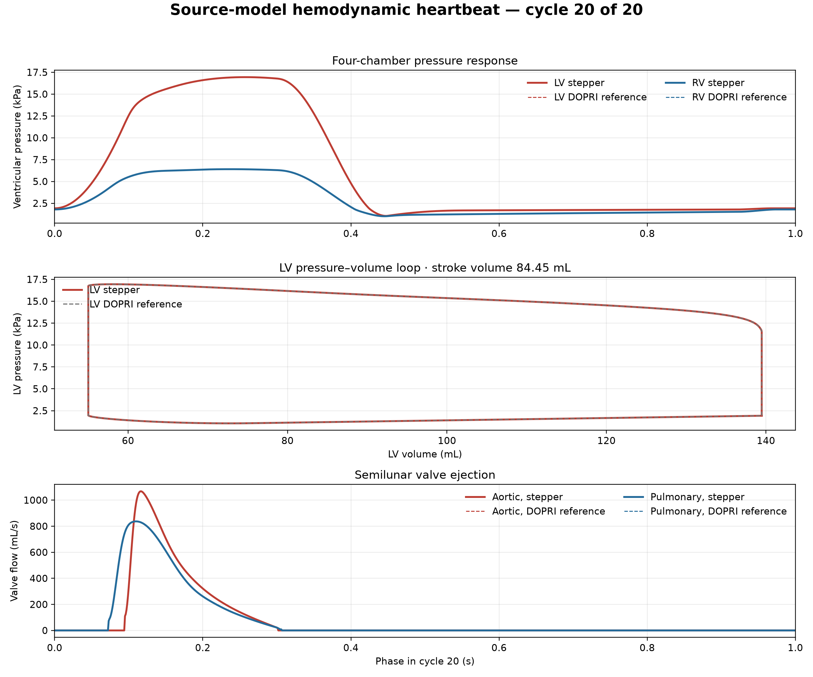

# Cardiac source-model heartbeat result — 2026-10-02

## Result

The pinned Shi/Hose CellML cardiovascular model completed 20 source-driven four-chamber cycles at a 1.0 s period (60 beats/min). The run includes time-varying atrial and ventricular elastance, four one-way chamber valves, and systemic and pulmonary return paths.

Cycle 20 produced an LV aortic stroke volume of **84.4516 mL** and RV pulmonary stroke volume of **84.4511 mL**. The pinned DOPRI5 source reference gives 84.4656 mL and 84.4670 mL respectively, differences of **−0.0166%** and **−0.0188%**. The LV end-cycle volume and pressure differ from the source reference by 0.00190% and 0.00183%. LV stroke volume changed 0.000143% between cycles 19 and 20. Total stored volume residual was `1.17e-17 m³`; all 400,000 steps were accepted.

The pressure, pressure-volume, and valve-flow traces overlay the independent source reference in the result figure:



The plotted figure and machine-readable comparison summary are checked in under `Docs/media/cardiac-source-heartbeat-20261002/`. The full step receipt and 20,000-row trace remain in the ignored local `Build/cardiac-source-heartbeat-20261002/` evidence directory.

## Source-law correction

The prior stepper interpreted the ventricular `Ts2` parameter as a duration after `Ts1`. In the pinned `EVentricle.cellml` law, `Ts1` and `Ts2` are absolute phase boundaries: elastance rises from phase 0 to `Ts1`, falls from `Ts1` to `Ts2`, then remains at its minimum until the next beat. The stepper now follows those piecewise equations, as well as the wrapped atrial activation in `EAtrium.cellml`. Compared with the pinned source trace, all four chamber elastance waveforms agree at 1 ms samples to floating-point precision (maximum relative error `4.5e-16`).

## Runtime optimization

The accepted state contains only scalar-valued compartment and connection records. Replacing recursive `deepcopy` on every candidate with isolated shallow copies of those two maps left the sampled trace byte-identical (`b572e23c…`) and reduced the matched 400,000-step, 20-cycle run from **17.06 s to 11.78 s** (30.9% less wall time; throughput rose from 23.5k to 34.0k steps/s). Earlier in this change, source-graph validation was also moved out of the per-step loop and state/activation trace hashes were streamed instead of retained as large Python lists.

A 100 µs run was also compared with the 50 µs result: cycle-20 LV stroke volume changed 0.00284%, and final LV volume changed 0.00141%. Across the 50 µs trace and the 20 s DOPRI5 source output, pressure and chamber-volume differences remain below 0.06% of each field's reference peak. Pointwise valve-flow differences are larger around switching instants; integrated cycle-20 filling, ejection, and return volumes differ by at most 0.07%.

## Run and evidence

The final matched run used:

```sh
PYTHONPATH=src OPENBLAS_NUM_THREADS=1 .venv-mujoco312/bin/python -m numilab_human.shi_hose_step \
  --steps 400000 --timestep-seconds 0.00005 \
  --trace-csv Build/cardiac-source-heartbeat-20261002/twenty-cycles-50us-optimized.csv \
  --trace-stride 20 \
  --output Build/cardiac-source-heartbeat-20261002/twenty-cycles-50us-optimized.json
```

Reference: `Docs/media/cardiac-source-20260912/source-20cycles-1e13.csv.gz`, generated from source revision `a679cdc2e97429fb5280af8132c119758626c1f2` with 20 s coverage and 1 ms output. Its DOPRI5 run accepted 519,097 internal steps and rejected 4,506. The source CSV SHA-256 is `30ef621c5fae87ff3e45ae37118d4002ace17dfa27dc6bd4b372951b7b4cb084`; the optimized 50 µs sampled trace SHA-256 is `b572e23c2366915eb1341ead4be43e7c05f0260fba29554f66df62562113dfcd`.

## Evidence boundary

This is a reproducible **0D hemodynamic heartbeat** from the pinned source model, not the earlier synthetic shell fixture. It demonstrates recurring chamber pressure-volume cycling and closed-loop valve flow. It does not demonstrate anatomical myocardial deformation, electrical conduction or ECG, patient-specific calibration, biological validation, or a qualified 3D electromechanics result.
