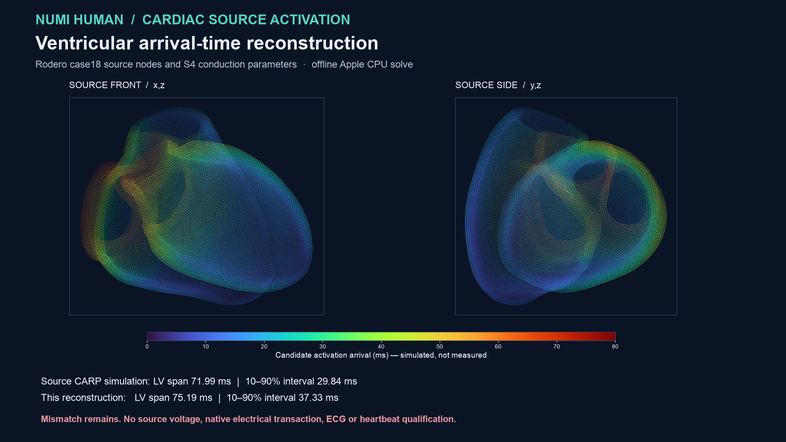

# Source-parameter ventricular activation reconstruction

Numi Human now executes an **offline ventricular activation-time reconstruction**
on all 1,097,534 ventricular tetrahedra of the retained Rodero case18 heart.
The run uses the original CT-derived node coordinates, tetrahedra, ventricular
labels, fibre field and universal ventricular coordinates. It takes the
conduction speeds and stimulation rules from the [published S4 supplement](media/cardiac-source-activation-20260930/rodero-s4-source.pdf):
0.8 m/s along fibres, 0.23 m/s transverse, 5.6 m/s in a fast endocardial
layer, endocardial stimulus at UVC Z ≤ 0.33, and fast-layer extent Z ≤ 0.7.
The [pinned configuration](../config/cardiac-rodero18-electrical-s4.v1.json)
records those units, source hashes and the reconstruction choice.



The mesh supplies **4,494 exact shared LV/RV tissue faces** involving 2,628
source nodes. Those nodes form one ventricular conduction domain. Three other
node IDs—17,565, 170,947 and 235,754—occur in both labels but have no
complete cross-label tissue face; they receive separate region-specific DOFs.
The resulting 218,080 electrical DOFs cover 218,077 distinct source nodes.
The atria do not enter this electrical solve, matching the source's ventricular
simulation scope. This improves on the preceding passive reference, which
deliberately kept *all* myocardial regions separate while it lacked a source
conduction rule.

The source prescribes endocardial stimulation below UVC Z = 0.33. On case18
that selects 3,927 DOFs. The source archive does not include a case18 fast-layer
cell tag, so this reconstruction takes one layer of tetrahedra incident to
exact rho=0 endocardial vertices with all four vertex Z values ≤ 0.7. That
declared interpretation selects 101,712 tetrahedra. Edge travel times use the
source fibre-aligned anisotropic metric or the fast-layer speed. A graph solve
gives an upper bound, then a compiled Apple CPU tetrahedral simplex solver
monotonically relaxes travel times through face interiors. The ventricular
graph is connected, every source edge satisfies its travel-time bound, all
stimulus DOFs remain at zero, and two complete native CPU solves replay
bitwise. The 22-sweep refiner took **8.81 s**, peaked at **159,039,488 bytes**
resident memory and had zero swaps on the local Apple M4.

| Metric | Case18 published CARP simulation | This reconstruction | Difference |
| --- | ---: | ---: | ---: |
| LV total activation span | 71.9895 ms | 75.1892 ms | +3.1997 ms |
| LV 10–90% interval | 29.8410 ms | 37.3295 ms | +7.4885 ms |

The comparator is the cohort's **simulation output**, not a measured patient
activation map. The mismatch is real and retained. A graph-only solve gave a
95.2010 ms LV span; continuous tetrahedral relaxation shortened that to
75.1892 ms without fitting the source output. This is still not a reproduction
of the CARP reaction-eikonal numerical scheme or its exact fast-layer tags.
The source archive contains no case18 voltage trace or local activation-time
field to compare pointwise.

The [producer receipt](media/cardiac-source-activation-20260930/summary.json),
[independent gate](media/cardiac-source-activation-20260930/independent-gate.json),
[rehashed wrong-region control](media/cardiac-source-activation-20260930/tamper-control.json),
[timed execution](media/cardiac-source-activation-20260930/execution.json),
and [figure provenance](media/cardiac-source-activation-20260930/figure-provenance.json)
hash-bind the published buffers and method. The gate independently checks the
full source, exact face interface, three point-only exceptions, DOF mapping,
UVC stimulus and fast-layer counts, all local travel-time inequalities and
the source-output discrepancy. A changed point-only region label with its
declared hash recomputed was rejected. The cardiac test selection passed
**33 tests and 22 subtests**, including an analytic face-interior travel-time
case.

To rerun with the source asset buffers under
`Build/cardiac-electrical-source-20260930/asset`:

```sh
PYTHONPATH=src OPENBLAS_NUM_THREADS=1 .venv-mujoco312/bin/python \
  -m numilab_human.cardiac_source_activation \
  --supplement Docs/media/cardiac-source-activation-20260930/rodero-s4-source.pdf \
  --output Build/cardiac-source-activation-20260930

PYTHONPATH=src OPENBLAS_NUM_THREADS=1 .venv-mujoco312/bin/python \
  -m numilab_human.cardiac_source_activation_gate \
  --supplement Docs/media/cardiac-source-activation-20260930/rodero-s4-source.pdf \
  --output Build/cardiac-source-activation-20260930/independent-gate.json
```

Rodero et al. case18 and the PLOS supplement are CC BY 4.0. This result has
**zero production native electrical steps**. It supplies no ionic currents,
transmembrane voltage, atrial/AV/Purkinje conduction system, ECG, native
accepted-state owner, electromechanical stress transfer, myocardial blood
perfusion, measured validation or physiological heartbeat qualification. The
fast-layer assignment and the residual mismatch must be resolved before
claiming source-model reproduction; whole-Human physiology remains open.
