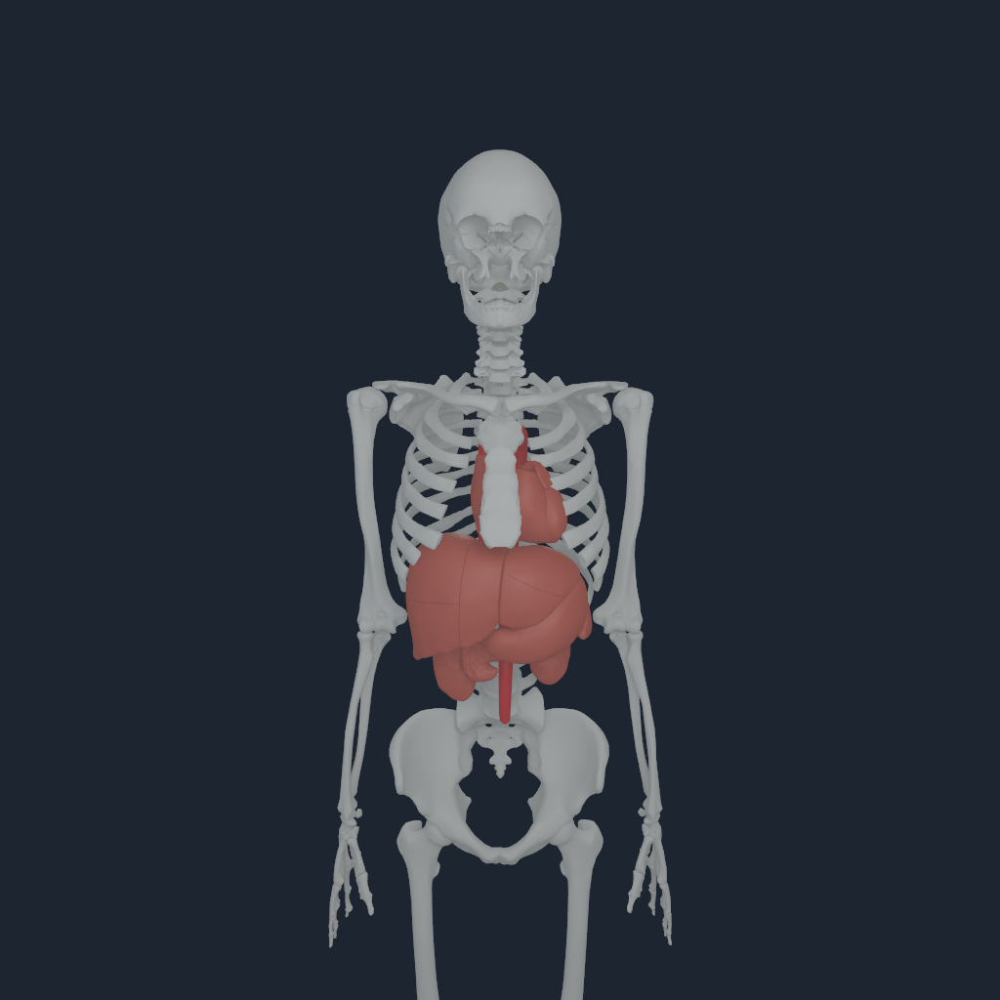
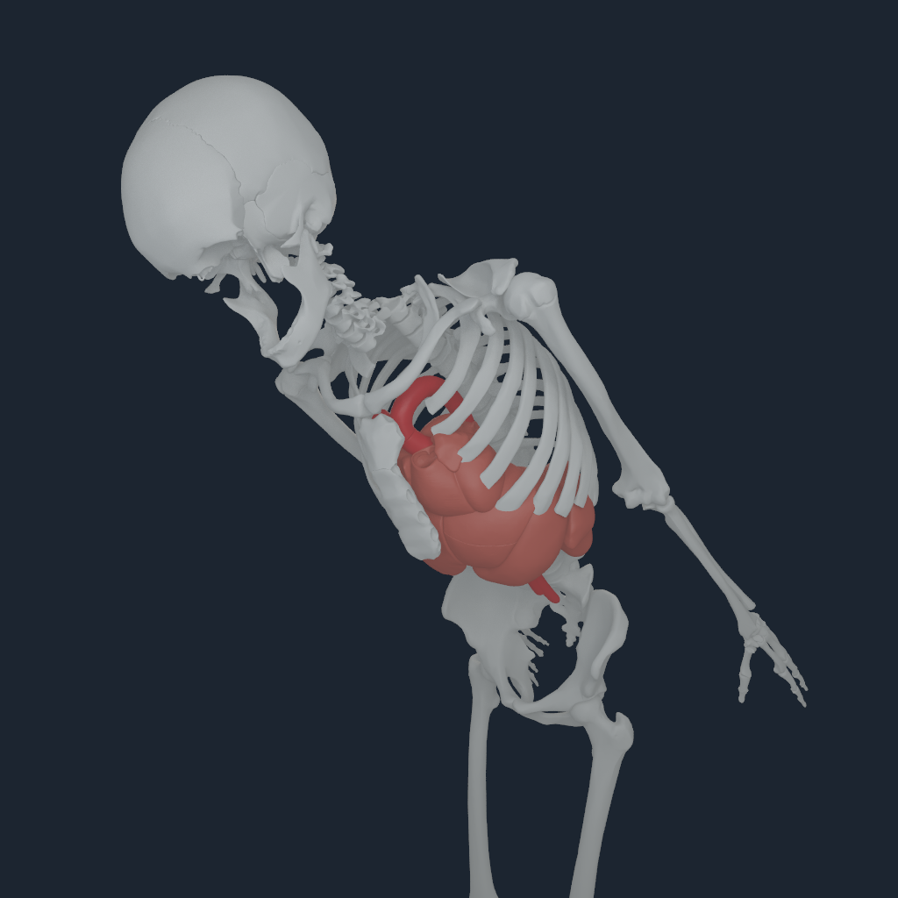

# Cardiac wall source coverage and topology checks

The native organ view now includes the retained left atrial wall and ventricular
wall, in addition to the right atrial wall. It increases from 22 to 24 surfaces
and from 92,623 to 117,960 vertices. The original 22 records, vertices and
triangle indices remain byte-identical. No source vertex or triangle is changed.




## Measured gap closed

The previous selection covered only one of the three members typed by the
retained atlas as FMA13256, `wall of cardiac chamber`. The left atrial wall
FJ2438 exists in the part-of heart selection. The ventricular wall FJ2428 is
absent from the entire retained part-of element table and archive; it is
available in the is-a archive as FMA13884, `wall of ventricle`.

| Source family member | Current surface ID | Selection |
| --- | --- | --- |
| FJ2439, right atrial wall | 1, preserved | part-of heart |
| FJ2428, ventricular wall | 23, added | is-a wall of ventricle |
| FJ2438, left atrial wall | 24, added | part-of heart |

The map declares complete membership of this exact source family and the
`torso` owner. Compilation checks the source tables, every required member,
layer and owner before output. Missing walls, duplicate members, wrong body
owners and missing coverage requirements fail. The native audit separately
checks the actually rendered members and Core body owners against the source
family. Both receipts cover **3/3 members**, with no missing members.

This is complete membership of one atlas family, not complete functional heart
anatomy. Valve, vascular, tissue, clinical and physiological requirements remain
distinct.

## Tissue, component and space are distinct

An exact is-a label match alone previously counted as a source-named organ
representation. The ventricular wall is an exact named structure but the source
types it as FMA82472, `cardinal organ part`, rather than FMA67498, `organ`.
The importer now retains these distinctions:

- Five source-named organ representations: stomach, pancreas, both kidneys, spleen.
- Twelve organ components: three chamber walls and nine liver components.
- Six vessel surfaces and one spinal cord surface.

All four cardiac cavity members are typed as anatomical spaces. They are
rejected from the organ tissue layer, even though their part-of heart relation
is valid. Exact source typing, both relation-table hashes and the selected
component classification are also verified by the native audit.

## Topology remains a separate gate

The compiler now records raw topology and a diagnostic quotient that identifies
only exactly equal authored decimal seam coordinates. It preserves raw payload
geometry and assigns no physical volume or mechanical mass. The audit recomputes
this diagnostic from exact source bytes and rejects forged closure metadata.

| Member | Nonmanifold edges after exact quotient | Degenerate faces | Duplicate faces | Face components | Closed-oriented candidate |
| --- | --- | --- | --- | --- | --- |
| Ventricular wall FJ2428 | 7 | 3 | 4 | 8 | false |
| Left atrial wall FJ2438 | 0 | 0 | 0 | 1 | true |
| Right atrial wall FJ2439 | 0 | 0 | 0 | 1 | true |

Self-intersections are not checked here. Neither atrial candidate admits
mechanics or clinical anatomy. The ventricular source remains unsuitable for
closed-wall admission. A diagnostic cleanup that removed the three zero-area
faces and four duplicate faces produced nine boundary edges, retained five
nonmanifold edges and eight vertex-link defects. It was rejected and never
applied to the payload. The
[topology record](media/cardiac-wall-coverage-20260929/cardiac-wall-source-topology.json)
and [rejected candidate](media/cardiac-wall-coverage-20260929/ventricular-exact-topology-candidate.json)
retain the measured failure.

## Native evidence and reproduction

The source oracle checks every selected native vertex and normal, triangle
index, semantic identity, instance owner and COM-centred body pose. Expected
positions use exact source OBJ geometry and independently evaluated MuJoCo
inertial frames rather than the compiler's declared defaults. Raw source rest,
equality-projected neutral and coupled torso motion all pass. Neutral/posed
1024-pixel captures are retained with their exact commands, native packs, pose
exports and source audits under `Build/cardiac-wall-coverage-20260929`.
Maximum world-vertex errors are **0.120 micrometres** in neutral and
**0.169 micrometres** during coupled torso motion, below the unchanged
20-micrometre geometry bound. The
[neutral audit](media/cardiac-wall-coverage-20260929/native-neutral.audit.json),
[posed audit](media/cardiac-wall-coverage-20260929/native-posed.audit.json) and
[original-surface parity record](media/cardiac-wall-coverage-20260929/original-surface-parity.json)
retain these independent checks.

The [final receipt](media/cardiac-wall-coverage-20260929/receipt.json) records
**47 tests passed in 42.99 seconds**, with exact executed source hashes.
The tests include source-family omissions, wrong owners/layers,
duplicates, all four cavity substitutions, forged closed-wall topology,
source-member hash drift and the existing rehashed native geometry/pose
corruptions. Complete source membership, exact geometry and topology quality
are independent checks.

```sh
PYTHONPATH=src:Sources/myosim/checkout .venv-mujoco312/bin/python \
  -m numilab_human.torso_anatomy_audit \
  --sources Sources --artifact Build/myosim-fullbody \
  --registration Build/knee-parity-registration-20260929/candidate.v6.registration.json \
  --payload Build/cardiac-wall-coverage-20260929/payload.v2/bodyparts3d-myosim-torso-anatomy.nhanatomy \
  --native-pack Build/cardiac-wall-coverage-20260929/native-neutral/views/myosim-fullbody-articulated-bodyparts-bones-source-torso-anatomy-focus-body-20.mrvpack \
  --native-poses Build/cardiac-wall-coverage-20260929/native-neutral/views/myosim-fullbody-articulated-bodyparts-bones-source-torso-anatomy-focus-body-20.torso-anatomy-poses.json \
  --output Build/cardiac-wall-coverage-20260929/reproduced-neutral-audit.json
```

The native inspection executable remains
`e8e447b24636e8a3f0c8c8c641e727cbc4fec3bddc64abb60454a84f486a2bec`;
the retained runtime remains
`6b9062e84bdacd6b86b413d5c549cd0046d9a271fb0caa141e03db41ffa213f6`.
Neither was rebuilt or modified. Human base revision is
`d338102f8382607d6585dd197b21499182deb992` and native revision is
`281a51cb8bebc808f70208abefe9bc6e9fe3ec10`.
The 24-surface payload SHA-256 is
`3de7b6a6f9fcdec97117fc9890e4ce9c0e179bb205bb72fccd72d2b99b63ea7f`.

This increment does not admit closed ventricular tissue, myocardial deformation,
pressure/contact coupling, cardiac perfusion, clinical anatomy or whole-body
standing/control. Lung parenchyma and full organ/skin/muscle/tendon qualification
remain open. Prior payloads, captures, board media and standing video are
preserved.
