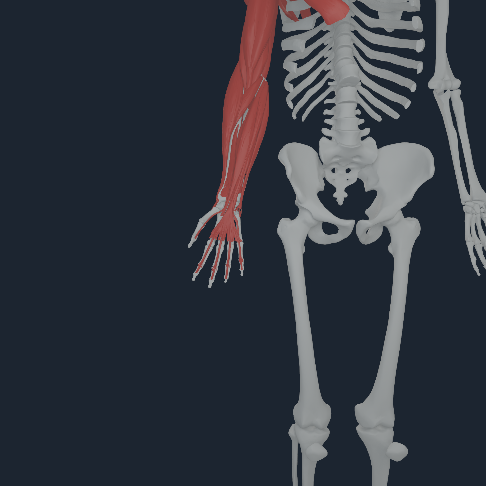
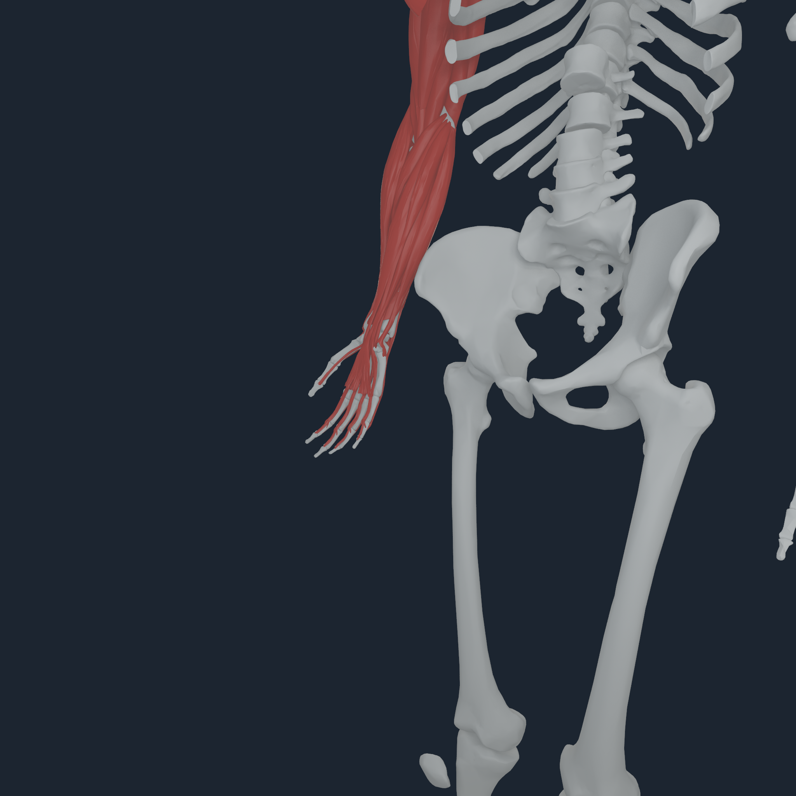
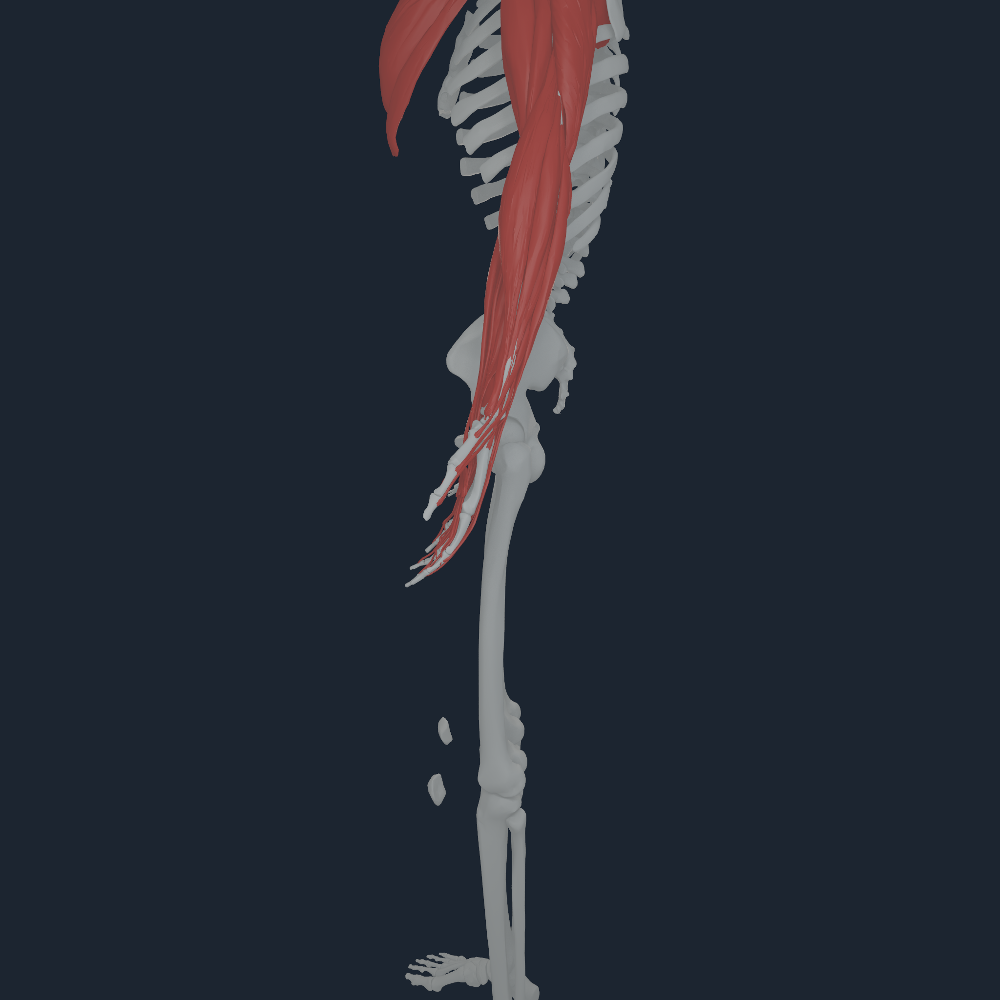
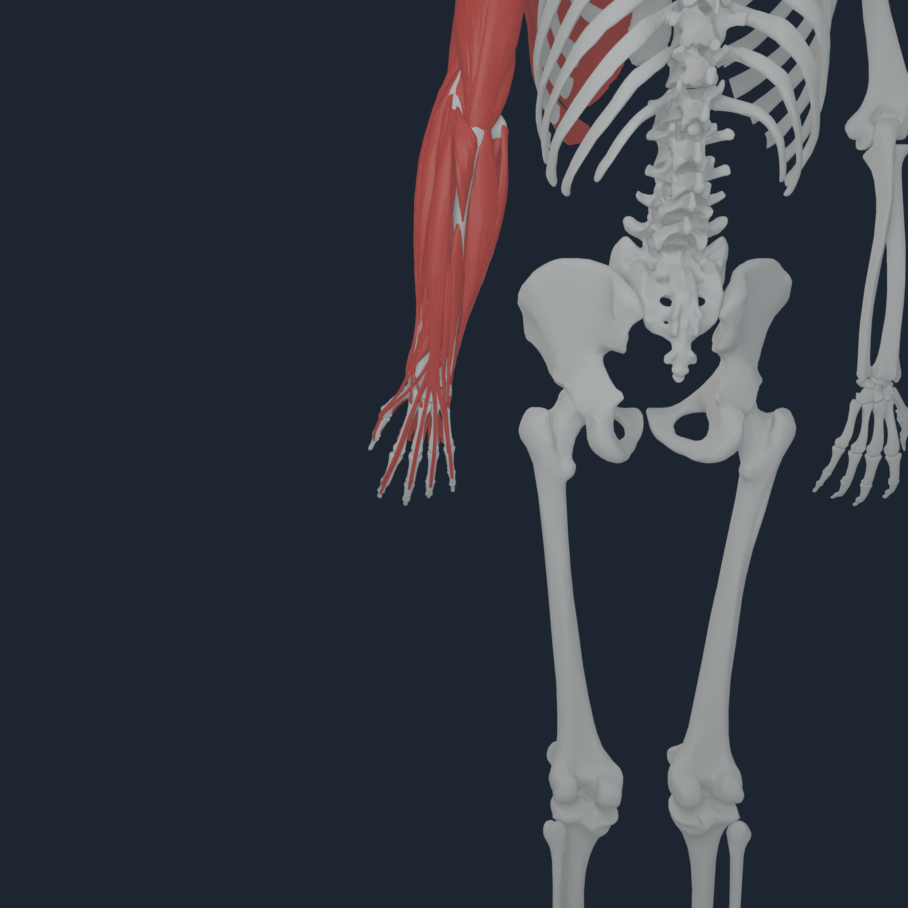
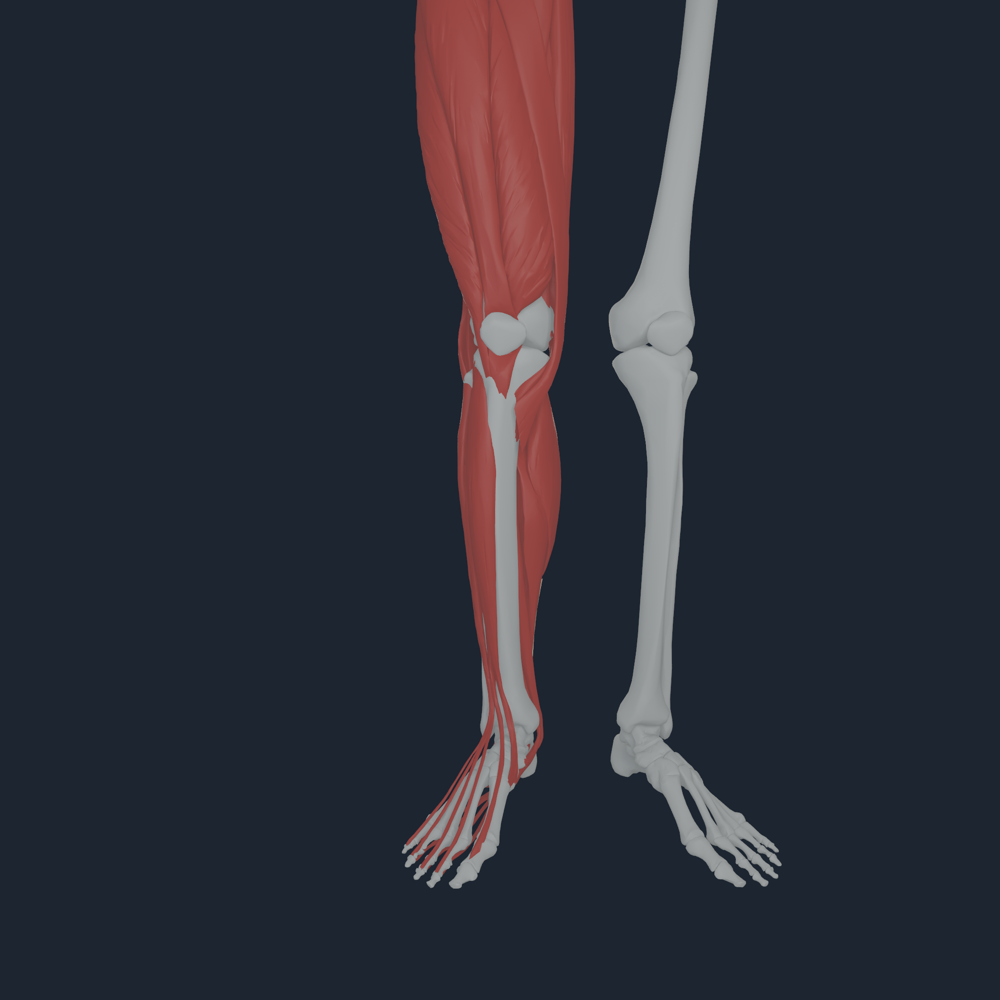
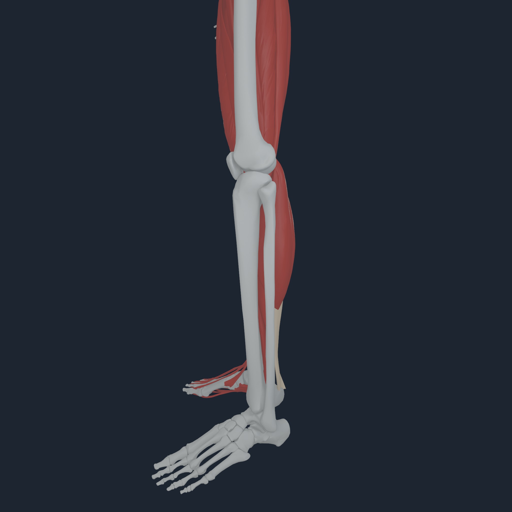
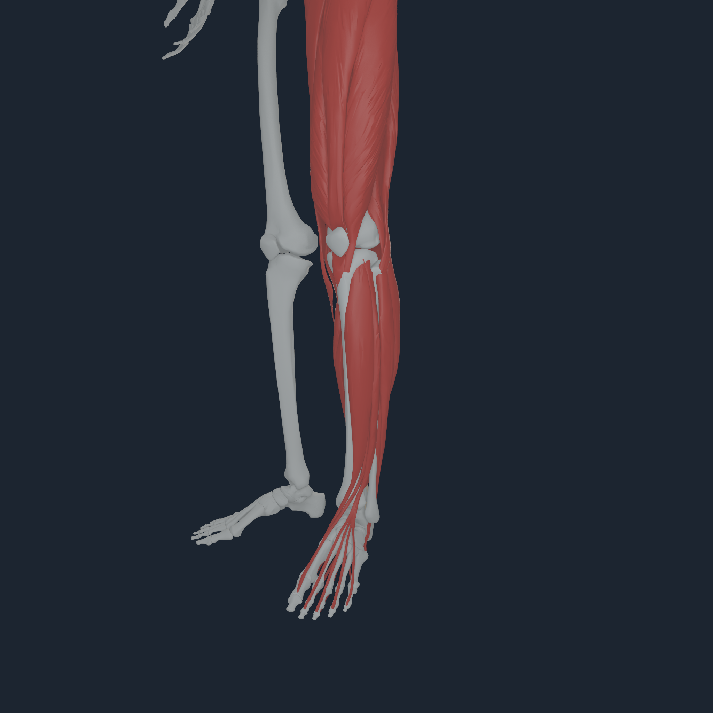
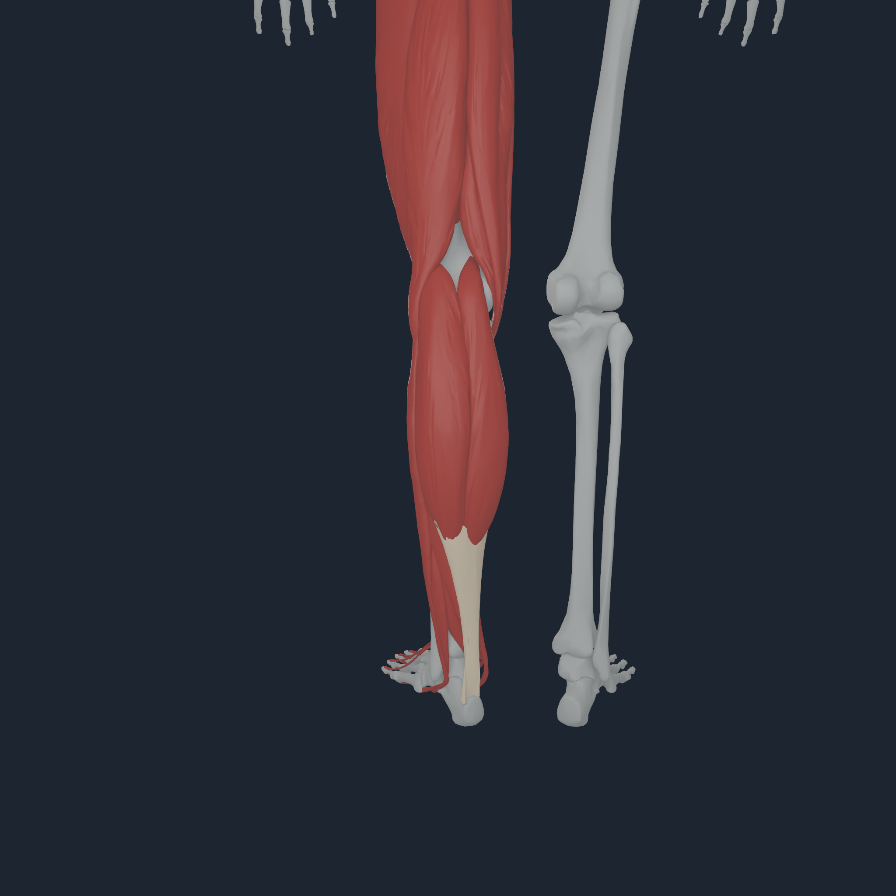

# Coherent limb registration v1

## Defect and correction

The attachment-site refinement was translating neighbouring BodyParts3D bone
meshes independently. That improved some source-site correspondences but broke
the source anatomy at elbows, wrists, fingers, knees, ankles, and feet. The
repair does not tune those gaps one by one. It restores every distal mesh to
its exact BodyParts3D common-rest displacement from a proximal mechanics
anchor:

- each forearm, carpal, metacarpal, and phalanx is rooted at its side's
  site-refined humerus;
- each patella, tibia/fibula mesh, hindfoot, midfoot, metatarsal, and toe mesh
  is rooted at its side's site-refined femur.

This changes visual rest registration only. It adds no joints and preserves
the existing MyoSim shoulder, elbow, wrist, knee, ankle, subtalar, MTP, hand,
and one-rigid-toes-body mechanics topology. In particular, the hallux remains
co-rigid with the other toe source bones, as requested; it is not given
independent articulation.

## Fail-closed geometry gates

The `NHBONES1` compiler now measures nearest transformed source vertices at
every declared boundary and rejects the payload when a gap exceeds its gate.
The accepted coherent-body-v4 payload records:

| Region | Transitions | Largest gap | Gate |
| --- | ---: | ---: | ---: |
| shoulder / elbow / wrist | 14 | 9.681 mm at the right AC joint | joint-specific 6-12 mm |
| carpal / metacarpal / phalanx | 38 | 1.230 mm | 4 mm |
| femur / tibia / patella | 4 | 1.587 mm | 4 mm |
| ankle / hindfoot / midfoot / metatarsal | 26 | 3.234 mm | 4 mm |
| occiput / spine / pelvis | 10 | 5.837 mm | 8 mm |

The existing bilateral toe identity checks still verify five chains and keep
hallux versus lesser-toe assignments fail closed. The continuity manifest is
retained with the capture.

The main right and left knee-flexion coordinates retain the source range
`[0, 2.0944] rad` and are enforced by Core, so the primary hinge cannot enter
negative hyperextension. Four-angle review also places both patellae on the
anterior side consistent with the feet. This addresses the reported backward
knee presentation; it is not a meniscus, cartilage, ligament, patellofemoral
contact, or loaded-gait validation.

## Apple M4 Pro visual and mechanics checks

### Upper limbs

  
  
  
  

The arm captures apply a bounded increment to six representative source
muscles per side while all 416 source routes are evaluated for 16 accepted
100 us steps. Each run transfers all 832 tendon endpoints per step through the
same-command-buffer `NHTENDON2` transaction and replays the stand bitwise.

### Knees, feet, and toes

  
  
  
  

All four 2048 px views for both sides are retained under the same media
directory, along with the exact arm and leg transcripts, bone continuity
manifest, payload hashes, and checksum set. The large generated muscle and
tendon manifests remain reproducible build artifacts rather than duplicated
documentation blobs.

## Force-transfer boundary

Re-registering the anatomy exposes disagreement between BodyParts3D surfaces
and MyoSim attachment sites that the former independent mesh translations had
partly hidden. The rebuilt `NHTENDON2` payload keeps all 832 exact source
endpoints with zero endpoint migration, but admits 226 distributed
bone-surface envelopes and explicitly falls back to 606 body-owned source
points (27.16% surface coverage). Over 16 steps that is 3,616 envelope
transfers and 9,696 point transfers. The maximum observed resultant residual
was `6.824e-5 N`, maximum moment residual was `1.910e-6 N m`, rollback was
preserved, and replay was bitwise.

That is an executable tendon force-transfer law. It is not yet a deformable
tendon continuum, and the 606 point fallbacks are not literal source-surface
entheses. Snapping their sites to prettier geometry would change muscle
mechanics, so those cases remain explicit until a superior source-compatible
registration or calibrated enthesis model is available.

The subsequent [semantic same-body limb enthesis increment](SEMANTIC_LIMB_ENTHESES_V1.md)
resolves exact hip/tibia/fibula member ownership without moving any endpoint,
raising its distributed-coverage baseline to 266 and reducing point fallbacks
to 566. The later [source-named thoracic increment](SEMANTIC_AXIAL_ENTHESES_V1.md)
raises current coverage to 282/832 with 550 point laws. The 226/606 figures
above remain the coherent-registration baseline.

The red muscle/tendon sheets in these frames are exact BodyParts3D
presentation surfaces with sparse kinematic route-body bindings. They are not
FEM tendon material, cartilage contact, ligament mechanics, skin, or clinical
registration. The stand transcript also reports `balanced=false`; these views
are bounded anatomical and transaction checks, not a static-equilibrium or
gait certificate.
