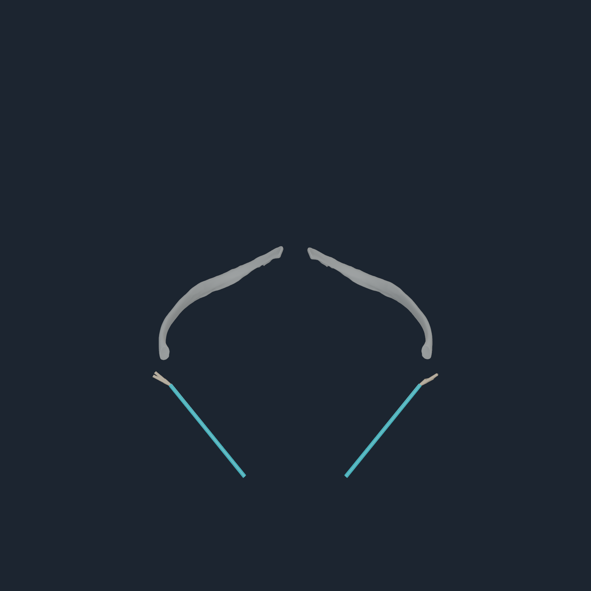
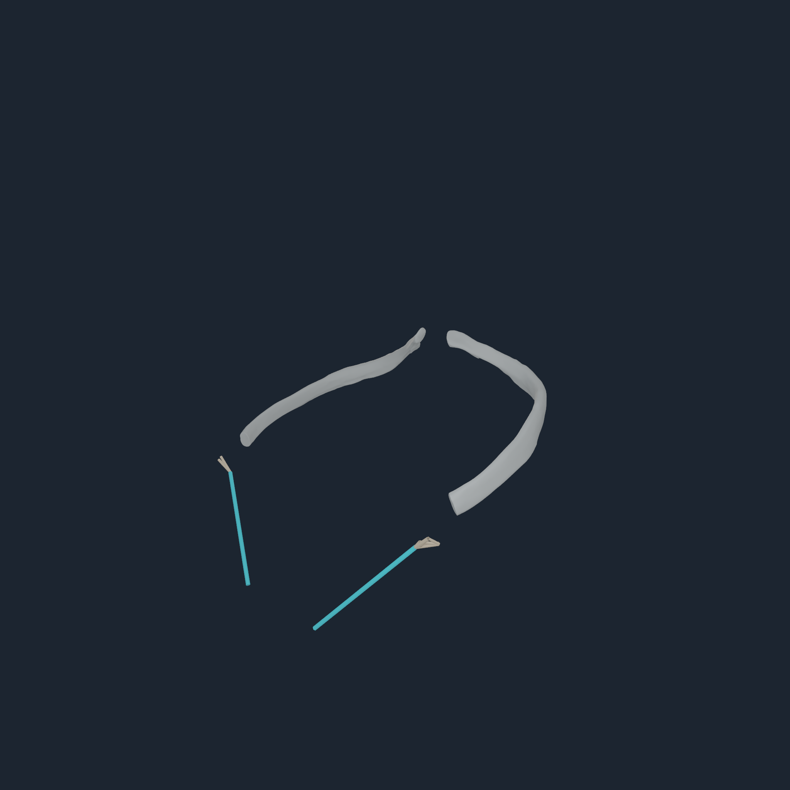
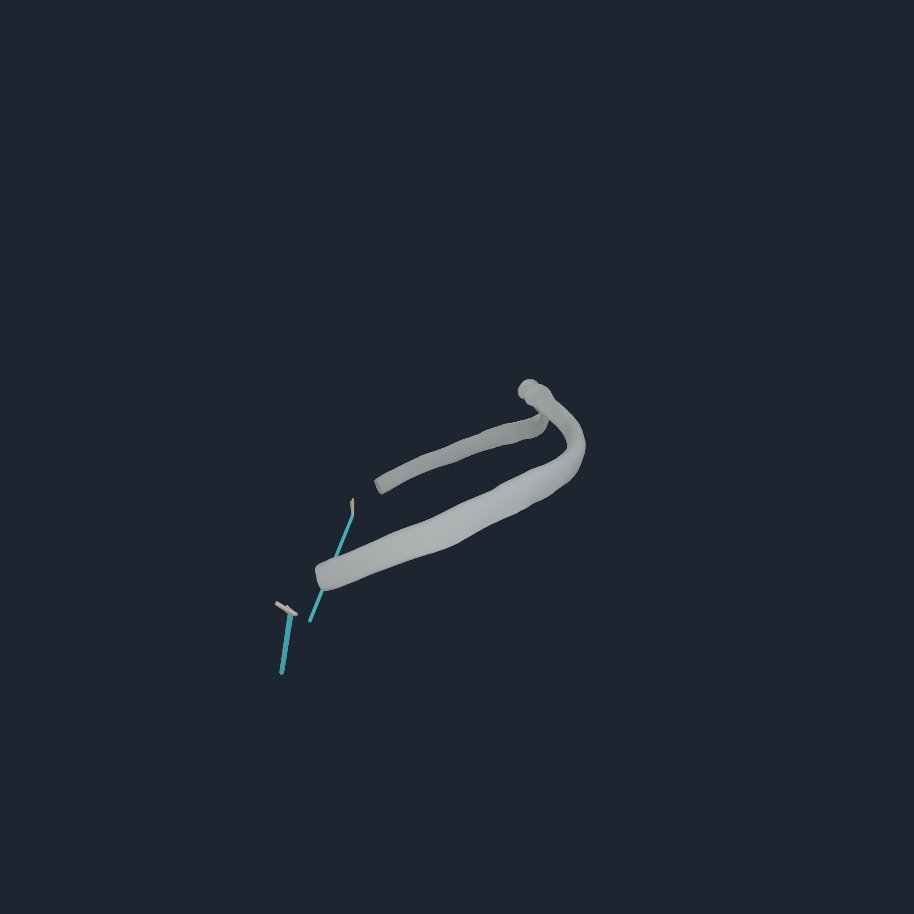
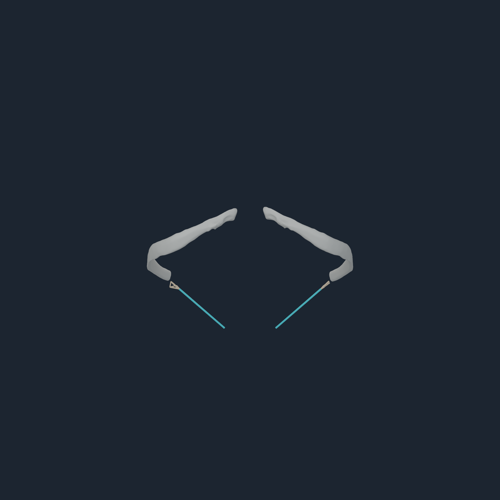

# EO3 exact source-component force transfer v2

## Result

Bilateral `EO3` origins now have an executable, force- and moment-conserving
surface transfer without moving a rib or an authored route endpoint. The
compiler always tries the named registered BodyParts3D rib 9 first. Only after
that member fails the unchanged 12 mm distance gate does it admit the exact
connected surface component from pinned MyoSim
`torso_geom_13_ribcage_s`.

This is a mechanics fallback, not a claim that the MyoSim component is a
BodyParts3D bone. The manifest therefore reports it as
`registered_source_surface_distributed_envelope`, uses a disjoint stable-ID
range, retains the exact source-component content hash, and records the
BodyParts rejection reason.

## Why the whole rib was not moved

The EO3 origins are close to their exact source-rib components but not to the
independently registered BodyParts3D rib-9 surfaces:

| Measure | Right | Left |
| --- | ---: | ---: |
| EO3 to exact pinned source component | `5.647779 mm` | `5.647779 mm` |
| EO3 to registered BodyParts3D rib 9 | `30.908658 mm` | `30.852987 mm` |
| already-admitted iliocostalis-to-rib-9 endpoint | `8.9737 mm` | `8.7497 mm` |
| already-admitted longissimus-to-rib-9 endpoint | `9.9401 mm` | `9.5452 mm` |
| registered costovertebral gap | `3.3377 mm` | `2.1829 mm` |

A whole-rib translation large enough to meet EO3 would invalidate the existing
12 mm attachment gates and the retained posterior joint relationship. An
endpoint warp would hide the mismatch by changing the source route. Both were
rejected. The current fallback preserves every bone transform and all 832
authored endpoint coordinates.

## Exact fallback surfaces

The abdominal registration receipt pins eight unique rib components used by
the ten source-topology-resolved abdominal routes. It stores their local-core
vertices, triangles, vertex-index signatures, and canonical content hashes.
EO3 uses component 13 on the right and component 9 on the left:

| Gate | Right `EO3_r` | Left `EO3_l` | Limit |
| --- | ---: | ---: | ---: |
| surface distance | `5.6477788 mm` | `5.6477794 mm` | `12 mm` |
| patch radius | `11.6007597 mm` | `11.8367848 mm` | `12 mm` |
| sampled force amplification | `2.1463612` | `2.1637386` | `4.0` |
| force residual | `4.46e-16` | `6.56e-16` | numerical zero |
| moment residual | `5.15e-18 m` | `8.84e-18 m` | numerical zero |
| endpoint migration | `0 mm` | `0 mm` | `0 mm` |

The two compiles are byte-identical. Current artifact fingerprints are:

| Artifact | SHA-256 |
| --- | --- |
| v2 registration receipt | `b4fec592f342fc1b2a6a917bc076d7bb6c56a580e4b0664f7b4e173eb56d4d67` |
| `NHBONES1` | `e8c4321e3bcdd177377cfb26349a71eb935e9a699e21bfb0a6204df47fc898bb` |
| `NHTENDON3` | `8be88886b5231805740b9775c187db7137af1d71f6ce0fdc57cc8ab9607bccfb` |
| tendon manifest | `5019bb13bc65129a3aa1d9996b3b023d0b23e9a12db945ce0a6fd239869de691` |
| registration worklist | `ae5828816f5aca4074bbe17a8cf6ece3336e3be26bdddb0c4d04a36c68f7b4d1` |

Coverage is now 630 distributed surface envelopes and 202 point laws. Of the
630, 628 terminate on registered BodyParts3D bones and two terminate on these
exact pinned source mechanics surfaces. The worklist has no remaining EO3 bone
registration candidate.

## Apple M4 Pro execution

The exact payload passes the native runtime at Numi Lab runtime revision
`864a65c916c1d52318e263469f673d3336d696b6`:

| Gate | Result |
| --- | ---: |
| endpoint transfers | `832` |
| distributed envelope transfers | `630` |
| exact point transfers | `202` |
| CPU force residual | `7.31035e-05 N` |
| CPU moment residual | `7.11716e-06 N m` |
| Metal force residual | `0.000244141 N` |
| Metal moment residual | `8.12571e-06 N m` |
| Metal nodal-force parity error | `0.000119714 N` |
| Metal replay | byte-identical |
| persistent accepted steps | `128` (`64` assisted + `64` unassisted) |
| persistent terminal transfers | `106,496` |
| persistent envelope transfers | `80,640` |
| persistent exact-point transfers | `25,856` |
| persistent borrowed consumer | exact same-command-buffer snapshot |
| injected consumer rejection | prior result preserved |
| direct rigid-state effect | bitwise-identical output-only; no direct joint torque |
| persistent replay | bitwise |

The runtime reserves the high-bit stable-ID namespace for pinned non-BodyParts
attachment surfaces, bounds its local ID to 1–256, and still uses the authored
body index for every Jacobian and force scatter. A deliberately corrupted
source-surface ID is rejected at decode with `invalid_binding`; the stable ID
cannot select a new body or become a direct joint torque.

## Four-angle diagnostic inspection

<p align="center">
  
  
  
  
</p>

All four original 2048 px frames were inspected directly. The cyan EO3 route
centrelines terminate continuously in the tan four-node source mechanics
patches with correct bilateral placement. The deliberately isolated grey
BodyParts rib-9 pair exposes, rather than hides, the common-frame disagreement:
the source patches do not lie on those meshes. These are diagnostic mechanics
views, not realistic full-body presentation frames. They prove why a whole-rib
move is rejected and why the fallback must remain separately identified.

The raw [reference probe](media/numi-human-eo3-source-surface-v2-2048/m4-reference-probe.txt),
[persistent stand probe](media/numi-human-eo3-source-surface-v2-2048/m4-persistent-stand-probe.txt),
[visual probe](media/numi-human-eo3-source-surface-v2-2048/m4-visual-probe.txt),
[rejection probe](media/numi-human-eo3-source-surface-v2-2048/rejected-source-surface-id.txt),
visual manifest, and checksums are retained with the frames.

## Cartilage and fascia boundary

BodyParts3D 4.0 contains named costal-cartilage meshes only through rib 7. Its
seventh-cartilage surfaces are closer to EO3 than the registered ninth ribs,
but applying the existing independent rib transforms to them creates a severe
common-frame inconsistency. They are therefore not silently substituted.

Human costal cartilage is anisotropic and age-dependent; published compression
and indentation measurements span substantially different effective moduli.
That evidence supports a later calibrated cartilage/fascia owner, not inventing
a single material constant here. The current law transfers terminal wrench to
an articulated body. It is not a deformable tendon, cartilage, fascia, or
clinical enthesis model.

The persistent stand still reports `balanced=false`; this increment closes the
EO3 transfer and exact-stack transaction gates, not assistance-free standing.

Primary mechanical references:

- Weber et al., 2021, [Mechanical characterization of human costal cartilage](https://pmc.ncbi.nlm.nih.gov/articles/PMC8245550/).
- Forman et al., 2010, [Effective material properties of costal cartilage for whole-body FE models](https://pubmed.ncbi.nlm.nih.gov/21128192/).

## Reproduction

```sh
PYTHONPATH=src .venv-myosim/bin/python -m numilab_human.abdominal_enthesis_registration \
  --sources Sources \
  --registration Build/torso-axial-source-mesh-v1.registration.json \
  --source-audit Build/myosim-source-bone-proximity-v1.json \
  --worklist Build/torso-axial-source-mesh-v1.registration-worklist.json \
  --tendon-manifest Build/torso-axial-source-mesh-v1-tendon/numi-human-tendon-attachments.manifest.json \
  --output Build/abdominal-source-component-v2.registration.json

PYTHONPATH=src python3 -m numilab_human.cli myosim-bodyparts-bone-payload \
  --sources Sources \
  --registration Build/abdominal-source-component-v2.registration.json \
  --output Build/abdominal-source-component-v2-bones

PYTHONPATH=src python3 -m numilab_human.cli numi-human-tendon-envelope-payload \
  --artifact Build/nheq1 \
  --bone-artifact Build/abdominal-source-component-v2-bones \
  --output Build/abdominal-source-component-v2-tendon \
  --migrate-semantic-rigid-foot-endpoints
```
