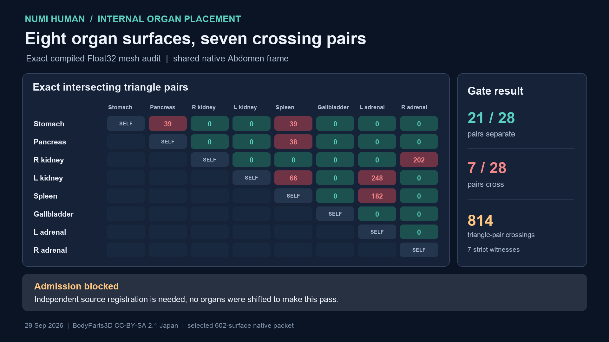

# Expanded compiled abdominal organ separation — 29 September 2026

The selected 602-surface native Human packet contains eight source-named,
individually closed and exactly self-intersection-free whole-organ surfaces
sharing its Abdomen body owner: stomach, pancreas, both kidneys, spleen,
gallbladder and both adrenal glands. The [expanded exact receipt](media/abdominal-organ-separation-20260929/receipt-v2.json)
checks all 28 pairs in that common owner frame. **21 pairs are separate; seven
pairs cross**, so the independent-organ domain gate fails.



| Crossing pair | Exact intersecting triangle pairs | Longest detected segment |
| --- | ---: | ---: |
| Stomach – pancreas | 39 | 2.029 mm |
| Stomach – spleen | 39 | 4.814 mm |
| Pancreas – spleen | 38 | 2.708 mm |
| Right kidney – right adrenal gland | 202 | 2.248 mm |
| Left kidney – spleen | 66 | 2.286 mm |
| Left kidney – left adrenal gland | 248 | 3.067 mm |
| Spleen – left adrenal gland | 182 | 2.640 mm |

The total is **814 exact intersecting triangle pairs** across seven organ
pairs. All are segment or polygon crossings, rather than isolated point
contacts. A separate [double-precision strict transverse witness](media/abdominal-organ-separation-20260929/transverse-witness-v2.json)
confirms one edge-through-triangle crossing for each failed pair. The other 21
pairs have no exact triangle crossings and pass outside/outside parity on their
closed surfaces. Triangle-pair counts measure mesh intersection incidence,
not displaced tissue volume or clinical severity.

This extends the immutable [five-organ receipt](media/abdominal-organ-separation-20260929/receipt-v1.json):
its ten prior pair results are recomputed and required to match before the
expanded result is accepted. The three added source members are FJ2817
(gallbladder), FJ3129 (left adrenal) and FJ3130 (right adrenal). Source type,
member hash, native owner, baseline-to-selected vertex and index identity,
prior compiled census, and current exact embeddedness are rechecked for all
eight organs. The alternate `is_a` BodyParts3D archive contains identical
vertex and face records for the four organ members it shares with the earlier
`part_of` cohort; it supplies no independent geometric correction to those
crossings. Spleen FJ2561 is absent from `part_of`.

No organ was translated, clipped, capped or silently reclassified. The failed
relationships require independently justified atlas registration or replacement
anatomy. This audit does not establish clinical placement, complete organ
coverage, tissue boundaries, physical organ volumes or mechanics. It does not
cover connected lumens such as ureter–kidney or every cross-surface relation in
the 579-source anatomy set. The historical 10-second standing clip predates
this selected anatomy packet.

Reproduce with retained inputs (exit 2 is the expected failed-gate result):

```sh
PYTHONPATH=src OPENBLAS_NUM_THREADS=1 .venv-mujoco312/bin/python \
  -m numilab_human.expanded_abdominal_organ_separation \
  --baseline-payload Build/whole-visceral-coverage-20260929/payload.verified/source-organ-family-anatomy.nhanatomy \
  --selected-payload Docs/media/right-eye-laterality-20260929/candidate/right-eye-laterality-candidates.nhanatomy \
  --selected-manifest Docs/media/right-eye-laterality-20260929/candidate/right-eye-laterality-candidates.manifest.json \
  --selected-report Docs/media/whole-body-embeddedness-20260929/selected-surface-gate.json \
  --census-archive Docs/media/whole-body-embeddedness-20260929/quotient-census.tar.gz \
  --native-audit Docs/media/right-eye-laterality-20260929/native-selected-audit.json \
  --native-pack Build/right-eye-laterality-cleanup-20260929/native/source-rest/views/myosim-fullbody-articulated-bodyparts-bones-source-torso-anatomy-focus-body-20.mrvpack \
  --pose Docs/media/right-eye-laterality-20260929/native/myosim-fullbody-articulated-bodyparts-bones-source-torso-anatomy-focus-body-20.torso-anatomy-poses.json \
  --prior-receipt Docs/media/abdominal-organ-separation-20260929/receipt-v1.json \
  --output Docs/media/abdominal-organ-separation-20260929/receipt-v2.json
PYTHONPATH=src OPENBLAS_NUM_THREADS=1 .venv-mujoco312/bin/python \
  Docs/media/abdominal-organ-separation-20260929/independent_transverse_witness_v2.py
```
