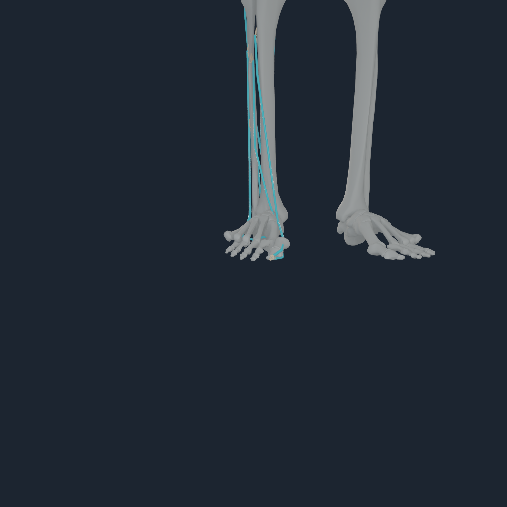
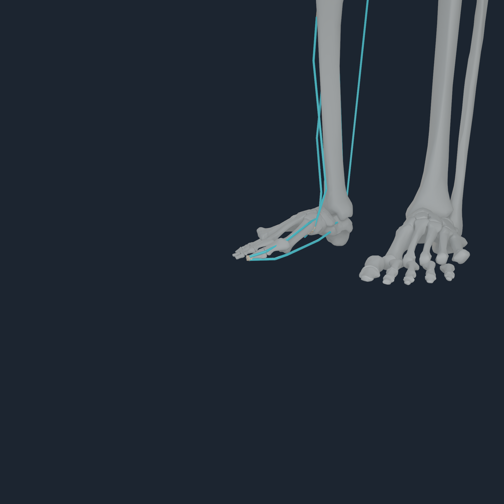
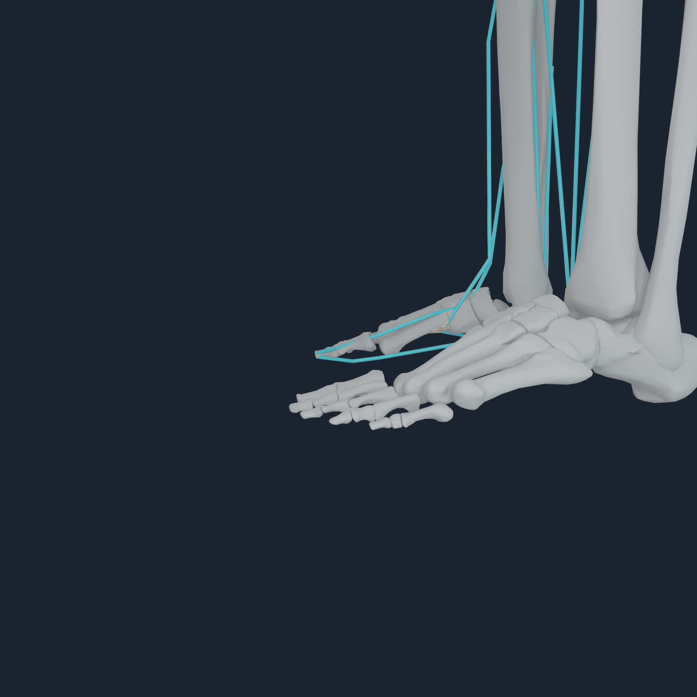
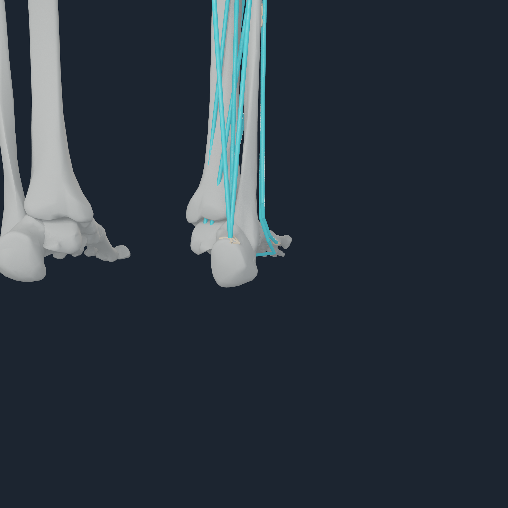
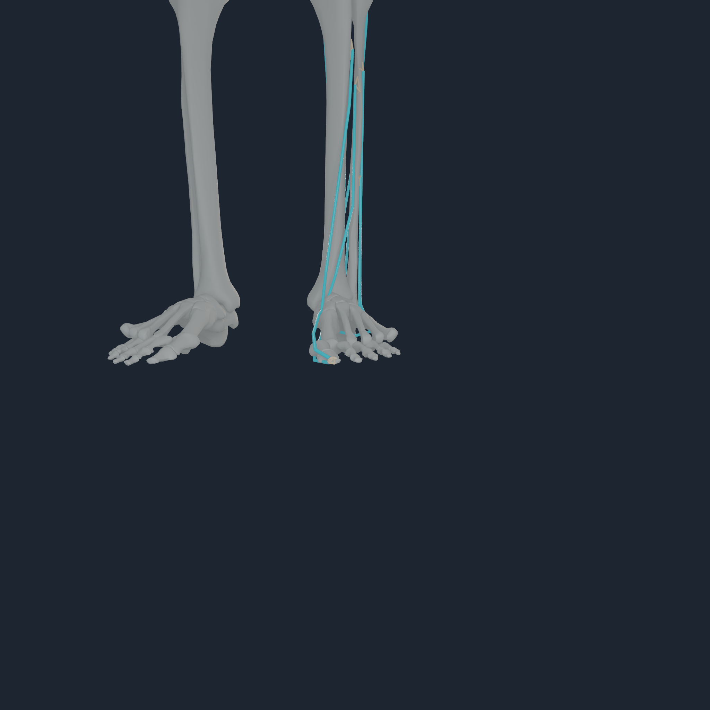
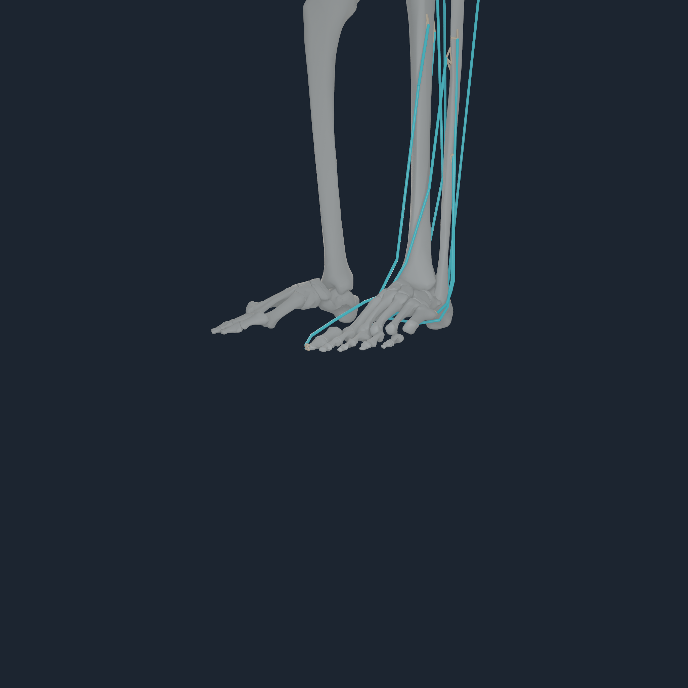
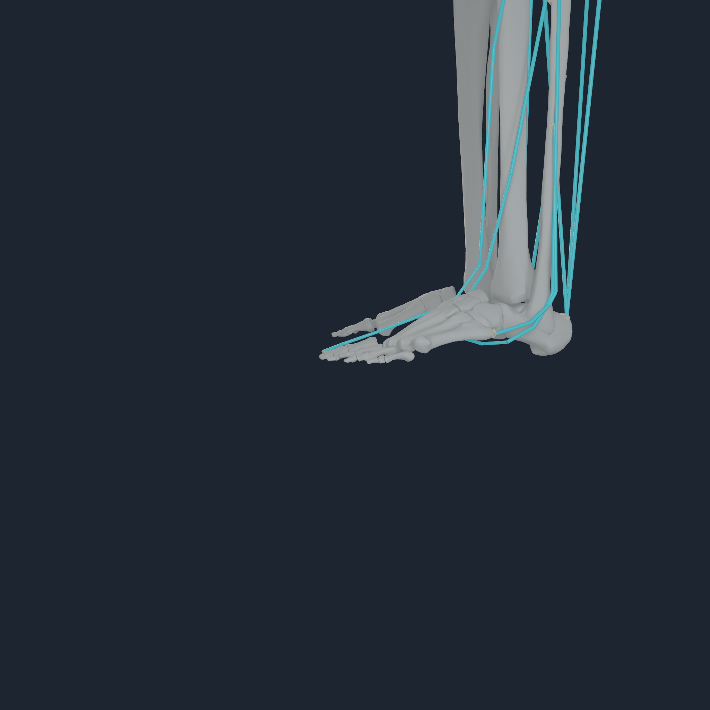
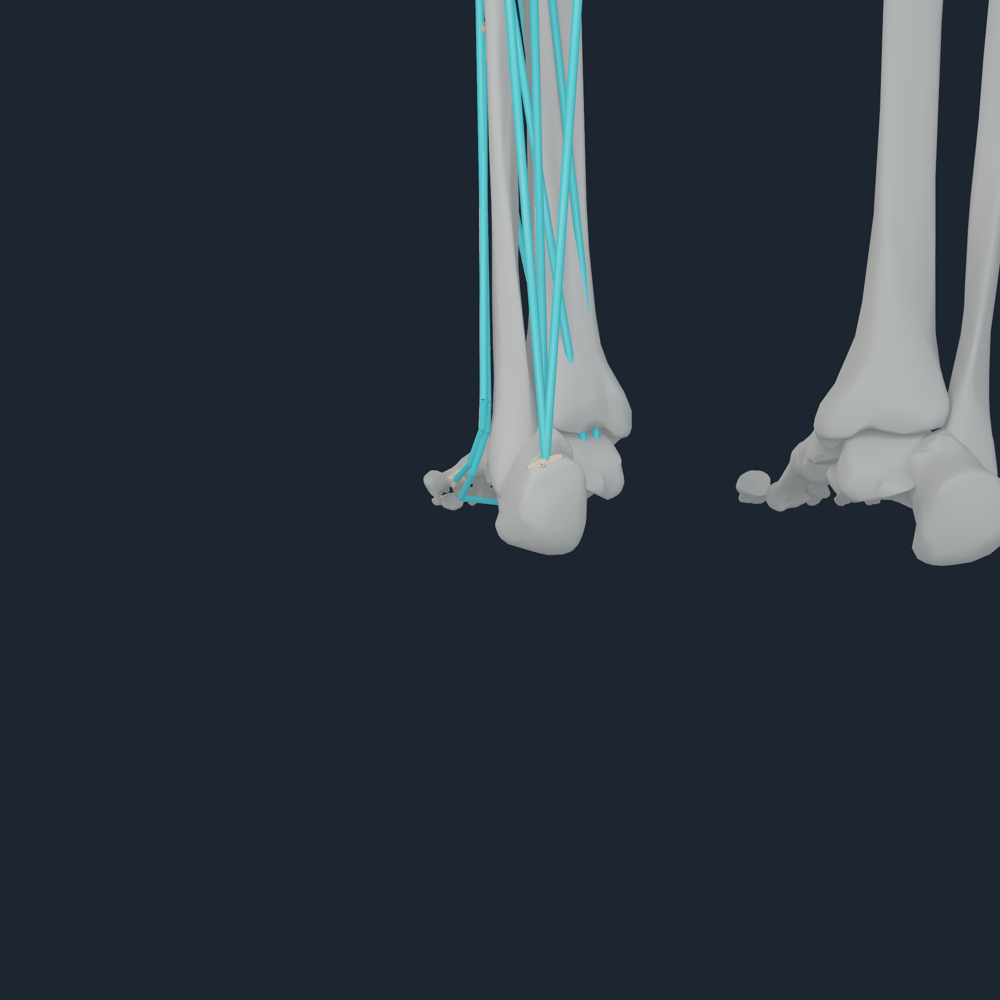

# Fixed-bone foot entheses v1

## Outcome

The bilateral hallux and rigid-foot routes now terminate on their named
BodyParts3D bone surfaces without translating or rotating any bone mesh and
without adding a toe joint. `NHTENDON3` materializes 18 route-private terminal
sites and keeps the existing 157-body articulation, 184 bone-mesh poses, and
collective `toes_r` / `toes_l` bodies unchanged.

The admitted one-to-one insertions are bilateral:

- extensor hallucis longus and flexor hallucis longus to the distal hallux;
- gastrocnemius medialis, gastrocnemius lateralis, and soleus to calcaneus;
- peroneus brevis to fifth metatarsal;
- peroneus longus and tibialis anterior to first metatarsal; and
- tibialis posterior to navicular.

EDL and FDL stay source-point laws. Each source row represents a lumped
four-digit actuator, so moving it to one distal phalanx would falsely assign
four independent tendons to one point. Their existing four-member
force-transfer envelopes remain the honest free-data boundary.

## Fixed-bone and force-reference invariants

The compiler starts from the exact paired `NHBONES1` artifact. It queries the
nearest point on the explicitly named bone member, stores that point only in a
route-private terminal binding, and recomputes the four-node force/moment map
about that resolved point. It never changes a bone registration, joint,
inertia, wrap, or nonterminal route site.

Moving a terminal changes the path length. The native runtime therefore
performs a deterministic reference calibration at the exact compiled default
configuration:

1. evaluate the source and resolved path for each migrated muscle;
2. translate both source length-range bounds by the signed path delta, keeping
   the source rigid normalized force coordinate at the reference pose;
3. scale optimal fibre length and tendon slack length together by the
   resolved/source reference-path ratio, keeping the compliant normalized
   equilibrium at that pose; and
4. reject any migration over 20 mm or architecture scale outside 0.75–1.25.

This is a reference-preserving simulation calibration, not subject-specific
physiology. It preserves the source force state at one pose while allowing the
resolved route to produce its anatomically corrected moment arm away from that
pose.

## Apple M4 Pro qualification

The exact candidate contains 832 endpoints: 554 distributed envelopes, 278
point laws, and 18 migrated envelopes. The payload SHA-256 is
`e43742f5eb5f0c4faba95d17501f2a03e1bf1dafe0b8f2f60f1724e4d93d72ac`.
The qualified Numi Lab `coupled` runtime revision is
`d54cfddfd5b1544cdace4c9aae9bdaba5ada8227`.

| Gate | Measured result |
| --- | --- |
| Maximum endpoint migration | `11.9825406 mm` |
| Maximum reference path delta | `9.6856132 mm` |
| Maximum architecture scale change | `0.04949945` |
| Source-oracle path-length error after calibration | `2.556e-8 m` |
| Source-oracle muscle-force error after calibration | `4.894e-4 N` |
| Metal path-length error | `7.326e-7 m` |
| Metal muscle-force error / maximum reference force | `0.12435 / 2866.66 N` |
| Metal generalized-force error / maximum reference value | `0.06705 / 2153.36` |
| Metal envelope nodal-force parity error | `1.419e-4 N` |
| Metal resultant force / moment residual | `1.259e-4 N` / `9.812e-6 N m` |
| Metal replay | byte-identical |

The source-point `NHTENDON2` baseline was rerun with the same native binary and
also passed. The candidate's source-versus-resolved generalized-force
difference is `5.1902`; this is the intended consequence of changing terminal
moment arms, not parity error. The full raw lines are retained in
[the reference directory](media/numi-human-fixed-bone-foot-entheses-v1-2048/reference/).

## Four-angle inspection

White geometry is the unchanged BodyParts3D skeleton, cyan is the current-pose
MyoSim route, and the warm fans are executable terminal force-transfer maps.
All eight 2048 px frames were inspected. The EHL/FHL routes terminate on the
distal hallux on both sides; the Achilles, first/fifth-metatarsal, and navicular
routes terminate on their named surfaces. No digit is displaced, duplicated,
or independently articulated.

### Right foot and hallux

<p align="center">
  
  
  
  
</p>

### Left foot and hallux

<p align="center">
  
  
  
  
</p>

Each angle has nonzero bone, route, and force-envelope pixels. The exact
per-view counters, runtime boundary, and replay result are in the right and
left capture transcripts beside the images.

## Reproduce

```sh
numilab-human numi-human-tendon-envelope-payload \
  --artifact Build/myosim-fullbody \
  --bone-artifact Build/lower-body-rigid-foot-v1-paired-bones \
  --migrate-semantic-rigid-foot-endpoints \
  --output Build/fixed-bone-foot-entheses-v1
```

The resulting payload requires an `NHTENDON3`-aware Numi Lab runtime. The
default command without the migration flag still emits source-point-preserving
`NHTENDON2`.

## Evidence boundary

This closes the visible one-to-one foot/hallux route-to-bone placement defect
and executes the corrected force transfer on Apple Metal. It does not create a
deformable tendon continuum, enthesis material, independent digit actuation,
calibrated cartilage/contact, clinical registration, stable standing, or gait.
The one-step visual transactions report `compiled_stand_balanced=false`.
