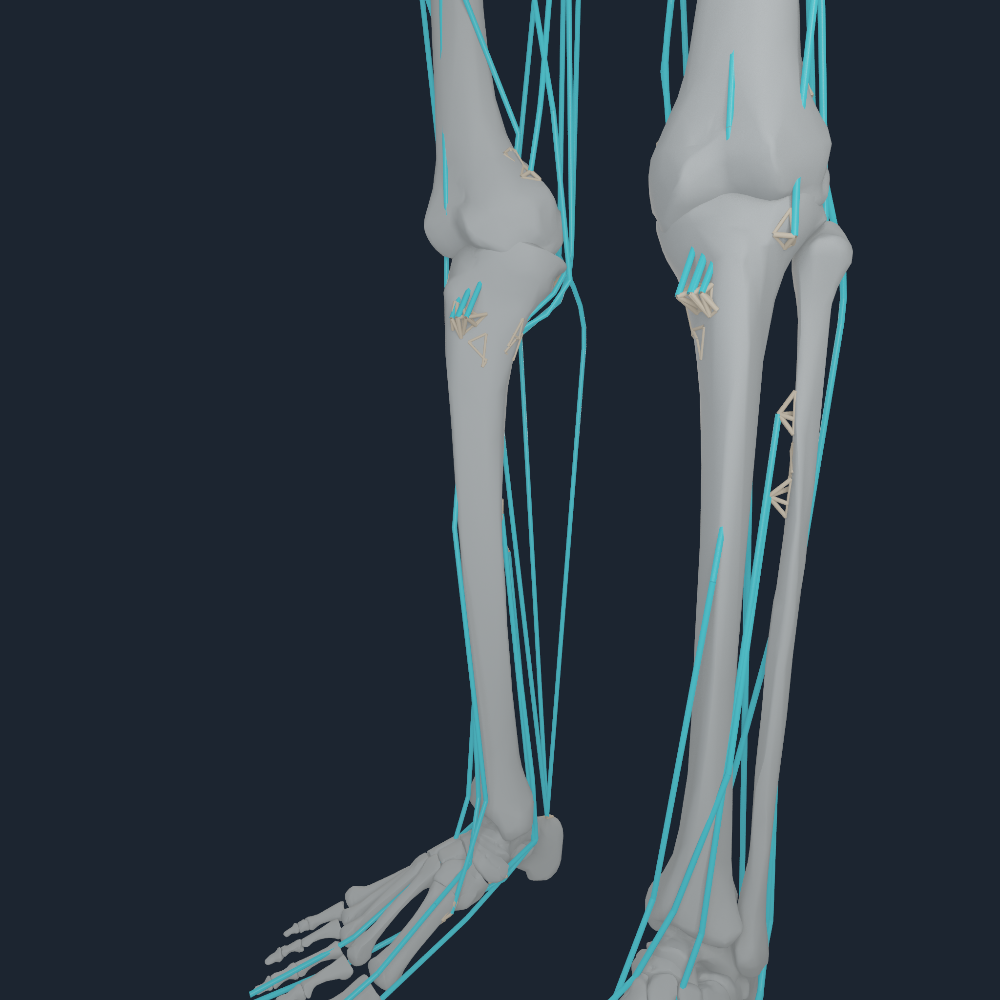
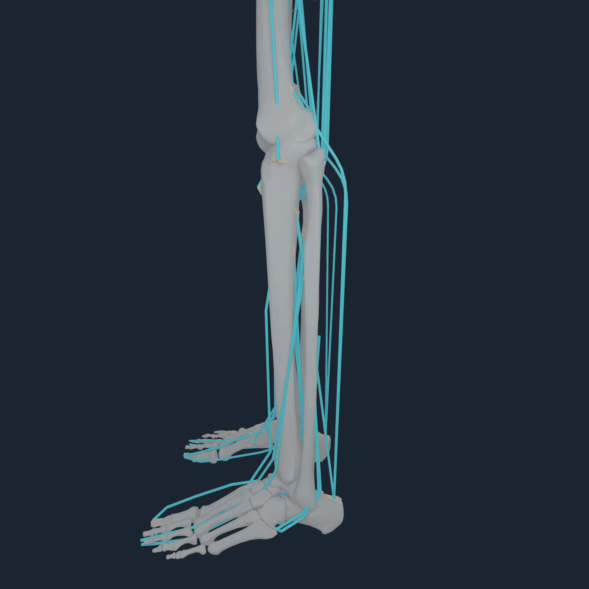
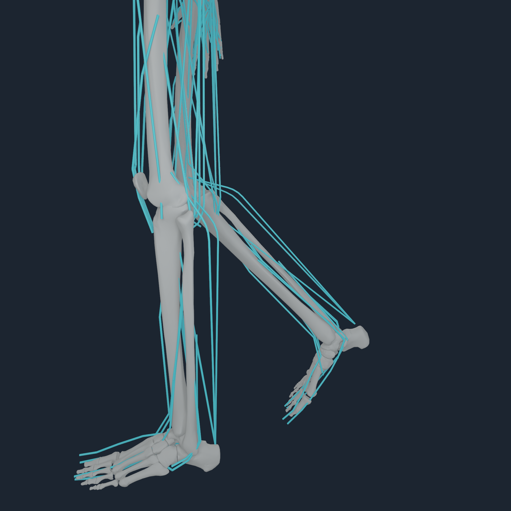
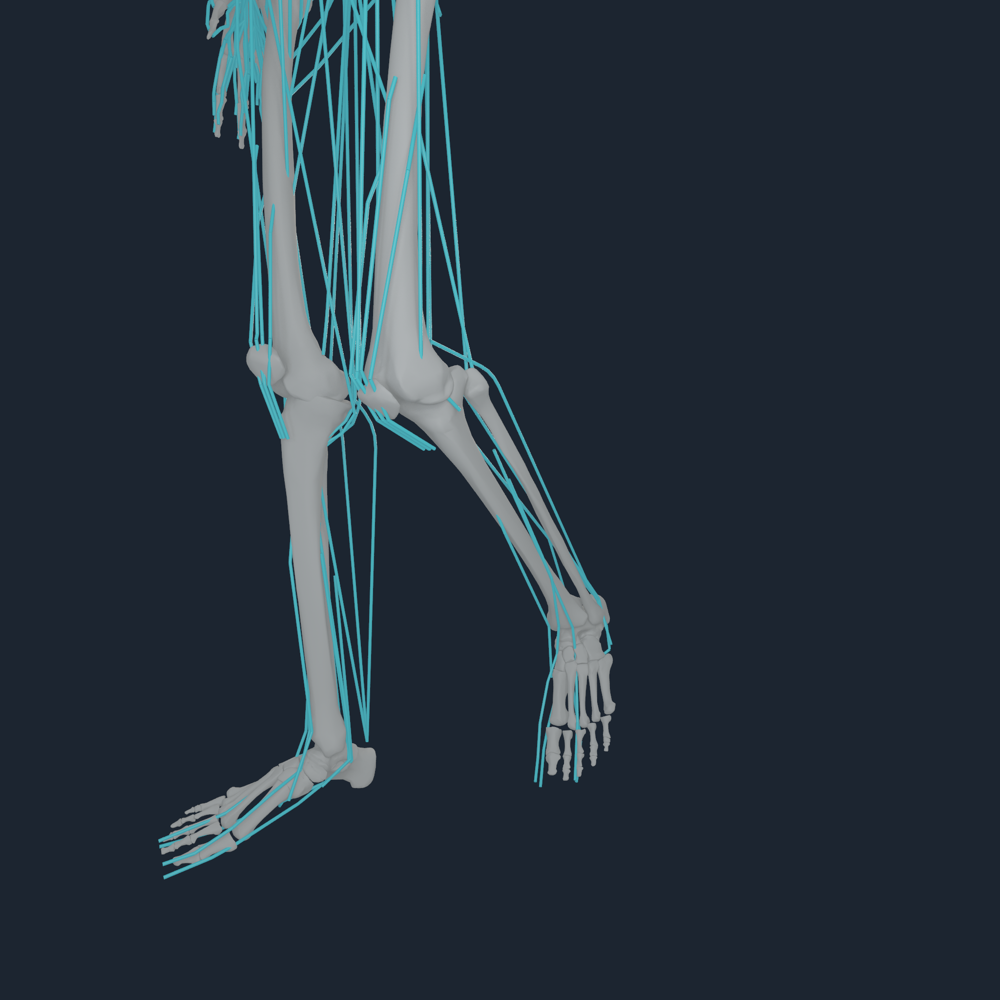

# Lower-limb source-mesh registration v2

## Outcome

This increment corrects the reported femur, patella, tibia/fibula, ankle,
foot, and hallux placement defects without adding toe joints. BodyParts3D
remains the emitted anatomy. Ten bilateral mechanics segments receive one
proper rigid correction against the pinned compiled MyoSim meshes: femur,
tibia/fibula, talus, rigid foot, and patella. Each complete five-toe compound
inherits its rigid-foot default-world correction and retains the existing MTP
joint.

The nearly symmetric patella mesh initially produced a numerically tempting
179 degree flip. The selector now regularizes unnecessary rigid motion and
caps patellar correction at 0.8 rad. The admitted pair uses 12.13 and 22.01
degree corrections, not the flipped candidates.

## Geometry gates

The compiler command is:

```sh
numilab-human myosim-lower-limb-source-mesh-registration \
  --python <pinned-myosim-python> \
  --sources Sources \
  --registration Build/lower-body-rigid-foot-v1.registration.json \
  --tendon-manifest Build/fixed-bone-foot-entheses-v1/numi-human-tendon-attachments.manifest.json \
  --output Build/lower-limb-source-mesh-v2.registration.json
```

Held-out source-surface p90 errors are 5.78-12.38 mm across the ten directly
fitted bodies. Bilateral mirrored mean errors are at most 6.43 mm. All 40
knee, ankle, hindfoot, midfoot, metatarsal, and toe continuity checks pass;
the largest gap is 3.876 mm at the right first-metatarsal/hallux boundary,
below the 4 mm gate.

An independent toe fit is prohibited: it opened metatarsal/toe gaps by
7-18 mm in the rejected experiment. Instead, the complete toe compound uses
one bounded 6.5 mm distal rest-registration refinement. This reduces the four
EHL/FHL source-site-to-hallux distances to 14.77-17.26 mm while preserving all
five chains and adding zero joints.

## Tendon and Apple-runtime gates

Ordinary surface admission remains capped at 12 mm. Only the 18 explicit
one-to-one NHTENDON3 foot/hallux migrations have a separate 25 mm candidate
gate; the admitted artifact reaches 17.262 mm. This prevents the larger atlas
allowance from admitting unrelated endpoints.

The paired artifacts are:

- NHBONES1: `a71f4f279271d9beb7cd16e94ad26b1d0c1aa58a7b54d0bab8b7d9d0a9e48859`
- NHTENDON3: `1ed8afe267d5b1b772740c3ba77404f941d51daf5cf470d74682639230482cc7`
- MyoSim muscle payload: `9a988f19a6fd8e533cd0f2bf3192cb8535fb008ccd394ffbf1a4432d3db76a05`

The M4 Pro probe passes with 416 muscles, 832 endpoints, 558 distributed
envelopes, 274 body-owned point fallbacks, and all 18 migrated foot/hallux
bindings. Maximum reference path recalibration is 10.549 mm and maximum
architecture scale change is 0.04908. Metal reports 0.12435 N maximum muscle
force error against a 2866.66 N reference maximum, 0.06705 maximum muscle
generalized-force error against 2153.36, 0.000120 N nodal transfer parity
error, 0.000244 N force residual, 8.126e-6 N m moment residual, and
byte-identical replay.

A second independent compiler invocation reproduced the registration JSON,
NHBONES1 payload, and NHTENDON3 payload byte-for-byte.

Relative to the previous fixed-foot artifact, seven endpoints newly admit a
distributed law and three left-shank origins fall back because their new
four-node patches fail the conditioning limit. Those three remain exact
source-authored rigid-body point laws; no unstable surface map is forced.
The net changes are 554 to 558 envelopes and 278 to 274 point laws.

## Neutral and flexed visual review

<p align="center">
  
  
  
  
</p>

All four neutral angles and all four flexed angles per side are retained in
the media directory. Neutral frames execute the paired NHTENDON3 program.
Flexed frames set only source q indices 106 or 120 to 0.75 rad, reject values
outside the source position range, and project all dependent coordinates
through the exact 51-record NHEQ1 program. The flexed review is kinematic
articulation evidence, not a muscle-driven, loaded-contact, cartilage, or gait
qualification.

Runtime support and diagnostics are published in Numi Lab commit
`7ebd89c2575da093895f9c77f0e8339ff08dffab`.

## Evidence boundary

This establishes source-mesh-constrained rigid registration, named
tendon-to-bone force-transfer execution, neutral/flexed Metal kinematics, and
multi-angle visual review for the lower limbs. It does not establish clinical
subject registration, ligament/cartilage mechanics, deformable tendon
continuum behavior, contact under load, stable standing, or gait.
