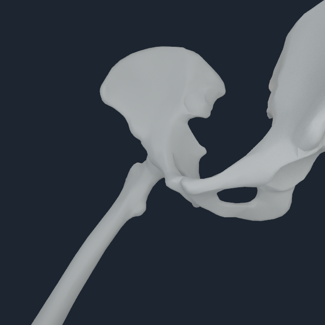
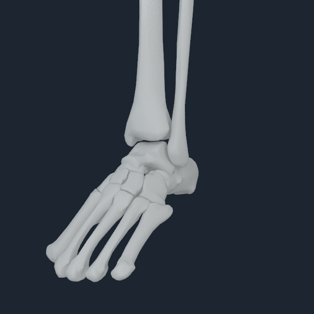
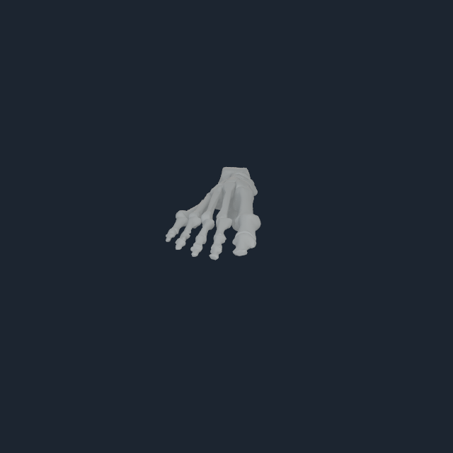

# Lower-limb robust registration and multi-pose audit v3

## Outcome

This increment replaces the lower-limb v2 nearest-vertex-only continuity gate
with a bidirectional articular-interface patch gate and verifies the complete
bilateral hip-to-toe chain in seven source poses. The admitted geometry remains
BodyParts3D 4.0; pinned MyoSim/Rajagopal surfaces and kinematics remain the
mechanics reference. No bone is flipped, no endpoint is moved independently,
and no new joint is introduced.

All 40 neutral knee, ankle, hindfoot, midfoot, metatarsal, and toe transitions
pass both their existing minimum-gap gate and a lowest-2% bidirectional patch
p90 gate. The largest minimum gap is 3.861 mm and the largest robust patch p90
is 4.788 mm. The only extra corrections are shared rigid translations:

- the complete left talus/calcaneus/toe group moves 0.5 mm in world +Z;
- the complete right five-toe compound moves 0.5 mm in world +Y.

The toe correction is deliberately one compound-body correction. All five rays
retain the existing source MTP body, the hallux remains the dominant medial ray,
and independent digit articulation remains zero.

## Reproducible compiler path

```sh
numilab-human myosim-lower-limb-source-mesh-registration \
  --python .venv-myosim/bin/python \
  --sources Sources \
  --registration Build/fullbody-articular-v3.registration.json \
  --tendon-manifest Build/articular-similarity-v1-tendon/numi-human-tendon-attachments.manifest.json \
  --output Build/fullbody-lower-interface-v3.registration.json

numilab-human myosim-lower-limb-pose-audit \
  --python .venv-myosim/bin/python \
  --sources Sources \
  --registration Build/fullbody-lower-interface-v3.registration.json \
  --output Build/fullbody-lower-interface-v3.audit.json
```

An independent invocation reproduced the registration JSON, 11,576,692-byte
NHBONES1 payload, and NHTENDON3 payload byte-for-byte. Their SHA-256 values are:

- registration: `6a48e223545a18390097245b5c21d9d1322991ca451f4bab8e1090e3232ad67f`;
- NHBONES1: `f9132393dfb259a80e2b2084ac5ff15f2bf988f7e073f7a961a7ddcfb9febc3c`;
- NHTENDON3: `0f233866455cac4f221008de5fdbe7304bc4c8f53313c0cdd62f52fde7b8d0e4`.

The paired payload contains 185 bone surfaces, 416 muscles, and all 832 route
endpoints. It admits 638 distributed surface envelopes and retains 194 exact
source-point fallbacks. All 18 named rigid-foot/hallux migrations remain
admitted; the maximum migration is 17.206 mm.

## Multi-pose gates

The new fail-closed audit evaluates neutral, bilateral hip flexion, knee
flexion, ankle dorsiflexion, subtalar rotation, MTP flexion, and a combined
crouch. Exact projection of all 51 MyoSim dependent-coordinate equalities is
applied before each posed interface test.

The result is 280/280 passing interface evaluations and 140/140 passing
bilateral parity evaluations. The default-frame centroid residual is
`5.89e-16 m`. The tightest source-relative case is the left fourth
metatarsal/fourth-toe boundary under MTP flexion: 6.629 mm candidate patch p90
against a 3.185 mm same-pose mechanics patch plus the 3.5 mm rigid-compound
allowance, for a 6.685 mm gate.

The largest bilateral difference is the flexed femur/tibia interface:
3.491 mm patch-p90 difference against the 4 mm parity ceiling. BodyParts3D's
two independently segmented atlas knees are not exact sagittal mirrors, so
the parity ceiling is subordinate to the same-pose per-side mechanics gate and
remains well below the existing 12 mm bilateral surface-fit envelope.

The companion upper-limb audit also passes unchanged against the new full-body
registration: six poses, 312 interface evaluations, and 156 parity evaluations.

## Native Apple validation

Eleven native M4 Pro joint-focus packs retain front, oblique, side, and rear
frames for bilateral hips, knees, ankles, neutral/posed toe compounds, and the
right hindfoot. All captures use the 640 px sensor-reference profile with 8
temporal and 8 area-light samples. Every posed mechanics-anchor residual is at
most `6.15e-8 m`, and every view contains non-zero bone pixels.

<p align="center">
  
  
  
  
</p>

The selected right EHL/FHL Apple Metal transaction executes two persistent
steps and 1,664 endpoint transfers: 1,276 envelope transfers and 388 point
fallbacks. Its maximum force and moment residuals are `0.000122071 N` and
`1.43245e-6 N m`. The borrowed consumer uses the same command buffer, injected
consumer rejection preserves the accepted result, and the transfer layer has
no direct joint-torque or duplicated rigid-state authority.

Machine-readable registration, pose-audit, payload, visual, and transaction
receipts are retained in
[`numi-human-lower-joint-focus-v1`](media/numi-human-lower-joint-focus-v1/).

## Evidence boundary

This proves source-owned rigid geometry placement, source kinematics across a
bounded pose suite, robust surface-interface continuity, exact payload replay,
and an executable tendon force-transfer law. It is not cartilage contact,
ligament restraint, loaded gait, clinical registration, or deformable tendon
continuum mechanics. Those require separate owning tissue state and coupled
constitutive/contact solves.
