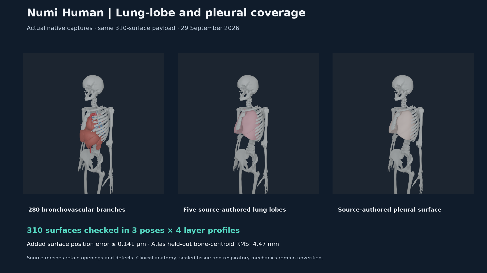
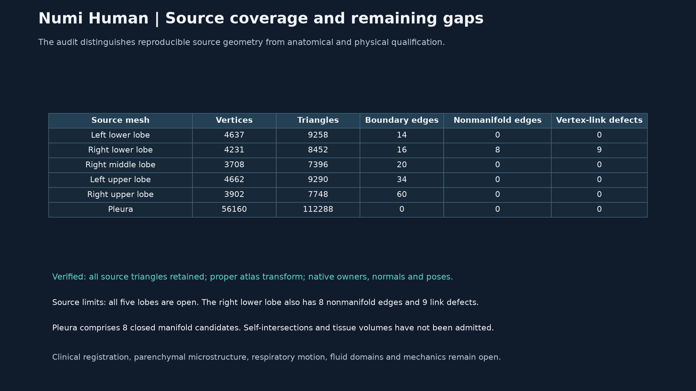

# Lung-lobe and pleural source geometry, 29 September 2026

Numi Human now includes five source-authored lung-lobe envelopes and a
source-authored pleural surface alongside the existing 280 bronchovascular
branches. All **310 torso surfaces** pass independent source-to-native
geometry audits in three poses and four viewing profiles. Added surfaces have
a maximum position error of **0.141 micrometres**, below the unchanged
20-micrometre gate. This closes missing reference-atlas visual coverage;
clinical anatomy, tissue domains and respiratory mechanics remain open.



## Traceable source and independent registration

The selected source is the pinned Z-Anatomy revision
`9a2ef22cc8443d14f9aa18ba91246416b1c6ab7a`, derived from BodyParts3D.
The source archive and exact `Z-Anatomy/Startup.blend` member are hash-verified.
The tracked Blender exporter runs with `--disable-autoexec`, retains existing
source modifiers, exports evaluated viewport geometry in metres and uses
`calc_loop_triangles` for authored polygon triangulation. It adds no smoothing,
repair, decimation or fusion. The second execution reproduced the complete
selected export byte for byte. Selected derived geometry and renders retain
the upstream CC-BY-SA-4.0 license and
[required attribution](media/zanatomy-thorax-source-20260929/ATTRIBUTION.md).

The export retains the complete five-mesh Lungs collection, the Pleura object
and 27 named thorax bone anchor meshes. A proper uniform similarity is fitted
to area-weighted surface centroids of the sternum and bilateral odd-numbered
ribs: 13 fitting anchors. Bilateral even-numbered ribs and both clavicles stay
held out: 14 anchors. The source geometry auditor independently re-fits this
transform from retained Z-Anatomy geometry and exact BodyParts3D OBJ members.
Held-out changes must not affect the fitted transform. Positive scale and a
proper rotation preserve source left/right identity.

| Registration diagnostic | Measured value |
| --- | ---: |
| Uniform scale | 0.9562250098 |
| Fitting centroid RMS, 13 anchors | 4.180 mm |
| Held-out centroid RMS, 14 anchors | 4.468 mm |
| Maximum held-out discrepancy | 6.326 mm |

These are atlas-to-atlas surface-centroid discrepancies. They are not exact
corresponding landmarks, subject calibration, a clinical acceptance threshold
or a claim that all thoracic interfaces are correct. The transform composes
with the unchanged existing BodyParts3D/MyoSim registration and source torso
inertial frame; no reflection or per-lobe fitting is introduced.

## Native geometry and viewing layers

The composite contains 264,157 vertices and 483,696 triangles. Its original
304 records, positions, normals and indices remain byte-identical. Added
stable IDs 305-309 represent the source's two left and three right lobes;
310 represents Pleura. The pleural object retains its source name and has no
guessed FMA identifier. All added surfaces have the named source torso owner.

NHANAT1 ABI 3 preserves the binary layout and adds layers 7 and 8, with native
semantics 51023 and 51024. Historical ABI 1 and ABI 2 remain supported with
their original limits. The native visibility mask selects separate baseline
branches (63), lobes (64), pleura (128), or the combined exterior (255).
Every profile retains all 310 meshes in the packet; hidden instances have
visibility flags zero. Opaque exterior layers can hide internal surfaces.
Packaged mesh counts are distinct from pixel-visible mesh coverage.

Every added source triangle and normal is checked independently. The audit
reconstructs source MuJoCo inertial poses and compares geometry with the
actual native COM pose snapshot, including exact articulated owner and local
transform identity. Geometry/normal-direction tolerances remain 20 micrometres;
the COM/orientation witness gate remains 1 micrometre. Native packet section
hashes alone cannot admit altered geometry. Source equality projection remains
checked in projected poses. These are geometry witnesses, not mechanical
initialization or controller qualification.

| Native pose | Maximum added-surface position error |
| --- | ---: |
| Raw source rest | 0.112 micrometres |
| Projected neutral | 0.112 micrometres |
| Coupled torso flexion/rotation | 0.141 micrometres |

The existing 304 surfaces retain their maximum source error of
0.169 micrometres. Physics-library and shader bytes are unchanged. Native
execution was isolated from other active jobs; timings are not performance
qualification.

## Source geometry limits remain explicit



| Evaluated source surface | Boundary edges | Nonmanifold edges | Vertex-link defects |
| --- | ---: | ---: | ---: |
| Left lower lobe | 14 | 0 | 0 |
| Right lower lobe | 16 | 8 | 9 |
| Right middle lobe | 20 | 0 | 0 |
| Left upper lobe | 34 | 0 | 0 |
| Right upper lobe | 60 | 0 | 0 |
| Pleura | 0 | 0 | 0 |

All five source lobe meshes remain open. Pleura comprises eight closed
oriented manifold candidate components. Signed surface integrals are retained
as diagnostics and are not admitted as fluid or tissue volumes. There is no
source repair, hole capping, mesh removal or component fusion. Self-intersection
and interdomain overlap are not qualified. Branch connectivity, parenchymal
microstructure, pleural contact/coupling, material laws, breathing motion,
pressure, perfusion and biological validation remain open.

## Reproduction and evidence

**129 distinct checks passed without skips.** The combined run passed 123
checks and exposed three failures in the older torso body-link compiler,
which still assumed twelve surfaces and the historical manifest. The compiler
now binds all 304 current baseline surfaces, validates both source hierarchies,
checks actual member bytes and joins the current native source audit with
the hash-bound source/core catalog. Its six focused checks passed, including
the corrected three cases plus forged-source-hash, wrong-native-owner and
partial-coverage rejection. An intermediate retry had five setup errors
because its temporary parent directory was missing; the corrected harness and
failed results are retained. Counts do not duplicate earlier passing cases.
The added six Z-Anatomy surfaces retain their independently audited named
torso binding in the composite geometry oracle.

The native change is published at
`e982c61d` in `Numi2/numi-lab`. Its executed source matches the committed file;
the arm64 probe compiled with warnings treated as errors. Both historical
ABI 1 and ABI 2 produce byte-identical native vertex, index, primitive and
instance sections. Renderer/probe SHA-256 is
`6c363826d1e89e2d84b8177dfea31f3d5fb392d3c0bd9c1b4d9110889a48f975`.

`numi human lung-envelope compose` and `numi human lung-envelope audit` route
to the Human-owned compiler/oracle. The retained Python environment is
`.venv-mujoco312/bin/python` with the pinned MyoSim checkout on `PYTHONPATH`.
For example, from the repository root:

```sh
PYTHONPATH=src:Sources/myosim/checkout \
NUMI_HUMAN_PYTHON=.venv-mujoco312/bin/python \
.numi/commands/human lung-envelope compose \
  --sources Sources --artifact Build/myosim-fullbody \
  --registration Build/knee-parity-registration-20260929/candidate.v6.registration.json \
  --base-payload Build/lung-source-coverage-20260929/payload/bodyparts3d-myosim-torso-anatomy.nhanatomy \
  --output Build/lung-envelope-20260929/reproduced-payload
```

The hash-pinned selected source export is tracked alongside its attribution;
raw source acquisition, exact compiler/native/test commands, executed source
snapshots, binary, payload, MRVPACK packets, actual native poses, 48 camera
captures and logs are retained under `Build/lung-envelope-20260929`. The
public [receipt](media/lung-envelope-20260929/receipt.json) binds selected copies
of all twelve complete audits, the compiler manifest, source reproduction
and current executable/test identities.

The 26-slide executive pack appends these two figures to the preceding
24-slide deck. All original slide/media parts are byte-identical and all
first 24 PDF pages are pixel-identical. The included 10-second standing video
remains the 28 September evidence; it predates later anatomy repairs and is
not a standing run of the new 310-surface payload.

Whole-Human anatomy, clinical registration and physics qualification remain
incomplete. Earlier knee range conflicts, skin shape/topology issues and
cardiac source-mesh limits remain separate open work.
