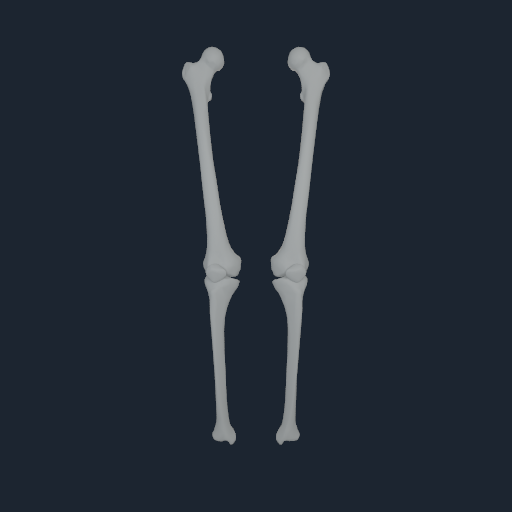
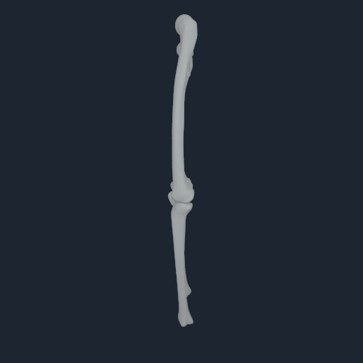

# Current-registration native anatomy QA — 2 October 2026

**Historical candidate notice (3 October 2026):** the images below use
registration `a241f5d3`. A later overlay-consistent source registration is
recorded in the [3 October lower-limb audit](media/numi-human-lower-limb-overlay-20261003/receipt.json)
with fingerprint `b22f93ed`; its raw source-qpos0 pose puts most patella
vertices behind the knee-anchor plane. The source-equality-projected neutral
pose passes the source-side geometry checks, but any future static anatomy
view built from that candidate must use that pose; it is not a native accepted
state. These earlier images are not images of the later candidate and have not
been regenerated.

The current provisional bone and muscle-surface payloads now render together
on an Apple M4. Their registration fingerprint is `a241f5d3`; the renderer
verified all ABI 3 source-record indices against the source-to-Core map in the
matching NHRIGID2 payload. The full-body QA capture contains 185 bone surfaces
and 150 route-bound muscle/tendon surfaces. It contains no skin shell, organs,
vessels, nerves, cartilage, menisci or ligaments.

The focused source-qpos0 knee capture shows both patellae anterior to the knee.
In literal source qpos0, every patella vertex stays ahead of its source
knee-anchor plane; the minimum offsets are **11.312 mm** on the right and
**11.342 mm** on the left. That confirms the apparent backside placement is
not present in this provisional payload's source pose.

A separate all-vertex geometry diagnostic also reports 16/16 anteriority checks
passing after equality projection across eight generated poses, with a minimum
offset of **15.425 mm**. Those projected poses are a geometry audit, not
validated motion evidence. The old single “maximum correction” diagnostic
mixed coordinate units: neutral includes a **52.419 mm** slide correction,
knee flexion has a **0.60208 rad** hinge correction, and deep crouch has a
**1.10078 rad** hinge correction. The pose sweep therefore does not confirm
clinical patellar tracking or anatomical correctness through motion.

The focused images below are unedited native-renderer QA captures. They are
engineering evidence, not a clinical anatomy certificate or a board slide.

The Human candidate remains marked `provisional_visual_registration_not_admitted_to_collision_or_physics`, and it does not contain the separate admitted lower-limb registration v3 receipt required for the formal lower-limb pose audit. The anteriority result is a bounded source-pose geometry diagnostic. It does not establish clinical anatomy, patellofemoral cartilage contact, loaded force transfer, contact pressure, tissue mechanics, or sustained standing.

## Paired tendon coverage check

An offline NHTENDON3 compile against this current bone registration retained all
832 endpoint records, but produced only **152 distributed surface envelopes**
and 680 explicit source-point fallbacks (18.27% surface coverage). The prior
toe-standing candidate on registration `1ec681e5` has 653 envelopes and 179
fallbacks. In the current compile, 632 endpoints exceed the configured
12 mm surface-distance gate, 20 have multiple possible bone members without a
unique semantic map, and four semantic representatives exceed their distance
gate. The current compile preserves endpoint records; it does not preserve the
previous surface mapping quality. It was not used in a native tendon
transaction or standing run and is not promoted.

The formal lower-limb registration builder also rejected the current cached
MyoSim artifact because its reference manifest predates the live
`myosim-left-knee-translation2-reflected-range-20261002` source overlay. The
sole source-joint-map difference is joint 112: its cached translation range
is `[+7.69e-11, +0.006792] m`, while the live reflected range is
`[-0.006792, -7.69e-11] m`. NHRIGID2 bytes and all 2,250 checked source fields
match, but source metadata does not. A fresh exact-source export was stopped
during compliant force-law fitting before it wrote artifacts. The next repair
gate is an overlay-consistent source export, followed by a newly paired
bone/tendon compile and the formal lower-limb pose audit. Exact diagnostics are
recorded in
[`source-registration-refresh-attempt.json`](media/native-visual-current-registration-abi3-20261002/tendon-candidate-not-promoted/source-registration-refresh-attempt.json)
alongside the tendon coverage receipt.

## Native reader compatibility fix

The old physical-M4-Pro probe accepted only NHBONES1 ABI 2, whose bone record
is 56 bytes. ABI 3 appends a source-record index, making each record 60 bytes.
The native reader patch now handles both layouts, verifies each ABI 3 source
index against NHRIGID2, and reports `bone_source_owner_bindings_verified=true`.
ABI 2 remains readable and reports the binding check as unavailable. A copied
ABI 3 payload with a mismatched source index was rejected before rendering.
The CMake target passed with warnings-as-errors, and the native M4 render passed
with the exact current bone and NHTISS4 payloads. The scoped runtime change is
in [PR #7](https://github.com/Numi2/numi-lab/pull/7).

The evidence receipt, exact payload and renderer hashes, four full-body views,
four focused-knee views, renderer manifests, compressed logs, and the
machine-readable patellar diagnostic are retained in
[`media/native-visual-current-registration-abi3-20261002/`](media/native-visual-current-registration-abi3-20261002/).

## Source-consistent registration follow-up — 3 October 2026

The refreshed candidate has a separate [source registration and pose audit](media/numi-human-lower-limb-overlay-20261003/receipt.json).
The unprojected source qpos0 diagnostic fails anteriority on both sides
(minimum offsets **-17.070 mm** right and **-17.286 mm** left). Exact
source-equality projection moves the compiled patella vertices anterior to the
knee-anchor plane in all 16 tested evaluations, with a minimum **9.414 mm**
margin; at projected neutral, the minimum margins are **35.197 mm** right and
**34.979 mm** left. The independent MyoSim source-visual preflight also passes
its 25 mm body-center display gate at **44.342 mm** right and **44.340 mm**
left. These are two different registrations and pose states: the earlier
images use `a241f5d3`; the qpos0 failure and projection result apply to
`b22f93ed`. For static views of `b22f93ed`, use the projected neutral pose.
That kinematic projection is not a native accepted state. Neither candidate
qualifies cartilage-facing orientation, patellofemoral contact, loaded
transfer, clinical tracking, or standing.

The refreshed registration remains provisional and is not admitted to
collision or physics. Its paired tendon map has 19.95% distributed surface
coverage and was not used in a native transaction or run. No new images or
board deliverables were produced for this update.

## Remaining anatomy and simulation gates

This render covers bone and selected muscle/tendon visuals only. Physical skin
and organ surfaces, blood vessels and flow, nerves, cardiac activation and
electromechanical coupling, registered cartilage and ligaments, material
calibration, loaded contact/pressure, measured-subject calibration, and
integrated physiology remain open. The current 10-second muscle-feedback
standing attempt also remains a failure-focused partial run: it lost support
and diverged before completion at 5.728 simulated seconds; see the
[partial-run report](NATIVE_STAND_CURRENT_TOE_ENTHESIS_10S_FAILURE_20261002.md).

No board deck or video was produced.
