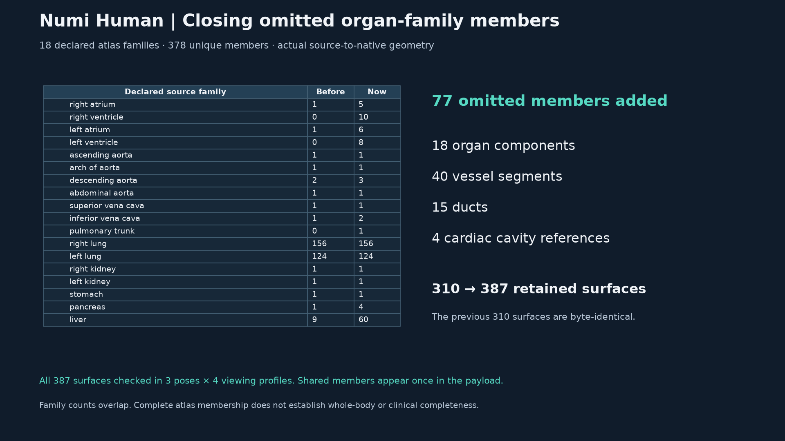
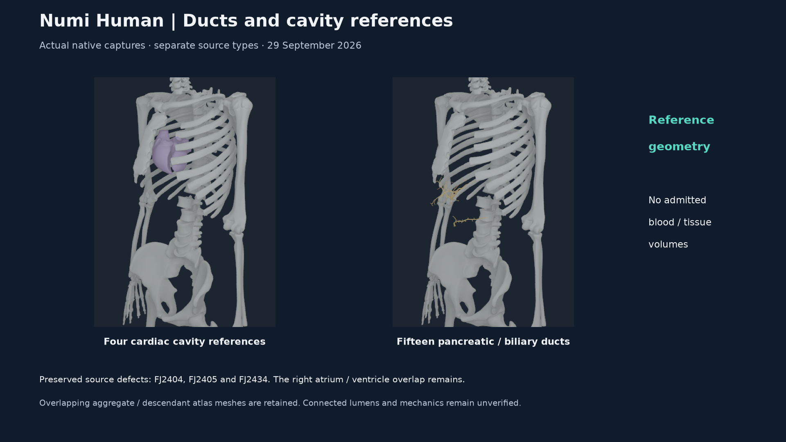

# Complete declared organ-family visual geometry, 29 September 2026

Numi Human now renders every member of the existing 18-region BodyParts3D
organ-family graph. The composite grows from **310 to 387 surfaces** by adding
**77 omitted source members**: 18 organ components, 40 vessel segments,
15 ducts and four cardiac cavity references. All 387 surfaces pass independent
source-to-native geometry audits in three poses and four viewing profiles.
This closes membership gaps in the declared atlas graph. Whole-body coverage,
clinical anatomy, connected lumens and organ mechanics remain incomplete.



## Source selection and types

The Human-owned compiler checks the pinned source lock and both `is_a` and
`part_of` hierarchy tables. It verifies every exact concept, source name and
complete member list in `physiology-organ-network-template.v1.json`, then
deduplicates the union. All **378 unique source members** are represented.
Eight shared members retain their family incidences while appearing once in
the payload. The original 304 BodyParts3D surfaces include 301 of these members
and three separate baseline selections; six retained Z-Anatomy surfaces bring
the original composite to 310. Family counts must not be summed as unique
surfaces, disjoint tissue or physical volumes.

| Source type added | Members | Layer / semantic |
| --- | ---: | --- |
| Material organ components | 18 | 1 / 51010 |
| Arterial or venous tree segments | 40 | 2 / 51011 |
| Cardiac cavity reference surfaces | 4 | 9 / 51025 |
| Ducts or biliary-tree segments | 15 | 10 / 51026 |

Vessel and duct partitions follow exact source `is_a` types, including generic
arterial/venous tree trunks. A parent family name cannot turn its descendants
into a named whole organ. Immaterial anatomical entities are explicitly cavity
references, not tissue. Ambiguous type partitions fail closed. Every new
surface retains its source OBJ member/hash, all source type labels, family
incidences and raw/exact-coordinate-quotient topology diagnostics.

The existing source/body bindings remain unchanged. New thoracic members use
the named source torso frame; new abdominal members use the named Abdomen
frame. Shared abdominal-aortic member FJ1932 has one explicit Abdomen owner.
The added IVC trunk FJ3659 also uses Abdomen. These are single-link kinematic
visual bindings; no organ deformation, material law or mechanical owner is
introduced.

## Independent geometry and native visibility



The payload retains all original 310 records, vertices, normals and indices
byte for byte. Added stable IDs are 311-387. Total geometry is **342,870
vertices and 610,604 triangles**. NHANAT1 ABI 4 retains the binary layout and
adds cavity and duct layers. Native semantics and materials preserve the
distinction between a cavity reference and a material surface.

| Viewing profile | Mask |
| --- | ---: |
| Baseline organs, vessels, nerves and bronchovascular branches | 63 |
| Cardiac cavity references | 256 |
| Ducts | 512 |
| Combined exterior | 1023 |

Each profile keeps all 387 surfaces in the native packet and records the
actual mask/COM poses. Selected instance flags are 11, hidden flags are zero.
An opaque exterior can occlude internal meshes. Packet coverage, visibility
selection and pixel-visible coverage are separate claims. Colors identify
source layers; they do not encode blood flow, material state or physiology.

The compiler uses the existing Human source-to-world/world-to-body lowering
and consumed body catalog. The auditor independently rebuilds geometry and
area-weighted normals with NumPy and obtains raw-rest/posed inertial frames
from the pinned MyoSim MuJoCo model. It checks every triangle index, named
source/core owner, local transform, normal, native position and visibility
flag, including the unchanged 310-surface baseline.

| Native pose, four profiles each | Maximum added position error |
| --- | ---: |
| Raw source rest | 0.104 micrometres |
| Projected neutral | 0.104 micrometres |
| Coupled torso flexion / rotation | 0.120 micrometres |

The existing geometry/normal-direction gate remains 20 micrometres, the
COM/orientation witness gate 1 micrometre, and the normal unit-length gate
0.002. These are source/renderer parity gates, not clinical tolerances.
The physics library and shaders are unchanged. Other host jobs remained
running; timing is not performance qualification.

## Source defects and open gates

Three **added** members retain source defects after identifying exactly
coincident coordinates; their emitted raw vertices and triangles are unchanged:

| Member / source family | Duplicate faces | Vertex-link defects |
| --- | ---: | ---: |
| FJ2404 / liver vessel | 2 | 6 |
| FJ2405 / liver vessel | 1 | 3 |
| FJ2434 / right ventricular component | 1 | 3 |

The other 74 added meshes are closed oriented manifold candidates under that
diagnostic. Self-intersection and interdomain-overlap checks are not performed
by this topology diagnostic and closed candidates do not admit physical
volumes. The existing [cardiac cavity intersection audit](CARDIAC_CAVITY_REGISTRATION_20260912.md)
separately records 42 intersecting right-atrium/right-ventricle triangle pairs.
The new views retain those source domains and do not select either later
partition convention. Aggregate/descendant atlas meshes can overlap.

Earlier [lung source defects](LUNG_ENVELOPE_SOURCE_GEOMETRY_20260929.md), knee
range conflicts, skin shape/topology limits and other cardiac mesh defects
remain open. The 18-region graph is a declared source selection, not an
exhaustive whole-body inventory. Source/interface geometry outside that graph,
clinical registration, connected tubes, tissue domains, material data,
deformation and load/contact/energy qualification still require evidence.

## Reproduction and receipts

`numi human organ-family-geometry compose` and `audit` route to the
Human-owned compiler/oracle. From this repository, after reproducing the
unchanged 310-surface lung-envelope baseline:

```sh
PYTHONPATH=src:Sources/myosim/checkout \
NUMI_HUMAN_PYTHON=.venv-mujoco312/bin/python \
.numi/commands/human organ-family-geometry compose \
  --sources Sources --artifact Build/myosim-fullbody \
  --registration Build/knee-parity-registration-20260929/candidate.v6.registration.json \
  --base-payload Build/lung-envelope-20260929/payload/thorax-lung-envelope.nhanatomy \
  --output Build/organ-family-coverage-20260929/reproduced-payload
```

Final payload SHA-256:
`7bb24753aa535dd6c5351580486517d92955d3ef3a04d6db8510e59e44419287`.
Executed native probe SHA-256:
`68d85d07385fd5df487bccc5f0d8ace5eaba61e1fe1e601e1a8cf9cfa767b07e`.
The native reader is published at `3840e052` in `Numi2/numi-lab`; its committed
source matches the captured executable source byte for byte.
Exact commands, source snapshots, compiler manifests, binary, payloads,
48 final camera captures, native packets/COM poses and twelve full audits
remain under `Build/organ-family-coverage-20260929`. Preliminary compilation
and captures remain separate. The final compiler and independent oracle use
different coordinate lowering paths; preliminary shared-helper geometry was
superseded and is not the final evidence.

Regression checks cover all twelve 387-surface pose/profile audits, rehashed
native/payload/receipt corruption, omitted/extra/duplicate source members,
wrong type partitions, a deliberately corrupted compiler coordinate helper,
ABI-4 input refusal and byte-identical historical ABI-1/2/3 native geometry.
The existing lung-envelope tests and four ABI-2 negative cases also run
against the retained source inputs. Exact counts and terminal results are
recorded in the receipt.

**93 distinct checks passed without skips:** 83 from the combined run, its
four corrected cases, two new same-size altered-archive refusal checks, and
four ABI-2 negative checks. The combined run initially failed four harness
cases: FJ1932 was already in the baseline, two owner mutations left the owner
unchanged, and the ABI-1 historical command used an obsolete flag. A first
retry passed five cases but found that the selected old directory had no
retained packet. The final eight-case run uses the retained `current-neutral.v2`
ABI-1 command/packet and passes the corrected cases, both archive guards and
the ABI-2/3 positive rechecks. Duplicate rechecks are excluded from the count.
The failed runs and exact hash-matching historical source snapshots remain
available. No source geometry or acceptance tolerance was changed to obtain
these passes.

The public [receipt](media/organ-family-coverage-20260929/receipt.json) binds
selected immutable copies, exact executed source/test hashes and validation
results. Source-derived geometry and images retain the
[existing attribution](media/zanatomy-thorax-source-20260929/ATTRIBUTION.md).

The executive pack appends two source-family slides to the 26-slide deck.
Earlier slides retain their dates and evidence limits. Its 10-second native
standing video remains the 28 September run and predates the later anatomy
repairs; it is not a current standing run of the 387-surface payload.
