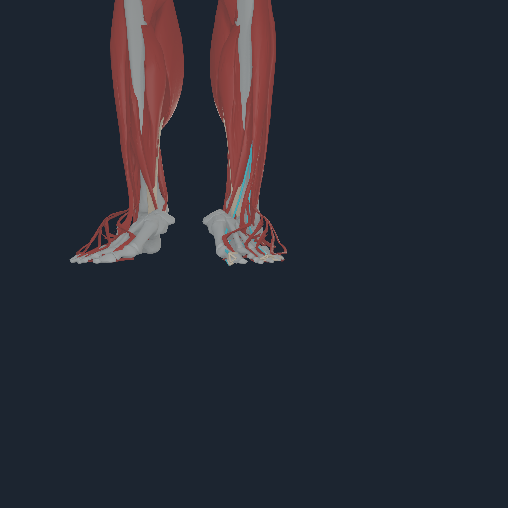
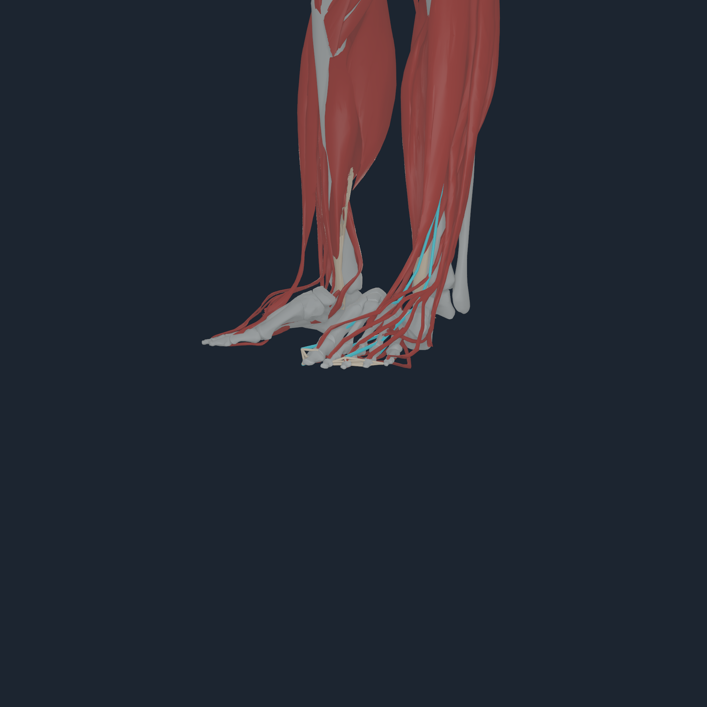
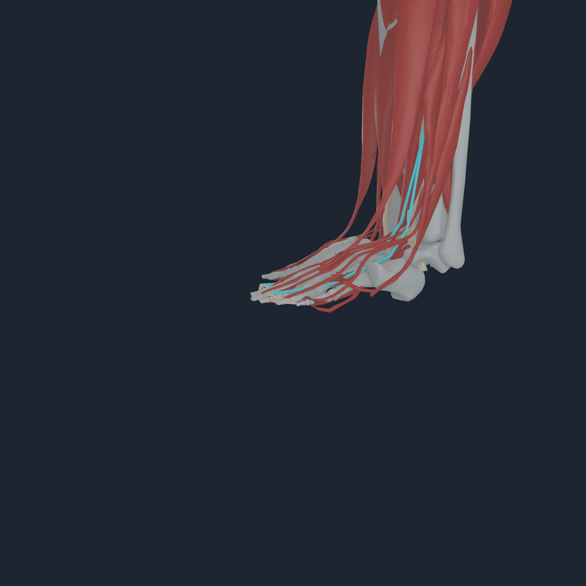
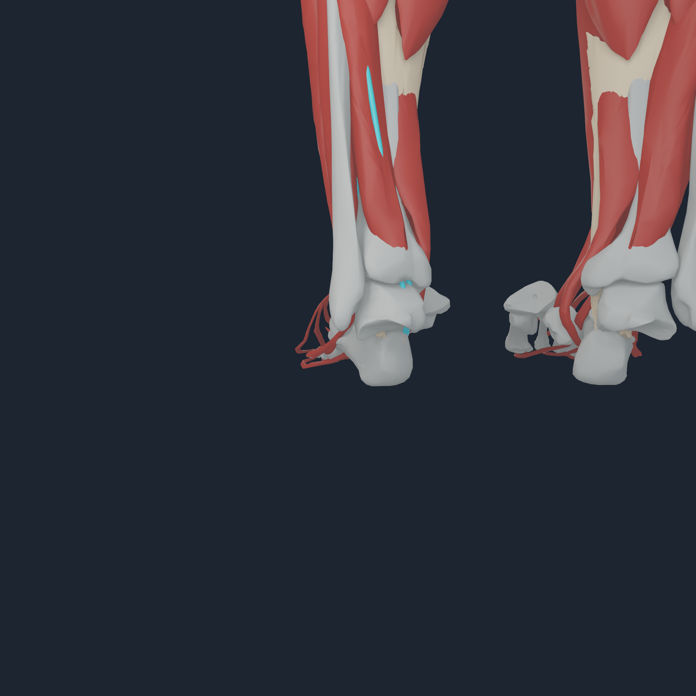
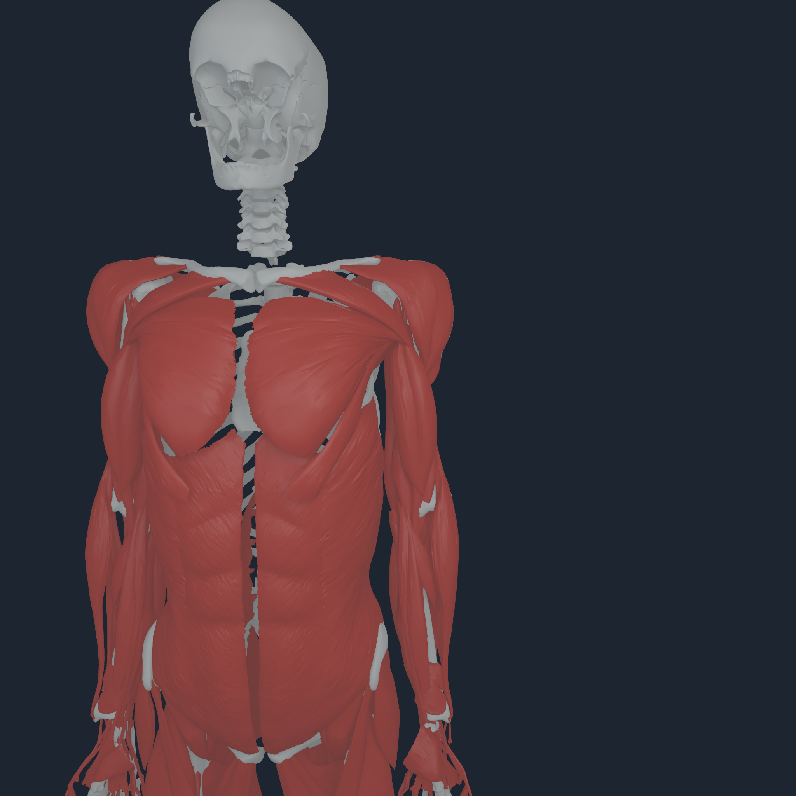
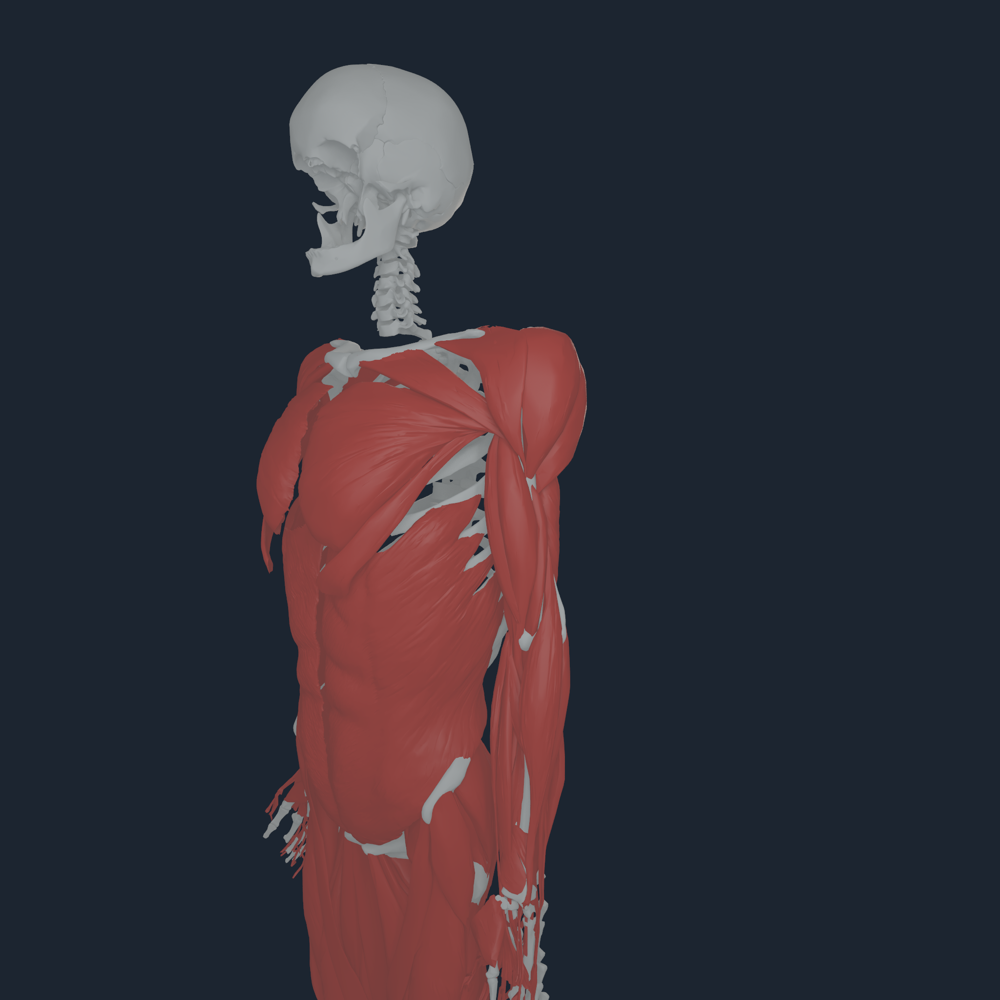
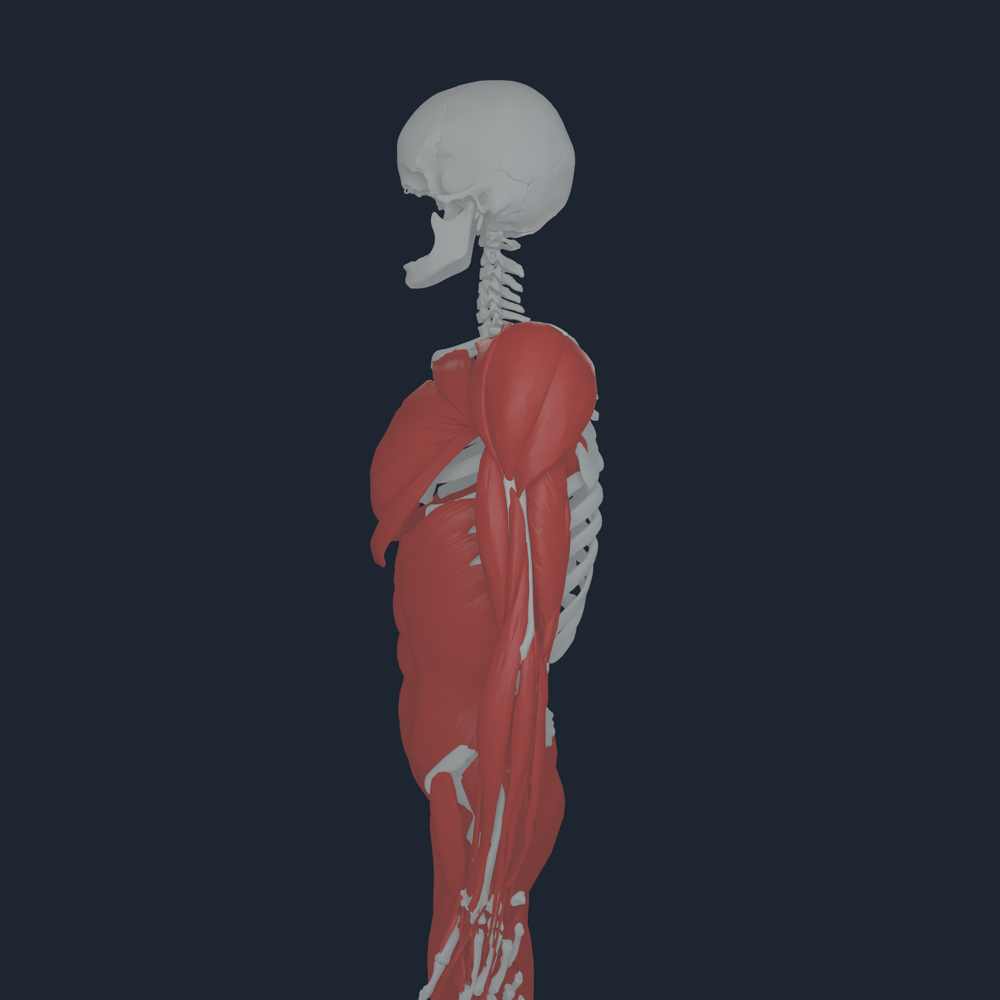
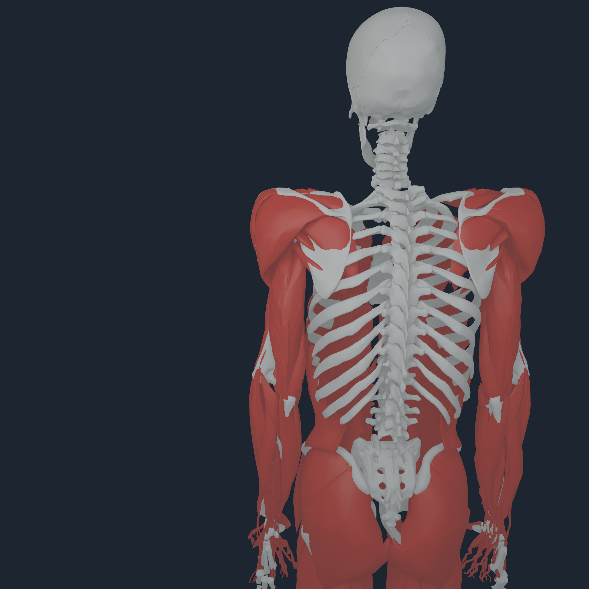

# Numi Human source-derived part control v1

## Outcome

Every Core body crossed by at least one compiled MyoSim muscle route is now a
named diagnostic control target. The catalog is decoded from the source-pinned
`NHMYO` payload and its manifest: it does not infer muscles from mesh proximity,
invent a joint, or inject a direct torque. Selecting one body activates the
union of exact source actuators whose route contains that body; all 416 source
paths are still evaluated by the native runtime.

The current artifact exposes 76 route-controllable bodies and all 416 source
muscles. For example, `toes_l` resolves exactly to actuator rows 384--387:
`edl_l`, `ehl_l`, `fdl_l`, and `fhl_l`. `humerus_l` resolves to its 37 exact
incident routes. Unknown names and drifted payload hashes fail before launch.

```sh
numi human control-list Build/myosim-fullbody

numi human control \
  Build/myosim-fullbody \
  Build/bodyparts3d-myosim-major-bones/bodyparts3d-myosim-major-bones.nhbones \
  Build/bodyparts3d-myosim-fullbody-muscle-surfaces/bodyparts3d-myosim-fullbody-muscle-surfaces.nhtissue \
  Build/numi-human-tendon-v5/numi-human-tendon-attachments.nhtendon \
  Build/control-toes-left toes_l \
  --activation 0.2 --steps 16 --mechanics-overlay
```

The command caps diagnostic activation at 0.2. Python performs only the
source-identity lookup at launch; `exec` replaces it with the native visual
probe, so stepping, force evaluation, dynamics, and rendering remain in the
Core/Metal path.

## Bilateral toe topology gate

The former hallux-only compound gate now validates all five BodyParts3D toe
chains on both sides: 38 source bone meshes in ten chains. Every chain must be
complete, owned by the correct existing `toes_l` or `toes_r` body, and use one
identical local transform. Every adjacent source-surface gap must remain below
1 mm. Measured maxima range from 0.256 to 0.727 mm.

Terminal identities are also fail-closed. EHL/FHL may terminate only on digit
1 (`FJ3182` left, `FJ3192` right); the lumped EDL/FDL sheets must name the exact
digit 2--5 distal union. This closes the one-toe indexing failure without
adding independent articulation.

## Apple M4 Pro visual check

<p align="center">
  
  
  
  
</p>

The 2048 px toe run selected four exact source actuators, exposed their 25
route-centreline segments and drew four admitted tendon envelopes, evaluated 6,656
source force records in 32 Apple M4 Pro Metal transactions, and produced all
four views. The transformed co-rigid toe chains remain continuous, with no
missing or duplicated hallux member. The cyan route is a mechanical path
diagnostic; the red BodyParts3D sheets remain kinematic visual surfaces.

<p align="center">
  
  
  
  
</p>

The separate upper-arm run selected 37 exact source actuators and completed the
same four-angle Apple M4 Pro path. Its transcript and the toe transcript are
retained beside the images.

## Boundary

This is bounded diagnostic coactivation, not a task controller, movement
policy, physiological synergy, calibrated neural recruitment map, direct
torque interface, stable rollout, gait result, or clinical validation.
Selecting all muscles incident to one body can include antagonists. It is the
exact, inspectable actuator-selection foundation on which body-part-specific
controllers can be developed without corrupting source anatomy.

These focused captures report `tendon_step_transaction=none`: they load and
draw the `NHTENDON2` attachment program but do not publish it to the borrowed
per-step deformable consumer. The existing persistent `numi human stand` path
remains the qualified tendon force-transfer law. Moving arbitrary selected
part activation through that same accepted/rollback-safe transaction is a
separate control-runtime gate and is not implied by these images.
