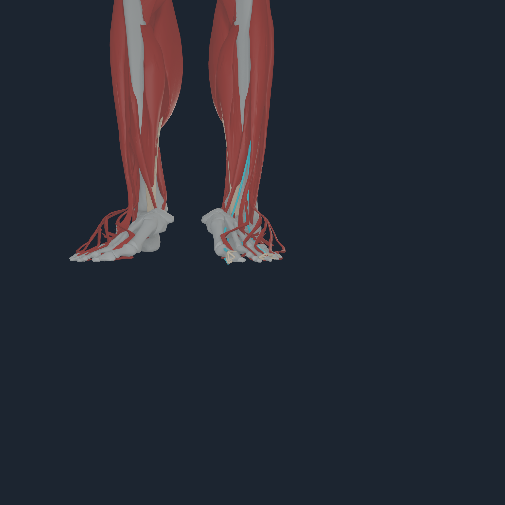
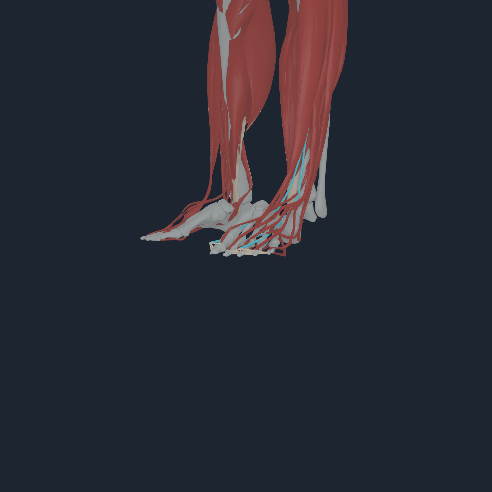
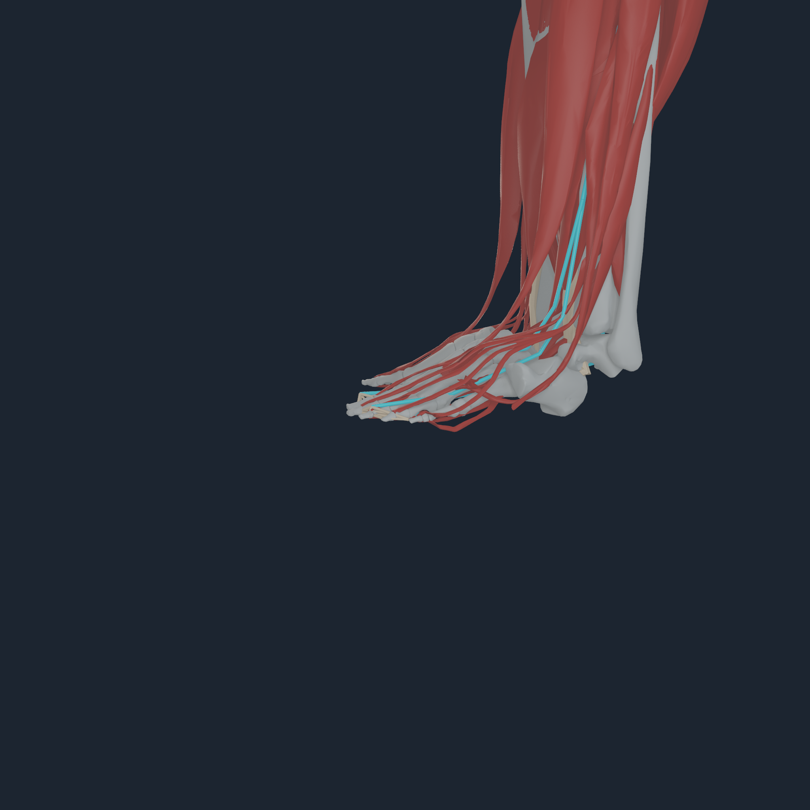
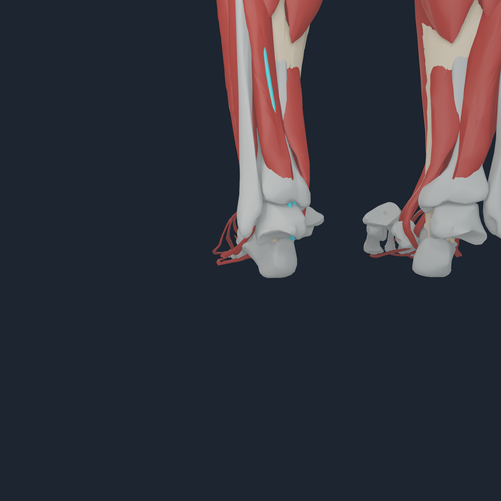
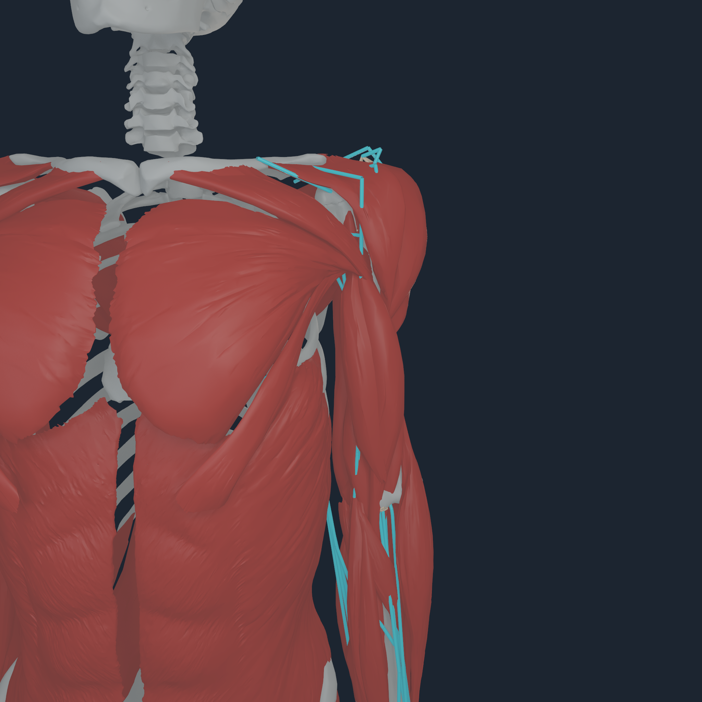
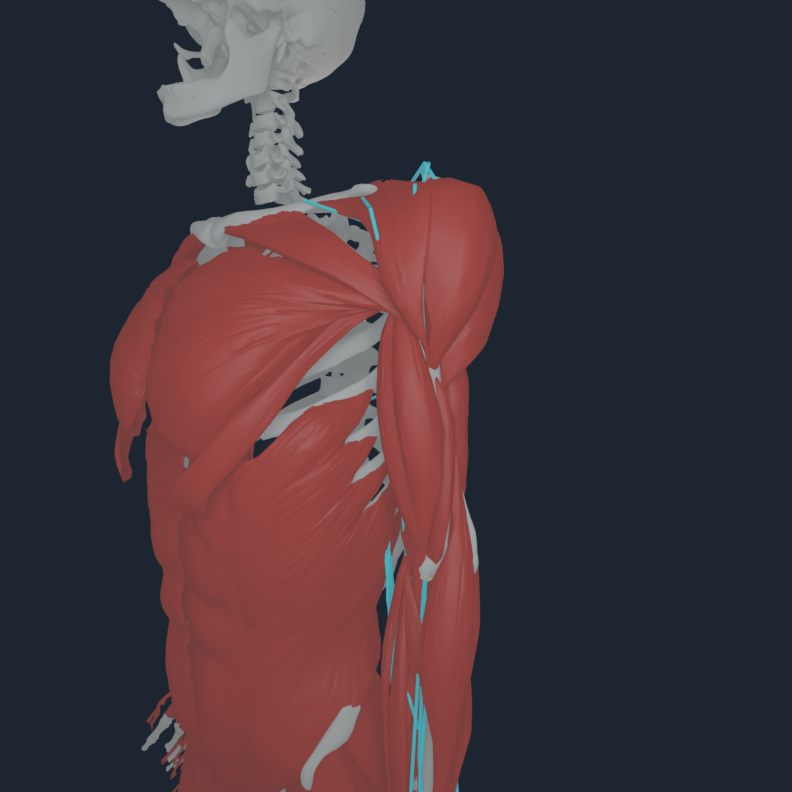
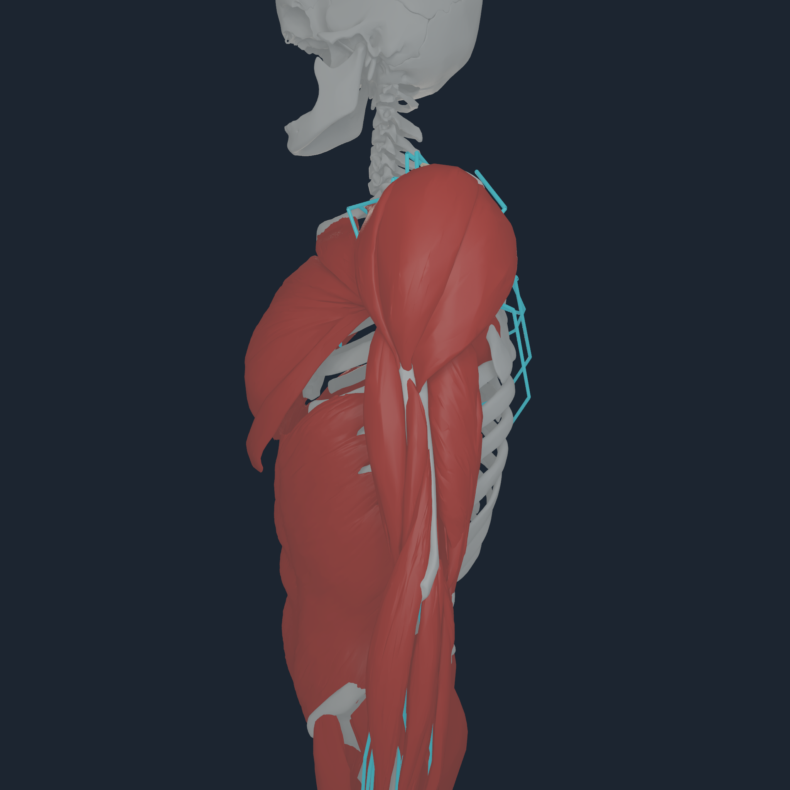
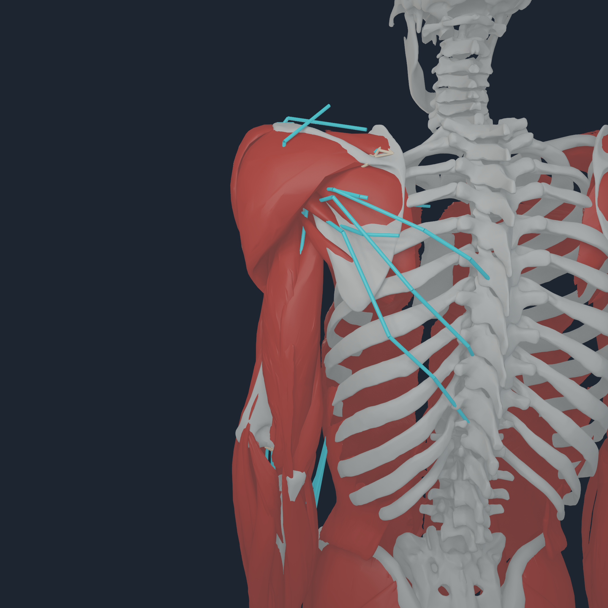

# Numi Human transactional part control v2

## Outcome

`numi human control` now carries a named body-part selection through the same
accepted/rollback-safe `NHTENDON2` force-transfer transaction as the persistent
Human stand operator. It first compiles the full-body posture using all 416
MyoSim actuators, then adds the requested bounded activation increment only to
the exact source routes incident to the selected body. All 416 routes remain
active inputs to native Apple Metal dynamics.

Each selected run also executes a matched zero-increment baseline from the same
compiled posture. Qualification fails unless a nonzero requested increment
changes `q` or `v`. This separates the selected effect from gravity, support,
and the imperfect compiled posture baseline.

The tendon output is now an executable force-transfer law at the consumer
boundary: every accepted step publishes 832 source terminal loads, including
admitted four-node bone-surface envelopes, on the owning command buffer. A
consumer rejection rolls back without publication. Removing the output-only
tendon transaction leaves rigid `q`/`v` bitwise identical, so it cannot be
misread as a second hidden joint-torque path.

```sh
numi human control-list Build/nheq1

numi human control \
  Build/nheq1 \
  Build/bodyparts3d-myosim-major-bones/bodyparts3d-myosim-major-bones.nhbones \
  Build/bodyparts3d-myosim-fullbody-muscle-surfaces/bodyparts3d-myosim-fullbody-muscle-surfaces.nhtissue \
  Build/numi-human-tendon-v5/numi-human-tendon-attachments.nhtendon \
  Build/control-toes-left-v2 toes_l \
  --activation 0.10 --steps 16 --dimension 2048 --mechanics-overlay
```

`--activation` is an increment over the compiled posture activation, not an
absolute replacement. It is capped at 0.2 and saturated per actuator at 1.0.

## Left toes

<p align="center">
  
  
  
  
</p>

The Apple M4 Pro run selected exactly `edl_l`, `ehl_l`, `fdl_l`, and `fhl_l`.
Across 16 accepted 100 microsecond steps it evaluated 6,656 muscle records and
published 13,312 tendon endpoint transfers: 4,864 envelope transfers and 8,448
explicit point fallbacks. The selected increment differed from its matched
baseline by `1.677e-4` maximum `q` and `1.827e-1` maximum `v`; the maximum
equality-position error was `4.933e-7 m`. Force and moment residuals stayed
below `1.399e-4 N` and `2.590e-6 Nm`, and replay was bitwise identical.

Front, oblique, side, and rear inspection shows all five co-rigid left toe
chains, including the hallux, with no missing or duplicated digit. Cyan lines
are exact source mechanical routes; warm endpoint fans are the admitted
transfer envelopes. They are deliberately diagnostic overlays, not rendered
tendon tissue.

## Left humerus

<p align="center">
  
  
  
  
</p>

This independent non-foot check selected the 37 exact source routes incident to
`humerus_l`. Its 16-step run published the same 13,312 endpoint transfers and
differed from the matched baseline by `2.476e-4` maximum `q` and `2.545e-1`
maximum `v`. The maximum equality-position error was `5.019e-7 m`; force and
moment residuals stayed below `1.754e-4 N` and `2.590e-6 Nm`; replay was
bitwise identical. All four views were inspected for route coverage and source
surface continuity. The angular cyan paths remain source-route diagnostics,
not claims of anatomical tendon surface shape.

The mechanics and selection result remain current, but this gallery predates
the corrected pectoralis visual binding. Use the
[pectoralis-origin v1 views](PECTORALIS_ORIGIN_V1.md) when judging the lower
chest surface during humerus motion.

## Boundary

The compiler still reports `balanced=false` with a large acceleration
diagnostic, and the qualified horizon is only 1.6 ms. This is a deterministic,
bounded part-control and force-publication gate—not stable standing, gait,
closed-loop motor control, a deformable tendon or enthesis material solve,
photorealistic skin, clinical anatomy, or clinical validation. Selecting all
routes incident to one body may coactivate antagonists.

Exact transcripts and SHA-256 hashes are retained in
[`media/numi-human-part-control-v2-transactional-2048`](media/numi-human-part-control-v2-transactional-2048/).
