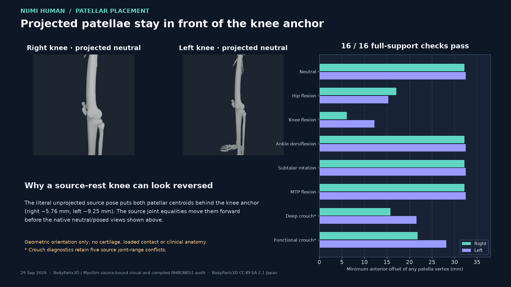

# Full-support patellar anteriority in the compiled lower-limb inspection

The current `NHBONES1` payload places **every decoded patella vertex anterior
to its source knee joint anchor in all eight equality-projected lower-limb
inspection poses**: 16 of 16 side/pose checks pass. The smallest offset is
**6.093 mm**, at the right patella in bilateral 0.9-radian knee flexion.
This directly tests the gross front/back concern across the whole patellar
mesh instead of relying on a centroid or a camera angle. It does not certify
the cartilage-facing surface, loaded articular contact or clinical anatomy.



The literal, unprojected MyoSim `qpos0` is different: the right and left
patellar centroids are **5.760 and 9.251 mm posterior** to their knee anchors,
respectively. In that source pose, 125/178 right and 172/180 left patella
vertices lie on or behind the knee-anchor plane. The source patellofemoral
equality program moves both patellae forward in the neutral runtime pose.
Thus a raw source-rest knee image is not evidence of the displayed projected
anatomy. The audit now records the raw-source and projected states separately
and fails the projected gate if even one patellar vertex crosses the plane.

The signed axis begins at source world anterior `(0, -1, 0)`, the same direction
used by the Open Knee orientation preflight, and follows the source pelvis
rotation in each posed state. The knee origin comes from the pinned
MyoSim `knee_angle_r/l` joint anchor in each posed state. Vertices come from
the **decoded** v6 `NHBONES1` payload, checked against its source OBJ and exact
source/Core owners before posing. Equality projection uses the pinned source
MyoSim model; the audit keeps its existing geometry and interface gates.

| State | Right minimum | Left minimum | Reading |
| --- | ---: | ---: | --- |
| Unprojected source `qpos0` | −20.07 mm | −19.80 mm | Diagnostic; not admitted as displayed posture |
| Projected neutral | +32.20 mm | +32.50 mm | All vertices anterior |
| Projected bilateral knee flexion | +6.09 mm | +12.20 mm | All vertices anterior |
| Projected deep crouch | +15.78 mm | +21.58 mm | Geometric diagnostic with a retained range conflict |
| Other five projected inspection poses | +17.09 mm or more | +15.29 mm or more | All vertices anterior; functional crouch retains range conflicts |

The native side images in the figure were rendered on the Apple M4 using the
same v6 bone payload and source joint-equality program. The figure arranges
those unaltered images next to data from the compiled-bone source-pose audit;
it does not paint, move or synthesize the patella. Exact image, payload,
registration, audit and figure hashes are in the adjacent
[`summary.json`](media/patellar-anteriority-20260929/summary.json). The full
audit remains at `Build/patellar-anteriority-20260929/compiled-bone-audit.json`.

The full lower-limb audit still exits **2** because of **five previously
documented dependent-coordinate source-range conflicts**. No range, bone,
registration or joint law was changed to obtain these anteriority results.
The 320 posed interface and 160 bilateral geometry checks remain as measured
in the v6 repair; this increment adds a separate orientation gate. The eight
poses are inspection states, not a loaded motion trajectory. Clinical anatomy,
patellofemoral cartilage orientation/contact, extensor force transfer and
sustained standing remain open. The 10-second board video predates the v6
anatomy changes and cannot be used as current knee-anatomy evidence.

Reproduce with the v6 registration and payload:

```sh
PYTHONPATH=src:Sources/myosim/checkout OPENBLAS_NUM_THREADS=1 \
  .venv-mujoco312/bin/python -m numilab_human.lower_limb_pose_audit \
  --sources Sources --artifact Build/myosim-fullbody \
  --registration Build/knee-parity-registration-20260929/candidate.v6.registration.json \
  --bone-artifact Build/knee-parity-registration-20260929/bones.v6/payload \
  --output Build/patellar-anteriority-20260929/compiled-bone-audit.json
```

Expected exit is 2 for the five existing range conflicts; inspect the
`patellar_anteriority` rows separately. The focused analytic and admission
checks pass **18 tests and 12 subtests**; three optional historical inputs
are skipped in the selected compiled-geometry test file.
