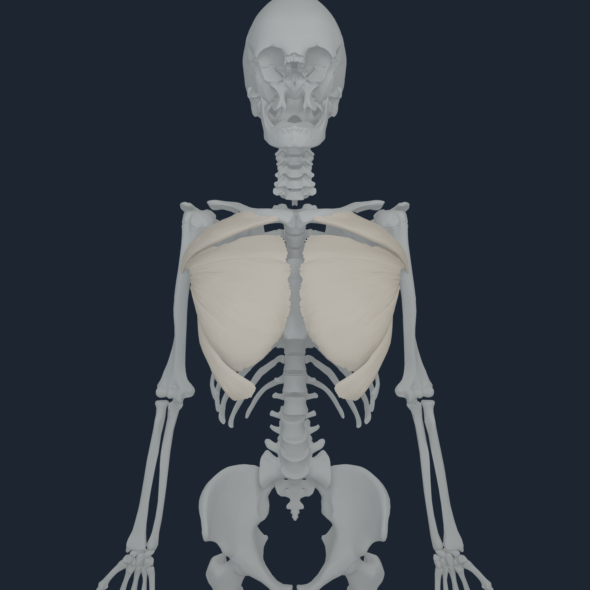
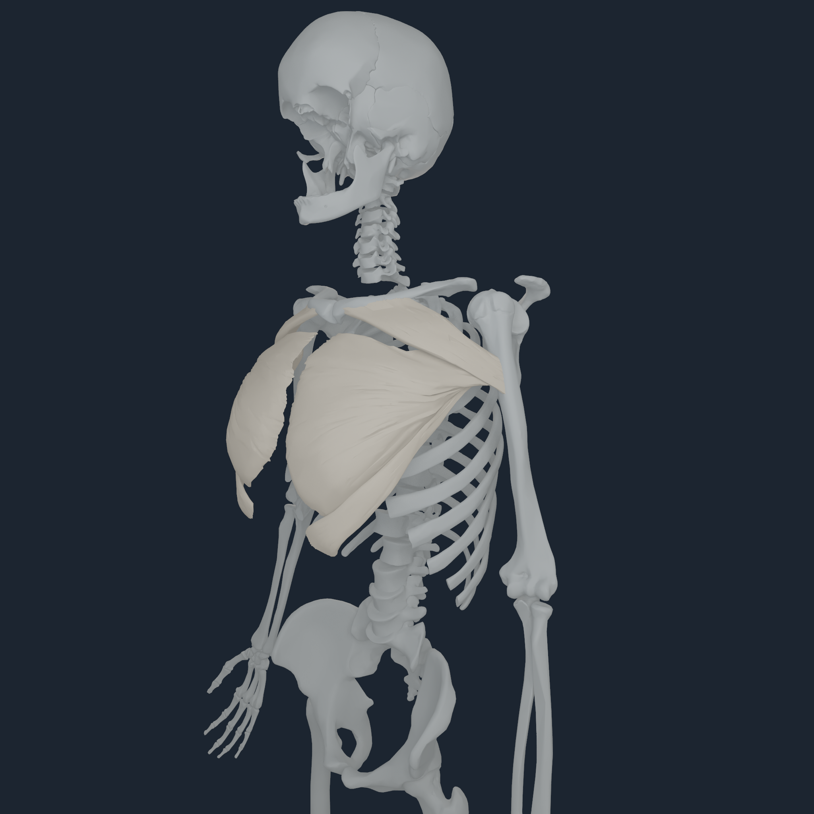
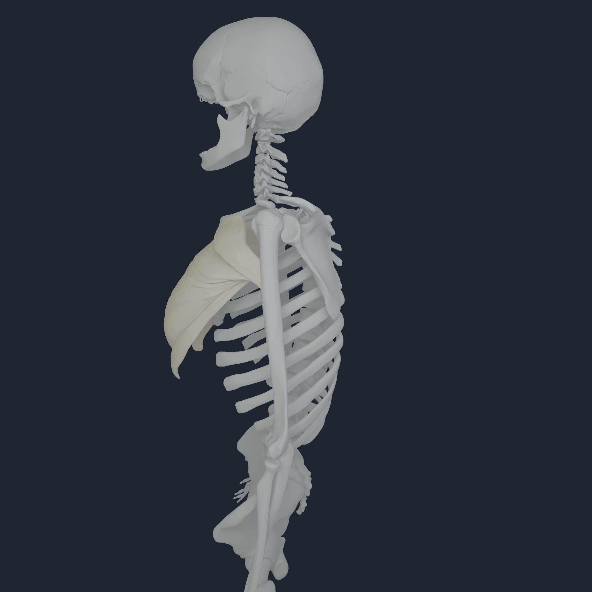
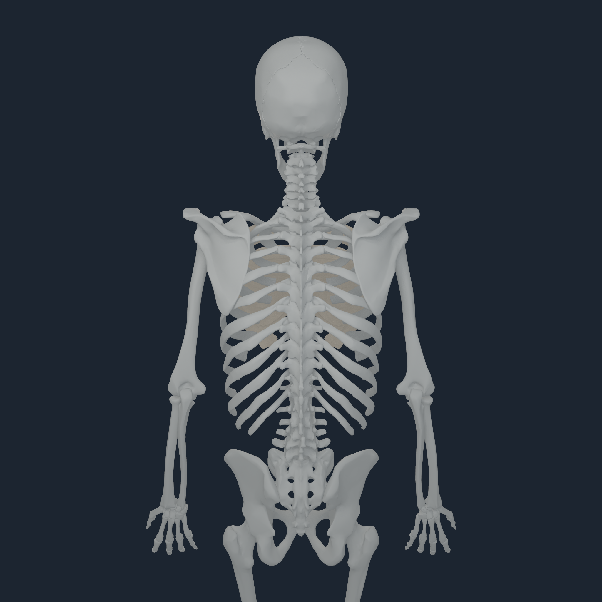

# Deformable pectoralis fascia mechanics v1

## Scope

This increment adds a bounded deformable fascia layer for the six bilateral
pectoralis-major routes. It is intentionally completed and qualified before
the same mechanism is generalized to the remaining muscles and tendons.

BodyParts3D 4.0 contains the three pectoralis-major parts on each side, but no
separate pectoral-fascia mesh. `numi-human-pectoralis-fascia-payload` therefore
emits `NHFASC1`, an explicit generated fallback. It selects the anterior part
of each exact source surface, retains exact source vertices on a bounded
medial-lateral/vertical mechanics envelope, adds a declared 0.6 mm thickness,
and tetrahedralizes that envelope. The high-resolution BodyParts3D muscle
surface remains the presentation geometry; the 326-node, 471-tetrahedron mesh
is the owning mechanics discretization.

```bash
PYTHONPATH=src python3 -m numilab_human.cli \
  numi-human-pectoralis-fascia-payload \
  --sources sources \
  --artifact build/myosim-fullbody \
  --output build/pectoralis-fascia-v1
```

The payload manifest preserves the six OBJ hashes, source selection counts,
MyoSim actuator indices (218-220 and 281-283), native soft-tissue stable IDs,
generated geometry decisions, literature references, and the force-share
assumption.

## Constitutive and load path

Matter owns the FEM state and implicit solve. The material uses the mean human
pectoralis-major fascia GOH fit reported by Kreutz et al.
([DOI 10.1016/j.jmbbm.2025.107283](https://doi.org/10.1016/j.jmbbm.2025.107283)):
`C10 = 0.92 kPa`, `k1 = 10 kPa`, and `k2 = 2.36`. A smooth tension-dominant
fiber term is aligned with the source medial-lateral axis. The 500 kPa bulk
term is an explicit numerical near-incompressibility assumption, not a value
reported by that uniaxial study. The 0.6 mm thickness is close to the 612 um
histological mean reported in
[DOI 10.1007/s00276-016-1747-8](https://doi.org/10.1007/s00276-016-1747-8).

The runtime consumes the published torso-side NHTENDON2 terminal force for
each named pectoralis route. Ten percent is distributed over the lateral
traction band; the medial band is fixed for this v1 coupon-like regional
solve. That 10% share is a bounded sensitivity parameter, not a measured
anatomical fraction.

The force enters Matter's implicit mechanical residual through a borrowed
environment-major FEM nodal-force field. MyoSim's existing `J^T` scatter
remains the only generalized rigid-body force. Fascia never adds the same load
to `q/v`, so there is no double force. Matter also has an explicit per-object
self-contact switch: this thin solid disables same-object surface contact so
its opposite faces are governed by tetrahedral stress, while contact with
other objects remains available.

## Transaction and qualification boundary

The Human stand first publishes an accepted NHTENDON2 load transaction. The
fascia then advances in its own borrowed-command-buffer Matter transaction
from that immutable accepted load field. Each fascia step checkpoints,
solves, and commits or rolls back. The qualification performs a bitwise replay
and injects a rejected enclosing status to prove the FEM state restores
exactly.

This is downstream transactional coupling, not yet a monolithic two-way
muscle/fascia/rigid Newton solve. Fascia reactions are not returned to the
articulated body in v1; doing so safely requires replacing, rather than adding
to, the corresponding share of MyoSim `J^T`.

The local Apple M4 smoke produced:

- 326 FEM nodes, 471 tetrahedra, 68 fixed nodes, and 68 traction nodes;
- 15.089 N admitted fascia traction from the six active pectoralis routes;
- 0.159 mm maximum free-node displacement and minimum `J = 0.911`;
- 20 FGMRES iterations at the fixed budget;
- bitwise deterministic replay and verified rejection rollback.

## Apple M4 Pro qualification

<p align="center">
  
  
  
  
</p>

The final sensor-reference capture ran on Apple M4 Pro at 2048 px from four
angles. All 416 source paths were evaluated for 16 stand steps while the six
pectoralis activations received the bounded increment. It published 13,312
NHTENDON2 endpoint transfers, admitted 14.496 N to the fascia, and advanced 8
Matter steps. Maximum nodal displacement was 4.705 mm, minimum `J` was 0.723,
and the fixed solve budget was 20 FGMRES iterations. Both the stand and fascia
replayed bitwise; injected tendon and fascia rejection paths preserved their
accepted states. The [exact transcript](media/numi-human-pectoralis-fascia-v1-2048/capture.transcript.txt),
[mechanics manifest](media/numi-human-pectoralis-fascia-v1-2048/pectoralis-fascia.manifest.json),
[body continuity manifest](media/numi-human-pectoralis-fascia-v1-2048/body-continuity.manifest.json),
and [checksums](media/numi-human-pectoralis-fascia-v1-2048/checksums.sha256)
are retained beside the frames.

The rendered fascia now uses the exact 15,971-vertex, 20,992-triangle
BodyParts3D pectoralis presentation surfaces. Their displacement is mapped
from the 326-node owning FEM mechanics mesh using four-nearest interpolation:
13,501 supported vertices deform, the largest applied map distance is
59.625 mm, and distant vertices remain at the exact undeformed source
position. The 30 mm full-response and 60 mm fade bounds prevent the coarse
regional tetrahedralization from dragging unrelated source anatomy. This is
high-resolution presentation of a lower-resolution mechanics solution, not a
claim that all 15,971 vertices own independent FEM state.

## Axial defect audit

The same four-angle review exposed a real L4/L5 registration defect. L4 had an
accepted attachment translation while unsupported L5 remained in the common
frame, leaving a 16.768 mm source-surface break. L5 now receives the mean
world-space translation of its immediate L4 and sacrum neighbours. This adds
no independent articulation and preserves the exact L5 mesh, owner, rotation,
scale, and source sites. The corrected L4/L5 gap is 0.154 mm and L5/sacrum is
0.376 mm.

The payload compiler now fails closed on ten transformed axial transitions
from occiput to bilateral hips. The corrected maximum is 5.837 mm at C7/T1,
below the explicit 8 mm gross-separation gate; occiput/atlas is 0.428 mm and
sacrum/hip is 0.488--0.632 mm. This clears gross skull-neck-spine-hip visual
separation. It does not fill normal joint spaces or claim intervertebral-disc,
cartilage, ligament, contact, or clinical mechanics; those missing soft-tissue
layers should be implemented as such rather than hidden by moving bones.

## Scientific limitations

The source study used female surgical and cadaver tissue and uniaxial tests.
This model is not subject-specific, biaxially calibrated, rate-calibrated, or
clinically validated. The BodyParts3D-derived mechanics envelope is not an
authored fascia segmentation. Its convex fill, thickness direction,
medial fixation, lateral traction band, and 10% load share are declared
research assumptions. v1 demonstrates executable Apple-native regional load
transfer and deformable response; it does not establish whole-body fascia,
organ coupling, a clinical enthesis, or validated two-way redistribution.
