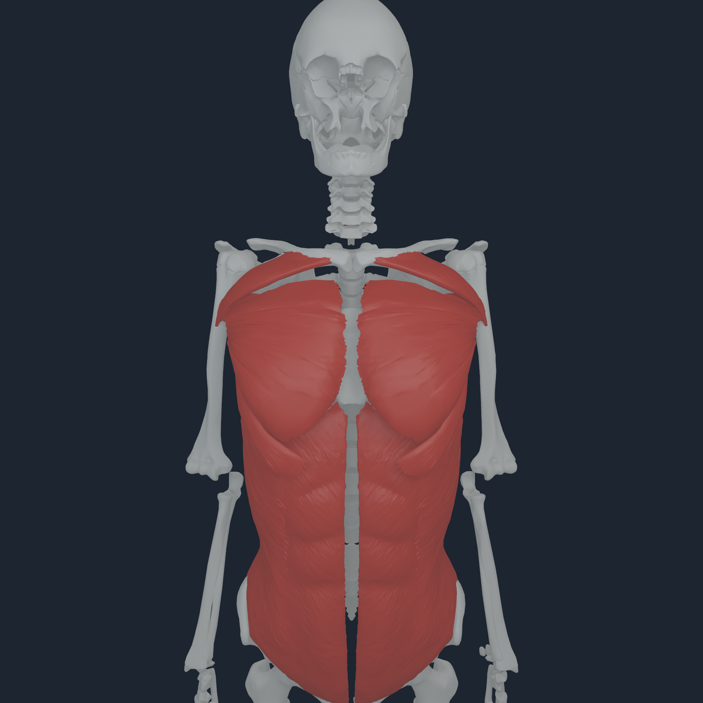
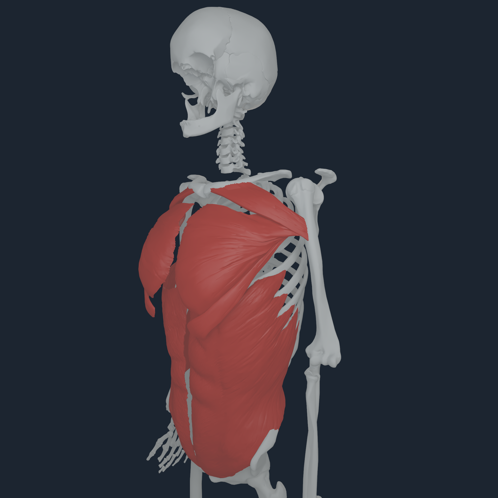
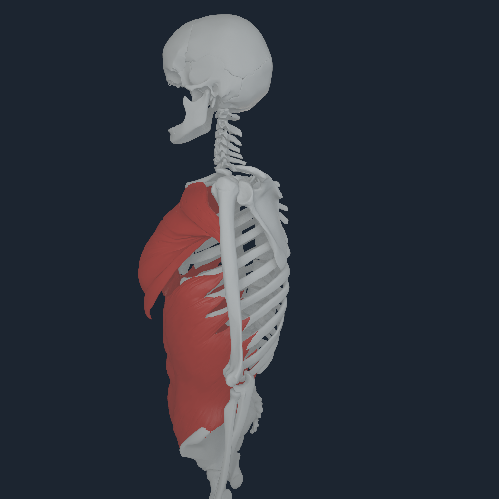
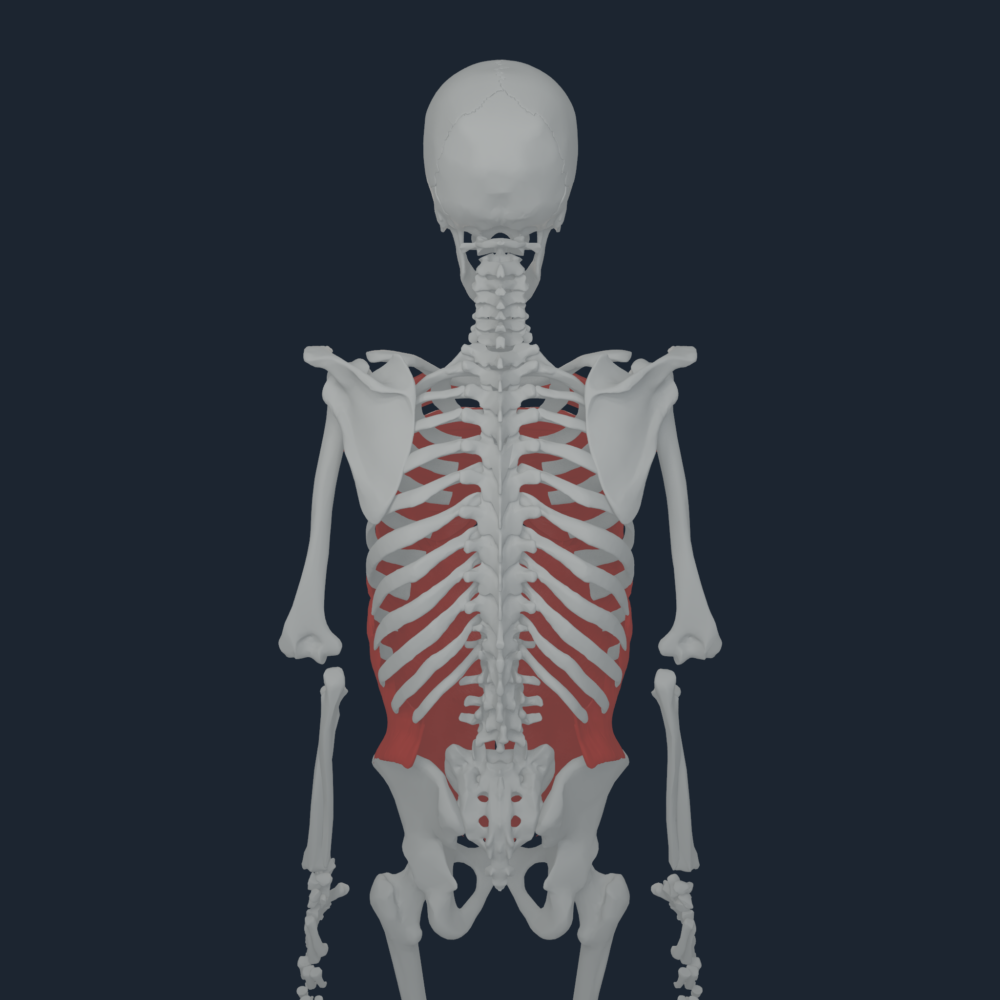

# Numi Human pectoralis origin binding v1

## Defect

The six BodyParts3D pectoralis-major parts used the generic two-body visual
blend. That blend projected each vertex along the humerus-to-chest body-centre
axis. In the sternocostal parts, the inferior source decile consequently
received as much as `0.73` humerus weight; the abdominal parts reached `0.396`.
Shoulder motion could therefore lift the broad lower origin and make it read as
a floating flap.

That ownership is also anatomically wrong. The broad pectoral origins lie on
the clavicle, sternum, costal cartilages, and external-oblique aponeurosis, while
the narrow insertion is on the proximal humerus. Cadaveric literature describes
an approximately 6 mm wide laminar humeral footprint and identifies the
external-oblique aponeurosis as part of the broad origin:
[pectoralis footprint study](https://pmc.ncbi.nlm.nih.gov/articles/PMC6565948/),
[chest-wall anatomy review](https://pmc.ncbi.nlm.nih.gov/articles/PMC3140231/).

## Repair

The visual compiler now identifies the insertion from proximity to the exact
named BodyParts3D humerus source surface. Vertices within 5 mm are locked to
the humerus; ownership feathers to zero by 60 mm. All remaining vertices stay
on the exact secondary MyoSim route body (`chest_r` or the matching clavicle).
No BodyParts3D vertex, MyoSim route point, actuator parameter, or NHTENDON2
endpoint is moved.

The abdominal and sternocostal records add a fail-closed origin gate: every
vertex in the lowest source-world-Z decile must have zero humerus weight. The
compiled payload measures:

| Part | Side | humerus locked | feathered | thorax/clavicle owned | inferior maximum humerus weight |
| --- | --- | ---: | ---: | ---: | ---: |
| abdominal | right | 70 | 222 | 727 | 0 |
| abdominal | left | 63 | 229 | 727 | 0 |
| sternocostal | right | 127 | 872 | 4,481 | 0 |
| sternocostal | left | 133 | 862 | 4,471 | 0 |

The clavicular parts use the same source-bone insertion band without the
inferior gate because their low edge includes the actual humeral insertion.

## Apple M4 Pro review

  
  
  
  

The context capture renders the six pectoral parts together with the bilateral
external obliques. Front, oblique, and side views retain the broad lower origin
against its thoracoabdominal context instead of dragging it with the humerus.
The rear view confirms that no new posterior or contralateral surface was
introduced.

The repaired payload was then substituted into the same 16-step left-humerus
transaction used by part control v2. Apple M4 Pro produced all four 2048 px
views and reproduced the prior mechanics exactly: 13,312 accepted NHTENDON2
endpoint transfers, bitwise replay, `5.019e-7 m` maximum equality-position
error, and the same selected-versus-baseline state deltas.

## Boundary

This repairs articulated visual ownership. It is not a pectoral-fascia mesh,
finite-element fascia, muscle-volume solve, clinical attachment map, or proof
that the free inferior/lateral border should be welded to a rib. The exact
BodyParts3D external-oblique surface supplies visual anatomical context; no
invented bone attachment is added.

The payload manifest, exact transcripts, images, and checksums are retained in
[`media/numi-human-pectoralis-origin-v1-2048`](media/numi-human-pectoralis-origin-v1-2048/).
