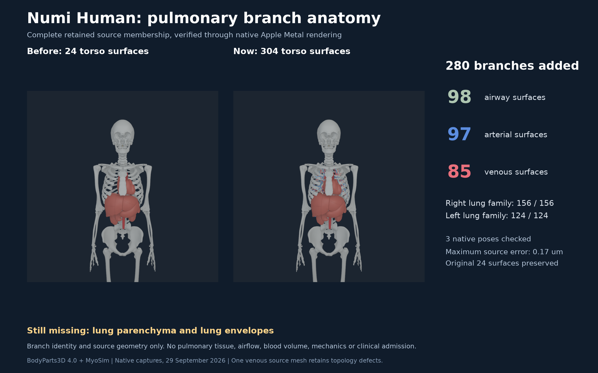

# Pulmonary branch source coverage, 29 September 2026

Numi Human now renders every retained BodyParts3D descendant of both lung
families: **280 added bronchovascular branches**, comprising 98 airway, 97
arterial and 85 venous meshes. All 304 torso surfaces pass source-to-native
geometry checks in three poses. Maximum error is **0.169 micrometres**, under the
unchanged 20-micrometre gate. Source vertices, normals and triangles of the
preceding 24 surfaces remain byte-identical.

This closes a missing-source-branch visual coverage gap. It does **not** supply
lung parenchyma or lung envelopes. The branch meshes are typed through the
retained source hierarchy, rather than represented as whole lung organs.
Clinical anatomy and whole-Human qualification remain open.

## Exact source membership and typing

| Source family | FMA concept | Required and rendered descendants |
| --- | --- | ---: |
| Right lung, part-of | FMA7309 | 156 / 156 |
| Left lung, part-of | FMA7310 | 124 / 124 |
| Cardiac chamber walls, is-a | FMA13256 | 3 / 3 |

The bilateral lung sets are disjoint and all 280 members are retained. Every
branch must match exactly one declared is-a type; missing and ambiguous types
are rejected. Right/left membership, branch type, stable identity, body owner,
exact source OBJ bytes and native packed topology are checked independently.

| Branch layer | Exact source is-a type | Surfaces | Raw source vertices | Source triangles |
| --- | --- | ---: | ---: | ---: |
| Airway | FMA68208, pulmonary segment of bronchial tree | 98 | 32,288 | 52,866 |
| Pulmonary artery | FMA66326, pulmonary artery | 97 | 24,430 | 40,936 |
| Pulmonary vein/trunk | FMA86188, segment of venous tree organ, within a lung family | 85 | 12,179 | 20,948 |

FJ3031 is explicitly a source-typed pulmonary venous trunk (FMA8648). It has no
generic vein type, so a pulmonary-vein-only filter would silently omit it. The
complete venous-tree partition retains this member without relabeling it as
parenchyma. No retained is-a family is labeled lung; the declared part-of lung
families contain only these independently typed bronchovascular descendants.

The total payload has 186,857 vertices and 987,792 indices. Existing counts
remain 17 organ surfaces (five source named-organ representations and twelve
components), six general vessel surfaces and one neural surface. All added
branches use the registered global atlas transform and the inspected MyoSim
torso COM frame. This is a single-link visual binding, not deformable lung
registration or subject calibration.

## Native ABI and ownership

Payload ABI 2 retains the NHANAT1 binary layout and increases the surface limit
from 64 to 1,024. Codes 4-6 add separate airway, arterial and venous layers;
semantics 51020-51022 avoid existing tendon, fascia and knee identities. The
native reader still supports ABI 1 with its original layer/count limits. New
colors distinguish source identity, not measured oxygenation or blood flow.
Every configured pulmonary layer must be visible across the camera family.

The old 24-surface ABI 1 payload still produces byte-identical native vertex,
index, primitive and instance sections. Its records, positions, normals and
triangle indices also remain byte-identical at the beginning of the expanded
ABI 2 payload. The registration, bone payload, source equality payload,
physics library and Metal shader are unchanged.

The native increment is published at
`598bac836efc2c5c37d04cce5797ca0a5e8bedd7`. Exact executed source and binary
identities, compilation commands, source snapshots, native packets, pose
snapshots, logs and exit codes remain under
`Build/lung-source-coverage-20260929`.

## Geometry and source topology

| Native pose | Maximum source-to-native position error |
| --- | ---: |
| Raw source rest | 0.120 micrometres |
| Projected neutral | 0.120 micrometres |
| Coupled torso flexion/rotation | 0.169 micrometres |

The audit independently reconstructs MuJoCo COM poses, source OBJ vertices and
triangle-derived normals. All source indices and float32 local/native/world
geometry are checked; the existing geometry, normal and COM tolerances are
unchanged. Coupled poses retain the exact source equality projection oracle.
These are geometry witnesses, not joint-range or controller qualification.

Exact authored-coordinate seam identification is diagnostic only. All 98
airway and 97 arterial branch meshes are closed oriented manifold candidates,
as are 84 of 85 venous meshes. **FJ2928 remains defective**: one duplicate
face, three vertex-link defects and two face components. No source mesh was
repaired, removed, simplified, fused or re-triangulated. Self-intersections are
not checked. Closed individual branches do not establish connected luminal
networks, airway flow, blood mass, tissue mechanics or clinical correctness.

## Verification and retained evidence

**92 distinct final checks passed without skips**: the final source/native run
passed 91 cases, while one additional existing lower-limb regression failed
because its selected test environment omitted the tendon input setting. That
case passed in 1.44 seconds after supplying the retained source-bound tendon
payload. No code or tolerance changed for the retry. The failed run and corrected
retry are both retained. An earlier 82-case run also passed before adding the
extra ABI and body-frame cases; it is not counted again.

Checks cover exact bilateral membership and typing; missing, duplicated,
mistyped and wrong-owner branches; forged branch semantic/type provenance;
unsupported native ABI/layers/counts; source/native displacement, topology,
normal and COM corruption; historical ABI 1 geometry compatibility; reversed
executing knee axes; and shifted declared torso COM frames. Executed source
hashes match the published code.

Public copies include three full final geometry audits, source family/type
sets, the compiler manifest, topology summary, original-surface parity and
unaltered native images. The machine-readable
[receipt](media/pulmonary-branch-coverage-20260929/receipt.json) binds their hashes
and the complete boundary. Reproduce an audit with
`python -m numilab_human.torso_anatomy_audit --help` under the retained MyoSim
Python environment, or use the retained exact command/input files.

The executive pack appends the current skin-seam and pulmonary-branch figures
to the preceding 22-slide deck. All original slide/media parts are byte-identical
and all first 22 PDF pages are pixel-identical. The included 10-second standing
video remains the 28 September evidence and predates the later anatomy repairs.
It is not a new standing run of this payload.

## Remaining qualification

Lung parenchyma, pleura and lung/lobe envelopes are absent. Branch joining and
connected luminal domains, respiratory motion, organ deformation, materials,
contact, pressure, airflow, perfusion and biological validation remain open.
Whole-body source calibration, the existing joint-range conflicts and skin
shape/topology issues remain explicit separate gaps. This increment establishes
source branch coverage and native geometry only.
