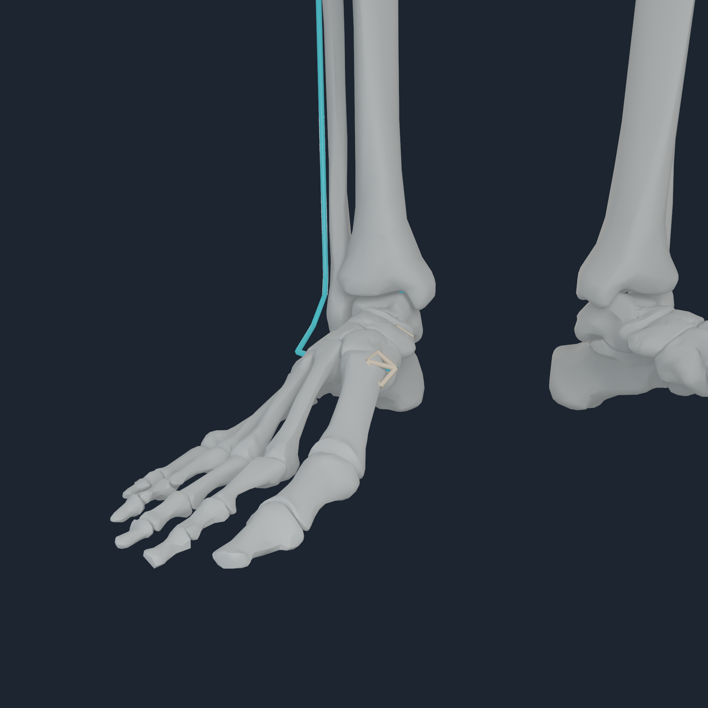
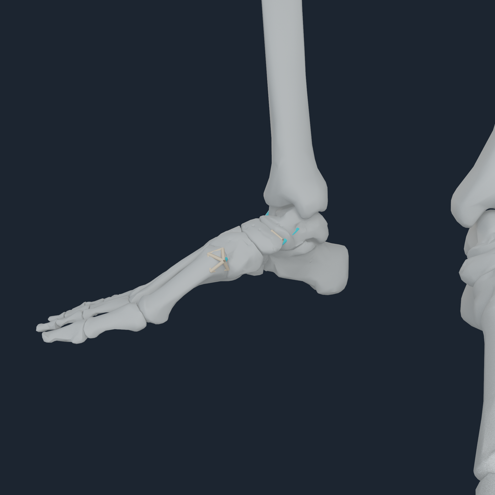
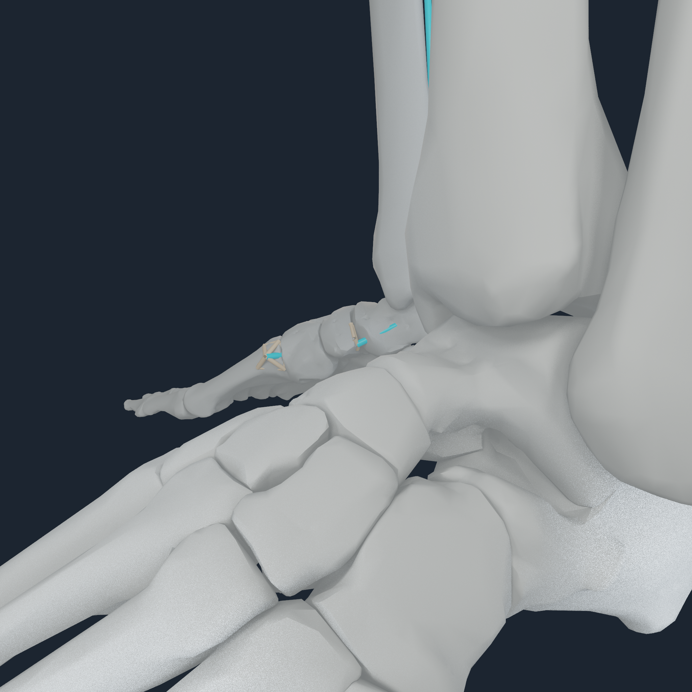
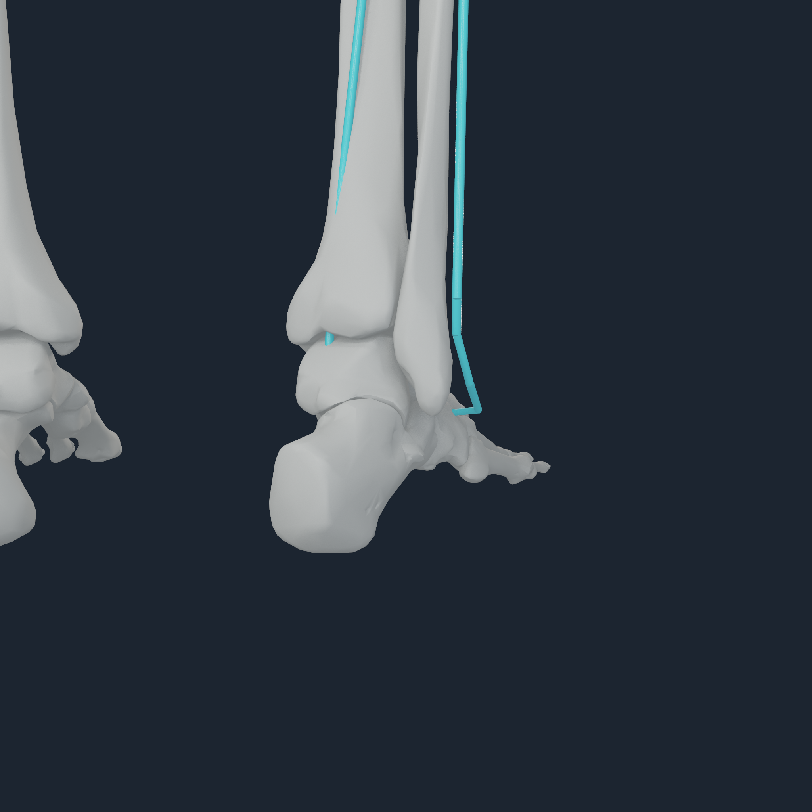
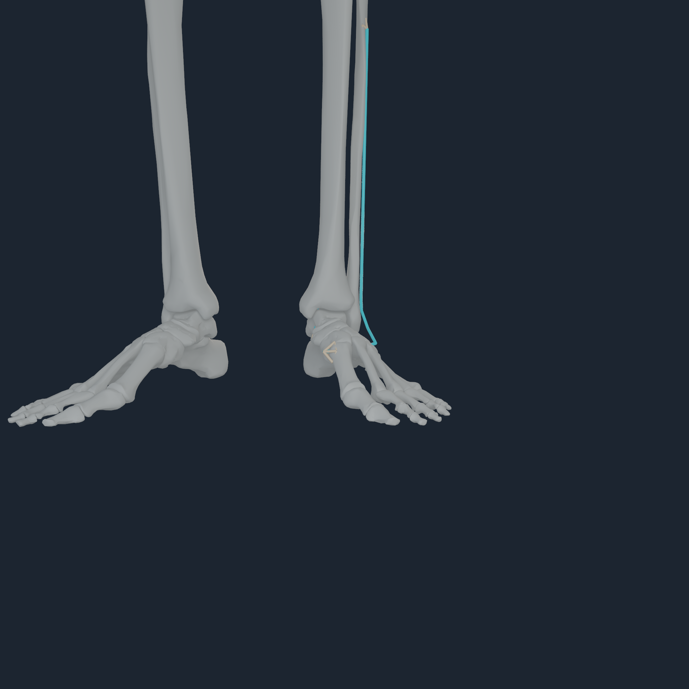
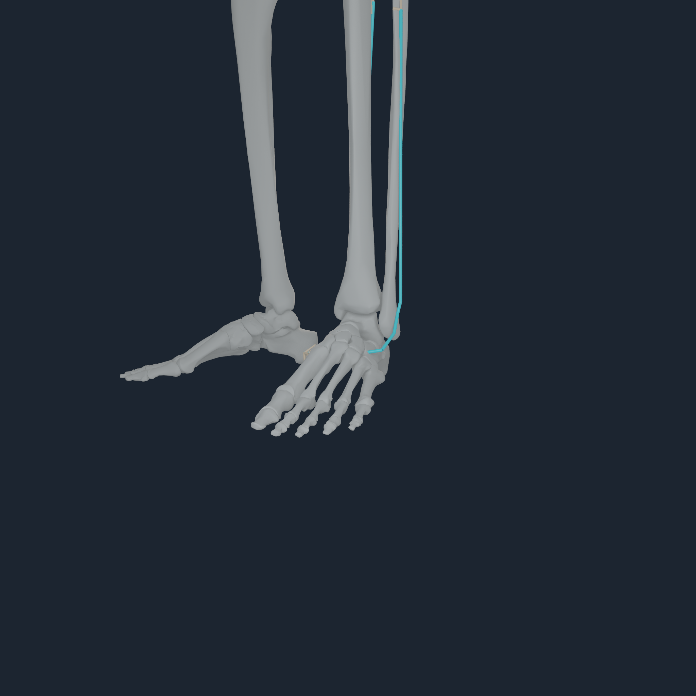
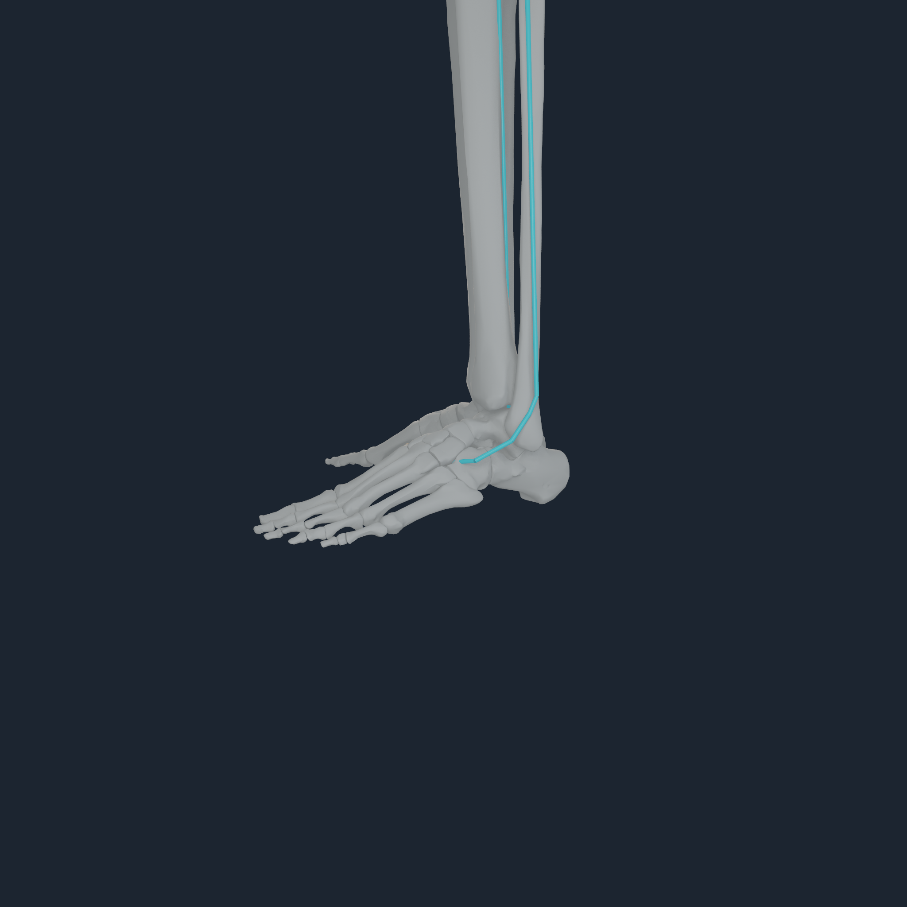
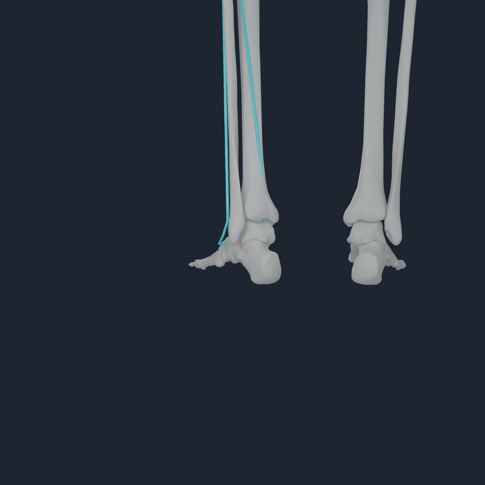

# Rigid-foot ownership and entheses v1

## Outcome

The BodyParts3D midfoot and metatarsals now follow Rajagopal/MyoSim's rigid
`calcn_r` / `calcn_l` foot segments. Only the phalanges follow the collective
`toes_r` / `toes_l` segments across the existing MTP joints. This corrects 20
bone owners without adding an independent toe or digit joint.

The reparent is an exact frame change: every affected mesh keeps its previous
default world pose while its coordinates are re-expressed in the rigid-foot
frame. The existing 36 bilateral tibia-to-toe continuity witnesses all pass at
the unchanged 4 mm threshold.

The semantic enthesis table now resolves the seven authored rigid-foot
insertions per side to their anatomical members:

- gastrocnemius medialis/lateralis and soleus to calcaneus;
- peroneus brevis to fifth metatarsal;
- peroneus longus and tibialis anterior to first metatarsal; and
- tibialis posterior to navicular.

The unchanged 12 mm distance and force-map conditioning gates admit four new
laws: bilateral peroneus longus and tibialis posterior. Coverage rises from
536 to 540 distributed laws out of 832 endpoints, with 292 exact source-point
fallbacks and no previously admitted-law loss. The other ten rigid-foot
insertions and the eight toe insertions remain point laws until a coupled
bilateral source-mesh registration can satisfy enthesis, ankle/MTP continuity,
held-out surface, and prior-law preservation gates together.

## Direct visual review

These are native 2048 px Apple M4 Pro frames. White is exact BodyParts3D bone,
cyan is the current-pose MyoSim route centreline, and the warm fans are the
executable four-node `NHTENDON2` force-transfer laws.

### Right rigid foot

<p align="center">
  
  
  
  
</p>

### Left rigid foot

<p align="center">
  
  
  
  
</p>

All eight angles were inspected. The hindfoot, midfoot, metatarsals, and
phalanges remain continuous; no toe is shifted, duplicated, or independently
articulated. The new fans lie on the first-metatarsal and navicular surfaces.
Rear-view fan occlusion is cross-checked by the other views and their nonzero
envelope pixel counts.

## Reproducibility and Apple execution

Two independent local rebuilds are byte-identical:

| Artifact | SHA-256 |
| --- | --- |
| registration candidate | `6f4b35b3ddfb1834cf4d9b2f8ff49b975db8a3b5164e3b458633c9abb8b9a69c` |
| `NHBONES1` | `166ff112052e02dd24cf2b83c772da596a7b200634d79d49f110ca3d588e4a2e` |
| `NHTENDON2` | `c0c0d349facc1dbfc89f068fe76783469575d500be3aca0be3f94afaa146d1f9` |

The Apple M4 Pro reference evaluated all 416 muscles and 832 endpoint laws:
540 envelopes, 292 point laws, zero endpoint migration, maximum Metal force
residual `1.25885e-4 N`, maximum moment residual `4.30321e-6 N m`, and
byte-identical tendon replay.

The persistent smoke executed 32 assisted plus 32 assistance-removed steps,
53,248 transfers (34,560 envelope and 18,688 point), with bitwise replay. The
runtime still reports `compiled_stand_balanced=false`; this is deterministic
force-transfer evidence, not stable-standing qualification.

```sh
numilab-human myosim-lower-limb-registration \
  --registration Build/scapular-source-mesh-v1.registration.json \
  --rigid-foot-base Build/lower-body-rigid-foot-v1-base.registration.json \
  --output Build/lower-body-rigid-foot-v1.registration.json

numilab-human myosim-bodyparts-bone-payload \
  --sources Sources \
  --registration Build/lower-body-rigid-foot-v1.registration.json \
  --output Build/lower-body-rigid-foot-v1-paired-bones

numilab-human numi-human-tendon-envelope-payload \
  --artifact Build/myosim-fullbody \
  --bone-artifact Build/lower-body-rigid-foot-v1-paired-bones \
  --output Build/lower-body-rigid-foot-v1-paired-tendon
```

## Evidence boundary

`NHTENDON2` is a source-point-preserving force-transfer law, not a deformable
tendon, enthesis material, or clinical attachment certificate. This increment
corrects body ownership and named rigid-foot wrench targets. It does not claim
photorealism, independent toe actuation, cartilage/contact calibration,
subject-specific registration, or stable balance.
