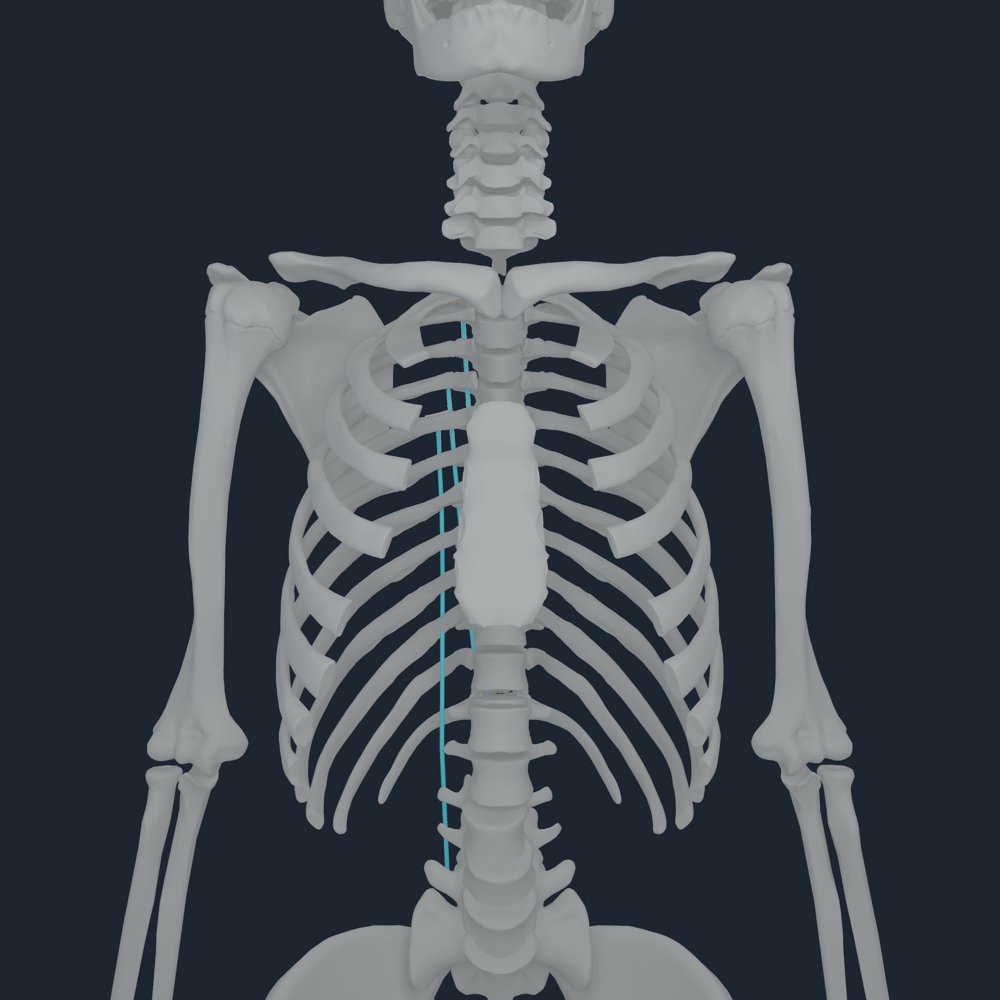
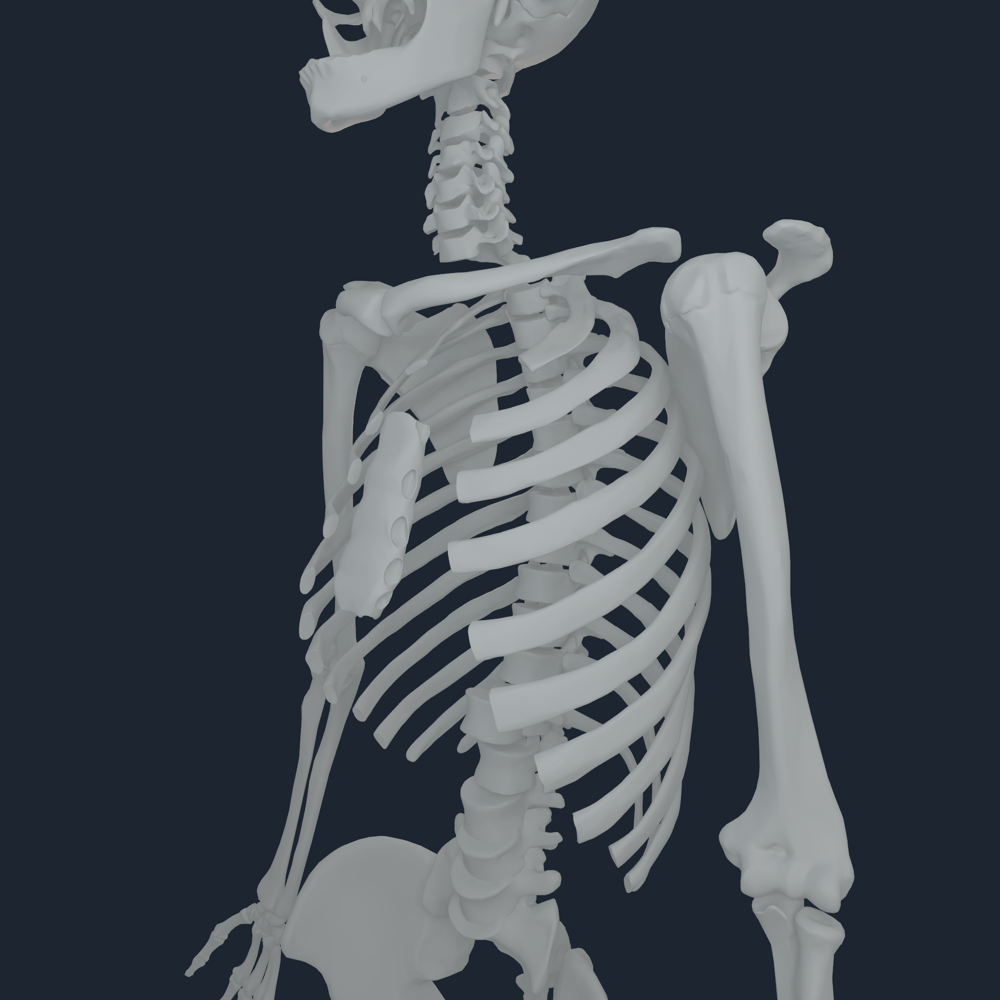
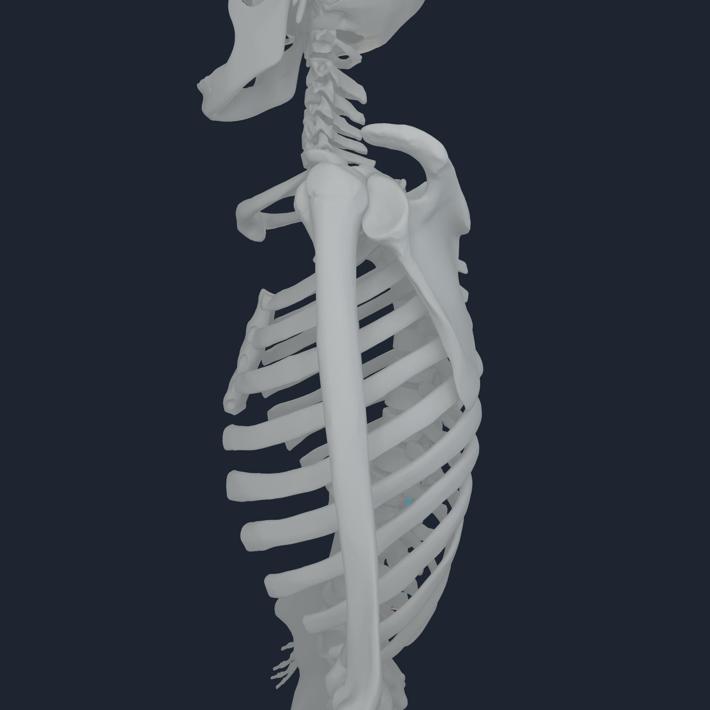
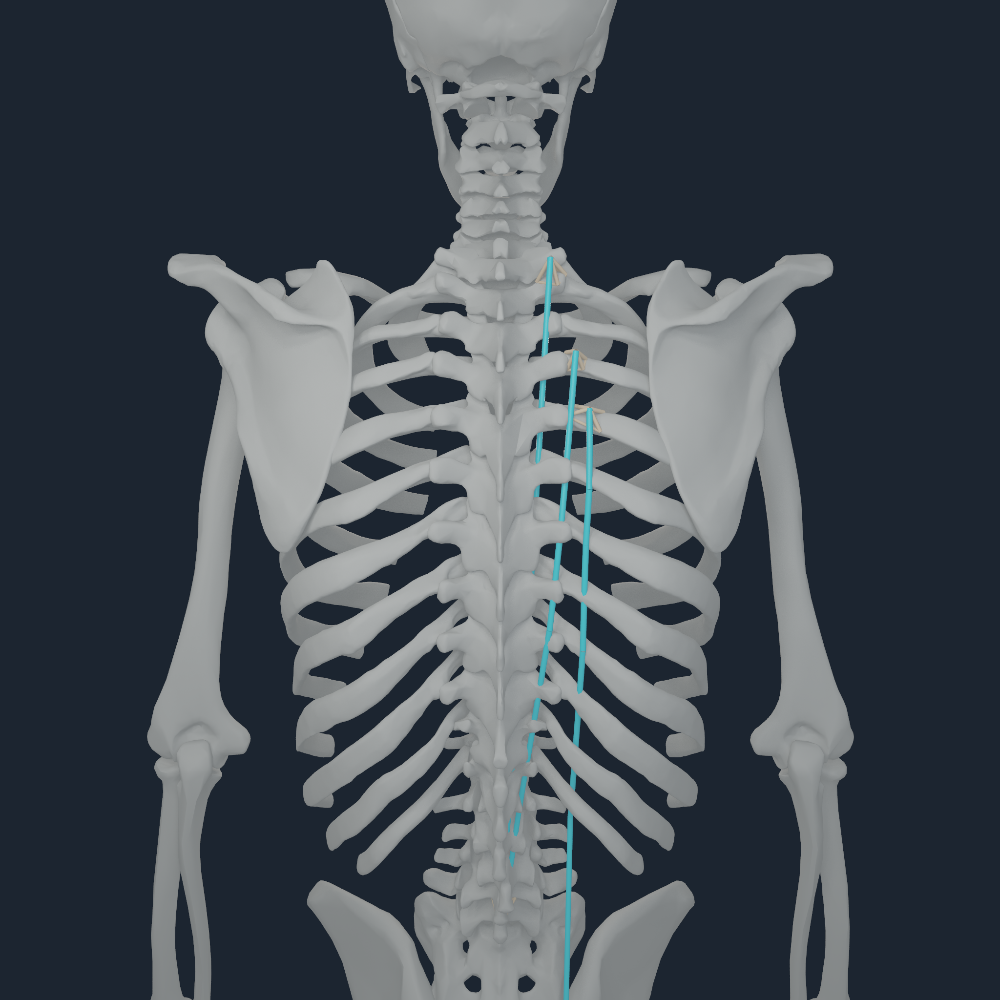

# Semantic thoracic entheses v1

## Closure

MyoSim carries the thoracic cage as one `torso` rigid body, while its pinned
muscle identifiers retain exact attachment levels. BodyParts3D carries the 12
thoracic vertebrae and 24 lateralized ribs as separate named meshes on that
same body. The compiler now resolves 80 exact same-body correspondences:

- `LTpT_T1` through `LTpT_T12` select the corresponding thoracic vertebra;
- `IL_R5` through `IL_R12` and `LTpT_R4` through `LTpT_R12` select the
  corresponding same-side rib;
- quadratus-lumborum routes explicitly labelled `12.1`--`12.3` select the
  same-side twelfth rib, while `T12` selects the twelfth thoracic vertebra;
  both preserve the compiled endpoint ordinal.

No correspondence is inferred for external oblique, internal oblique, or
rectus-abdominis routes because their source identities do not name one unique
bone. All mappings preserve the exact MyoSim endpoint, route, force law, and
rigid body. Candidates still pass the unchanged 12 mm distance, connected
four-node patch, sampled force-amplification, force, and moment gates.

Sixteen endpoints pass every gate: six bilateral thoracic-vertebra endpoints
at T2--T4 and ten bilateral rib endpoints at ribs 4--6. The remaining 64
declared thoracic correspondences remain point-owned because their current
BodyParts3D/MyoSim rest-frame distance or patch conditioning fails.

| Metric | Before | After |
| --- | ---: | ---: |
| distributed surface envelopes | 266 | 282 |
| explicit source-point laws | 566 | 550 |
| surface coverage | 31.97% | 33.89% |
| endpoint migration | 0 | 0 |

The closest new surface distance is 4.140 mm, the farthest is 11.032 mm, and
the largest new sampled total-force amplification is 3.6126. No numerical
threshold was relaxed.

## Apple M4 Pro qualification

The exact paired inputs were:

- coherent `NHBONES1` SHA-256
  `0efe0a20ba31cc838b4e76ad14fe89492227869256ae797551350ada339ef7ab`;
- v10 `NHTENDON2` SHA-256
  `676f0273db7e55a137b2c2b66a80a61adc2717b8dedbd276a25b3c0ddf55d077`;
- Numi runtime revision `50cab6b69426ad28c268aa05738de71df9f88bf0`.

The 512 px persistent stand probe completed 16 assisted and 16
assistance-removed steps across all 416 routes. It executed 26,624 endpoint
transfers: 9,024 envelope transfers and 17,600 point transfers. Maximum force
and moment residuals were `6.824e-5 N` and `1.863e-6 N m`; borrowed-consumer
rejection preserved state and replay was bitwise. The compiled pose still
reports `balanced=false`; this is force-path qualification, not stable stance.

## Multi-angle attachment review

  
  
  
  

The focused probe drives `IL_R5_r`, `LTpT_T2_r`, and `LTpT_R4_r` for 16
accepted 100 us steps while evaluating all routes. Cyan is the exact source
route and each warm fan is an executable four-node transfer law. Five selected
route endpoints render envelopes. The front, side, and rear views expose
attachment pixels; the oblique view is almost entirely bone-occluded and is
retained honestly with seven visible route and envelope pixels.

The [focused transcript](media/numi-human-semantic-axial-entheses-v1-2048/right-thorax-2048.transcript.txt),
[whole-body transcript](media/numi-human-semantic-axial-entheses-v1-2048/stand-smoke-512.transcript.txt),
and [checksums](media/numi-human-semantic-axial-entheses-v1-2048/checksums.sha256)
are retained with the frames.

## Evidence boundary

These are source-name-resolved, simulation-inferred bone-surface transfer
programs. They are not source-authored enthesis areas, deformable tendons,
insertional fibrocartilage, bone stress, or clinical attachment certificates.
The rejected direct correspondences expose a cross-source registration gap;
they are not permission to increase the distance threshold.
