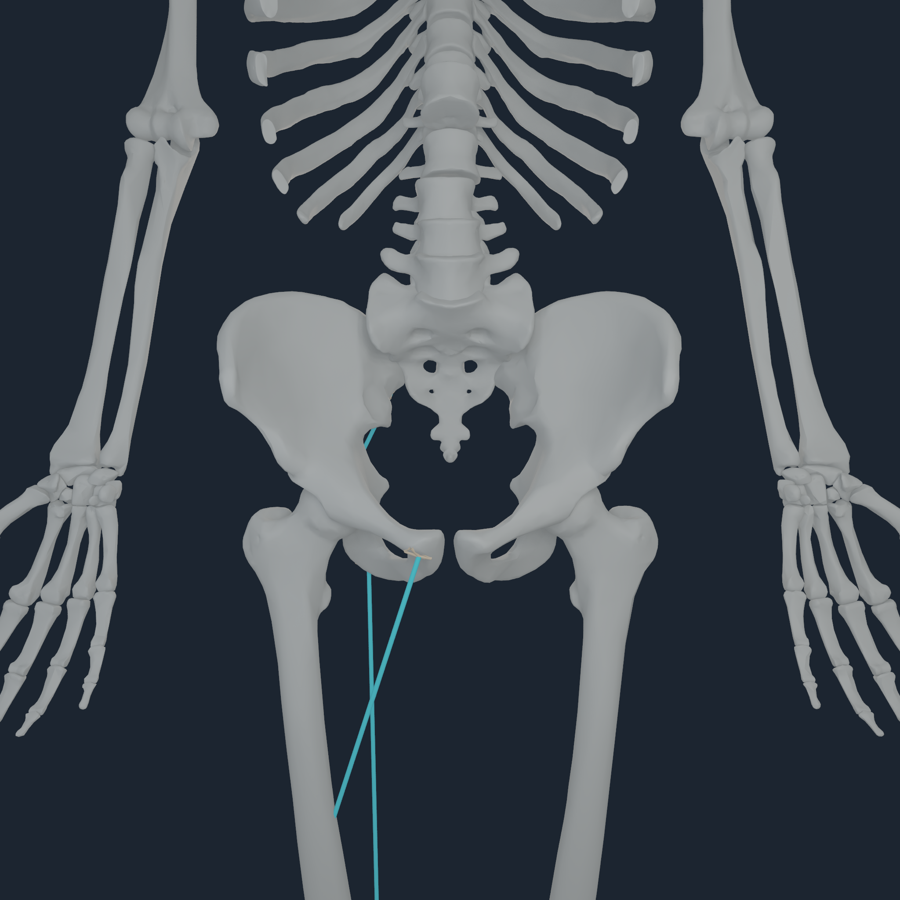
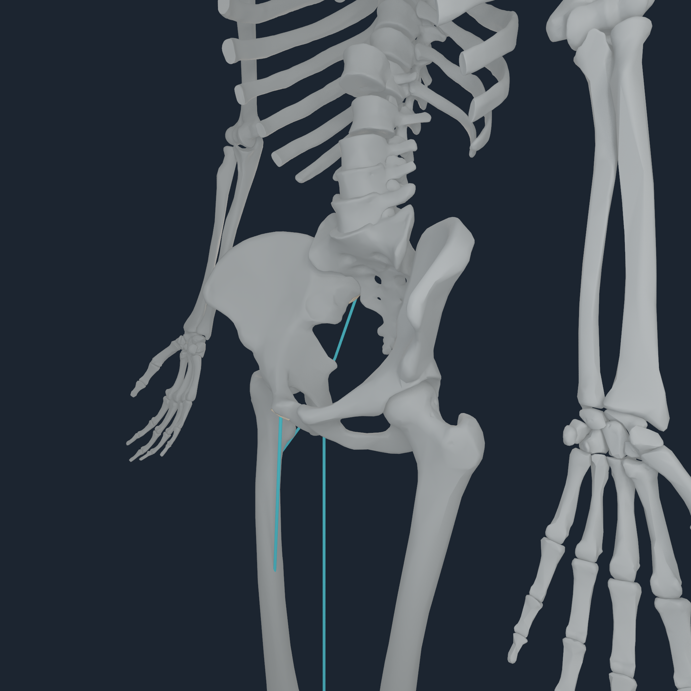
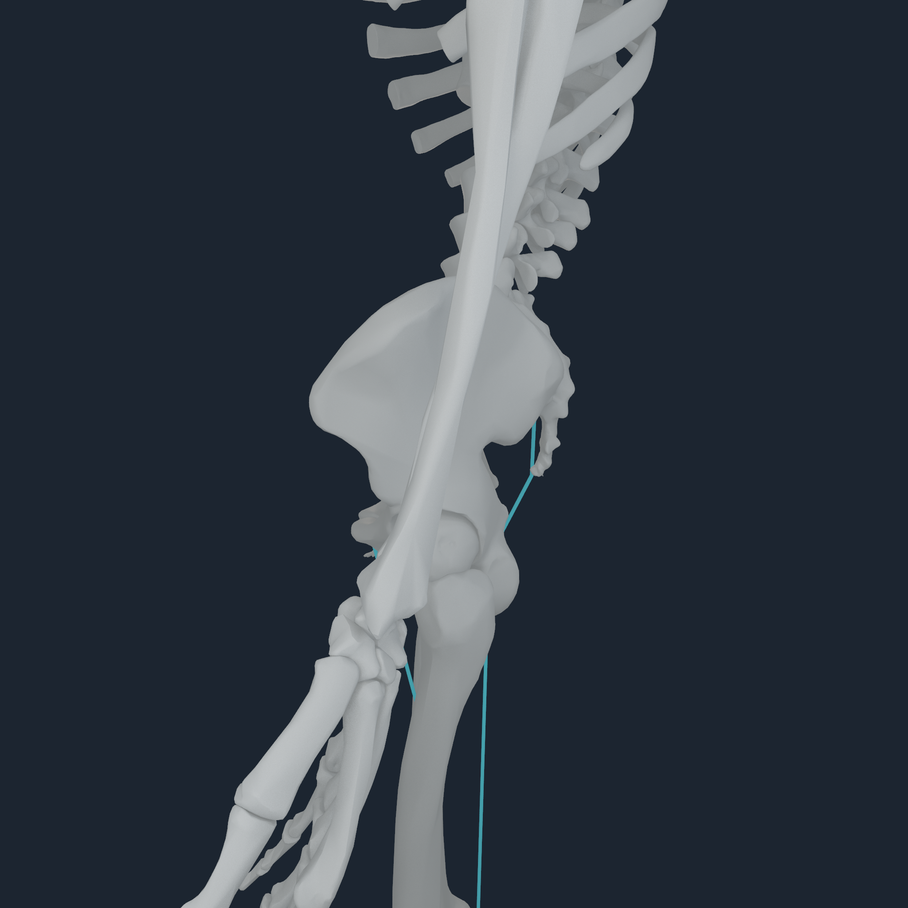
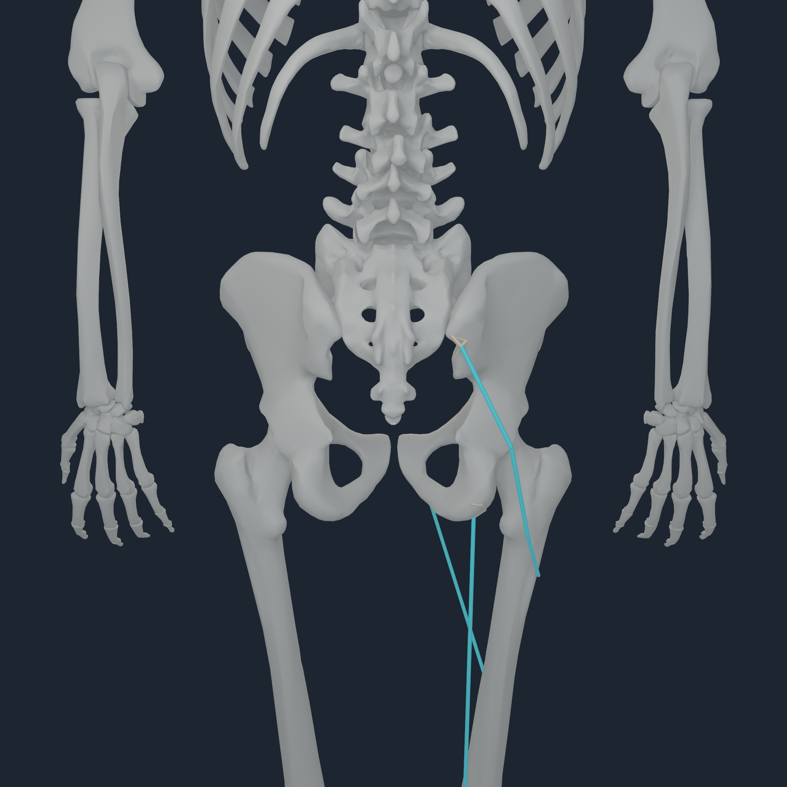
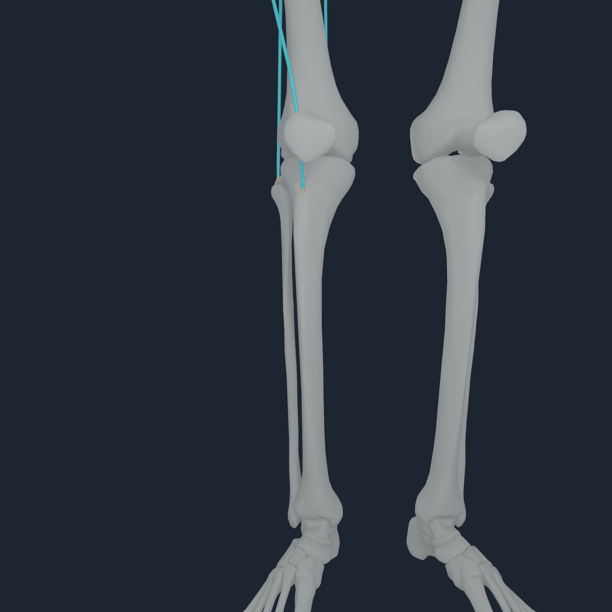
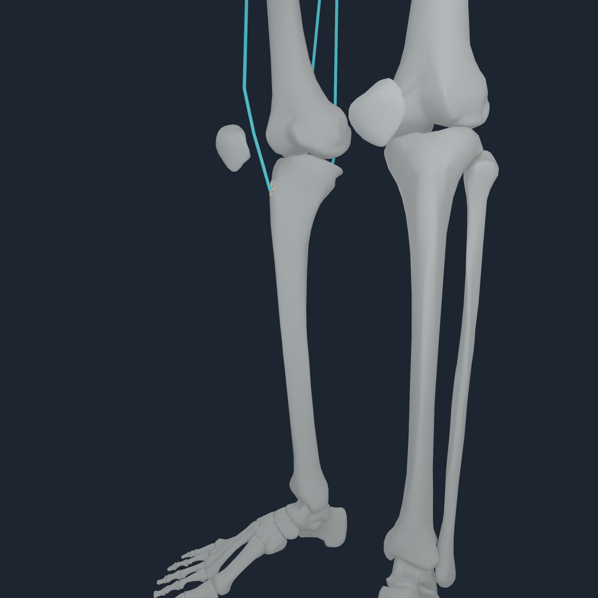
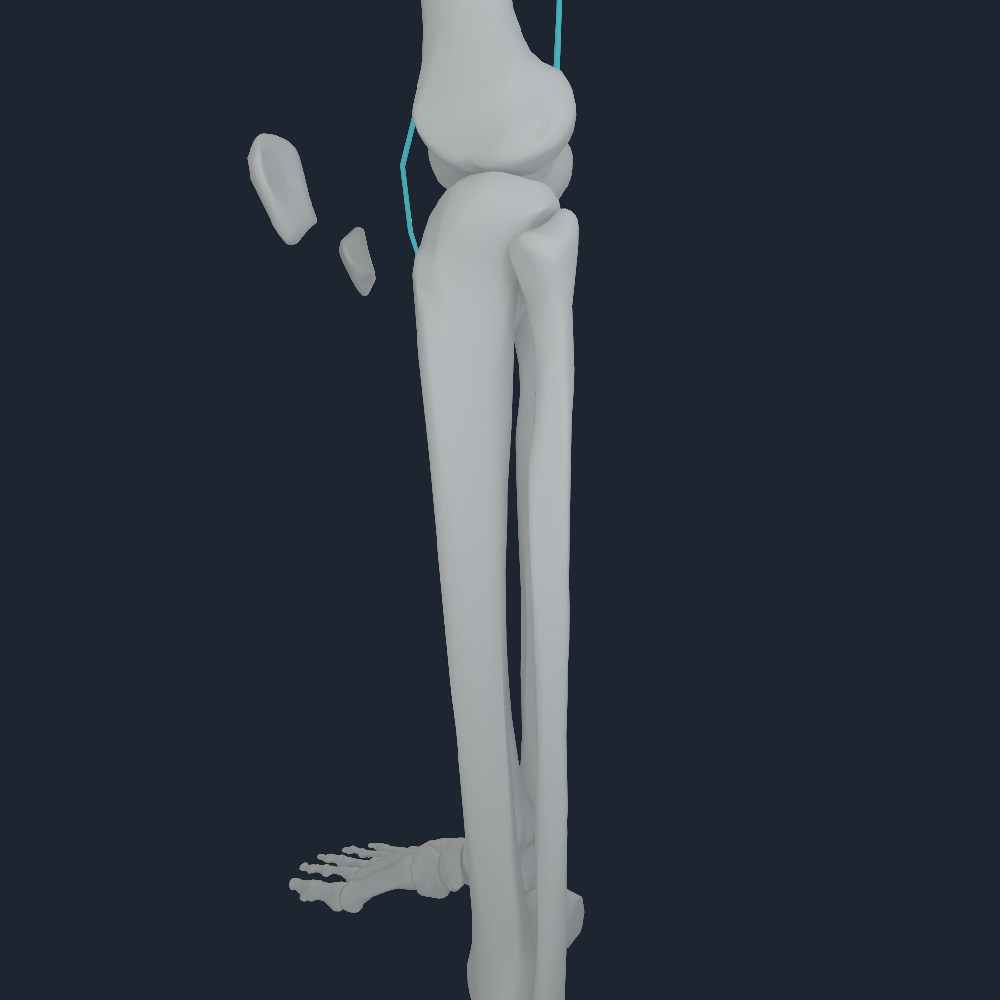
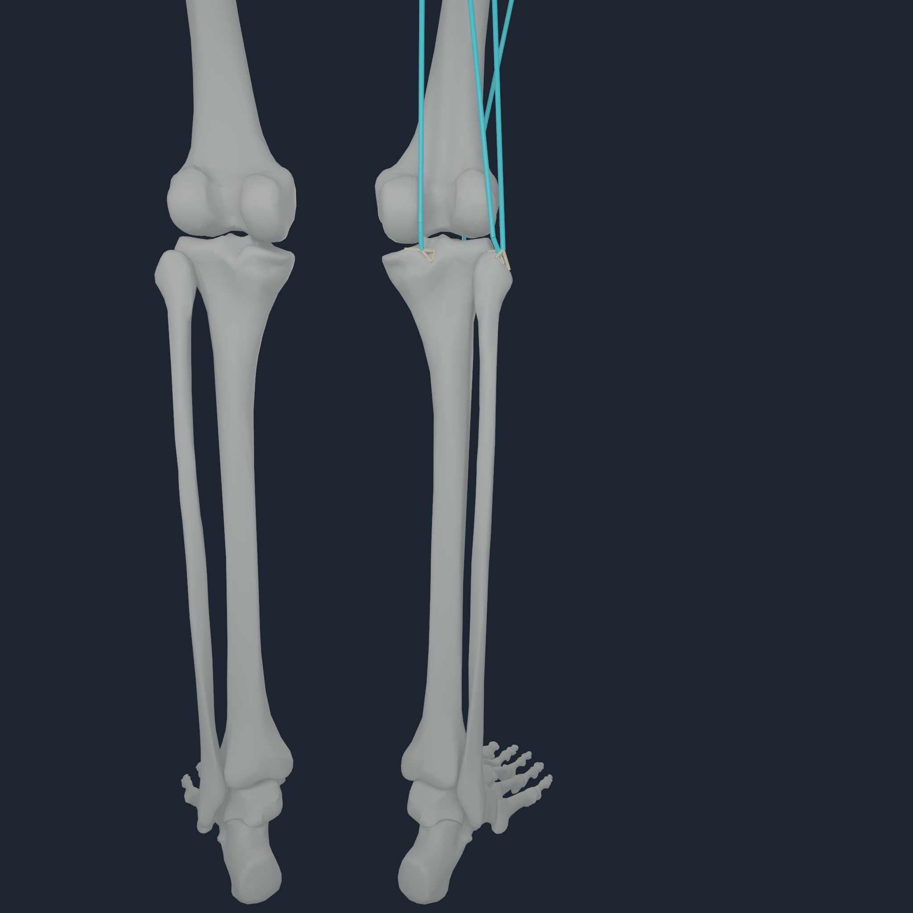

# Semantic same-body limb entheses v1

## Why this increment

The coherent skeleton exposed a mechanics ambiguity that visual registration
must not hide. MyoSim owns one `pelvis` rigid body carrying both BodyParts3D
hip members and one shank body per side carrying separate tibia and fibula
members. `NHTENDON2` previously rejected every endpoint on these bodies rather
than guessing which bone should receive its wrench.

The compiler now contains an exact, bilateral route-member table for 90
endpoints:

- 50 pelvis origins select the named right or left hip from route laterality;
- 40 shank endpoints select the tibia or fibula from the muscle identity and
  endpoint ordinal.

The table resolves only the bone member inside an already-owned rigid body.
It does not move a MyoSim endpoint, alter a path, change a moment arm, or add a
joint. Each candidate must still pass the existing 12 mm source-point distance
gate, connected four-node surface-patch construction, maximum `4.0` sampled
force amplification, and exact resultant-force/source-point-moment checks.

## Accepted result

The coherent v9 build admits 40 new distributed envelopes: 30 on bilateral
hip members and 10 on bilateral tibia/fibula members. They cover 36 unique
source muscles, including adductors, gluteals, hamstrings, rectus femoris,
sartorius, tensor fasciae latae, semimembranosus, and vastus lateralis.

| Metric | Before | After |
| --- | ---: | ---: |
| distributed surface envelopes | 226 | 266 |
| explicit source-point fallbacks | 606 | 566 |
| surface coverage | 27.16% | 31.97% |
| endpoint migration | 0 | 0 |

The farthest newly admitted endpoint is 11.006 mm from its assigned source
bone surface and the largest new sampled force amplification is 3.887. The
remaining 50 declared limb correspondences stay point-owned because their
distance or patch-conditioning gate fails. No threshold was relaxed to raise
the headline count.

## Apple M4 Pro qualification

The 512 px whole-body smoke ran the existing assisted and assistance-removed
stand phases for 16 steps each. Metal evaluated all 416 routes and completed
26,624 endpoint transfers: 8,512 distributed-envelope transfers and 18,112
point transfers. Maximum force and moment residuals were `6.824e-5 N` and
`1.863e-6 N m`; the one-step parity gate passed, replay was bitwise, and the
borrowed-consumer rejection path preserved the accepted state.

The compiler still reports `balanced=false`. This is deterministic force-path
qualification, not a static balance, gait, or clinical certificate.

### Hip routes and footprints

  
  
  
  

The selected `addlong_r`, `glmax2_r`, and `semimem_r` increments run for 16
accepted 100 us steps while all 416 routes remain evaluated. Cyan is the exact
MyoSim route centreline at the simulated pose; the warm footprint/fan is the
actual four-node `NHTENDON2` transfer program. It is not a rendered tendon
surface.

### Fibular-head and tibial-plateau routes

  
  
  
  

This run selects `bflh_r`, `bfsh_r`, `semimem_r`, and `vaslat_r`. The front,
oblique, and rear views expose their accepted fibular-head/tibial footprints.
The side view contains zero visible envelope pixels because the footprint is
occluded by source bone geometry; it is retained without a fake display
offset.

The [whole-body transcript](media/numi-human-semantic-limb-entheses-v1-2048/stand-smoke-512.transcript.txt),
[hip transcript](media/numi-human-semantic-limb-entheses-v1-2048/right-hip-2048.transcript.txt),
[shank transcript](media/numi-human-semantic-limb-entheses-v1-2048/right-shank-2048.transcript.txt),
and [checksums](media/numi-human-semantic-limb-entheses-v1-2048/checksums.sha256)
are retained with the frames.

## Evidence boundary and next bottleneck

These envelopes are inferred simulation correspondences between exact pinned
sources, not source-authored attachment areas or clinical entheses. Their
four-node force maps conserve the original terminal wrench but do not model a
deformable tendon, insertional fibrocartilage, ligament, or bone stress. The
next efficient mechanics target is the large set of single-bone endpoints
that fail the 12 mm cross-source registration gate; they require a calibrated
mechanics-to-anatomy registration field, not relaxed distance thresholds.
