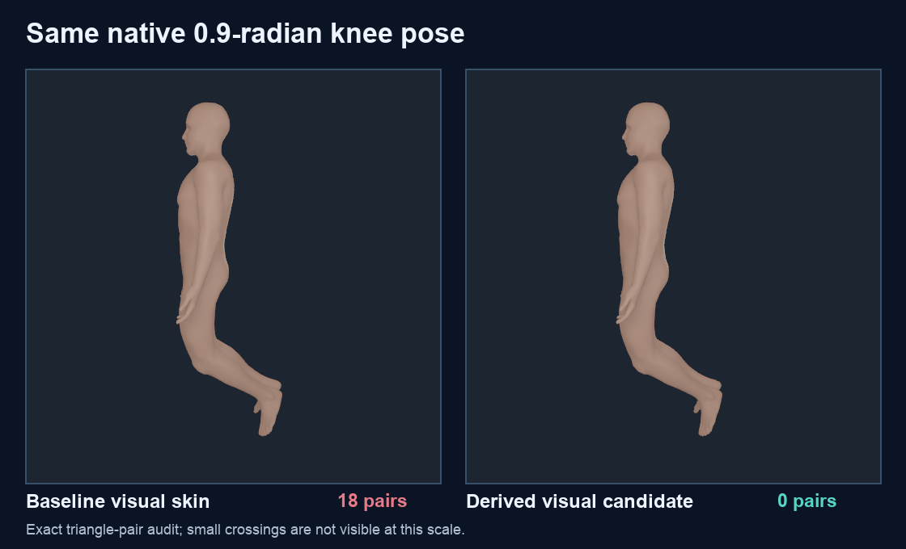

# Native skin crossing attribution and derived visual trial

The September 29 [exact skin census](SKIN_NATIVE_EMBEDDEDNESS_20260929.md)
found 42 self-intersecting triangle pairs across three retained native poses.
This follow-up identifies the actual crossing faces, source-graph seed distances,
full visual weights and body-motion contributions. It also tests a derived
visual-weight candidate on the Apple M4. **The candidate is not admitted as a
replacement:** a deeper held-out knee pose still intersects and creates new
crossing pairs.

## What moves the crossing patches

The [source-bound attribution](media/skin-geodesic-visual-candidate-20260930/crossing-attribution.json)
replays all 42 exact face pairs, verifies the emitted Float32 full weights
against the retained 86-body solution, and predicts the native skin positions
to at most 1.363 micrometres in the three failing poses. Mean contributions
below are weighted magnitudes of each body's motion at the implicated source
vertices; they do not add as scalar displacements.

| Pose | Exact pairs | Largest weighted body-motion contributions | Mean source-skin distance to admitted bone seed |
| --- | ---: | --- | --- |
| Coupled reach | 3 | Left humerus 24.51 mm; left ulna 9.28 mm; left radius 6.98 mm | 0.005 m, 0.133 m, 0.151 m |
| Bilateral knee flexion, 0.9 rad | 18 | Left/right tibiae 11.54/10.73 mm; right/left patellae 9.21/8.84 mm | Tibiae about 0.45 m; patellae about 0.42 m |
| Asymmetric knee flexion | 21 | Right tibia 11.30 mm; right patella 9.76 mm; left tibia 4.28 mm | Right tibia 0.447 m; right patella 0.416 m |

The knee crossing patch is near the proximal midline in source world space.
These long-range distal-body weights are evidence of nonlocal visual-binding
influence, not proof of the correct clinical skin attachment or of a patellar
cartilage/contact defect. The [patellar anteriority audit](PATELLAR_ANTERIORITY_FULL_SUPPORT_20260929.md)
separately found all patella vertices anterior in the equality-projected
inspection poses.

## Derived candidate and native result

The trial screens each original full-field weight by source-skin geodesic
distance to that body's admitted bone seeds, using the registered source bone
envelope diagonal as its distance scale. Only **5%** of that screened field is
blended into the original weights, with a smooth source-graph taper to zero
within 0.12 m of the exact crossing witnesses. This affects 4,372 source
vertices. The [candidate manifest](media/skin-geodesic-visual-candidate-20260930/candidate.manifest.json)
binds its payload, method, source inputs, support faces and code hashes. Source
positions, normals, binding table and triangle indices remain byte-identical;
the independent native audit recomputes the candidate weights from the pinned
source and checks the diagnostic quartets.

The [nine-pose Apple M4 native audit](media/skin-geodesic-visual-candidate-20260930/native-summary.json)
finds **0 exact self-intersections in all nine retained inspection poses**, down
from 3, 18 and 21 in the three original failures. The largest candidate-versus-
baseline native position change is 1.728 mm, and the largest native/pose-oracle
position error is below 1.4 micrometres. Exact source-coordinate seams stay
coincident. Some descriptive shape measures move both ways: coupled reach's
largest face-area ratio changes from 10.231 to 10.307, and shoulder elevation's
from 12.986 to 13.072. Neither value is a physiological strain gate.



The full-body image cannot resolve the submillimetre crossing correction by
eye. The exact native packs and triangle predicates establish the result.

## Held-out failure and admission boundary

Four additional static source poses were rendered twice with the same native
binary, rigid, muscle, bone and equality inputs; only the skin payload changed.
At bilateral knee flexion 0.45 rad, asymmetric knee flexion and intermediate
coupled reach, both baseline and candidate have zero exact crossings. At a
held-out bilateral **1.2-radian knee pose**, the baseline has **78** crossing
face pairs. The candidate removes **42** of those but creates **37 different**
pairs, leaving **73**. The [held-out exact pair audit](media/skin-geodesic-visual-candidate-20260930/heldout-summary.json)
therefore fails its no-new-crossings gate. A count-only reduction would conceal
the regression.

The native candidate remains a diagnostic visual variant. The original FJ2810
source still has **171 boundary edges and two vertex-link defects**, so neither
payload is a closed skin volume. Intervening motion, skin/fat material, contact,
loaded knee mechanics, subject calibration and clinical anatomy remain open.
No physics or production Human payload was changed.

Retained full native packs, commands, stdout/stderr and offline trials are under
`Build/skin-embeddedness-20260930/`. The public receipts linked here contain
source, executable, pose, candidate and result hashes. Reproduce the checks
from this checkout with:

```sh
PYTHONPATH=src OPENBLAS_NUM_THREADS=1 .venv-mujoco312/bin/python \
  -m numilab_human.skin_crossing_attribution \
  --output Build/skin-embeddedness-20260930/crossing-attribution.json

PYTHONPATH=src OPENBLAS_NUM_THREADS=1 .venv-mujoco312/bin/python \
  -m numilab_human.skin_geodesic_visual_candidate \
  --output-dir Build/skin-embeddedness-20260930/native-candidate

PYTHONPATH=src OPENBLAS_NUM_THREADS=1 .venv-mujoco312/bin/python \
  -m numilab_human.skin_geodesic_native_audit \
  --output-dir Build/skin-embeddedness-20260930/native-candidate-audit

PYTHONPATH=src OPENBLAS_NUM_THREADS=1 .venv-mujoco312/bin/python \
  -m numilab_human.skin_geodesic_heldout_audit \
  --output-dir Build/skin-embeddedness-20260930/heldout-audit
```
