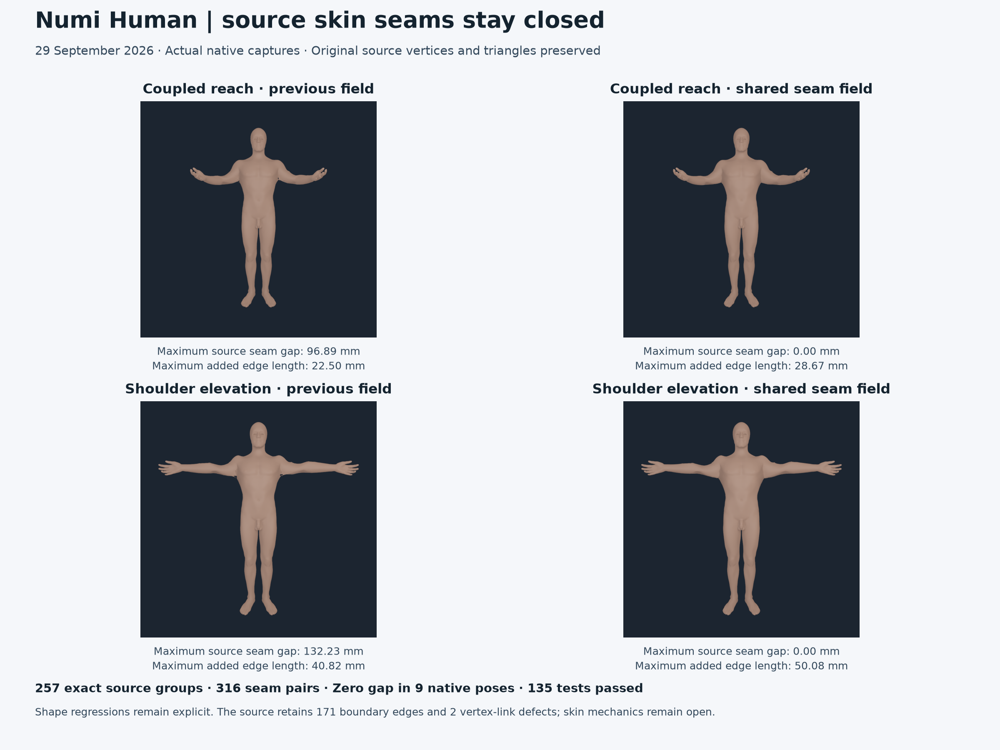

# Exact source skin seam continuity

The native skin no longer separates vertices that occupy the same exact source
position. A shared source graph point receives one complete body-weight field,
which is expanded back into the unchanged source vertex order. All 257 exact
coincident groups, covering 316 vertex pairs, remain coincident in nine native poses. In shoulder elevation,
the previous 132.23 mm seam gap falls to zero and the six edges above five-times
source length disappear.



This closes an inferred visual-binding defect. It does not close overall skin
shape quality. The shoulder's worst added edge length rises from 40.82 to
50.08 mm, two shoulder triangles still exceed ten-times source area, and
seven triangles oppose their rendered vertex normals. Source openings,
self-intersections, materials, anatomical skin weights and clinical anatomy
remain separate requirements.

## Cause and adopted change

The [previous full-field repair](SKIN_GEOMETRIC_FULL_FIELD_20260929.md) retained
all 86 body weights but built its graph using raw source vertex indices.
The selected exterior contains 286 redundant vertices in 257 exactly
coincident groups. Their individual body weights could differ by 0.5304 even
though their source positions were identical. Rest images hid the mismatch;
arm motion separated the seams by centimetres.

The current authoring graph identifies only exactly equal Float64 source
world coordinates. It has 54,663 graph vertices and 163,860 unique graph edges.
The emitted skin still has all 54,949 source vertices and 109,183 source
triangles, with original coordinates, normals, binding transforms and topology.
No proximity threshold, vertex displacement, hole cap or source triangle
replacement is used. The [byte-parity record](media/skin-exact-seam-continuity-20260929/source-geometry-parity.json)
also checks the unchanged ABI 5 header.

Source seed projection, guarded geodesic reachability and the graph equations
use this shared-point graph. The current source retains 185 bones, 12,025
candidate samples, 696 rejected associations and 5,039 seeded graph vertices.
Inverse source projection gaps still set confidence; all 86 body weights
remain in native rendering. Every duplicate receives the same full solution
row and the same float32 runtime quantization. The independent audit rebuilds
both the shared-point seed graph and its equations, checks exact duplicate-row
equality, and compares the actual native seam positions.

The native probe and physics runtime are unchanged. The payload retains
NHSKIN ABI 5, and the audit still supports the earlier ABI 4 association and
the earlier ABI 5 full field as dated evidence. A separate offline
[dual-quaternion blending trial](media/skin-exact-seam-continuity-20260929/dual-quaternion-trial.json)
used the same weights and source poses but worsened several area/stretch
measures. It was not adopted. Its method follows the original
[Kavan et al. paper](https://users.cs.utah.edu/~ladislav/kavan08geometric/kavan08geometric.pdf);
it is an offline rendering experiment, not native or mechanical qualification.

## Actual native comparison

The before/after comparison uses the same ABI 5 native executable, rigid,
muscle, bone and equality inputs, registration and requested poses. Only skin
weights and their authoring evidence change. Seam distance measures every
pair in every exactly coincident source group; it is not limited to distance
from a single representative vertex. Each pose is independently checked
against source geometry, body frames and the complete field.

| Pose | Maximum seam gap, before → after | Maximum source-edge ratio, before → after | Maximum added edge length, before → after |
| --- | --- | --- | --- |
| Projected neutral | 0.100 → 0 mm | 2.141 → 2.141 | 9.74 → 9.74 mm |
| Coupled torso | 1.606 → 0 mm | 2.170 → 2.170 | 10.80 → 10.80 mm |
| Coupled reach | 96.89 → 0 mm | 5.027 → 2.831 | 22.50 → 28.67 mm |
| Bilateral knee flexion | 1.079 → 0 mm | 2.055 → 2.055 | 10.12 → 10.12 mm |
| Shoulder elevation | 132.23 → 0 mm | 6.394 → 3.603 | 40.82 → 50.08 mm |
| Hip flexion | 0.766 → 0 mm | 2.285 → 2.285 | 13.74 → 13.74 mm |
| Unilateral reach | 55.99 → 0 mm | 4.046 → 2.546 | 22.50 → 28.66 mm |
| Asymmetric knee flexion | 0.698 → 0 mm | 2.051 → 2.051 | 11.07 → 11.07 mm |

Raw source rest also has zero seam gap; its small float32 edge errors remain
at micrometre scale. Counts above five-times source edge length become zero
in all nine native poses. That descriptive count is not a shape-quality gate.
The [complete native comparison](media/skin-exact-seam-continuity-20260929/native-geometry-comparison.json)
retains every edge, area, tangent-map and normal-opposition summary, including
regressions. The full [receipt](media/skin-exact-seam-continuity-20260929/receipt.json)
binds commands, logs, tests, inputs, source snapshots and native captures.

## New autonomous geometry checks and unmet gates

The source audit now reports triangle area ratios and both singular values of
each source-tangent-to-native-triangle map. These values are invariant under
global rigid rotation and translation. All 109,183 faces are measured;
source-degenerate and native-collapsed faces are counted explicitly. No
physiological strain threshold is inferred. Counts below 0.1-times or above
ten-times area are descriptive only.

In shoulder elevation, minimum area ratio rises from 0.0954 to 0.1295, minimum
tangent stretch from 0.0204 to 0.0884, and maximum tangent stretch falls from
21.11 to 16.18. Counts above ten-times area fall from three to two. Coupled
reach improves its maximum tangent stretch from 15.74 to 11.34, but its minimum
stretch worsens slightly. Unilateral reach worsens maximum tangent stretch
from 7.85 to 9.02 and minimum area ratio from 0.1072 to 0.1012. These limitations
remain open despite exact seam continuity.

The audit also counts triangles whose geometric normal opposes the sum of
their rendered vertex normals. Shoulder elevation decreases from 27 to seven
and coupled reach from 16 to six. This is a presentation diagnostic, not an
inversion or continuum-strain certificate.

Exact-coordinate source topology has 171 boundary edges, two boundary-branch
vertices and two vertex-link defects. It has one face component and no
degenerate or duplicate faces, nonmanifold edges or winding defects. It is
not a closed oriented manifold. The original source-index topology has
827 boundary edges; identifying coordinate seams exposes the remaining source
openings without altering the payload. Closed volume remains unadmitted, and
self-intersection checking remains explicitly unavailable. Shared visual
weights do not resolve source topology or establish mechanical material-point
identity.

## Verification and reproduction

**135 tests passed in 223.25 seconds**, without skips. Nine current native
poses pass source verification, and the earlier nine ABI 5 and five ABI 4
poses remain independently verifiable.
Maximum native/source position error is **1.578 micrometres**, below the
unchanged **20-micrometre** source-geometry gate. The project command
dispatcher also passes against the actual new neutral capture; the two public
1024-pixel poses retain exactly the same geometry packs as their audited
512-pixel counterparts.

The selected test run and source snapshots are retained under
`Build/skin-seam-continuity-20260929/production/final-tests`. Actual compiler,
native corpus and source audits are retained under the same production root.
Tests cover rehashed unequal seam weights and false seam counts, previous
source/pose/weight corruptions, malformed native inputs, nine prior ABI 5
poses, five prior ABI 4 poses and actual skin recompilation. Analytic geometry
tests check rigid-frame invariance, known stretches, collapsed/degenerate
triangles, exact-versus-near correspondence, all-pairs seam distance, topology
and separation of geometric candidates from volume admission.

```sh
NUMI_HUMAN_PYTHON="$PWD/.venv-mujoco312/bin/python" \
PYTHONPATH=Sources/myosim/checkout .numi/commands/human skin-surface-audit \
  --sources Sources --artifact Build/myosim-fullbody \
  --registration Build/knee-parity-registration-20260929/candidate.v6.registration.json \
  --payload Build/skin-seam-continuity-20260929/production/payload/bodyparts3d-myosim-skinned-shell.nhskin \
  --native-pack Build/skin-seam-continuity-20260929/production/native-neutral/myosim-fullbody-articulated-bodyparts-bones-source-skinned-shell.mrvpack \
  --native-poses Build/skin-seam-continuity-20260929/production/native-neutral/myosim-fullbody-articulated-bodyparts-bones-source-skinned-shell.skin-poses.json \
  --output Build/skin-seam-continuity-20260929/production/reproduced-neutral-audit.json
```

Source equality laws, range conflicts, knee bone registration, earlier organ
and tendon evidence, board decks and standing video are preserved. Source
continuity and renderer fidelity remain distinct from full skin shape quality,
loaded mechanics, subject calibration, functional organs and whole-Human
qualification.
