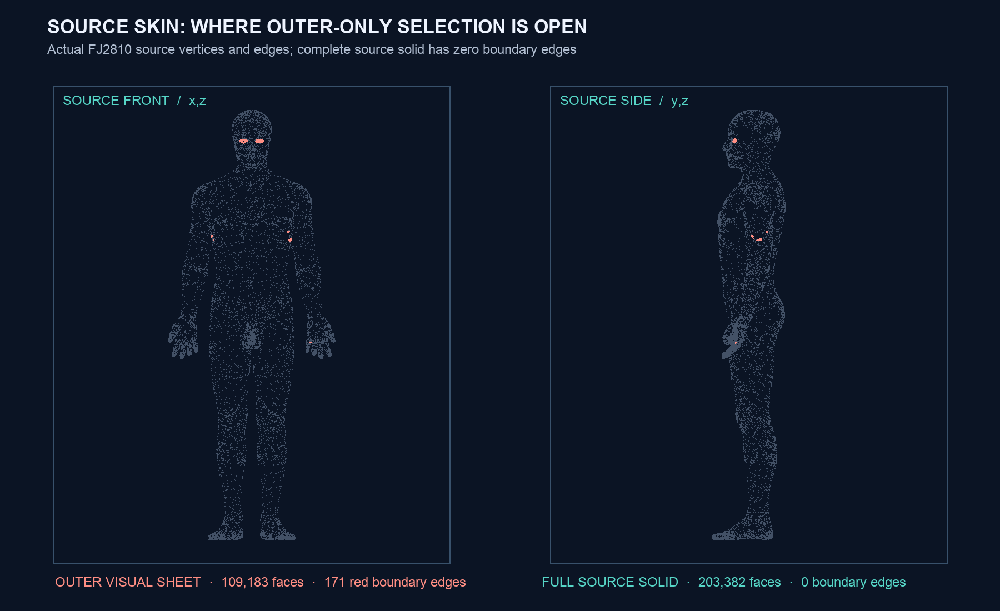

# Complete FJ2810 source skin solid geometry

The BodyParts3D `FJ2810` member already contains a complete thin skin solid in
its **full** source mesh. The Human visual pipeline deliberately selected only
its outer sheet, which explains the 171 boundary edges and two vertex-link
defects reported for the displayed shell. Those defects belong to the
outer-only selection. The complete source has **zero** boundary edges and
**zero** exact self-intersection pairs both before and after Float32 compilation.

This is a new, source-bound **geometric candidate**, not a physical skin model
or an upgrade to the existing native renderer. The earlier [motion-dependent
visual crossing failure](SKIN_CROSSING_ATTRIBUTION_20260930.md) still applies to
the outer-shell payload. The complete solid has not yet been articulated,
deformed, loaded or checked against other anatomical domains.

| Exact check | Complete source | Float32 candidate |
| --- | ---: | ---: |
| Coordinate-identified vertices | 101,691 | 101,691 |
| Original source triangles | 203,382 | 203,382 |
| Face components | 1 | 1 |
| Boundary / nonmanifold / reversed edges | 0 / 0 / 0 | 0 / 0 / 0 |
| Vertex-link / zero-area / duplicate-face defects | 0 / 0 / 0 | 0 / 0 / 0 |
| Exact self-intersecting triangle pairs | 0 | 0 |
| Positive signed enclosed volume, source-local | 3.431999 L | 3.431998 L |

The source OBJ has 102,467 indexed vertices in **100** index-connected pieces:
54,949 vertices in the outer sheet, 47,178 in the inner sheet, and 340 in 98
small patches. An [independent exact-coordinate interface census](media/skin-full-source-solid-20260930/source-component-interfaces.json)
finds 68 patches touching **both** major sheets, 19 touching only the outer
sheet, and 11 touching only the inner sheet. Exact coordinate identification
joins them into one closed,
oriented surface. No vertex position or source triangle was synthesized,
discarded or remeshed. The compiler independently checks that all 109,183
triangles of the current visual outer shell occur in the full candidate with
the same oriented vertex order.

The registered source frame gives a 3.511 L **enclosed geometric** volume. This
is a transform of the same source shape, not a measured tissue volume or mass.
The outer and inner source sheets have areas of about 1.780 and 1.722 m²;
their nearest-point distances are descriptive geometry, not a skin-thickness
field. Density, material law, sliding, collision, self-contact, attachments,
vascular/nerve interfaces, subject calibration and clinical validity remain
unassigned.



The figure projects exact source mesh coordinates. Red marks where the
outer-only view is open; the complete source candidate has no such edges.
The larger symmetric facial openings and smaller upper-limb/hand openings
explain why blindly capping the outer sheet would erase source anatomy.

The [binary geometry candidate](media/skin-full-source-solid-20260930/bodyparts3d-full-source-skin-solid.nhsolid),
[manifest](media/skin-full-source-solid-20260930/manifest.json) and
[independent exact audit](media/skin-full-source-solid-20260930/audit.json)
bind the original OBJ member, archive, current visual payload, registration,
producer and exact-predicate source. `NHSOLID1` ABI 1 stores Float32 source-local
metre positions and UInt32 triangles after exact-coordinate identification.
It is an **offline source artifact**; no native consumer or physical volume is
claimed. BodyParts3D 4.0 is CC-BY-SA 2.1 Japan.

Reproduce from the pinned sources and current checkout:

```sh
PYTHONPATH=src OPENBLAS_NUM_THREADS=1 .venv-mujoco312/bin/python \
  -m numilab_human.skin_full_source_solid \
  --output-dir Build/skin-full-source-solid-20260930
```

The independent exact triangle scan takes about two minutes on this Mac. It
rejects source/hash drift, any source-face change, open or intersecting source
and Float32 geometry, and nonpositive signed volume. Native full-solid posing,
held-out motion embeddedness, source skin-to-bone attachment, continuum
material/contact, and calibrated physiological thickness are the next gates.
