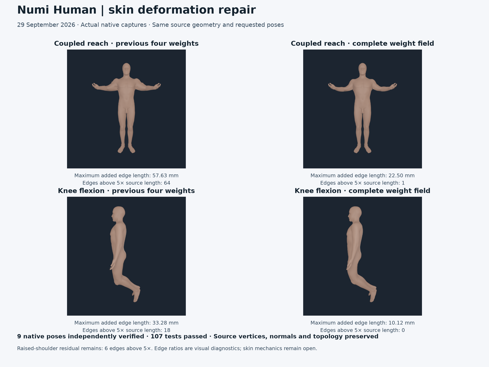
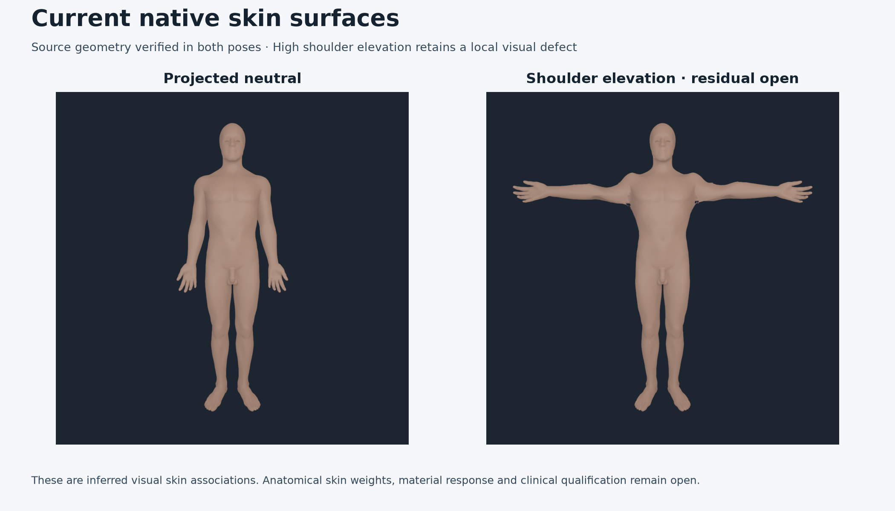

# Complete source skin weight field

Native skin blending now retains all 86 body weights, and source bone-to-skin
projection distances determine seed confidence. This removes the large local
ratio regressions left by the [previous four-weight repair](SKIN_SOURCE_SURFACE_BINDING_20260929.md).
In bilateral knee flexion, maximum source-edge stretch falls from 18.48 to
2.05 and maximum added edge length from 33.28 to 10.12 mm. Nine actual native
poses pass the independent source audit; 107 selected tests pass without skips.



These are verified source visual changes. The raised-shoulder pose retains
six edges above five-times source length. Anatomical skin weights, skin shape
admission, mechanical deformation and clinical anatomy remain open.

## Measured native change

The paired comparison uses the same rigid/muscle/bone inputs, source
registration, source equality program and requested poses. The previous ABI 4
probe renders the previous four-weight payload; the updated probe renders the
new full-field ABI 5 payload. No source coordinates, normals, triangles, body
binding transforms or source identity fields change. Both 512- and 1024-pixel
captures contain byte-identical geometry packs for each corresponding input.

All 164,188 unique source edges are measured. Five-times counts are descriptive
visual diagnostics, not a physiological or skin-quality admission threshold.

| Pose | Maximum added edge length, before → after | Edges over five-times source length, before → after | Maximum stretch ratio, before → after | p99 stretch ratio, before → after |
| --- | --- | --- | --- | --- |
| Raw source rest | 0.677 → 1.332 µm | 0 → 0 | 1.0007 → 1.0007 | 1.00008 → 1.00012 |
| Projected neutral | 30.45 → 9.74 mm | 17 → 0 | 17.45 → 2.14 | 1.120 → 1.068 |
| Coupled torso | 30.45 → 10.80 mm | 17 → 0 | 17.45 → 2.17 | 1.158 → 1.101 |
| Coupled reach | 57.63 → 22.50 mm | 64 → 1 | 17.45 → 5.03 | 1.717 → 1.275 |
| Bilateral knee flexion | 33.28 → 10.12 mm | 18 → 0 | 18.48 → 2.05 | 1.280 → 1.165 |

Raw-rest edge errors increase slightly with 86 float32 contributions but
remain at micrometre scale. The full [native comparison](media/skin-geometric-full-field-20260929/native-edge-comparison.json)
retains exact values and the worst edges. The native audits bound position
error separately against the unchanged 20-micrometre source-geometry gate.

Four additional poses extend source verification without a recorded paired
ABI 4 baseline:

| Pose | Maximum added edge length | Edges over five-times source length | Maximum stretch ratio | p99 stretch ratio |
| --- | --- | --- | --- | --- |
| Shoulder elevation | 40.82 mm | 6 | 6.39 | 1.393 |
| Hip flexion | 13.74 mm | 0 | 2.29 | 1.187 |
| Unilateral reach | 22.50 mm | 0 | 4.05 | 1.206 |
| Asymmetric knee flexion | 11.07 mm | 0 | 2.05 | 1.135 |



## Source confidence and native ABI

The old solution used each seed vertex's skin graph degree as its penalty.
Tiny source edges therefore strengthened both continuity and the local seed
penalty, preserving sharp ownership transitions. Keeping all 86 weights of
that old solution barely changed its worst defects in an offline diagnostic.
Changing source confidence while truncating the new field to four weights
also reintroduced discontinuities. Those exploratory forecasts are retained
under the proof root and are separate from the adopted native evidence.

The current method keeps the same 185 source bones, 12,025 candidate samples,
696 guarded rejections, 5,039 seed vertices and positive inverse-edge-length
graph. For each source sample, its exact distance to the nearest source skin
vertex supplies inverse-distance confidence. Repeated samples for one body
are averaged; distinct bodies share the seed target in proportion to their
confidence. The seed penalty is their mean confidence. Projection confidence
and edge conductance both have units of inverse length; no material stiffness
or fitted smoothing coefficient is introduced. The retained source gaps range
from 1.284 to 107.202 mm, including rejected samples.

The screened graph solution has 54,949 rows and 86 body columns. The complete
float64 solution, exact seed associations and every source projection gap
remain in the offline hash-bound certificate. The independent audit rebuilds
source geometry and seed projections using direct all-vertex distances, then
checks every graph equation without running the authoring solver. Its maximum
relative equation residual is **9.84e-16**. The source field is positive and
its maximum partition error is **1.95e-14**.

NHSKIN ABI 5 appends the complete vertex-major float32 weight matrix after
the existing header, binding records, source vertices and triangle indices.
The payload is 23,292,952 bytes. The old four-weight vertex fields remain
diagnostics; at the worst vertex they retain only 34.20 percent of the new
field and are not used for ABI 5 rendering. No weight is intentionally dropped
by the runtime. Maximum float32 weight quantization error is **2.98e-8** and
maximum float32 partition error is **5.96e-7**.

The native loader rejects nonfinite/negative weights, malformed partitions,
truncation, trailing bytes, false legacy headers and unknown ABI versions.
Its existing partition tolerance is unchanged. Positions and normals blend
the complete field; current/rest body-frame evidence records the consumed ABI.
The offline NPZ remains a verification input and is not consumed by rendering.

## Executed verification and compatibility

Raw source rest, projected neutral, coupled torso, coupled reach, bilateral
knee flexion, shoulder elevation, hip flexion, unilateral reach and asymmetric
knee flexion all exit successfully and pass independent source checks. Each
audit checks all 54,949 vertices, 109,183 triangles, 86 current/rest body frames,
source normals, full runtime weights, source ownership, seed targets,
projection gaps and graph equations. Worst native/source position error is
**1.469 micrometres**, below the unchanged **20-micrometre** gate. Source
equality laws and range-conflict policies are preserved.

**107 tests passed in 131.19 seconds**, with no skips. They cover actual
recompilation and native poses, changed atlas frames, reversed executing knee
axes, source hash/geometry/normal/topology/owner corruption, altered current
and rest poses, forged projection gaps, forged full solution/runtime weights,
false physical status, hidden weight truncation and malformed native ABI 5
inputs. Five archived ABI 4 source audits remain verifiable.

The [source byte-parity record](media/skin-geometric-full-field-20260929/source-geometry-parity.json)
checks unchanged geometry and binding fields separately. The
[legacy rendering record](media/skin-geometric-full-field-20260929/legacy-native-parity.json)
checks the same ABI 4 payload through old and new native binaries: both raw
rest and neutral geometry packs and all four PNGs match, **10/10 files**.
The dated September 14 skin candidate and native-visual admission profiles
keep their original ABI 4 evidence; this ABI 5 increment uses the current
independent `skin-surface-audit`.

The updated native probe builds with warnings treated as errors and links
the unchanged frozen physics runtime. The
[receipt](media/skin-geometric-full-field-20260929/receipt.json) binds exact
executed/tested source snapshots, commands, logs, nine audits, inputs,
native binary, published native revision and figure inputs. Public PNGs are
copied unchanged from actual native captures. The figure only arranges and
labels them; no generated anatomy or edited body surface is used.

## Reproduction and remaining scope

Authoring requires the project's `skin-authoring` extra and Python 3.11 or
later. Rendering ABI 5 requires the updated native probe; ABI 1–4 remain
supported. Retained payloads, certificates, raw packs, logs and exploratory
forecasts live under `Build/skin-full-weight-20260929`.

```sh
NUMI_HUMAN_PYTHON="$PWD/.venv-mujoco312/bin/python" \
PYTHONPATH=Sources/myosim/checkout .numi/commands/human skin-surface-audit \
  --sources Sources --artifact Build/myosim-fullbody \
  --registration Build/knee-parity-registration-20260929/candidate.v6.registration.json \
  --payload Build/skin-full-weight-20260929/production/payload/bodyparts3d-myosim-skinned-shell.nhskin \
  --native-pack Build/skin-full-weight-20260929/production/native-neutral/myosim-fullbody-articulated-bodyparts-bones-source-skinned-shell.mrvpack \
  --native-poses Build/skin-full-weight-20260929/production/native-neutral/myosim-fullbody-articulated-bodyparts-bones-source-skinned-shell.skin-poses.json \
  --output Build/skin-full-weight-20260929/production/reproduced-neutral-audit.json
```

The project command dispatcher was executed against the actual ABI 5 neutral
capture and passes. Earlier board decks and the September 28 standing video
are preserved as dated evidence; they do not depict this new skin field.
The [bilateral knee registration repair](BILATERAL_KNEE_GEOMETRY_REPAIR_20260929.md)
remains the controlling bone-placement evidence. Raised-shoulder defects,
self-intersection/volume and full shape-quality checks, measured anatomical
weights, material/contact mechanics, subject calibration, complete organs,
clinical anatomy and whole-Human qualification remain open.
