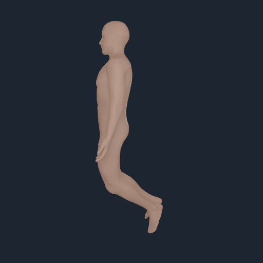

# Exact skin embeddedness in retained native poses

The compiled **outer visual sheet** and nine retained native inspection poses were checked
for triangle self-intersections with the exact-coordinate quotient predicate.
The predicate found **42 crossing triangle pairs in three poses**. Coupled
reach had 3, bilateral knee flexion had 18, and asymmetric knee flexion had 21.
The compiled source and the other six native poses had zero. These are actual
sampled native visual packs, independently bound to the prior source/native
audit; they are not interpolated motion trajectories.

| Sample | Exact crossing pairs | Embedded-surface result |
| --- | ---: | --- |
| Compiled source | 0 | Open/nonmanifold |
| Raw source rest | 0 | Open/nonmanifold |
| Neutral | 0 | Open/nonmanifold |
| Coupled torso | 0 | Open/nonmanifold |
| Coupled reach | 3 | Open/nonmanifold and intersecting |
| Bilateral knee flexion | 18 | Open/nonmanifold and intersecting |
| Shoulder elevation | 0 | Open/nonmanifold |
| Hip flexion | 0 | Open/nonmanifold |
| Unilateral reach | 0 | Open/nonmanifold |
| Asymmetric knee flexion | 21 | Open/nonmanifold and intersecting |

Every state contains 54,949 source vertices and 109,183 triangles. The exact
coordinate quotient preserves every triangle's spatial support, including
authored duplicate vertex positions. Source topology still has 171 boundary
edges, two boundary-branch vertices and two vertex-link defects. The mesh is
therefore not a closed, oriented skin volume even in states with zero crossings.
The closed-skin gate fails for all ten outer-sheet states. The later
[complete source-solid audit](SKIN_FULL_SOURCE_SOLID_20260930.md) shows that
the source's retained inner sheet and small connectors make the full FJ2810
source a closed, intersection-free geometric candidate at rest. That full
source solid has not been run in these native poses.

A later [source-bound visual-weight trial](SKIN_CROSSING_ATTRIBUTION_20260930.md)
clears these nine native pose crossings but fails strict pair-level nonregression
at a deeper held-out knee pose. It remains a diagnostic candidate rather than
a replacement for this baseline.



The crossing triangles are below the resolution of this full-body capture;
the exact face-pair witnesses, rather than the image, establish the failure.

The first recorded crossing witnesses are small and local. In the native
coupled-reach pack, the four implicated faces span x=0.173422–0.182524 m,
y=0.156651–0.159354 m, z=1.311248–1.319456 m. The first 16 recorded
bilateral knee witnesses span x=-0.034918–-0.025359 m,
y=0.040003–0.044057 m, z=0.813187–0.832253 m; the corresponding first 16
asymmetric-knee witnesses span x=-0.036295–-0.026512 m,
y=0.041696–0.048347 m, z=0.837038–0.857153 m. These are world-space
bounding boxes of implicated triangle vertices, not a clinical anatomical
localization or patellar contact finding.

The [identity](media/skin-native-embeddedness-20260929/identity.json),
[summary](media/skin-native-embeddedness-20260929/summary.json), and
[per-state rows](media/skin-native-embeddedness-20260929/rows/) retain exact
face-pair witnesses, candidate counts, topology, geometry hashes, predicate
source hashes, native-pack hashes and the prior source/native audit receipt
hash. No source positions, skin bindings, native pose, or renderer inputs were
changed by this diagnostic. The prior audit bounded each native/source
position difference to at most 1.578 micrometres.

Reproduce from the retained inputs:

```sh
PYTHONPATH=src OPENBLAS_NUM_THREADS=1 .venv-mujoco312/bin/python \
  -m numilab_human.skin_embeddedness_gate \
  --payload Build/skin-seam-continuity-20260929/production/payload/bodyparts3d-myosim-skinned-shell.nhskin \
  --manifest Build/skin-seam-continuity-20260929/production/payload/bodyparts3d-myosim-skinned-shell.manifest.json \
  --prior-receipt Docs/media/skin-exact-seam-continuity-20260929/receipt.json \
  --output-dir Build/skin-embeddedness-20260929/exact-native
```

The command returns exit code 2 for the failing closed-volume gate. Clearing
the visual crossings requires an independently checked deformation or binding
change; closing the source holes requires a source-bound topology repair.
Neither result would by itself qualify skin material, contact, clinical anatomy,
patellar mechanics, or whole-body motion.
