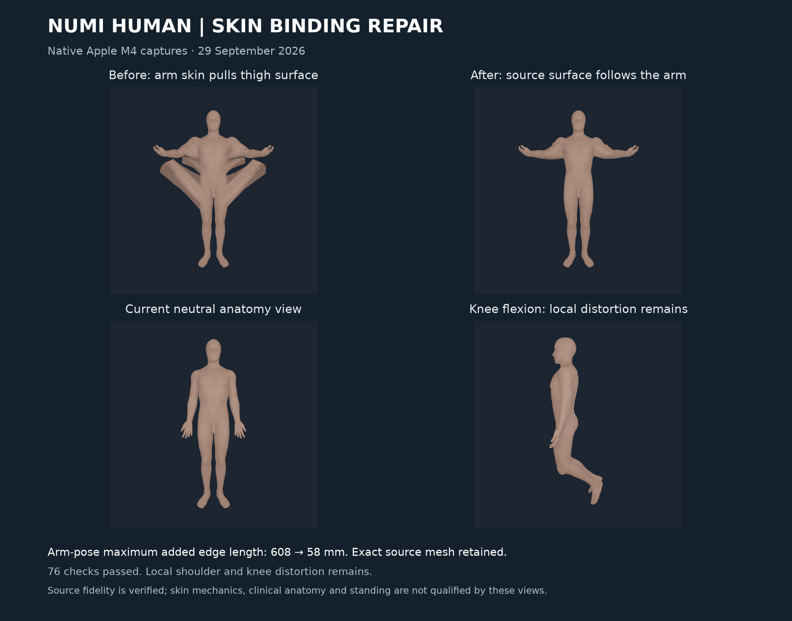

# Skin source-surface binding repair

Raising the arms no longer pulls large sheets of thigh skin upward. The old
four-nearest-bone assignment attached some thigh vertices to nearby finger
bones in the source resting pose. A correct static surface hid the wrong
ownership. The new binding follows the connected source skin surface while
retaining the exact source geometry and native four-influence layout.



This is a verified source visual increment. Local shoulder and knee distortion
remains; these views do not qualify anatomical skin weights, skin mechanics,
clinical anatomy or standing.

## Measured native change

The comparison uses the same rigid/muscle/bone inputs, source registration,
requested poses and native binary. Only skin influence indices and weights
change. Raw rest omits equality projection; the remaining cases consume the
same source equality program. The diagnostic measures all 164,188 source edges.
Five-times counts are descriptive, not physiological admission thresholds.

| Pose | Maximum added edge length, before → after | Edges over five-times source length, before → after | Maximum stretch ratio, before → after | p99 stretch ratio, before → after |
| --- | --- | --- | --- | --- |
| Raw source rest | 0.565 → 0.597 µm | 0 → 0 | 1.001 → 1.001 | 1.000 → 1.000 |
| Projected neutral | 37.31 → 30.45 mm | 37 → 17 | 10.01 → 17.45 | 1.027 → 1.120 |
| Coupled torso | 252.82 → 30.45 mm | 609 → 17 | 35.71 → 17.45 | 2.216 → 1.158 |
| Coupled reach | 607.51 → 57.63 mm | 2,093 → 64 | 81.58 → 17.45 | 6.177 → 1.717 |
| Bilateral knee flexion | 66.99 → 33.28 mm | 131 → 18 | 16.41 → 18.48 | 1.119 → 1.280 |

Large absolute defects become smaller and less widespread in every posed
case. Neutral and knee maximum/p99 ratios nevertheless worsen. Source edges
are irregular and some are tiny; no diagnostic is hidden or relabeled as
physiological strain. The [full comparison](media/skin-source-surface-binding-20260929/native-edge-comparison.json)
retains the worst length increases. Six exploratory candidates remain under
the proof root, including rejected hard-anchor and continuous-distance variants.
The final source-surface binding is adopted as a bounded visual repair with
these residual defects open.

## Source-derived associations and independent certificate

The selected exterior of BodyParts3D FJ2810 has 54,949 vertices and 109,183
triangles, selected from 102,467 vertices and 203,382 triangles in the compound
source. Coordinates, smoothed source normals, triangles, all 86 binding frames
and the native header remain byte-identical to the previous payload. The
[byte-parity record](media/skin-source-surface-binding-20260929/source-byte-parity.json)
checks these fields separately.

Each of 185 source bones contributes its centroid and 64 source surface
vertices. A sample can seed only the skin neighbourhood reachable from its
centroid projection within a source-derived bone diameter bound plus twice
the centroid-to-skin gap. Of 12,025 candidate associations, 696 are rejected;
5,039 unique skin vertices retain source body targets. This guards against
surface samples reaching an unrelated limb through Euclidean proximity.

A positive inverse-edge-length graph Laplacian smooths the targets. Screening
uses one source graph degree at each seed vertex; it is an inferred visual
association, with no fitted material stiffness. Offline authoring uses the
[SciPy sparse solver](https://docs.scipy.org/doc/scipy/reference/generated/scipy.sparse.linalg.spsolve.html)
with SciPy 1.17.1. The complete 54,949-by-86 weight solution and exact seed
targets are retained in a hash-bound NPZ certificate, which is not a runtime
input. The four largest weights are normalized into the existing native ABI.
At the worst vertex they retain 57.77 percent of full solution mass; the
discarded 42.23 percent remains an explicit approximation limit.

The independent audit rebuilds the exterior with a face-edge graph, locates
all seed targets by direct all-vertex distances, and checks every row of the
screened graph equations without invoking the authoring solver. Its maximum
relative equation residual is **1.44e-15**. It reconstructs source normals,
MuJoCo COM poses, source equality projection and every native sparse blend.
Source ownership, geometry and shape quality remain distinct checks.

## Native verification

Raw source rest, projected neutral, coupled torso, coupled reach and bilateral
knee flexion all pass. Maximum native position errors are respectively
**0.713, 0.713, 0.588, 0.736 and 0.713 micrometres**, below the unchanged
20-micrometre source-geometry bound. Each audit checks every selected triangle,
normal, binding transform, current/rest body pose and semantic owner. The
[five source audits](media/skin-source-surface-binding-20260929/receipt.json)
and final receipt retain exact input hashes.

The native probe now exports the actual current and raw source-rest COM poses
used by skin blending. It changes no skin renderer or runtime math. Comparing
the previous native binary with the exporter binary gives identical MRVPACK2
bytes and all four PNGs in both raw rest and neutral: **10/10 files** match.
The [export parity record](media/skin-source-surface-binding-20260929/native-export-render-parity.json)
retains those hashes. The four public 1024-pixel captures also retain exactly
the same geometry packs as the corresponding 512-pixel captures.

**70 tests passed in 130.38 seconds**, including rehashed vertex, normal,
topology, body ownership, influence-weight, current/rest pose, source hash,
seed-target and full-equation corruption; forged physical status and hidden
truncation fail. An additional **six producer/native regression tests passed
in 46.60 seconds**, covering actual recompiled skin, four native poses,
changed source atlas frames and reversed executing knee axes. No test skips.
The [receipt](media/skin-source-surface-binding-20260929/receipt.json) binds
executed source snapshots, commands, logs, native executable and frozen runtime.

## Reproduction

Authoring requires the project's `skin-authoring` extra and Python 3.11 or
later. Native rendering consumes only NHSKIN; the full NPZ is offline evidence.
Retained production inputs and commands live under
`Build/skin-surface-audit-20260929/production`.

```sh
PYTHONPATH=src:Sources/myosim/checkout .venv-mujoco312/bin/python \
  -m numilab_human.skin_surface_audit \
  --sources Sources --artifact Build/myosim-fullbody \
  --registration Build/knee-parity-registration-20260929/candidate.v6.registration.json \
  --payload Build/skin-surface-audit-20260929/production/payload/bodyparts3d-myosim-skinned-shell.nhskin \
  --native-pack Build/skin-surface-audit-20260929/production/native-neutral/myosim-fullbody-articulated-bodyparts-bones-source-skinned-shell.mrvpack \
  --native-poses Build/skin-surface-audit-20260929/production/native-neutral/myosim-fullbody-articulated-bodyparts-bones-source-skinned-shell.skin-poses.json \
  --output Build/skin-surface-audit-20260929/production/reproduced-neutral-audit.json
```

The same operation is available as `numi human skin-surface-audit` when
`NUMI_HUMAN_PYTHON` selects the source environment. Knee bone registration,
source equality laws/ranges, contact/material owners, earlier board packs and
standing video are preserved. The [bilateral knee repair](BILATERAL_KNEE_GEOMETRY_REPAIR_20260929.md)
and [joint constraint consistency record](SOURCE_JOINT_CONSTRAINT_CONSISTENCY_20260929.md)
remain the controlling evidence for bone placement and source-range conflicts.
Full skin deformation, self-intersection checks, physiological weights,
calibrated tissue/subject mechanics and whole-Human qualification remain open.
