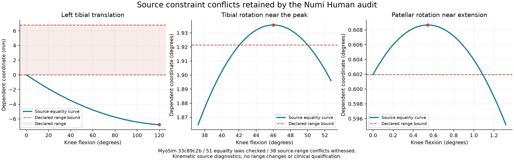

# Source joint constraint consistency — 29 September 2026

The shared pose projector now honors joint reference offsets and skips inactive
source equalities. The previous calculation treated joint coordinates as
absolute polynomial inputs; for a nonzero reference it could produce an
incorrect articulated pose. An independent MuJoCo regression reproduces that
error and verifies the correction. The current pinned full-body equality
references are zero, so this repair preserves the existing measured anatomy.

Both upper- and lower-limb audits now read the source engine's constraint
residuals after `mj_forward`. They retain every active joint equality, its
source ID, dependent/driver coordinates, unit and residual. A missing,
duplicated, nonfinite or mismatched constraint cannot establish projection
coverage; a failed oracle rejects the pose audit even if the geometry checks
would otherwise pass. This uses the existing `1e-9` coordinate arithmetic
admission bound.

## Executed whole-body source result

The actual pinned MyoSim model has 51 active joint equalities. All **408** engine
residuals across the eight lower-limb inspection poses pass; the maximum is
`2.220446049250313e-16`. The decoded bone geometry, all source/native pose-range
measurements, 320 interface measurements, 160 bilateral measurements and five
retained pose failures are exactly identical to the preceding knee audit.
The fresh audit still exits **2** for those five range failures.
The upper-limb audit exits **0**: its seven poses independently verify another
357 equality residuals, with 364 interface and 182 bilateral checks passing.
Together the executed limb audits cover **765 source-engine equality residuals**.

The audits also inspect each equality over its source driver's complete
**declared** range using endpoints and numerical polynomial stationary points.
This reveals conflicts that a finite pose suite misses:

| Diagnostic | Result |
|---|---:|
| Source equality laws inspected | 51 / 51 |
| Laws with a witnessed declared source-range conflict | 38 |
| Laws with a rounded source coordinate outside a consumed native limit | 33 |
| Driver domains retained as unverified | 0 in this pinned model |
| Source/native ranges or polynomial laws changed | 0 |

The 33 native-limit results round source-projected values to FP32 and compare
with the consumed native range bytes and flags. They are **not** executions of
the native polynomial at every driver value. Each source conflict witness is
also checked against MuJoCo's actual equality residuals in the source regression.



The first panel shows the left tibial translation law entering the negative
coordinate range while its source declares a positive range. The next panels
show tibial and patellar rotation peaks outside their source upper bounds.
The zoomed panels have their own labelled axes; they do not depict mesh shape,
cartilage orientation or loaded knee mechanics.

| Selected source equality | Declared dependent range | Witnessed dependent value | Driver witness |
|---|---|---:|---:|
| Left tibial translation2 | `7.69254e-11 .. 0.006792 m` | `-0.006791998837 m` | `2.0944 rad` |
| Right tibial rotation2 | `-0.00167821 .. 0.0335354 rad` | `0.033782911687 rad` | `0.802981836664 rad` |
| Right patellar beta rotation1 | `-1.79241 .. 0.010506 rad` | `0.010623036523 rad` | `0.009477643049 rad` |

The contradictions are in the pinned source, rather than evidence that the
Numi importer flipped a range sign. The native compiler already retains six
source-limited joints without enforcing their hard limits because their source
default lies outside the declared interval; five of them have witnessed domain
conflicts. The domain receipt preserves those
compiler dispositions rather than assigning a new limit or silently changing
the source default.

## What the diagnostic proves

A finite witness proves that exact equality projection at that driver value
cannot also satisfy the declared dependent bound at the unchanged tolerance.
MuJoCo source equality and position-limit dynamics are compliant. The witnesses
do **not** prove that those soft dynamics are infeasible; they identify a
conflict in an exact kinematic/hard-range interpretation.

Numerical stationary-point enumeration is not an interval-arithmetic proof or
a calibrated physiological range certificate. If an upstream equality owns a
driver or the source provides no finite enforced driver range, the receipt
retains an explicit `unverified_driver_domain` disposition. Source constraints
must be reconciled through an explicit owning model/constraint policy before
promoting full-range motion; clipping a pose or widening a bound is not a
qualified repair.

## Reproduction and retained evidence

Append-only local proof root: `Build/source-constraint-consistency-20260929`.
The `lower-audit` directory retains the command, environment, exact executed
Python source snapshots, terminal exit 2 and the complete result. The initial
`source-equality-oracle.json` independently reads all eight source poses.
`verification-summary.json` records the exact comparison with the previous
compiled geometry audit. The constraint regressions include nonzero references,
inactive equalities, missing/duplicated oracle rows, pose rejection, hidden
interior peaks, constant/flat polynomials, unsupported domains and actual
whole-body conflict witnesses.
The completed regressions passed **14 constraint tests** and **84 native/source
tests**, with no skips. The lower-limb audit retains its expected exit 2 for the
five known sampled range failures.

```sh
PYTHONPATH=src:Sources/myosim/checkout .venv-mujoco312/bin/python \
  -m numilab_human.lower_limb_pose_audit \
  --sources Sources --artifact Build/myosim-fullbody \
  --registration Build/knee-parity-registration-20260929/candidate.v6.registration.json \
  --bone-artifact Build/knee-parity-registration-20260929/bones.v6/payload \
  --output Build/source-constraint-consistency-followup.json
```

The full-domain receipt is under `joint_equality_driver_domain_audit`; each pose
has `source_equality_projection_oracle`. An audit exit 2 retains the five known
sampled range failures and its diagnostic output.
The [published compact evidence](media/joint-source-consistency-20260929/source-joint-constraint-evidence.json)
retains all 51 laws, witness coordinates, source identities, consumed range
flags and source-program byte comparisons without depending on local Build files.

| Identity | Value |
|---|---|
| MyoSim revision | `33c89c2bde282553dde3f526768eb3bdcfaa7649` |
| Source archive SHA-256 | `280d297aa496acccf3f1c5373a1304d23f9569362c2d6960910128bfba144975` |
| Compiled audit SHA-256 | `ddb017d75c54eab774fd75339956b66018fbd8d04734b54d480c0d4c62210dbf` |
| Unchanged bone payload SHA-256 | `2aaf0567e6a5131c88b599cd56cb605b9d585c2792084b324e84699cabbc9b33` |
| Plot PNG SHA-256 | `16d2bca3fb3b2d6dafbd99c49ecd6cbe5c664b7fb353a28c082f93bbad229097` |

The plot is derived from these source equations and bounds (MyoSim,
MyoHub, Apache-2.0), with no synthetic anatomy imagery. Existing native binaries,
payloads and dated board packages remain unchanged. This increment does not
qualify loaded joints, tissue materials, organ physiology, subject-specific
anatomy or sustained whole-body control.
