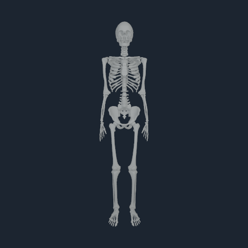

# Standing and walking completion plan

The current release target remains the [neuromusculoskeletal release matrix](NEUROMUSCULOSKELETAL_RELEASE_MATRIX.md). Standing and walking require the same published anatomical, tissue, controller and native runtime stack. This plan resolves the next physical dependency and specifies the remaining executable gates.

The immediate critical path is **correct loaded contact, practical coupled GPU
execution, and source-compliant anatomical equilibrium**. Controller selection
and long behavior trials depend on those physical prerequisites. Small replay
transactions remain regression evidence rather than standing outcomes.

The [costal contact-search repair](COSTAL_BVH_20260908.md), native `2ca77bb`,
reduces the unchanged validation-enabled costal runner from 277.393 to 29.047
seconds. Seven native tests and the costal transaction pass. A bounds hierarchy
replaces the measured exhaustive pair scan while preserving candidate order,
and exact-prefix overflow now fails closed. The subsequent
[coupled support repair](HARD_SUPPORT_KKT_20260908.md), native `3c15621`, replaces
the history-dependent penalty with independent contact impulses. Eleven loaded
cases in three environments pass analytic weight/friction and bytewise replay;
the generic query boundary rejects undersized internal arenas. The old 1.222%
cold-start support result remains retained failed evidence. Prepared Human and
costal transactions pass on the new revision; anatomical loaded equilibrium
and sustained behavior remain unqualified.

The [offline equilibrium](COUPLED_EQUILIBRIUM_20260908.md) passes its unchanged
FP64 internal balance gate at 0.00814 using ideal equalities and source stops.
[Prepared-state admission](PREPARED_STATE_ADMISSION_20260908.md) transports the
identical FP32 pose and muscle state into v7 with NHCNT2/NHEQ2/NHLIM1 and a small
FEM fixture. [Prepared recruitment](PREPARED_RECRUITMENT_20260908.md) reaches the
Brain motor path, but its four-root comparison establishes no settling
improvement. These do not establish loaded compliant joint/fibre/contact
balance or registration of anatomical tissue at the prepared state.

The next implementation must establish source-compliant anatomical settling
with the corrected contact law, then demonstrate longer stable physical time
on the same anatomical stack. Profile remaining GPU
cost where measured; preserve source compliance, source stops, tissue mass,
conservative transfer, causal control and rejected-state isolation. Batch fixes
and their physical evidence into cohesive changes. Retain the complete behavior,
calibration and regional anatomy requirements below.

Historical increments remain available in the [curved-support report](CURVED_SUPPORT_20260908.md),
[offline limit-reaction report](OFFLINE_LIMIT_REACTIONS_20260908.md),
[dynamic source-limit report](SOURCE_DYNAMIC_LIMITS_20260908.md), and
[costal deadline report](COSTAL_IDLE_REQUALIFICATION_20260908.md).

## Implemented: geometrically admissible recruitment

The legacy standing baseline started with a 14.0669 mm foot penetration. A one-step diagnosis separated the source ground alignment, joint-equality projection and muscle recruitment. The first two left minimum gaps of approximately 0.012 and 0.107 micrometres. Recruitment then changed right-ankle coordinate 109 from zero to -0.1221731 rad without respecting the ground. Its static support compiler also assigned force to separated witnesses because the support interface contained a direction but no plane.

The native `NumiHumanMuscleEquilibrium` compiler now carries the authored world plane, evaluates each witness on every candidate pose, rejects penetrating initial states and discards penetrating search candidates. Separated witnesses retain their source indices and carry exactly zero load. The default one-micrometre tolerance bounds geometry roundoff; it is not a soft contact layer. Failed compilation preserves the caller's accepted result. Root coordinates and the ground remain fixed during recruitment.

Explicit tissue poses now disable pose search before recruitment. Previously, the visual probe could overwrite the recruited configuration afterward, leaving activation and force diagnostics attached to a different posture. The final native horizon also exports its initial and terminal q/v for reproducible equal-duration comparisons. This diagnostic export does not implement the TaskPack accepted-root metric producer.

The analytic fixture verifies weight balance, airborne zero force, translated and rotated planes, penetration rejection, accepted-output preservation, tolerance admission and exact replay. Restoring force across a gap in a controlled negative test must fail. The anatomical regression rejects 48 penetrating candidates, preserves a near-zero initial gap and reports eight separated witnesses with zero force.

See [the retained support evidence](media/support-geometry-20260908/receipt.json) and [its local verifier](media/support-geometry-20260908/verify_support_geometry.py). Historical failed and intermediate runs remain in that bundle.

The same validation pass exposed an existing native IO binding error: the
non-shadow motor path supplied an 80-byte motor header for a declared 160-byte
ready-gate argument. It now binds a correctly sized zero record when that gate
is unused. The existing motor/sensor transaction test runs with Metal API
validation enabled; readiness authority and decision-shadow checks are unchanged.

## Remaining implementation and acceptance gates

| Work | Permanent owner and implementation | Completion evidence |
|---|---|---|
| Load-balanced anatomical stance | Bounded native placement and the witness gravity wrench now pass. Current-pose primitive queries now pass. FP64 internal recruitment with ideal equalities and source-stop reactions now passes. Establish source-compliant loaded joint/contact response, passive tissue/prestress and fibre equilibrium. Share the identical root/pose initial condition with tissue registration and existing Human/CompiledRun admission. | Witness geometry and gravity-wrench evidence are retained in the stance increment; initial full primitive geometry now passes; bounded internal acceleration/fibre residuals, dynamic joint/contact complementarity and registered FP64/native force parity remain required. |
| Source-compliant loaded integration | NumanX v7/Core/Matter now admits the exact prepared pose and muscle state with NHEQ2/NHLIM1/NHCNT2. The small FEM fixture passes bounded joint replay. Diagnose and settle limit/equality/contact/fibre residuals, then compile the registered tissue at that identical state. The legacy NHEQ1 visual solver remains a diagnostic comparator. | Scalar source-law and small joint-transaction checks pass. Prepared-pose source/timestep convergence, registered mesh convergence under load, conservative force/moment transfer, no duplicated mass or active force, rollback/retry and replay remain required. |
| Standing and recovery controller | Lower source-semantic posture/support observations and muscle commands through the existing SensorPack/PolicyPack and Brain controller. Keep neural learning and controller state causal to accepted physical time. Tune stance feedback only after the initial mechanical state is admitted. | Assistance-free sustained balance, controlled nonzero perturbations and recovery, actuator bounds, observable force/kinematic response, observation dropout and emergency-stop behavior. Preserve joint-risk inhibition and rejected-state isolation. |
| Native behavior telemetry | Implement the frozen reductions in the owning native accepted-root publication path: source-bound root/trunk state, support/contact, ground-relative height and tilt, forward/lateral speed, falls, assistance and termination. Retain every attempted root and its disposition. | Replayable metric reductions agree with an independent trace check; failed/rejected futures never advance physical time or publish observations; missing, duplicated and truncated trials are rejected. Terminal probe q/v is insufficient. |
| Standing qualification | Bind one exact source/task/controller/runtime stack to the existing behavior evaluator. Freeze task thresholds from source observations and measurement uncertainty before tuning or selection. | All 20 distinct 60-second standing trials pass. At least 95 of 100 distinct five-second recovery trials pass with the prescribed nonzero impulses and hold conditions. |
| Walking | Author bilateral stance/swing roles and contact transitions by source semantic identity. Train or identify the controller through the existing PolicyPack/Brain path, using delivered observations and accepted physical time. | The frozen 300 walking trials: 100 at each of 0.5, 1.0 and 1.5 m/s, 120 seconds each; at least 95 pass at each speed and speed RMSE is at most 0.15 m/s. All 420 standing/recovery/walking trials must be valid. |
| Calibration and delivery | Keep raw specimen/subject data, registration, parameter identification, uncertainty and sealed validation in Human's calibration owners. Measure the existing five Apple PerformanceEnvelope workloads on the published stack. | Independent held-out force/deformation and movement evidence; identifiability and uncertainty records; declared performance gates, reproducible installation and exact artifact closure. Authored research gains and short replay runs do not count as experimental calibration. |

Data acquisition/calibration, source completion, metric implementation and profiling can progress independently of the stance solve. Controller behavior and release promotion remain gated on the physical and evidence prerequisites above. Regional tissue work, including unresolved LCL prestress and loaded cartilage/meniscus contact, remains open in the release matrix.

## Retained geometry-only baseline (`c1db46d`)

The corrected one-step maximum generalized velocity change is 0.1581752, compared with 210.3526 in the matched baseline. This maximum mixes linear and angular coordinates and is not a speed in metres per second. Minimum native support gap on that first step is approximately 0.093 micrometres. Neither result is a balance certificate.

Four identical-initial-state runs cover 0.6 ms with 100, 50, 25 and 12.5 microsecond steps. Consecutive maximum q differences decrease from 7.0357e-5 to 2.5523e-5 to 7.4143e-6; v differences decrease from 0.09603 to 0.08238 to 0.04146. This is a short refinement trend, not full source or physiological-duration convergence. The 64-step, 100-microsecond run covers 6.4 ms, reaches maximum generalized velocity change 2.17837 and minimum gap -48.032 micrometres, and still reports `balanced=false`.

The corrected static compiler finds only two loaded witnesses, total normal load 176.028 N, and maximum floating-root force residual 776.836 N. Its normalized residual RMS is 36.3192 and `balanced=false`. The geometry error is repaired; the current posture still cannot provide a balanced support wrench. No controller gain, risk threshold, ground height or hidden root wrench was changed to mask this result.

Full standing, recovery, walking, independent calibration and the neuromusculoskeletal release remain unqualified.

At the earlier support-geometry revision, the IO regression passed with Metal
API validation enabled, but the source-compliant costal regression twice missed
the 60-second callback deadline. A separate NumiVivo benchmark was present;
contention was not established as the cause. Those failed attempts remain
historical evidence. The subsequent idle-host run passed the bounded deadline,
and the current BVH repair makes the same costal transaction substantially
faster. Prepared anatomical loading and sustained behavior remain unqualified.

Local validation uses the declared Python >=3.11 requirement: Python 3.14.6 ran
178 tests with seven skips and no failures. An initial run with unsupported
Python 3.10 failed 21 behavior-qualification tests at `hashlib.file_digest`; the
runner error is retained and no compatibility requirement was changed.

The [prepared recruitment comparison](PREPARED_RECRUITMENT_20260908.md) now
preserves the exact per-muscle tonic proposal through the existing Brain motor
path, including the inclusive excitation endpoint. Four-root native comparison,
activation/force response, dropout and bitwise replay pass. Early settling is
essentially unchanged (right ankle velocity about 0.169 rad/s at 0.4 ms).
Loaded source-compliant equilibrium, registered tissue, calibrated feedback and
sustained behavior remain open; inhibition was not weakened.

The subsequent [costal idle-host qualification](COSTAL_IDLE_REQUALIFICATION_20260908.md)
passes eight accepted 10-microsecond roots and exact rejection/retry under the
unchanged 60-second callback deadline. No NumiVivo job was observed during the
277-second runner. This closes the current source-default costal fixture's bounded
deadline gate; it does not establish the historical timeout cause or qualify
prepared NHCNT2 tissue loading. A sampled 9.3G process peak leaves memory and
performance investigation open.
