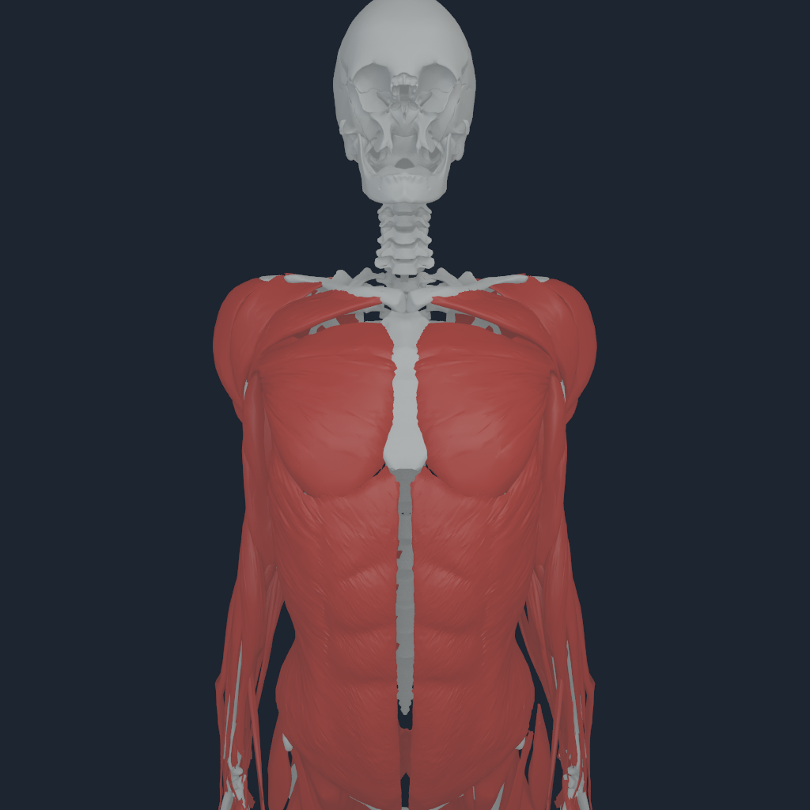
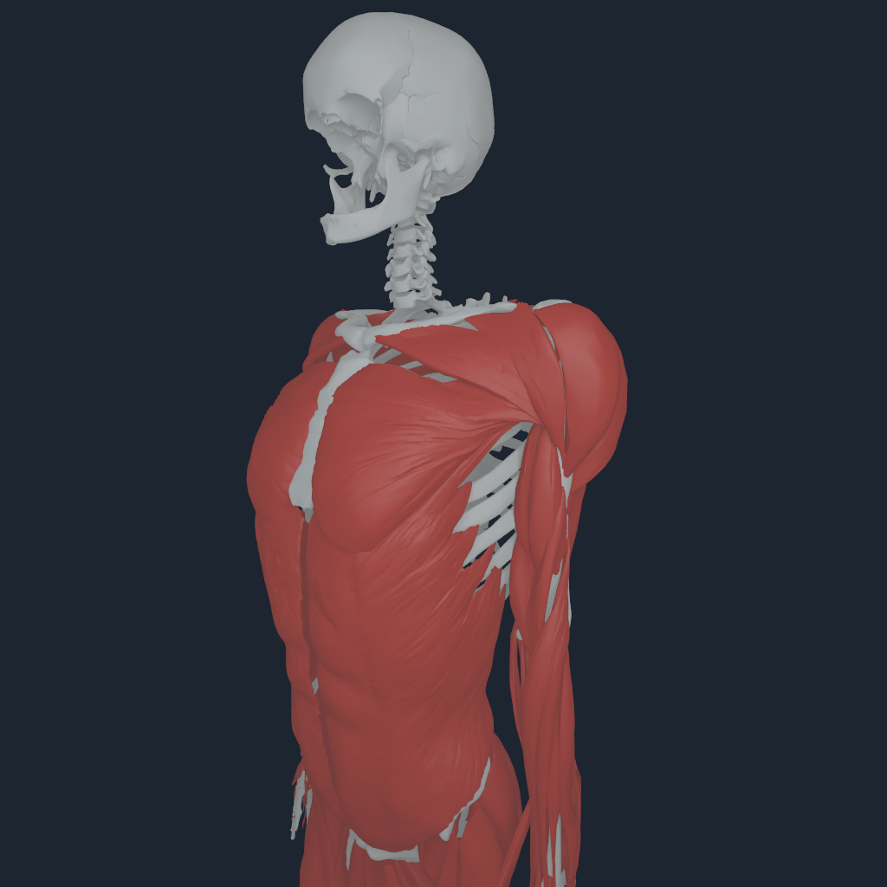
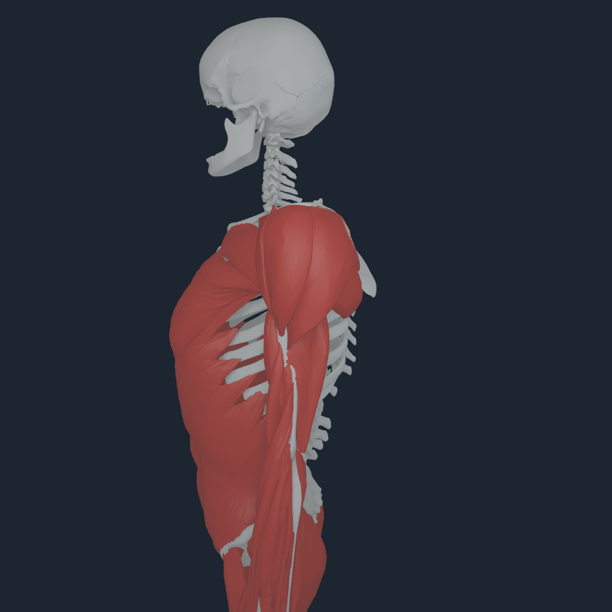
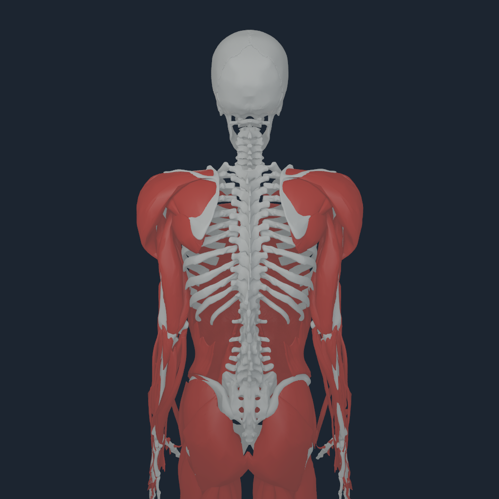

# Source-owned sternal girdle completion v1

## Outcome

The neutral shoulder-girdle opening in prior renders was not a clavicle-fit
problem. Both clavicles were already within 0.9--1.7 mm of the exact
BodyParts3D manubrium position. The visible defect had two causes:

- the exact BodyParts3D manubrium (`FJ3290`) was absent from `NHBONES1`; and
- a soft-tissue site refinement had translated the sternum body 53.079 mm
  away from the common BodyParts3D skeletal frame.

The new registration restores the sternum body to the pinned common frame and
adds the exact manubrium on the existing MyoSim `torso` body. It does not move
either clavicle, edit vertices, add a joint, or create substitute geometry.
The native skeleton now contains 185 exact BodyParts3D bone meshes.

## Fail-closed gates

| Gate | Result |
| --- | ---: |
| manubrium to sternum body | 0.106 mm / 2.000 mm maximum |
| manubrium to left clavicle | 0.865 mm / 4.000 mm maximum |
| manubrium to right clavicle | 1.726 mm / 4.000 mm maximum |
| bilateral sternoclavicular gap difference | 0.860 mm / 2.000 mm maximum |
| clavicle transforms | 0 |
| new joints | 0 |
| tendon endpoint laws after recompilation | 832 / 832 |
| distributed / point laws | 638 / 194, unchanged |

The exact generated NHTENDON3 pair retains 18 explicit migrated rigid-foot
envelopes, the prior 76.683% distributed coverage, and the prior maximum
endpoint migration. This proves that restoring visual sternal ownership did
not silently rewrite the mechanical endpoint laws.

```bash
PYTHONPATH=src python3 -m numilab_human.cli \
  myosim-sternal-girdle-registration \
  --sources sources \
  --registration Build/anterior-thorax-composite-v3.registration.json \
  --output Build/sternal-girdle-v1.registration.json

PYTHONPATH=src python3 -m numilab_human.cli \
  myosim-bodyparts-bone-payload \
  --sources sources \
  --registration Build/sternal-girdle-v1.registration.json \
  --output Build/sternal-girdle-v1-bones
```

## Apple M4 Pro visual review

The four 1024 px frames are native Metal renders of the exact 185-bone payload
with its registration-matched 150 BodyParts3D muscle surfaces. Front,
oblique, side, and rear views show the source manubrium occupying the former
central void and joining the unchanged clavicles without a floating bone
block or left/right swap.

<p align="center">
  
  
  
  
</p>

A current NHTENDON3 selected-pectoralis transaction also completed on Apple
M4 Pro with all 832 transfers, 638 envelopes, 194 exact point fallbacks,
bitwise replay, consumer-rejection rollback, and no direct rigid-state effect
from the borrowed diagnostic consumer. Its single-step acceleration is not a
standing or physiological stability certificate.

## Evidence boundary

This is exact source geometry, rigid ownership, neutral surface continuity,
and executable tendon-law preservation. It does not implement the
sternoclavicular disc, articular cartilage, costoclavicular or
sternoclavicular ligaments, compliant contact, or subject-specific shoulder
calibration. Those remain mechanics work rather than geometry-placement work.
