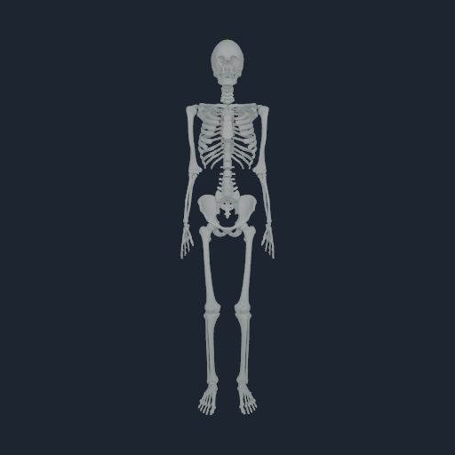

# Source support stance

Native commit `fab76fe9e0445893ef7a81bc2ddf0a2fd2f3cd58` closes the static gravity
wrench for the ten retained NHCNT1 witnesses. It does not close whole-body
equilibrium or sustained standing. The independent source check also exposes a
remaining distinction between those witness points and the complete capsules.

The native offline compiler now fits an explicit contact manifold using current
point Jacobians and exact NHEQ1 equality derivatives. It admits bounded scalar
independent joints and explicit root translations, checks every witness and
source joint limit, and leaves accepted output unchanged on failure. Quaternion
rotation and direct edits to equality dependents are rejected. The ground stays
fixed; the fitted root position is an initial condition, not a runtime force.

The [source profile](../config/myosim-support-stance.v1.json) binds all payload
hashes, six named foot witnesses, and bilateral ankle, subtalar and MTP
coordinates. The search permits 20 mm of root-z placement and 0.1 rad at each
foot joint. These are explicit search bounds, not measured calibration. The
actual fit lowers the previously ground-aligned root by 1.416 mm and rotates
the ankles approximately 0.01249 rad. Two Newton iterations fit the selected
witnesses to within 3.2e-13 m in the native FP64 model.

| Check | Measured result | Scope |
|---|---|---|
| Static gravity wrench | Six contacts carry 952.864475209 N against 952.864477038 N; maximum floating-root generalized-force residual 1.8292e-6 | NHCNT1 point support, exact replay |
| Airborne witnesses | Four separated witnesses carry exactly zero force | Current compiled pose |
| Internal equilibrium | Normalized RMS 12.0072, `internal_balanced=false` with activation cap 1 | Still open |
| Independent source wrench | Maximum force residual 2.8383e-5 N and moment residual 1.8777e-5 Nm | Pinned MuJoCo 3.12 kinematics, native FP32 initial pose |
| Independent source witness gap | Minimum -0.0561 micrometres | Within the native one-micrometre roundoff bound |
| Complete source capsule gap | Minimum -1.6391 micrometres | **Fails** that bound; full primitive contact remains open |
| Matched 6.4 ms native horizon | Maximum generalized velocity change 0.585423, versus 2.17837 before this placement | Default 0.5 activation cap; exact replay, no assistance |
| Native dynamic limits | Fifth-finger flexion reaches -0.002582 rad beyond its lower stop | Legacy path does not implement joint-limit contact; not a standing certificate |

Generalized maxima mix coordinate units and are not whole-body speeds. Increasing
the activation cap to 1 improves the static recruitment objective but does not
solve dynamics: the left knee reaches -0.003330 rad in 6.4 ms. Those runs and a
rejected request exceeding the probe's 64-step bound are retained. The source
passive-coordinate experiment remains separate because its forces are not part
of this native standing horizon.

The independent oracle checks source Python/XML/config files against the pinned
archive, converts native root COM coordinates to the source body-origin frame,
and performs no source dynamics stepping. An initial incorrect root-frame
comparison is retained as rejected evidence. The corrected comparison shows why
fitting fixed witness points cannot certify complete curved contact primitives.

## Reproduce the native static certificate

From the Human checkout on the Mac mini:

```sh
PYTHONPATH=src /opt/homebrew/bin/python3.13 -m numilab_human.cli support-stance \
  --input /Users/n/human-completion-20260907/input \
  --runtime-build /Users/n/MetalRobo-human-completion-build-20260907 \
  --output Build/support-stance-new-run
```

Use Python >=3.11 and a new output directory. The command verifies source hashes,
records the native revision, patch, executable/library hashes and both replay
geometry checks, and independently sums contact forces. It returns
`wrench_only_passed`; standing and walking flags remain false. Python launches
one offline native certificate and does not step physics.

The [receipt](media/support-stance-20260908/receipt.json),
[native certificate](media/support-stance-20260908/qualified-certificate/receipt.json),
[source oracle](media/support-stance-20260908/source-oracle.json), and
[local verifier](media/support-stance-20260908/verify_support_stance.py) retain
the measured boundary. Native analytic tests cover bounded placement, rotated
planes, obstructing witnesses, exact equality tangents, dependent joint limits,
invalid selections, output preservation and replay. Removing the equality
tangent makes the analytic regression fail; restoring it passes. Two native
CTest checks pass. Python 3.14.6 passes 185 tests with seven skips.

## Remaining work

Resolve current-pose source capsule contacts in the existing contact owner,
complete internal muscle/fibre/tissue equilibrium, and carry the identical
prepared state through NumanX v5 and tissue registration. Source joint limits,
contact and NHEQ2 must share that accepted physical transaction. The legacy
NHEQ1 visual horizon cannot supply sustained behavior evidence.

The two earlier costal callback timeouts remain unresolved. Another NumiVivo
workload continued throughout this pass; no heavy costal retry was presented as
requalification, and no callback deadline or physical tolerance was relaxed.
Standing/recovery control, accepted-root behavior metrics, the frozen 420-trial
gate, independent calibration and performance qualification remain open in the
[completion plan](STANDING_WALKING_COMPLETION_PLAN_20260908.md).


