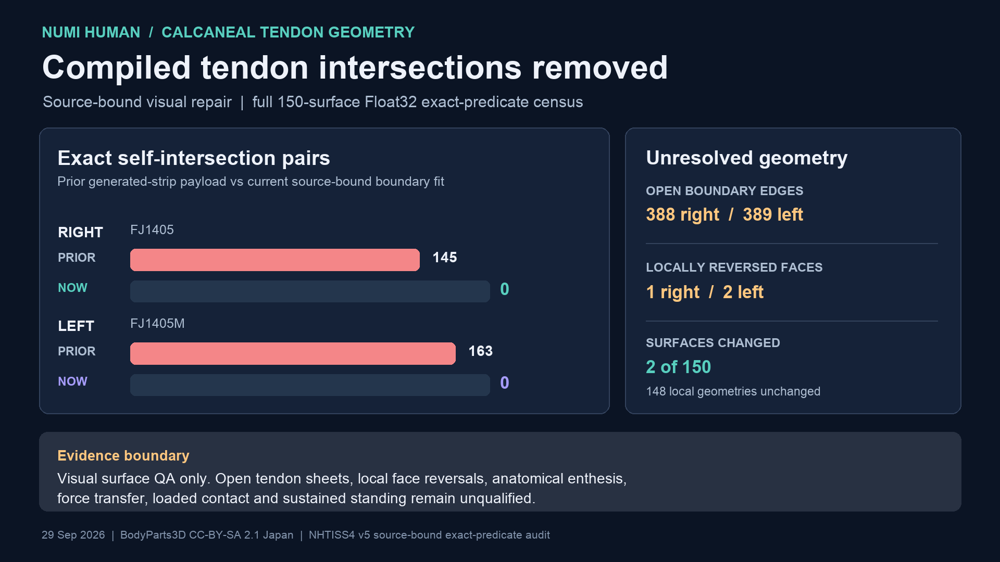

# Calcaneal tendon visual boundary repair — 29 September 2026

The prior compiled right and left calcaneal tendon sheets had **145** and
**163** exact Float32 self-intersection pairs. The broad 5 mm insertion inset
and generated terminal strip were responsible: their source sheets before
that projection had no exact self-intersections. The new importer fits only
the opened distal source boundary to each named calcaneus at a 0.35 mm visual
inset, then distributes displacement over nearby source edges with a local
harmonic field. It emits no terminal strip.

The complete 150-surface CPU rebuild, not a synthetic fixture, now has **zero
exact intersections in both compiled tendon sheets**. The independent
[delta receipt](media/tendon-harmonic-boundary-20260929/receipt-v1.json) joins
the old and new source/member identities, payload hashes, exact-predicate
scans and byte ranges. Only stable IDs 7 and 8 change. The other 148 local
vertex records and face-index sequences, all body-binding bytes, the native
ABI and the registered source identity remain unchanged. The two new face
index streams are exact prefixes of their predecessors: 64 and 66 generated
strip faces were removed, along with 35 and 36 strip vertices.



| Compiled tendon | Prior exact intersection pairs | Current pairs | Current open boundary edges | Source faces with reversed normal |
| --- | ---: | ---: | ---: | --- |
| Right `FJ1405` | 145 | **0** | 388 | 1 (`10`) |
| Left `FJ1405M` | 163 | **0** | 389 | 2 (`10`, `38`) |

The boundary moves by at most 3.251 mm right and 2.725 mm left to reach the
named bone. Maximum source-edge stretch is 2.284× right and 2.256× left;
the respective 99th percentiles are 1.024× and 1.028×. Trials over 0.05–0.8
mm inset and 3–60 mm smoothing radius did not remove every local normal
reversal while retaining the bone-seated boundary. The emitted payload retains
the exact-intersection gate, and the manifest records each reversal. Both
sheets remain **open**; neither is an embedded tendon volume or a certified
anatomical attachment. The all-surface census still has two other open,
intersecting muscle surfaces and 62 closed but intersecting surfaces.

The matching [v3 full census](media/muscle-surface-embeddedness-20260929/receipt-v3.json)
checks all 150 surfaces with the same exact predicate used for v2. Focused
synthetic fail-closed tests and existing tendon tests pass. No native rendered
view or 10-second standing run was produced from this payload while another
solver job owned the GPU. This repair is kinematic visual geometry only; it
does not alter MyoSim routes, tendon force, contact, tissue material, or the
previously dated board video. Clinical enthesis position, watertight topology,
local orientation, force transfer and sustained standing remain open.

Reproduce the delta audit after building the pinned old and new payloads and
their full exact-predicate scans:

```sh
.venv-mujoco312/bin/python \
  Docs/media/tendon-harmonic-boundary-20260929/create_receipt.py
```
