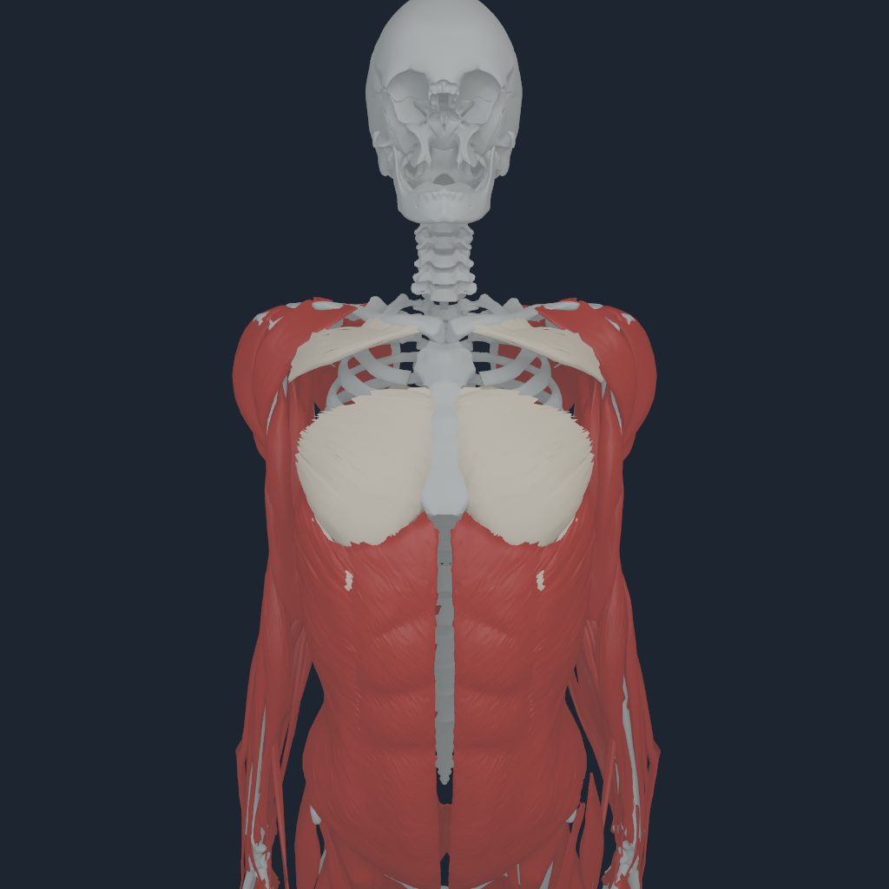
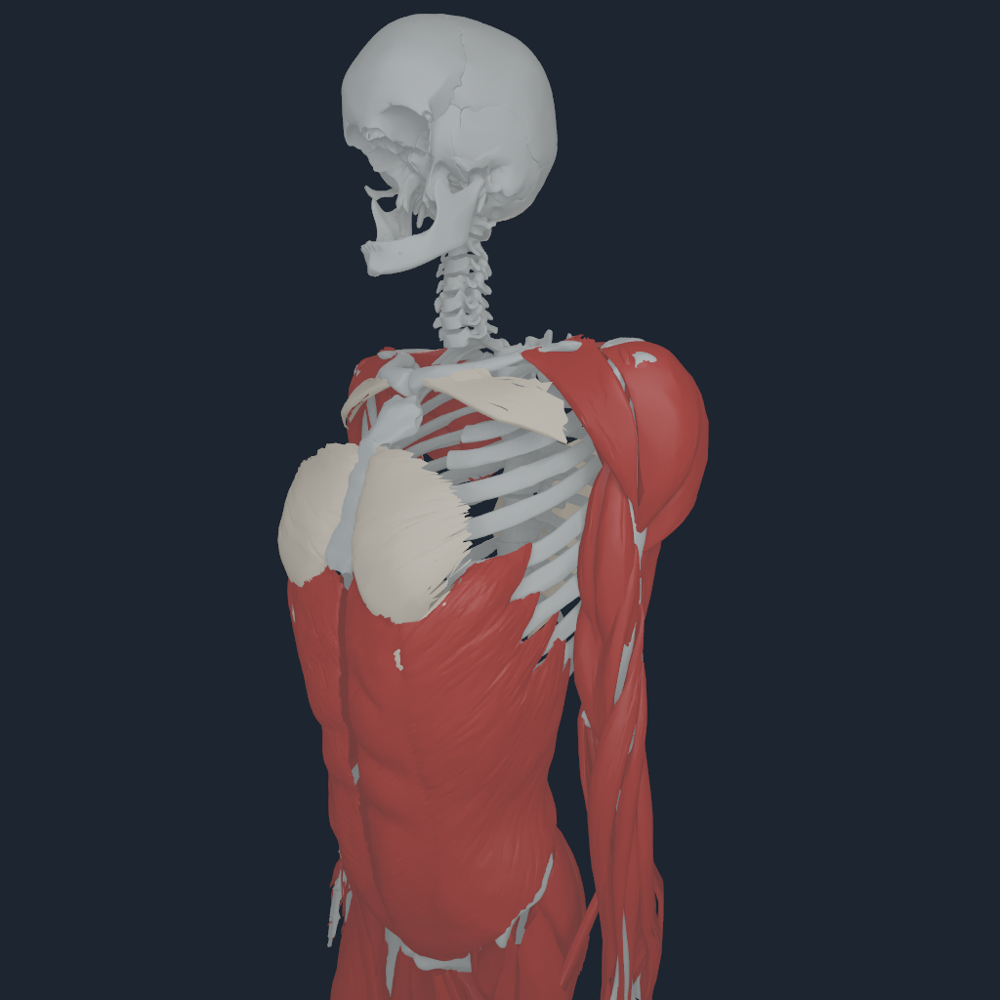
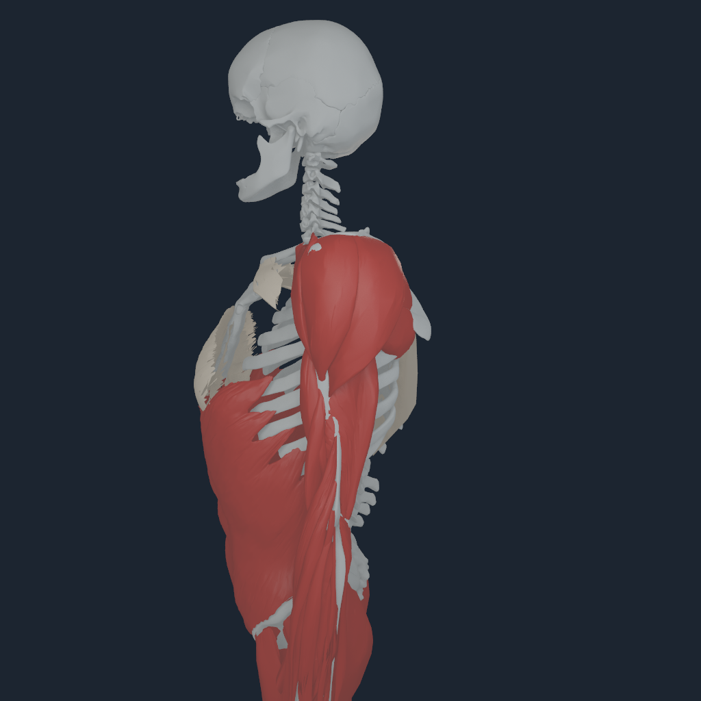
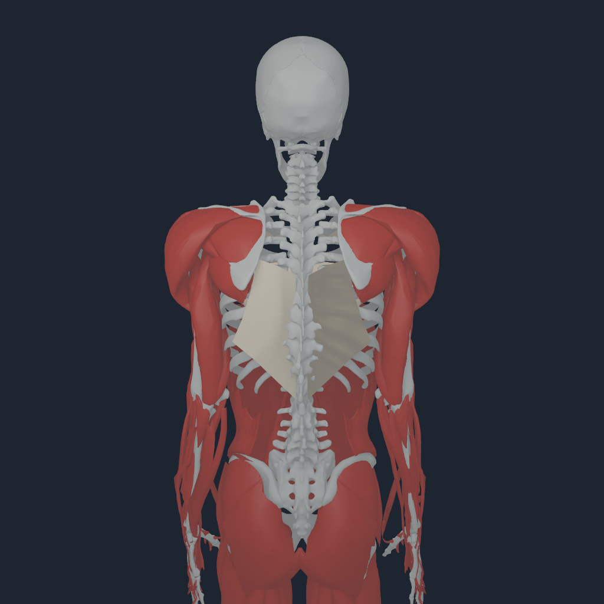

# Thoracic myofascia mechanics v3

## Outcome

`NHFASC3` extends the live pectoral continuum to the six bilateral MyoSim
`LAT1`/`LAT2`/`LAT3` chest endpoints. The posterior regions are not attached to
an invented bone surface. They are thin-solid latissimus-aponeurosis strips
whose centre lines are the pinned P4/P5/P6 sites on source body 25. Adjacent
slips share midpoint boundaries; only the superior and inferior outer edges
are extrapolated.

The combined payload contains 12 regions, 866 nodes, 1,623 positive
tetrahedra, and 8,833 presentation triangles. The posterior mesh subdivides
the broad source lattice into 8 longitudinal by 4 transverse cells per slip.
Its 1.75 mm thickness uses a published healthy mean. The anterior six regions
retain the exact compiler-selected BodyParts3D pectoralis presentation
topology and 0.6 mm mechanics thickness.

## Force ownership

MyoSim remains the only full-body muscle and rigid `J^T` authority. In the
same owning Metal command buffer, the Matter consumer:

1. reads the borrowed NHTENDON3 terminal-force buffer;
2. applies the declared 10% share to the FEM load boundary;
3. removes exactly that share from the chest terminal's source `J^T` term;
4. advances fixed nodes with body 25;
5. projects accepted fixed-node reactions through the same body Jacobian; and
6. commits or restores Human and FEM state together.

The posterior material is a deliberately reduced isotropic proxy. Human
thoracolumbar fascia is anisotropic, while Matter does not yet carry a
per-tetrahedron fibre frame. The proxy therefore pairs its 10% force ownership
with 10% of the 150.9 MPa population-mean tensile modulus. This preserves the
first-order force/stiffness strain scale without pretending that the current
isotropic solve is the measured directional law. The anatomical basis is the
[human latissimus cadaver study](https://pubmed.ncbi.nlm.nih.gov/11415812/),
the [thoracolumbar-fascia anatomy review](https://pmc.ncbi.nlm.nih.gov/articles/PMC3512278/),
and the [human TLF tensile study](https://pubmed.ncbi.nlm.nih.gov/38598370/).

## Apple M4 Pro qualification

The exact qualification payload SHA-256 is
`45c04bcc81d850c52631385b0ee01ee5ec5532ad9cf010535a0234143e88ee2c`.
It ran with the current 185-bone registration, 150 source-tissue surfaces,
416 muscle routes, 832 NHTENDON3 endpoints, 51 joint equalities, gravity, and
source foot support.

At a 0.1 ms step and 2% bilateral pectoral/latissimus activation increment:

- 10.579 N entered the 12 continuum regions;
- fixed-node reaction L1 was 1.757 N, with a 0.312 N maximum node reaction;
- maximum FEM displacement was 0.0914 mm;
- minimum determinant was `J = 0.996633`;
- Human state differed from source-only `J^T` by `7.18e-9` maximum q and
  `7.18e-5` maximum v;
- all 832 transfers completed with 641 distributed envelopes and 191 exact
  point laws; and
- Human/FEM replay was bitwise and downstream rejection restored the prior
  accepted state exactly.

A 20% activation increment also passed at a 10 us step: 61.692 N applied,
3.282 N anchor-reaction L1, 0.00841 mm displacement, `J = 0.997220`, five
FGMRES iterations, bitwise replay, and verified rollback. The same increment
at 0.1 ms was rejected by the nonlinear-deformation gate; it is not an
admitted operating point.

  
  
  
  

All four 1024-pixel views have nonzero fascia coverage. Visual inspection found
bilateral posterior coverage without an exploded mesh, inversion, or a side
swap. The beige surfaces are mechanics-debug presentation, not skin or a
photoreal fascia layer.

## Evidence boundary

BodyParts3D 4.0 has no separately segmented latissimus or thoracolumbar-fascia
OBJ in the pinned English part tables. The posterior geometry is therefore a
source-path-derived mechanics fallback, not clinical segmentation. Strip
width, outer extrapolation, interpolation, tetrahedralization, fixation band,
10% load ownership, and reduced isotropic material are declared assumptions.
There is no rib/skin contact, subject calibration, biaxial fit, failure law, or
long-horizon controller qualification. The visible inferior pectoral edge is
still an exact source-surface presentation over a coarse internal envelope;
this checkpoint does not claim that contact-supported visual gap is solved.
