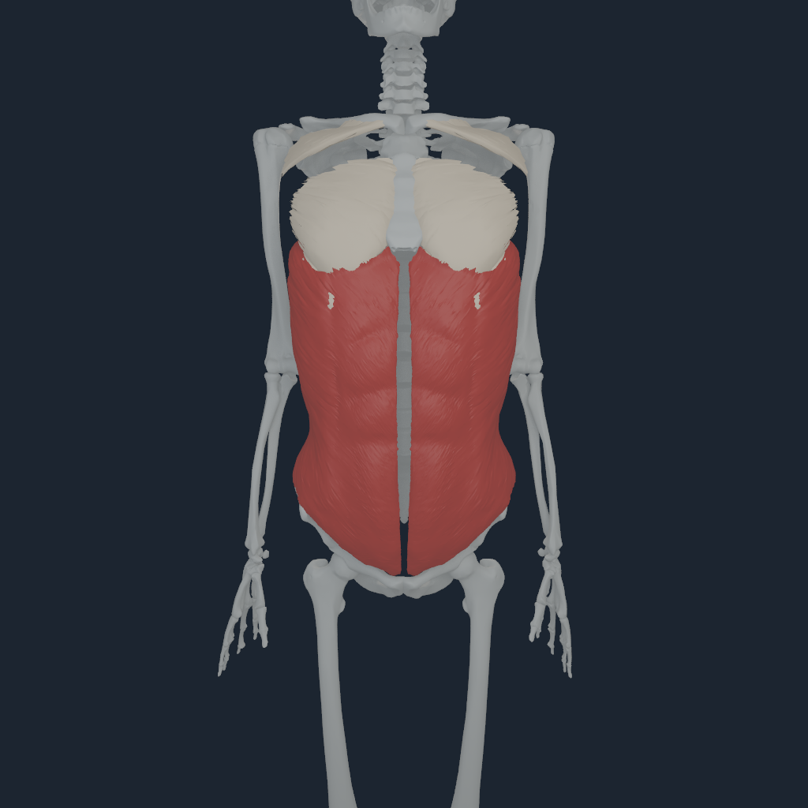
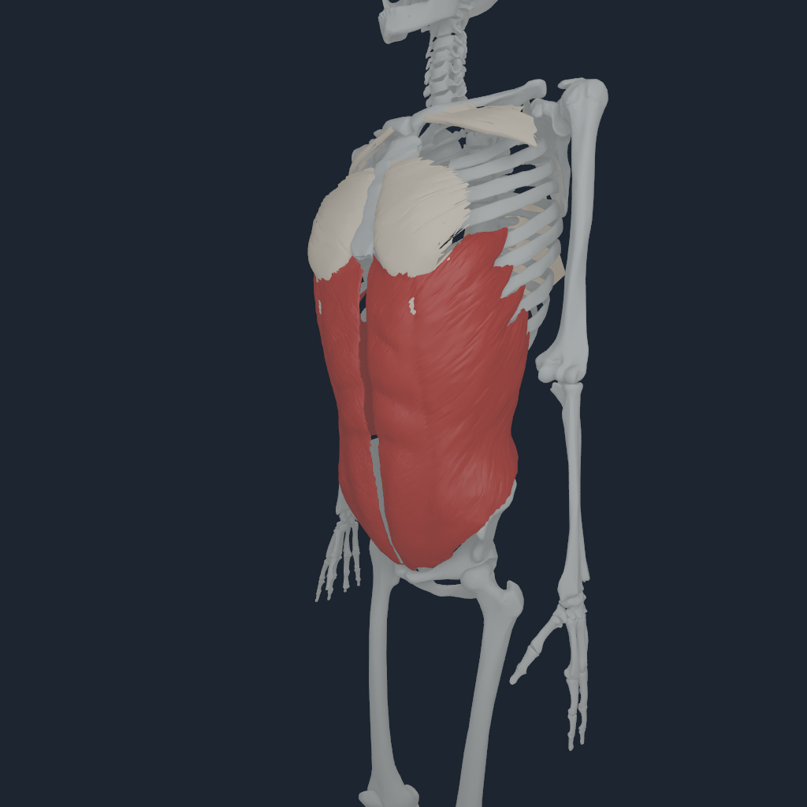
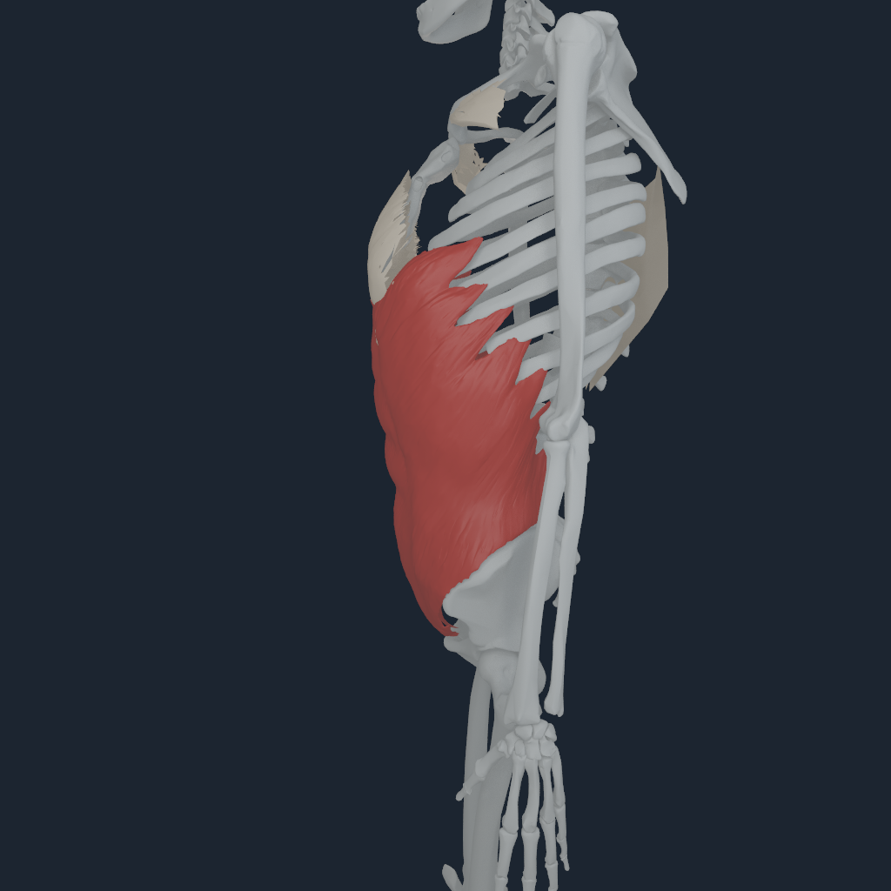
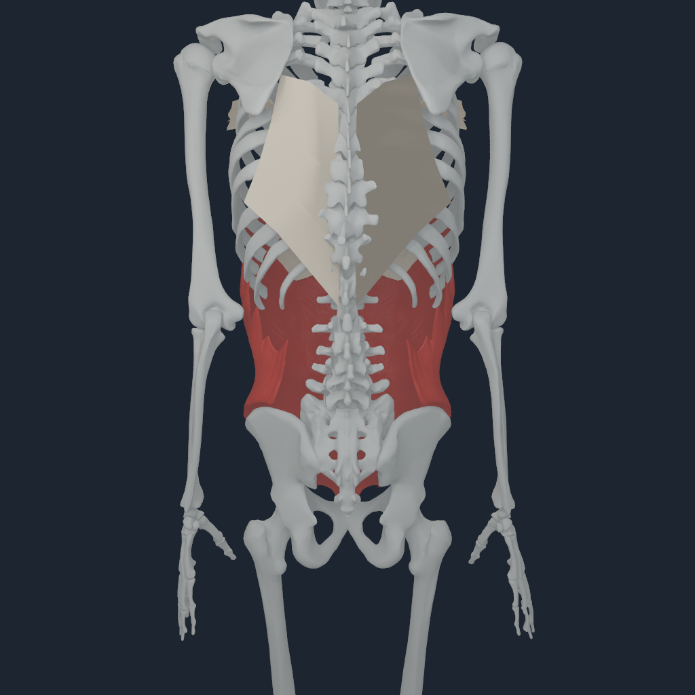

# Thoracoabdominal myofascia mechanics v4

## Outcome

`NHFASC4` extends the live same-command-buffer Human/FEM owner from the six
pectoralis and six latissimus regions to all fourteen remaining Abdomen-body
external- and internal-oblique terminals. The payload now contains 26 driven
regions, 1,202 nodes, 2,127 positive tetrahedra, 212 moving attachment nodes,
and 212 traction nodes.

Every abdominal terminal remains at its exact pinned MyoSim local coordinate.
The bilateral coordinates must mirror, and adjacent source-lattice cells must
share their y boundary exactly. The runtime replaces, rather than duplicates,
the declared 10% anchor-side `J^T` share and projects the accepted prescribed-
node reaction through the owning body Jacobian.

## Anatomy and evidence boundary

BodyParts3D supplies exact bilateral external-oblique surfaces (`FJ1452` and
`FJ1452M`). It does not supply a separately named internal-oblique surface in
the pinned English hierarchy. Z-Anatomy is derived from BodyParts3D and did not
provide a demonstrated superior accessible segmentation for this missing
layer. The mechanics compiler therefore uses the exact MyoSim Abdomen-terminal
lattices for both layers, with published population thickness proxies of
4.5 mm for external oblique and 6.0 mm for internal oblique.

The rectangular terminal-lattice cells are efficient mechanics envelopes, not
anatomical presentation geometry. They remain live in Matter but are hidden by
the anatomical renderer. Visible external oblique uses the exact BodyParts3D
surface. Internal oblique remains mechanics-only until a provenance-pinned
segmented surface is available. This avoids presenting inferred FEM cells as
medical anatomy.

Human abdominal architecture and regional fibre direction are supported by
PMCID `PMC3017737` and PMID `15698694`; the population thickness proxy is from
PMCID `PMC12276042`. The current Matter law is still an effective isotropic
10%-ownership reduction. It is not subject-specific anisotropy, a clinical
segmentation, or validated physiological load sharing. Transversus abdominis
is not actuated because it is absent from the source MyoSim actuator set.

## Deterministic payload

```bash
PYTHONPATH=src python3 -m numilab_human.cli \
  numi-human-pectoralis-fascia-payload \
  --sources sources \
  --artifact Build/myosim-fullbody \
  --output Build/thoracoabdominal-myofascia-v4
```

The qualification payload SHA-256 is
`a39916cc3207f8557f47f70dff660ab7f39d98f1279db3354993dd22f8fd3760`.
Compiler replay is byte-identical, all 14 source terminals are asserted, and
every tetrahedron has positive rest volume.

## Apple M4 Pro qualification

The four-step selected-oblique run used 10 microsecond coupled substeps, all
416 MyoSim routes, NHTENDON3, NHEQ1, source foot support, and the Numi Matter
same-command-buffer adapter. It reported:

- 3,328 tendon endpoint transfers, including 2,552 distributed envelopes and
  776 explicit point fallbacks;
- 74.968 N admitted force across the 26 regions;
- 11.036 N maximum and 3.700 N minimum per-step fixed-node reaction L1 across
  all four audited steps;
- 0.0757 mm maximum continuum displacement and minimum `J = 0.997695`;
- 3 FGMRES iterations in the accepted final state;
- nonzero Human-state change relative to source `J^T` ownership;
- bitwise replay and verified downstream-rejection rollback; and
- Apple M4 Pro ownership for both Metal muscle transfer and Matter FEM.

At 100 microseconds the coarse internal-oblique sheet inverted on the second
step. The qualified runtime boundary is therefore 10 microsecond substepping;
the larger step is rejected, not silently presented as stable. Four 1024-pixel
views were also inspected. The initial mechanics-only view exposed false
rectangular lumbar plates; the final renderer suppresses those debug cells and
shows exact bilateral BodyParts3D external-oblique anatomy instead.

<p align="center">
  
  
  
  
</p>
