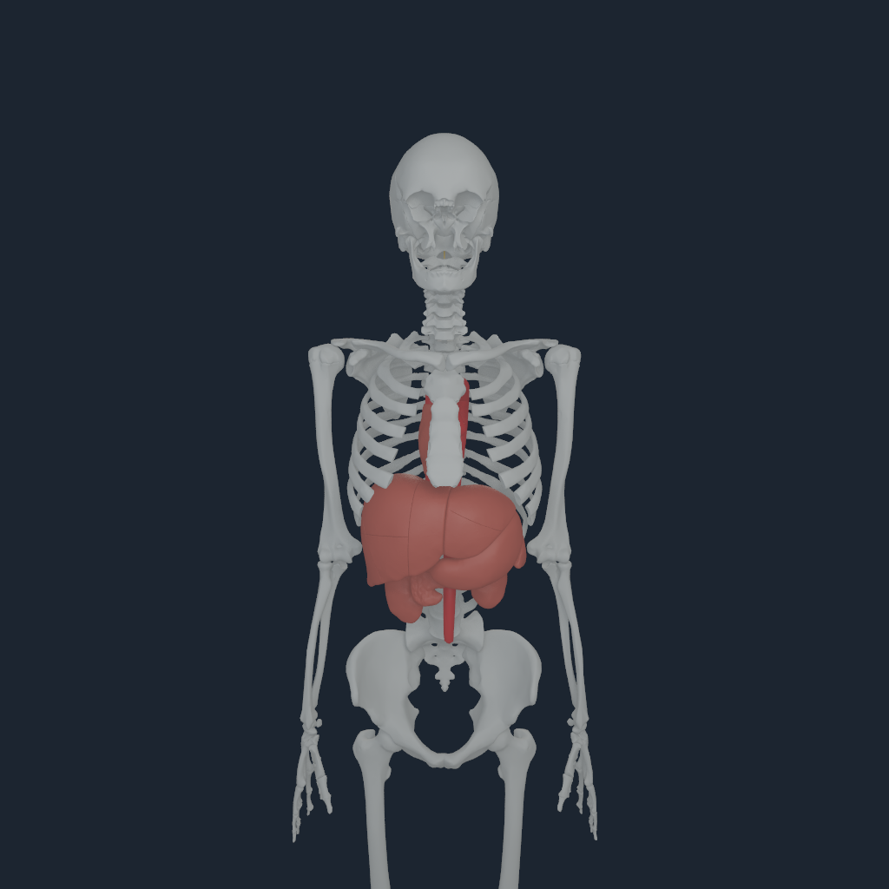
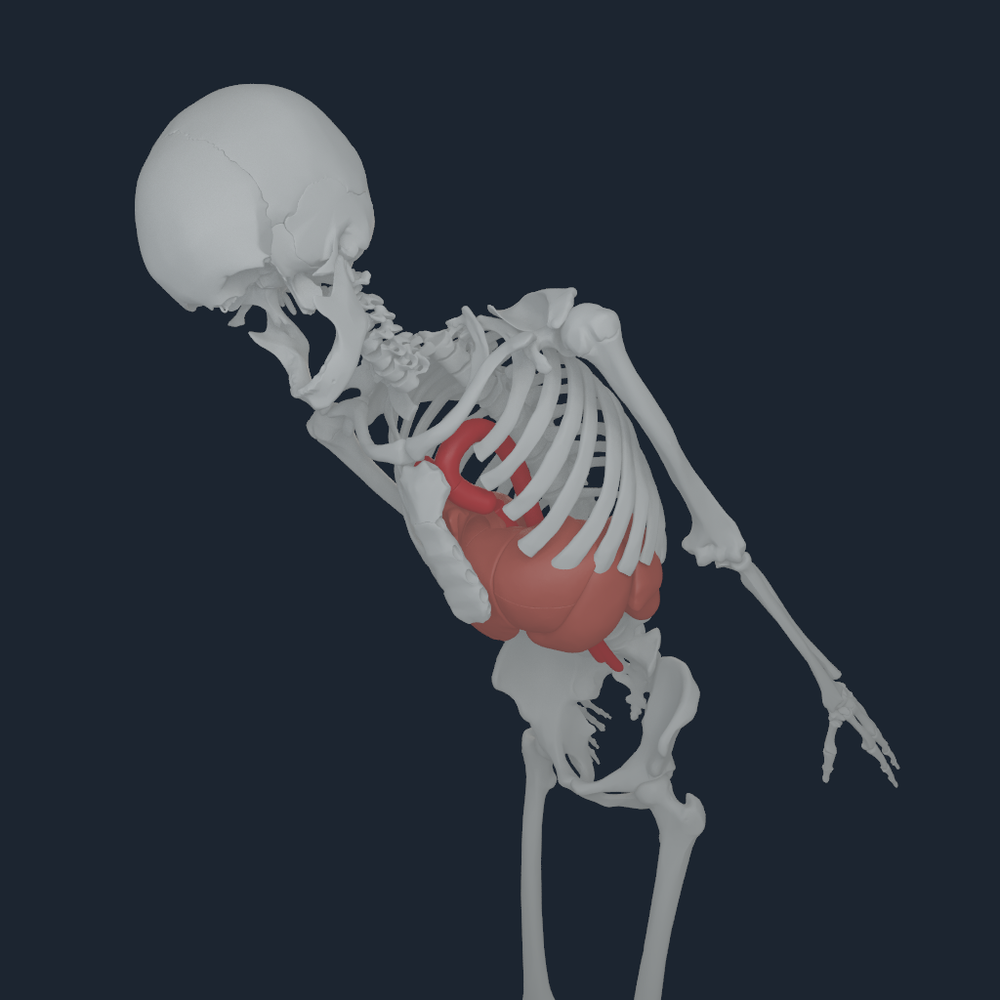

# Native torso organ coverage and source geometry audit

The native anatomical view now adds the retained spleen surface and nine liver
components. The bundle increases from 12 to 22 surfaces and from 21,648 to
92,623 vertices. The first 12 records, vertices and triangle indices are
byte-identical to the previous bundle. The compatibility fingerprint now binds
the current v6 bone registration. Additional surfaces preserve source topology
and use the existing global registration and source inertial-frame conversion.




## Source coverage

| Selection | Representation in this bundle |
| --- | --- |
| Stomach, pancreas, right kidney, left kidney, spleen | Five exact source-named `is_a` representations; mesh completeness remains unqualified |
| Heart | Right atrial wall, FJ2439, under the `heart` part-of ancestor; whole heart remains missing |
| Liver | Nine source components under FMA7197, including caudate lobe and hepatovenous segments; whole-liver completeness remains unqualified |
| Vessels and spinal cord | Six vessel surfaces and one spinal cord surface |
| Lungs | No parenchymal surfaces selected |

Liver members are FJ2816, FJ2818, FJ2819, FJ2820, FJ2821, FJ2822, FJ2409,
FJ2823 and FJ2824. They retain their component type labels in the manifest.
All follow the source `Abdomen` inertial frame; the thoracic selection follows
`torso`. Original surface IDs 1–12 are preserved; additions use IDs 13–22.

The retained right-lung part-of selection contains 156 meshes: 54 arterial,
49 venous and 53 tracheobronchial tree components. The left-lung selection
contains 124: 43 arterial, 36 venous and 45 tracheobronchial tree components.
There are zero exact named-lung `is_a` entries in these retained tables.
These vessels and airways are not substituted for lung parenchyma. This
inventory makes no claim about other upstream datasets. See the hash-bound
[retained lung source inventory](media/torso-organ-coverage-20260929/retained-lung-source-inventory.json).

## Independent native verification

The native inspection client exports the exact COM-centred body poses passed
to its renderer alongside the hashed MRVPACK2. The Python source oracle reads
the native pack's own vertices, normals, triangle indices, semantic identities
and articulated instance owners. It compares them with exact retained OBJ
geometry transformed through independently evaluated MuJoCo source inertial
frames. It does not reuse the compiler's world-to-body transform or its
declared default COM to construct the expected geometry.

The audit validates source archive and OBJ hashes, both source relation tables,
registration and map hashes, payload identity, and every native section hash.
Topology and ownership must match exactly. Geometry uses the existing skin
serialization bound of 20 micrometres; COM position and 1-metre orientation
witnesses use the existing native 1-micrometre rest reconstruction bound.
Normals have separate dimensionless unit and direction checks.

All 22 surfaces and 92,623 vertices pass at raw source rest, equality-projected
neutral and coupled torso coordinates `7=-0.4, 8=0.1, 9=0.2`. Projected poses
also independently satisfy all 51 active source joint equality residuals.
The retained 1024-pixel neutral and posed captures have maximum world vertex
errors of 0.120 and 0.169 micrometres, respectively.

The final focused run passes **29 tests without skips**. Rehashed wrong-owner
and triangle-order corruption are rejected. A 5 mm native vertex shift, changed
normal, 20 mm native COM shift and source-member hash drift fail even when
their surrounding metadata remains valid. Existing compiler checks still
reject a reversed executing knee and a shifted declared torso frame.

Reproduce the neutral source audit with the project Python environment:

```sh
PYTHONPATH=src:Sources/myosim/checkout .venv-mujoco312/bin/python \
  -m numilab_human.torso_anatomy_audit \
  --sources Sources --artifact Build/myosim-fullbody \
  --registration Build/knee-parity-registration-20260929/candidate.v6.registration.json \
  --payload Build/torso-organ-coverage-20260929/final-payload/bodyparts3d-myosim-torso-anatomy.nhanatomy \
  --native-pack Build/torso-organ-coverage-20260929/current-neutral.v2/views/myosim-fullbody-articulated-bodyparts-bones-source-torso-anatomy-focus-body-20.mrvpack \
  --native-poses Build/torso-organ-coverage-20260929/current-neutral.v2/views/myosim-fullbody-articulated-bodyparts-bones-source-torso-anatomy-focus-body-20.torso-anatomy-poses.json \
  --output Build/torso-organ-coverage-20260929/reproduced-neutral-audit.json
```

Use `--raw-source-rest` for a capture without equality projection. Supply the
matching `--pose-q` values for a posed capture. Structural/provenance failures
raise an error; geometric failures return a failed receipt and exit 2.

## Exact increment and limits

Human base revision: `01cc0968cbb6851c69954992aa3e2573cd505111`.
Native base revision: `d1a13a6b48675743fc242d7b7b7f56e2e40b4209`.
The inspection client was rebuilt and linked against the unchanged retained
runtime; no physics runtime or Metal shader was rebuilt.

| Input | SHA-256 |
| --- | --- |
| NHANAT1 payload | `894b796d246ce9b2e320828e2fd2cbd0ad67de56c8e1702676ba653a0c7b5743` |
| Native inspection executable | `e8e447b24636e8a3f0c8c8c641e727cbc4fec3bddc64abb60454a84f486a2bec` |
| Retained native runtime | `6b9062e84bdacd6b86b413d5c549cd0046d9a271fb0caa141e03db41ffa213f6` |
| v6 registration | `0b7129f788ae91272d03abf9f10b985359f3b9d9569941515b222787ffe71324` |

Commands, source snapshots, failed setup attempts, final test output, native
packs and pose exports are retained under `Build/torso-organ-coverage-20260929`.
The compact published [receipt](media/torso-organ-coverage-20260929/receipt.json),
[neutral audit](media/torso-organ-coverage-20260929/current-neutral.v2.audit.json),
[posed audit](media/torso-organ-coverage-20260929/current-posed.v2.audit.json) and
[byte parity](media/torso-organ-coverage-20260929/legacy-surface-byte-parity.json)
bind the evidence to these inputs.

This increment verifies source geometry and single-link visual articulation.
It does not establish organ deformation, contact, force transfer, perfusion,
neural conduction, complete heart/lung/liver anatomy, clinical registration or
whole-body standing qualification. The source-range conflicts documented in
the joint constraint audit remain open and are not changed here.
