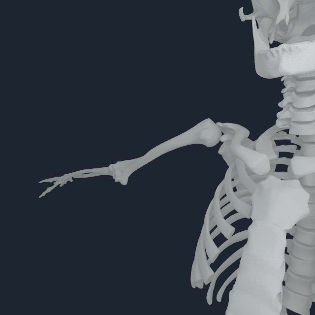
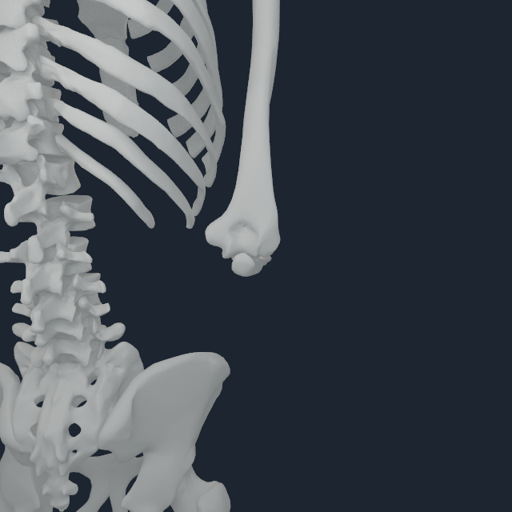
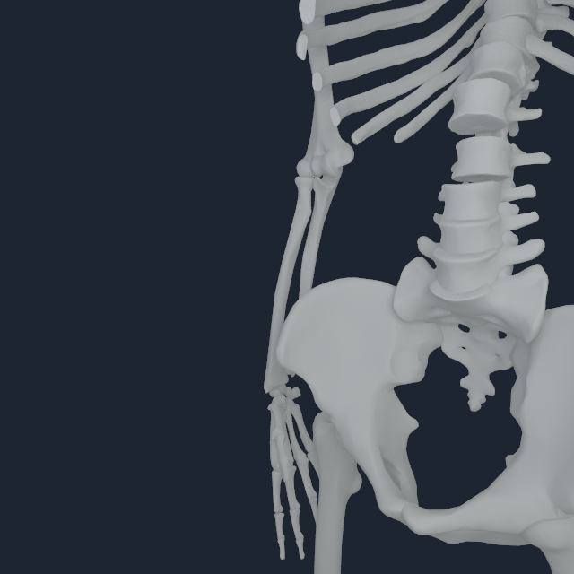
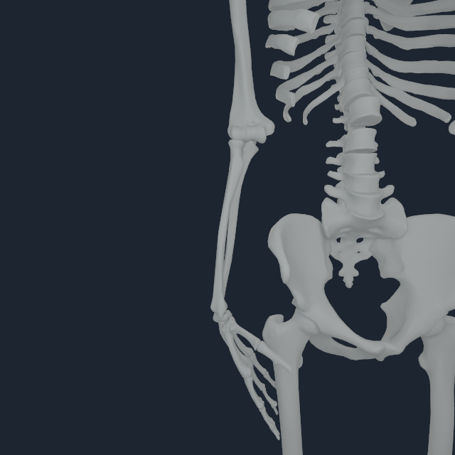

# Upper-limb articular registration v3

## Outcome

The v2 shoulder/elbow/wrist pictures were rejected after direct review.  Their
registration had been compiled before the humeral-head articular-center gate
was active, and its gap-only acceptance thresholds were permissive enough to
show visibly separated joints.  V3 rebuilds all 64 bilateral shoulder-to-digit
members against the pinned source meshes while constraining each humeral head
to the source mechanics axis.

This is a replacement for the v2 visual evidence, not an endorsement of it.

| Default-pose interface | v2 gap | v3 gap |
| --- | ---: | ---: |
| right scapula to humerus | 7.600 mm | 0.421 mm |
| left scapula to humerus | 7.908 mm | 0.336 mm |
| right humerus to radius | 5.400 mm | 0.549 mm |
| left humerus to radius | 5.400 mm | 0.342 mm |
| right humerus to ulna | 0.292 mm | 0.823 mm |
| left humerus to ulna | 0.295 mm | 1.746 mm |

The small elbow increases are accepted because the complete paired surfaces
and source joint frames are being fit together; neither value is a generated
contact patch.  The fitted humeral-head centers are 1.081 mm (right) and
1.289 mm (left) from the source articular centers, with 2.794 mm and 2.610 mm
offsets from the respective mechanics axes.  Both are below the 3 mm center
and 5 mm mechanics-axis gates.

## Direct M4 Pro review

These bone-only frames were rendered from the complete 185-surface payload on
Apple M4 Pro.  They use exact NHEQ1 dependent-coordinate projection.

### Shoulder elevation, q36 = 1.2 rad

<p align="center">
  
  
</p>

### Elbow flexion, q39 = 1.4 rad

<p align="center">
  
  
</p>

### Wrist deviation and flexion, q41 = 0.25 and q42 = 0.6 rad

<p align="center">
  
  
</p>

The six-pose audit covers neutral, bilateral shoulder elevation, elbow
flexion, forearm pronation, wrist deviation/flexion, and a functional fist.
The default-frame reconstruction residual is `1.466e-14 m`.  The worst posed
bone interval remains the left ulna-to-triquetrum interval at 12.596 mm.  That
interval represents the ulnocarpal space where TFCC/cartilage/ligament
geometry is still absent; moving the bones into direct contact would be an
anatomical error.  The machine-readable receipt is
[`upper-limb-articular-v3.audit.json`](media/numi-human-upper-articular-v3/upper-limb-articular-v3.audit.json).

## Reproduction

```sh
numilab-human myosim-upper-limb-registration \
  --sources Sources \
  --registration Build/sternal-girdle-v1-rerun.registration.json \
  --source-audit Build/myosim-source-bone-proximity-v1.json \
  --worklist Build/bodyparts-registration-worklist-v1.json \
  --tendon-manifest Build/articular-similarity-v1-tendon/numi-human-tendon-attachments.manifest.json \
  --output Build/fullbody-articular-v3.registration.json \
  --python .venv-myosim/bin/python

numilab-human myosim-upper-limb-pose-audit \
  --sources Sources \
  --registration Build/fullbody-articular-v3.registration.json \
  --output Build/fullbody-articular-v3.audit.json \
  --python .venv-myosim/bin/python
```

## Evidence boundary

V3 validates articular placement and kinematic continuity of the registered
bone surfaces.  It does not yet qualify loaded cartilage contact, TFCC,
ligament restraint, deformable tendon/fascia, collision, or clinical use.
