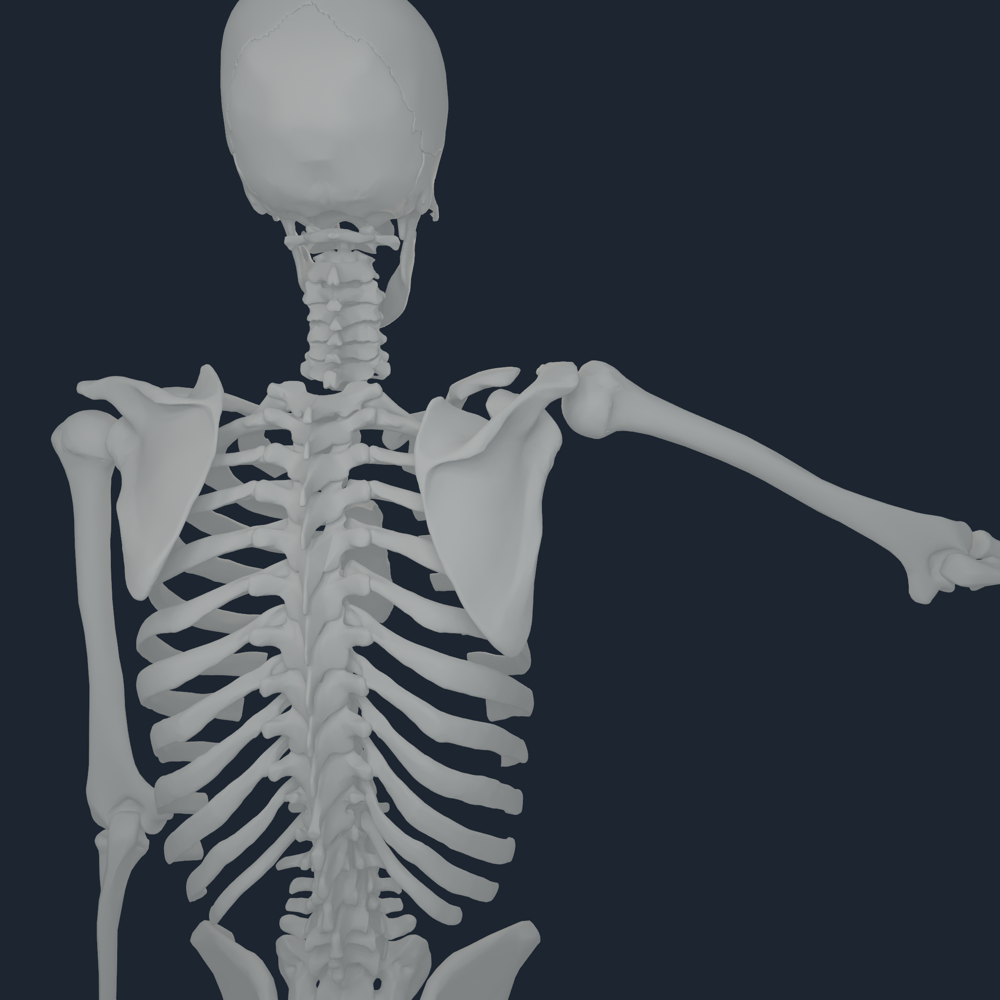
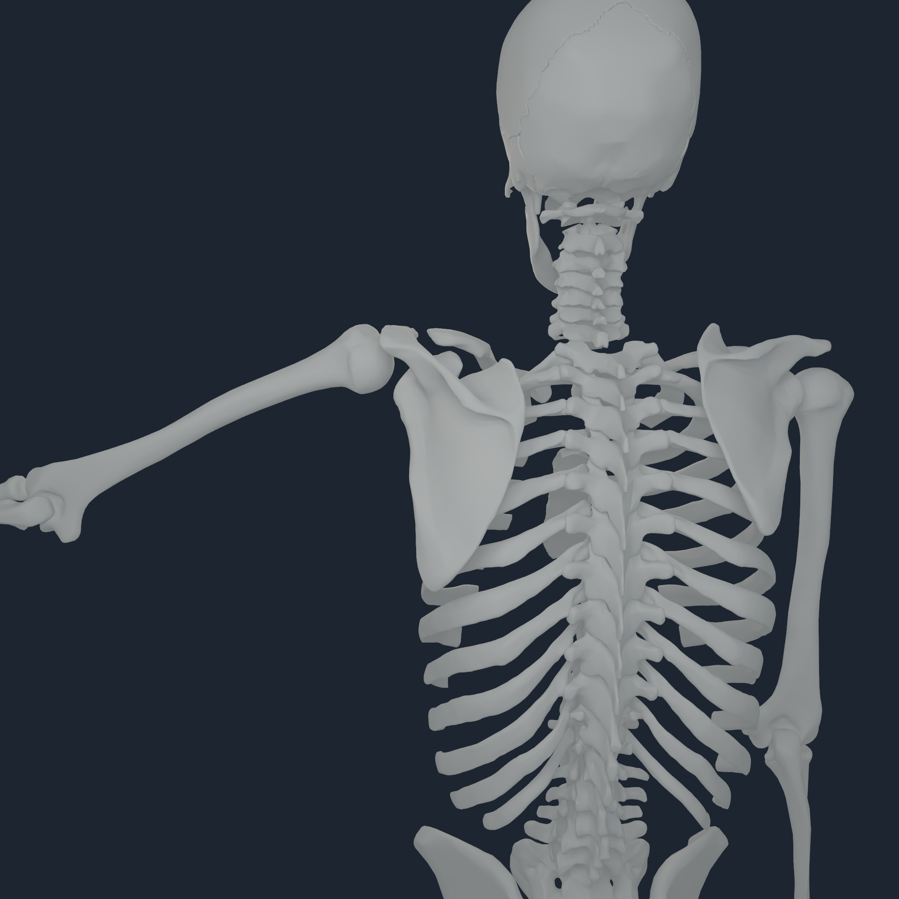
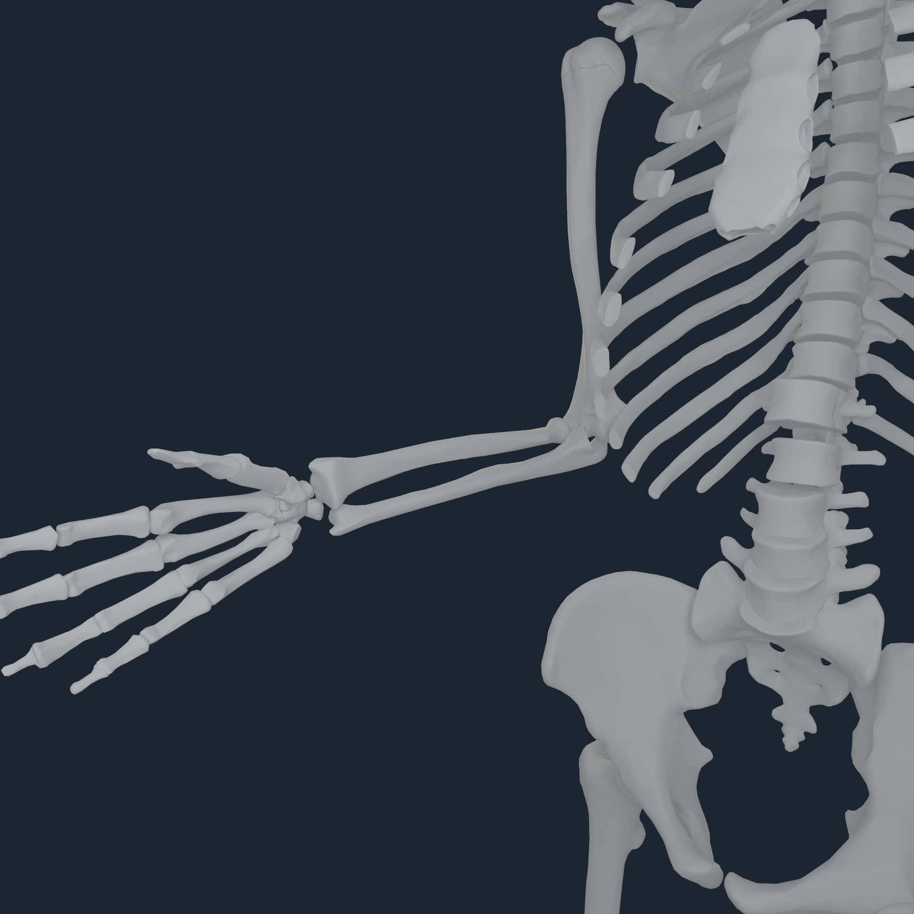
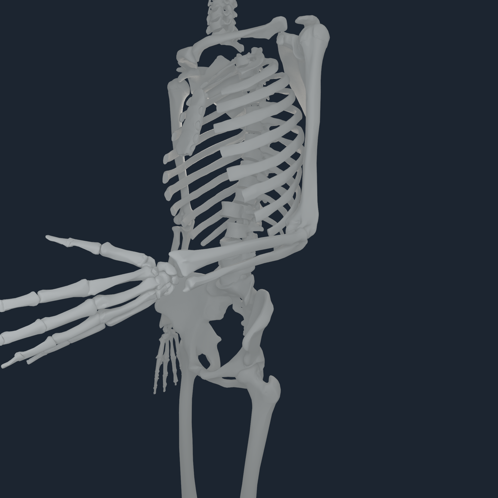
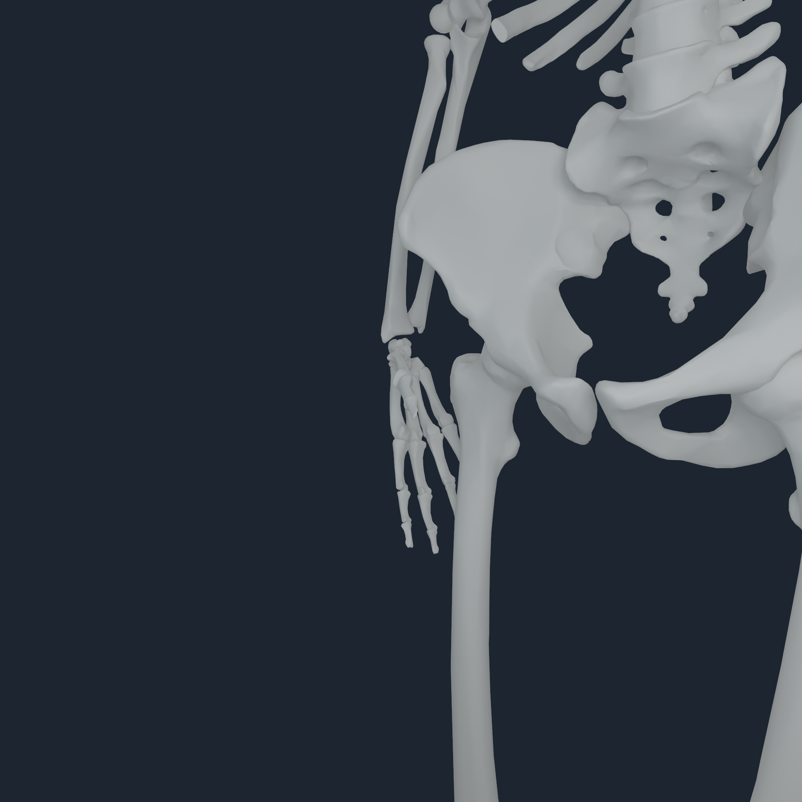
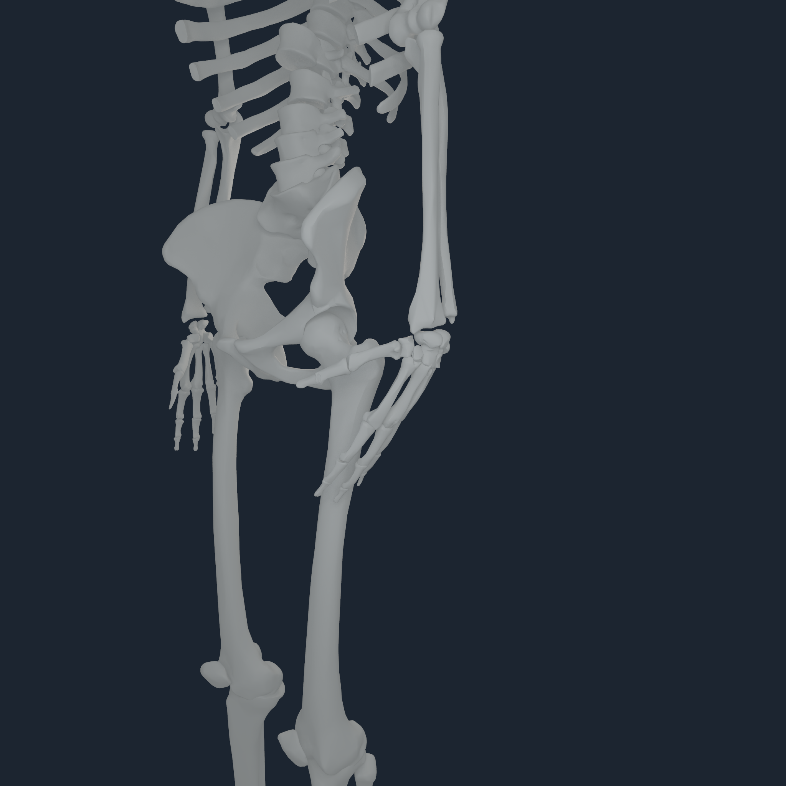
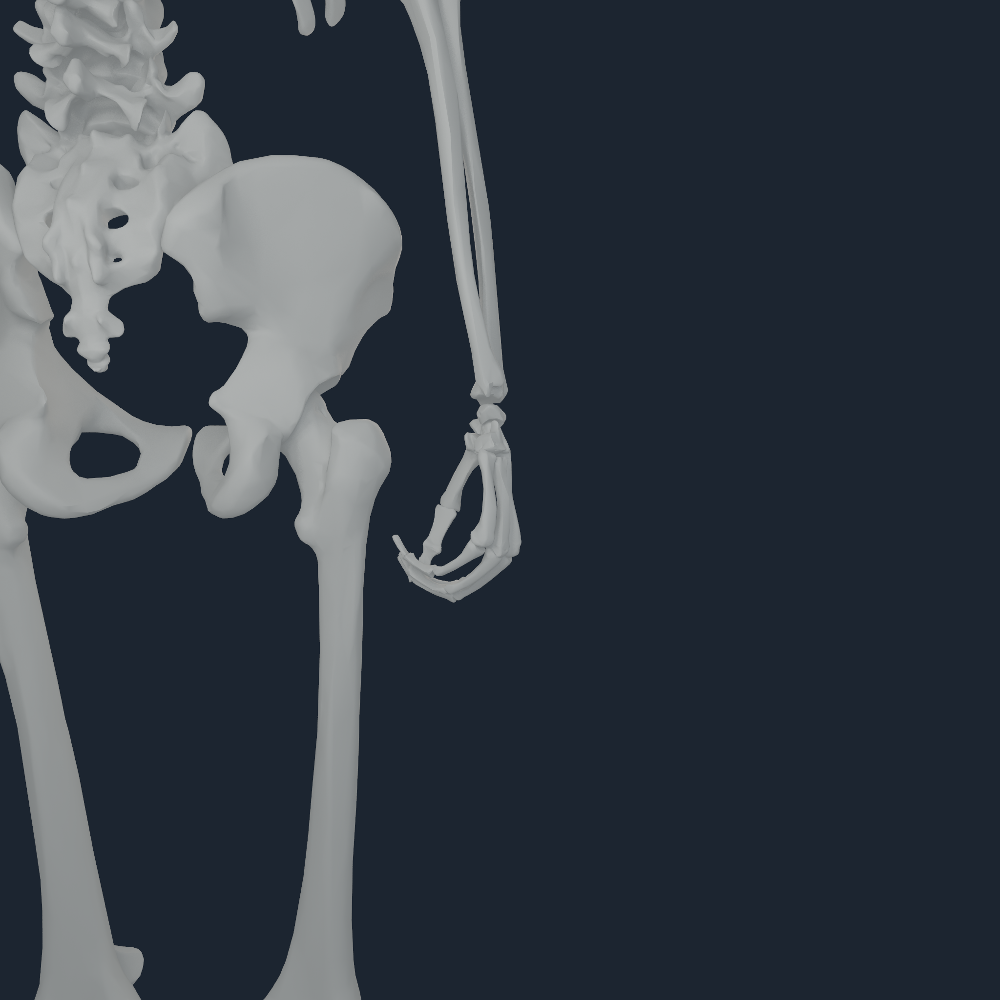
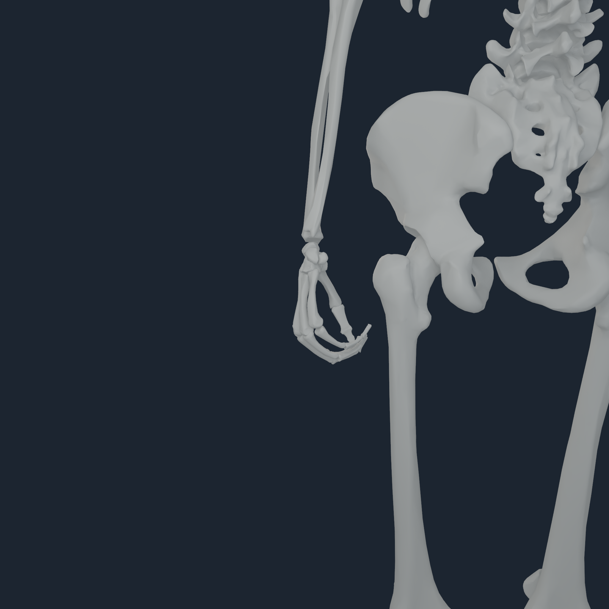
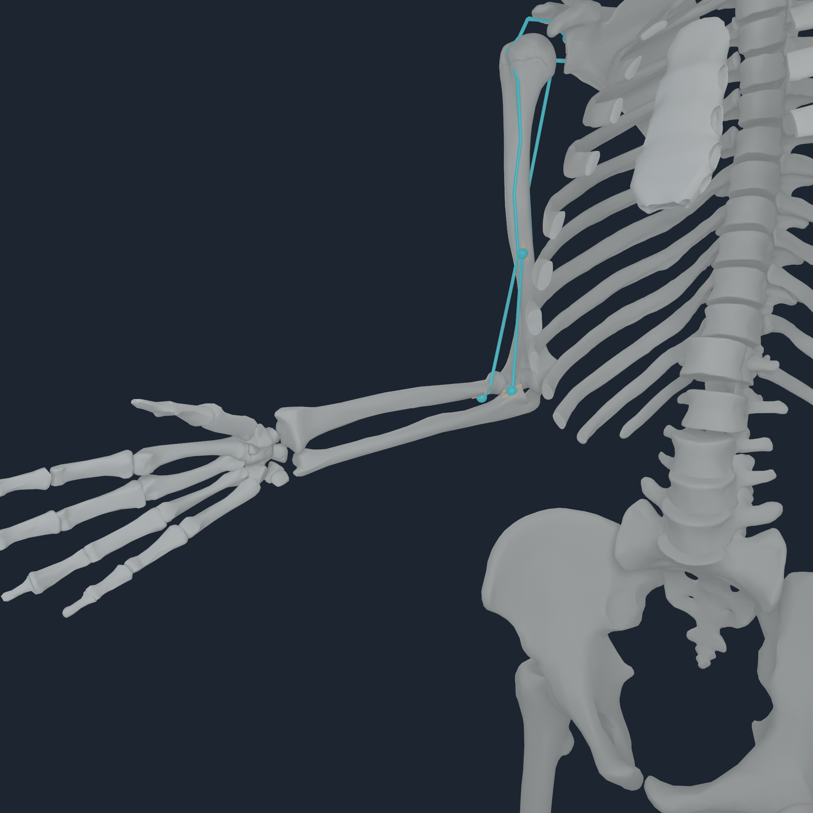

# Upper-limb multi-pose registration v2

> **Superseded and rejected for visual placement.** Direct review found that
> this artifact predated the humeral-head articular-center gate and admitted
> visibly separated shoulder/elbow/wrist views.  Use
> [upper-limb articular registration v3](UPPER_LIMB_ARTICULAR_REGISTRATION_V3.md)
> for current placement and evidence.  The material below is retained only as
> a record of the failed v2 gate.

## Outcome

The bilateral BodyParts3D shoulder-to-finger geometry now has an executable,
fail-closed posed-registration audit instead of relying on neutral screenshots.
The audit reconstructs each admitted mesh in its owning MyoSim body frame,
replays six bounded bilateral source poses, projects all dependent joint
coordinates through the exact source polynomial equalities, and measures the
same 52 shoulder, elbow, wrist, hand, and digit surface transitions in every
pose.

No per-bone visual offset was added. The source-owned geometry passed, so the
right correction was to preserve those transforms and gate them away from the
neutral pose. The native visual probe was also corrected to frame a focused
body from the posed vertices of its rendered BodyParts3D surface. It no longer
uses a mechanics centre of mass that can sit outside a wrist, carpal, or digit
mesh.

| Gate | Result |
| --- | ---: |
| source bodies / source members | 64 / 64 |
| bilateral poses | 6 |
| continuity evaluations | 312 (52 per pose) |
| bilateral parity evaluations | 156 |
| projected source joint equalities | 51 |
| neutral frame maximum centroid residual | 0.0000000000107 mm |
| posed continuity allowance above the admitted rest gate | 1.000 mm |
| worst posed interval | 12.789 / 13.000 mm, left ulna-to-triquetrum |
| worst bilateral gap difference | 1.547 / 2.000 mm, clavicle-to-scapula |

The wrist interval is not asserted to be direct bone contact. It spans the
ulnocarpal region where the current model does not yet implement the TFCC,
cartilage, or ligament contact mechanics.

The machine-readable result is the
[multi-pose audit receipt](media/numi-human-upper-limb-multi-pose-v2-2048/upper-limb-multi-pose-v2.audit.json).

## Direct visual review

These are native 2048 px Apple M4 Pro frames from coupled runtime revision
`6d03b7a`. The
white surfaces are BodyParts3D bones carried by their owning source bodies.
The arm-at-side poses put a hand close to the pelvis in some camera views; that
overlap is pose context, not a hand-to-pelvis parent or registration.

### Bilateral shoulder elevation

<p align="center">
  
  
</p>

### Bilateral elbow flexion

<p align="center">
  
  
</p>

### Bilateral wrist deviation and flexion

<p align="center">
  
  
</p>

### Bilateral functional fist

<p align="center">
  
  
</p>

Visual review covered 80 final frames: five non-neutral pose families, both
sides, four fixed cameras, and separate bone-only and route-overlay passes.
Every frame used `focused_body_source_geometry_bounds`; source extents were
0.0625--0.2404 m. Bone coverage ranged from 259,367 to 2,596,572 pixels. The
40 bone-only frames contained zero route pixels. The 40 diagnostic overlays
contained at least 205,587 route pixels and 11,241 transfer-envelope pixels.

## Tendon and route interpretation

Dense cyan overlays are all requested MyoSim route centrelines, not literal
tendon surfaces. Showing hundreds of routes through a focused camera can make
unrelated lines look detached from the selected joint. That display is useful
for coverage counts but is not suitable as an anatomical beauty render.

The selected right-elbow diagnostic below renders only the long-head triceps,
long-head biceps, and brachialis routes. Cyan is the current-pose MyoSim path;
the small warm/cyan terminal markers are the registered `NHTENDON3`
force-transfer endpoints and envelopes. This is a transfer-law diagnostic,
not a deformable collagen tendon.

<p align="center">
  
</p>

## Reproduction

Run the source audit from the pinned MyoSim/MuJoCo environment:

```bash
numilab-human myosim-upper-limb-pose-audit \
  --sources Sources \
  --registration Build/lower-limb-source-mesh-v2.registration.json \
  --output Build/upper-limb-multi-pose-v2.audit.json \
  --python /path/to/pinned/myosim/python
```

The source q-coordinate suite is neutral, bilateral shoulder elevation,
bilateral elbow flexion, bilateral forearm pronation, bilateral wrist
deviation/flexion, and a bilateral functional fist. The audit rejects missing
or duplicate source ownership, registration-frame drift, out-of-range source
coordinates, joint-equality coverage drift, posed discontinuity, and excessive
bilateral gap asymmetry. Output is deterministic; the direct module run and
the CLI replay were byte-identical.

The curated frame and receipt hashes are in
[checksums.sha256](media/numi-human-upper-limb-multi-pose-v2-2048/checksums.sha256).

## Evidence boundary

Passing proves source ownership, exact default-frame reconstruction, bounded
posed surface continuity, bilateral gap parity, native Metal pose transfer,
and visible coverage for this pose suite. It does not prove cartilage contact,
TFCC or ligament constraints, loaded joint stability, clinical registration,
deformable skin, a deformable tendon continuum, or whole-body balance.
