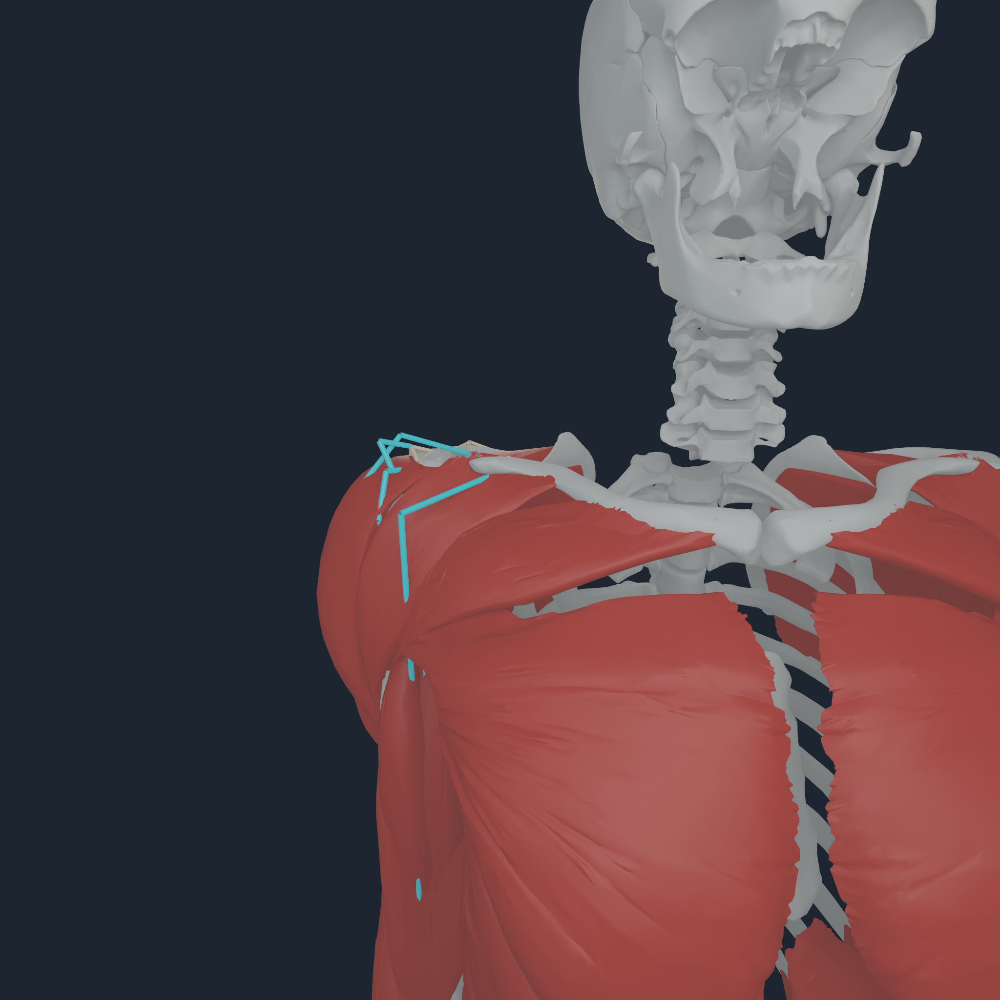
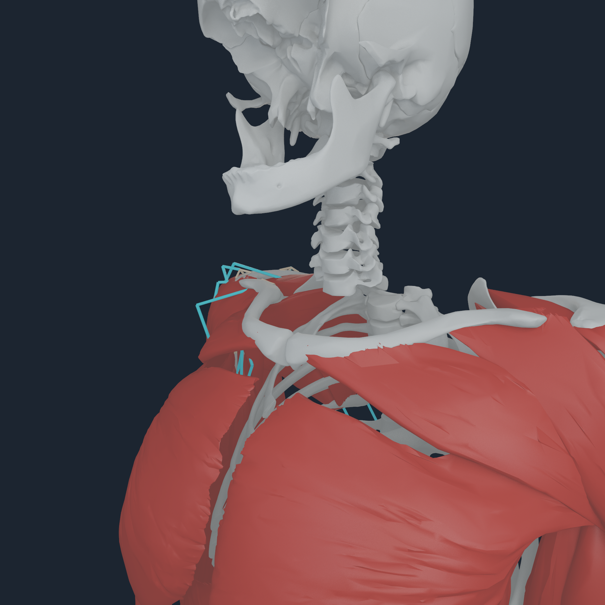
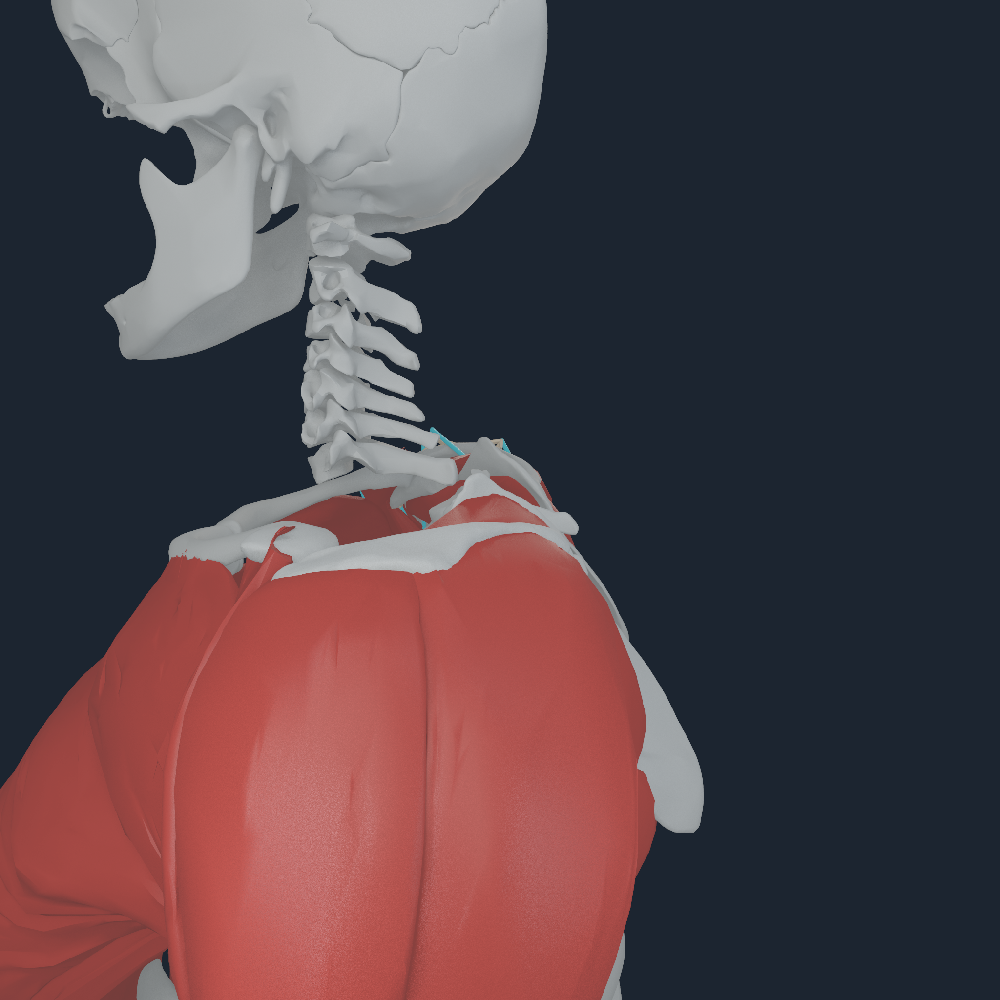
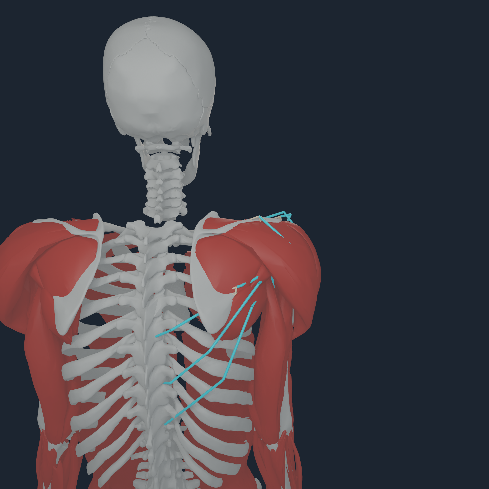
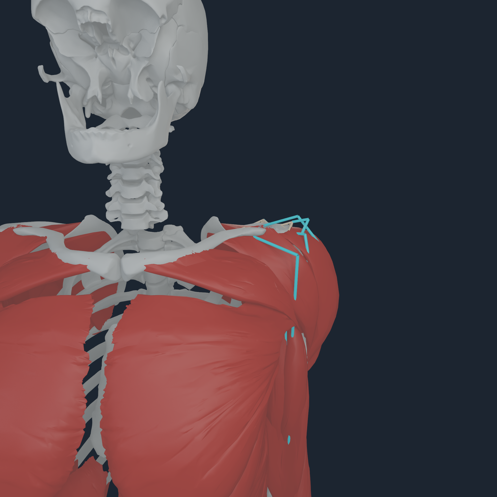
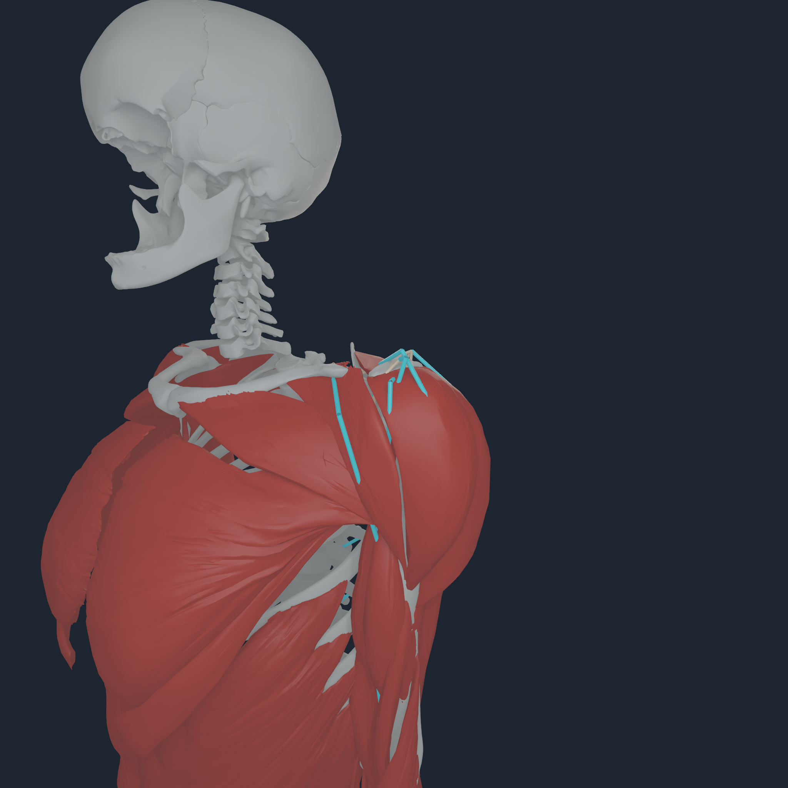
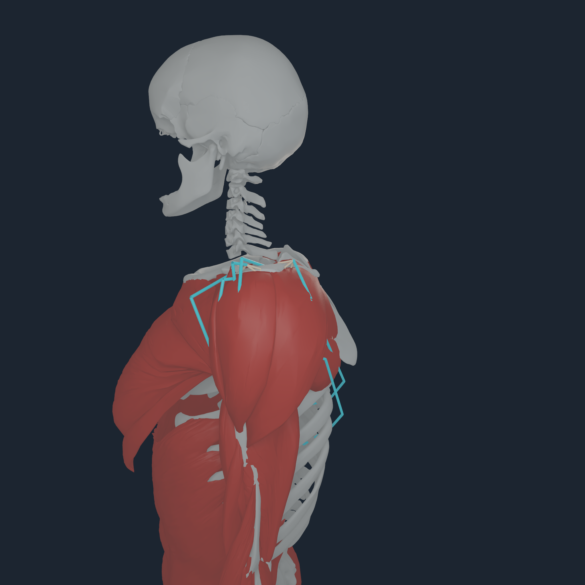
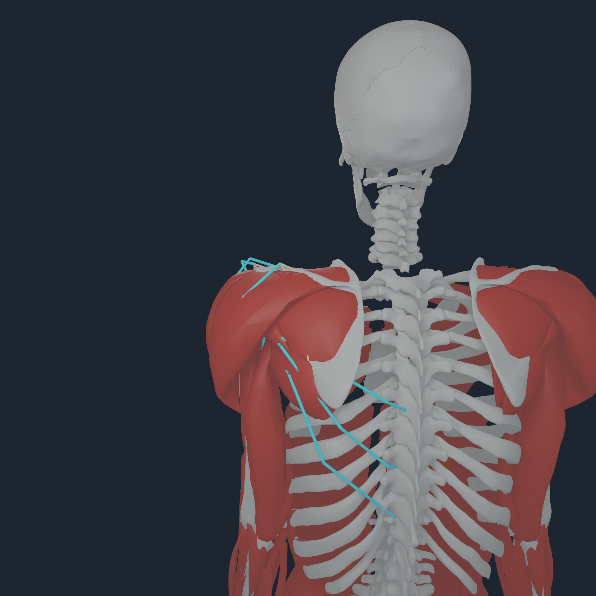

# Upper-limb source-mesh registration v1

## Outcome

The bilateral scapula-to-finger registration is now promoted into the paired
`NHBONES1`/`NHTENDON2` validation path. Exact BodyParts3D geometry is rigidly
registered to the pinned compiled MyoSim bone meshes; MyoSim sites, muscle
paths, joints, masses, and force parameters are unchanged.

The final candidate covers 62 named bodies in 31 bilateral pairs. It uses
PCA-seeded, 90%-trimmed symmetric rigid ICP with every fifth deterministic
surface sample reserved before fitting. Bilateral mirror consistency, endpoint
distance, prior-envelope preservation, and default-pose continuity are hard
selection gates. Five distributed source attachment regions per scapula add a
bounded translation to that complete proper-rigid fit, with a 10 mm total
refinement bound and a 15 mm held-out surface-p90 gate. The wrist correction
translates each complete hand together; no shoulder endpoint, hand, or finger
receives an independent patch or added articulation.

| Gate | Result |
| --- | ---: |
| upper-limb/hand registration candidates | 176/176 within 12 mm |
| maximum candidate distance, before / after | 139.377 / 8.615 mm |
| previously admitted upper-limb envelopes preserved after continuity regularization | 57/57 |
| bilateral body pairs | 31 |
| default-pose shoulder/elbow/wrist/hand transitions | 52/52 pass |
| worst transition | 7.908 / 8.000 mm, left scapula-to-humerus interval |
| maximum held-out surface p90 / outlier | 12.724 / 24.568 mm |
| maximum mirrored surface p90 / outlier | 9.020 / 20.219 mm |
| endpoint migration | 0 mm |

The held-out and mirrored outliers remain visible because cross-subject bone
surfaces are not identical. The scapular held-out p90 remains below its
explicit 15 mm cross-source gate, and these outliers are not used to weaken the
12 mm endpoint gate.

The 12 mm ulnocarpal gate is not a direct ulna-to-triquetrum contact claim. The
pinned MyoSim bone-only source leaves 9.371 mm bilaterally, while the TFCC
includes an articular disc and ulnocarpal ligamentous structures in this
interval. The anatomy boundary is consistent with cadaveric TFCC studies of
the [ligamentous structure](https://pubmed.ncbi.nlm.nih.gov/9848546/) and
[carpal attachment](https://pubmed.ncbi.nlm.nih.gov/12358373/). No TFCC,
cartilage, ligament, or compliant-contact mechanics are implemented here.

## Direct visual review

Every frame below is a native 2048 px Apple M4 Pro render of the final paired
hash. White is exact BodyParts3D bone geometry, cyan is the exact current-pose
MyoSim route centreline, and the warm four-node fans are the executable
`NHTENDON2` transfer maps. The fans are force-transfer diagnostics, not a
fabricated tendon surface.

### Right scapula and shoulder

<p align="center">
  
  
  
  
</p>

### Left scapula and shoulder

<p align="center">
  
  
  
  
</p>

### Right hand and fingers

<p align="center">
  
  
  
  
</p>

### Left hand and fingers

<p align="center">
  
  
  
  
</p>

### Right elbow, forearm, and wrist

<p align="center">
  
  
  
  
</p>

### Left elbow, forearm, and wrist

<p align="center">
  
  
  
  
</p>

Direct inspection found no disconnected scapula, elbow, or wrist block; no
swapped forearm bone; no off-by-one digit assignment; and no independently
shifted finger. The eight new shoulder frames keep the warm transfer fans on
their owning surfaces. Side-view occlusion can hide a route or fan; the other
cameras and pixel counters remain the cross-check.

## Tendon-law result

Recompiling the exact final bone/tendon pair produces 172 net distributed-law
gains and no loss relative to v11. Of the 176 intended registration targets,
169 become distributed envelopes; three additional same-body endpoints pass
the unchanged gates after the coherent geometry update.

| Disposition | v11 | final |
| --- | ---: | ---: |
| connected four-node surface envelope | 364 | 536 |
| exact source-site point law | 468 | 296 |
| surface coverage | 43.75% | 64.42% |

Seven intended targets remain exact point laws because their candidate
four-node patches fail conditioning: bilateral `TRImed` origins, left `FDP5`
insertion, and right `RI4`, `LU_RB4`, `UI_UB4`, and `RI5` origins. These are
not repaired by relaxing distance, force-amplification, or wrench gates.

That list records the v1 registration snapshot. The later
[bilateral triceps medialis enthesis pass](TRICEPS_MEDIALIS_ENTHESIS_V1.md)
admits the right origin through the ordinary exact-surface topology search and
the left origin through counterpart-seeded projection onto its own exact
BodyParts3D humerus. It does not relax any conditioning gate or move either
source endpoint.

The ten scapular gains are bilateral posterior-deltoid origins, teres-minor and
teres-major insertions, and coracobrachialis and short-head-biceps origins.
Their distributed placement around the scapular spine/acromial region, lateral
border/inferior angle, and coracoid makes them useful source landmarks. A
bounded coordinate descent translates each complete proper-rigid scapula fit;
it does not rotate or deform the BodyParts3D mesh, move a MyoSim site, or tune
one attachment independently. Worst endpoint distance falls from 13.835 to
6.636 mm right and 16.202 to 7.827 mm left. Total refinement is 7.520 and
8.958 mm, below the 10 mm bound, while held-out surface p90 is 12.724 and
11.850 mm, below the explicit 15 mm cross-source gate.

## Native execution evidence

The final pair ran in revision `50cab6b69426ad28c268aa05738de71df9f88bf0`
of the `coupled` runtime checkout on Apple M4 Pro.

The reference probe evaluates 416 muscles and 832 terminal laws on Metal. It
reports 536 envelope transfers, 296 point transfers, zero endpoint migration,
`1.25885e-4 N` maximum Metal force residual, `4.30321e-6 N m` maximum moment
residual, and byte-identical tendon replay.

The full-body smoke executes 64 assisted plus 64 zero-root-wrench steps:
106,496 terminal transfers, including 68,608 envelope and 37,888 point
transfers. Maximum per-step residuals are `1.29475e-4 N` and
`1.90921e-6 N m`; deterministic replay is bitwise. This is a runtime and
force-transfer smoke, not a balance qualification: the compiled report still
says `balanced=false`.

The hand captures each apply a 0.05 increment to 31 selected source muscles
over the compiled posture while all 416 paths continue to run. The elbow/wrist
captures each select 17 routes. Each new shoulder capture applies 16 persistent
100 us steps with a 0.05 increment on its 15 exact scapula-crossing source
muscles while all 416 paths remain evaluated. The exact prior transcripts and image hashes are in
the [media directory](media/numi-human-upper-limb-source-mesh-registration-v1-2048/)
and [checksum set](media/numi-human-upper-limb-source-mesh-registration-v1-2048/checksums.sha256);
the new shoulder and standing evidence is in the
[scapular media directory](media/numi-human-scapular-attachments-v1-2048/)
with its [checksum set](media/numi-human-scapular-attachments-v1-2048/checksums.sha256).

## Reproduction and exact pair

The generated `Build/` products are reproducible and byte-identical across two
independent local runs:

| Artifact | SHA-256 |
| --- | --- |
| registration candidate | `518773b9c063c1d2f21a2c1654e0660a54d7f0b0efc74e1a5f9f6884be729107` |
| `NHBONES1` | `7c6258fe8d0e90283706a2f1bdbd1faea19dd1d4a2315bc2d73806a3b6bb2b58` |
| `NHTENDON2` | `ef4176c6b68e400a568e471c4959509b6bafa93c4549e641a7832a9b0ef3edb2` |

```sh
PYTHONPATH=src python3 -m numilab_human.cli myosim-upper-limb-registration \
  --sources Sources \
  --registration Build/coherent-body-v4.registration.json \
  --source-audit Build/myosim-source-bone-proximity-v1.json \
  --worklist Build/bodyparts-registration-worklist-v1.json \
  --tendon-manifest Build/numi-human-tendon-topology-v11/numi-human-tendon-attachments.manifest.json \
  --output Build/scapular-source-mesh-v1.registration.json \
  --python .venv-myosim/bin/python

PYTHONPATH=src python3 -m numilab_human.cli myosim-bodyparts-bone-payload \
  --sources Sources \
  --registration Build/scapular-source-mesh-v1.registration.json \
  --output Build/scapular-source-mesh-v1-bones

PYTHONPATH=src python3 -m numilab_human.cli numi-human-tendon-envelope-payload \
  --artifact Build/myosim-fullbody \
  --bone-artifact Build/scapular-source-mesh-v1-bones \
  --output Build/scapular-source-mesh-v1-tendon
```

## Evidence boundary

This increment proves deterministic source-mesh registration, exact paired
force-transfer compilation, native Apple execution, and inspected default-pose
continuity. It does not prove subject-specific or clinical registration,
photorealistic anatomy, deformable tendon/enthesis mechanics, TFCC/cartilage
contact, independent finger control, closed-loop balance, or realistic skin.
