# NumiLab Human visual progress

## Registration-compatible calcaneal tendon detail — 2026-08-27

<p align="center">
  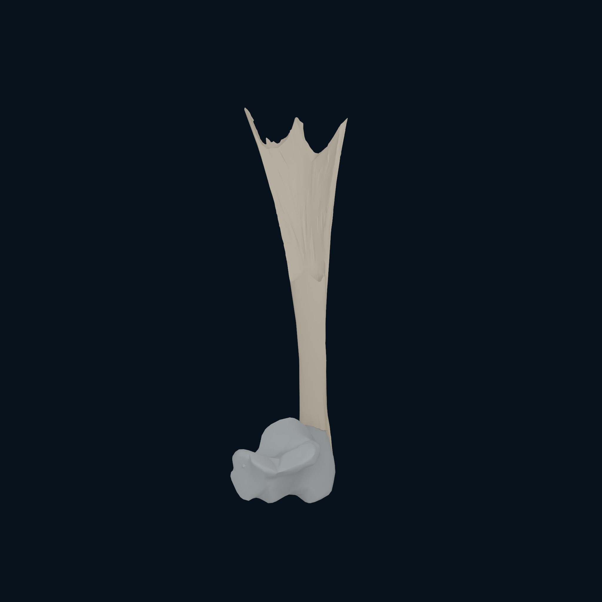
  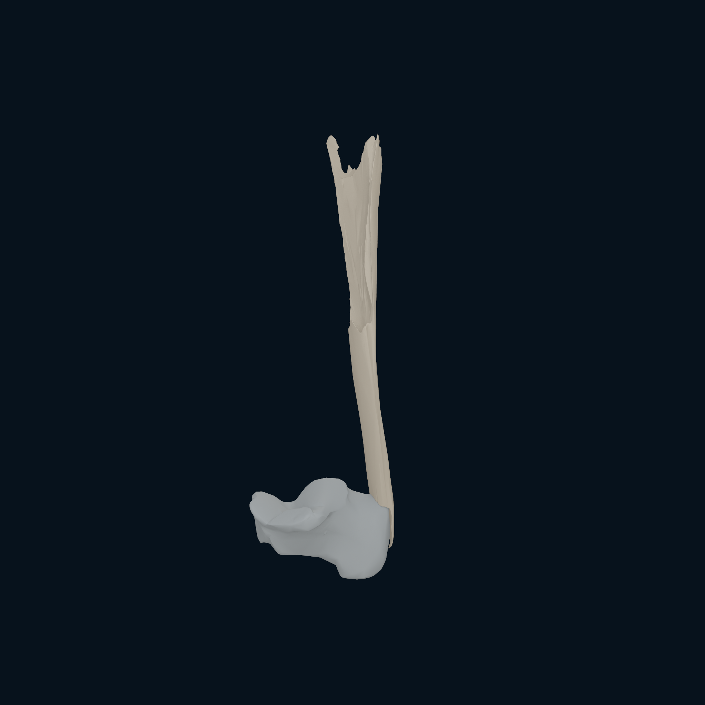
  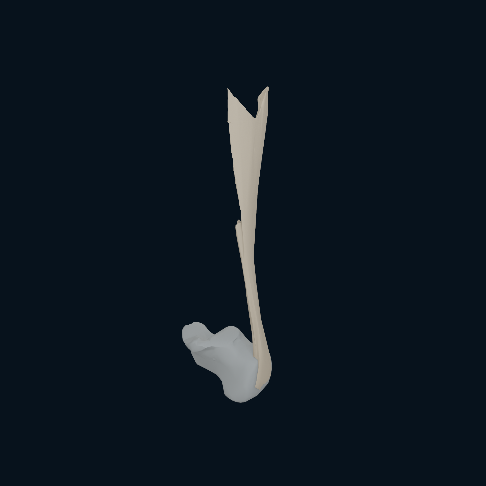
  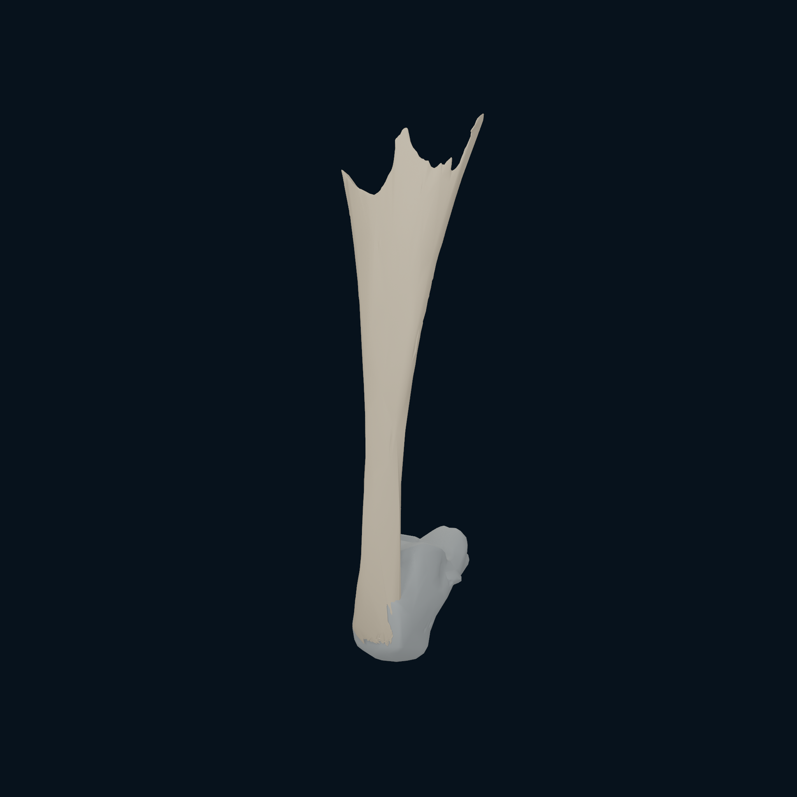
</p>

This is the first narrow native review that makes the observed tendon/bone
pairing explicit. Bone and soft-tissue payloads can contain the same MyoSim
source identity yet be expressed in different BodyParts3D visual rest frames.
The native ABI now embeds a compact fingerprint of the complete registration
receipt in both payload headers and refuses a mixed pair before the renderer
starts. A deliberately mismatched pair fails with `BodyParts3D bone and
soft-tissue payloads have different visual registrations`.

The successful Apple M4 capture is 2048 × 2048 from four cameras. It contains
184 possible bone meshes but selects only the right calcaneus and the exact
right calcaneal-tendon surface, yielding nonzero bone/tendon coverage in every
view (front 76,721 / 150,525; oblique 79,974 / 90,141; side 66,943 / 100,742;
rear 47,431 / 184,238 pixels). The complete native output and artifact hashes
are retained in the [capture directory](media/myosim-native-calcaneal-tendon-detail-2048).

These are direct BodyParts3D source meshes in a neutral anatomy light rig,
not a photoreal human surface. They prove that this visual pair is expressed in
one rest frame and that the tendon reaches the named calcaneus in the rendered
source geometry. They do not prove a continuum tendon, tendon-to-bone force
transfer, deformable tissue, collision, gait, or clinical registration.

## Native source-skin context — 2026-08-27

<p align="center">
  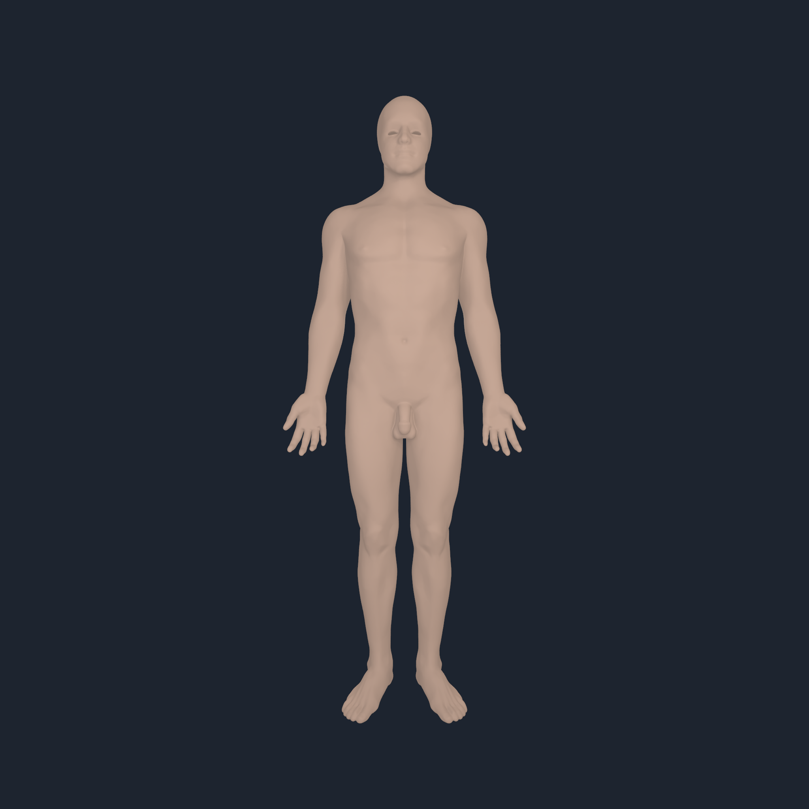
  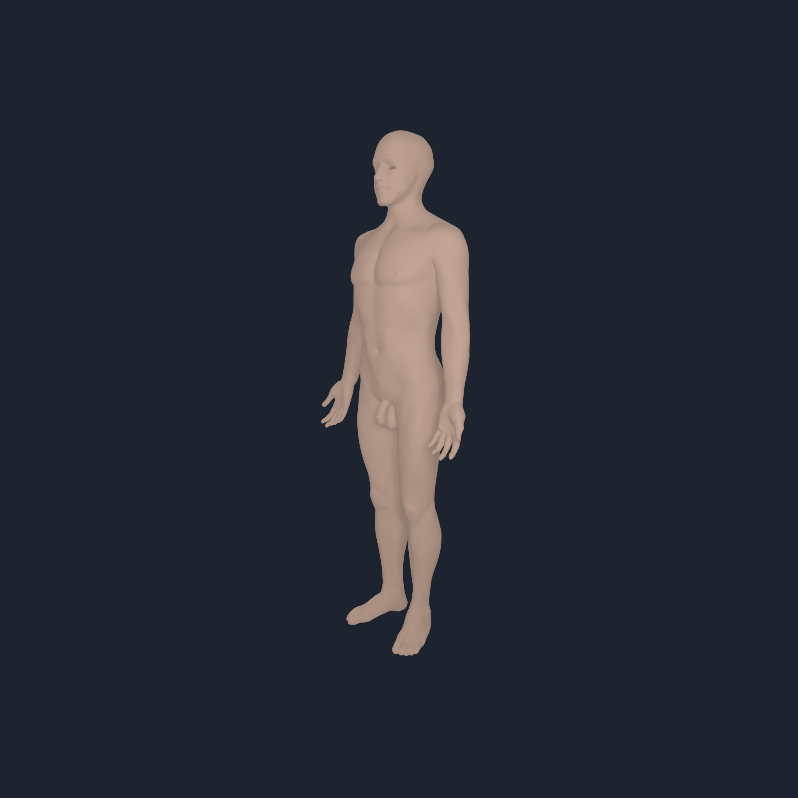
  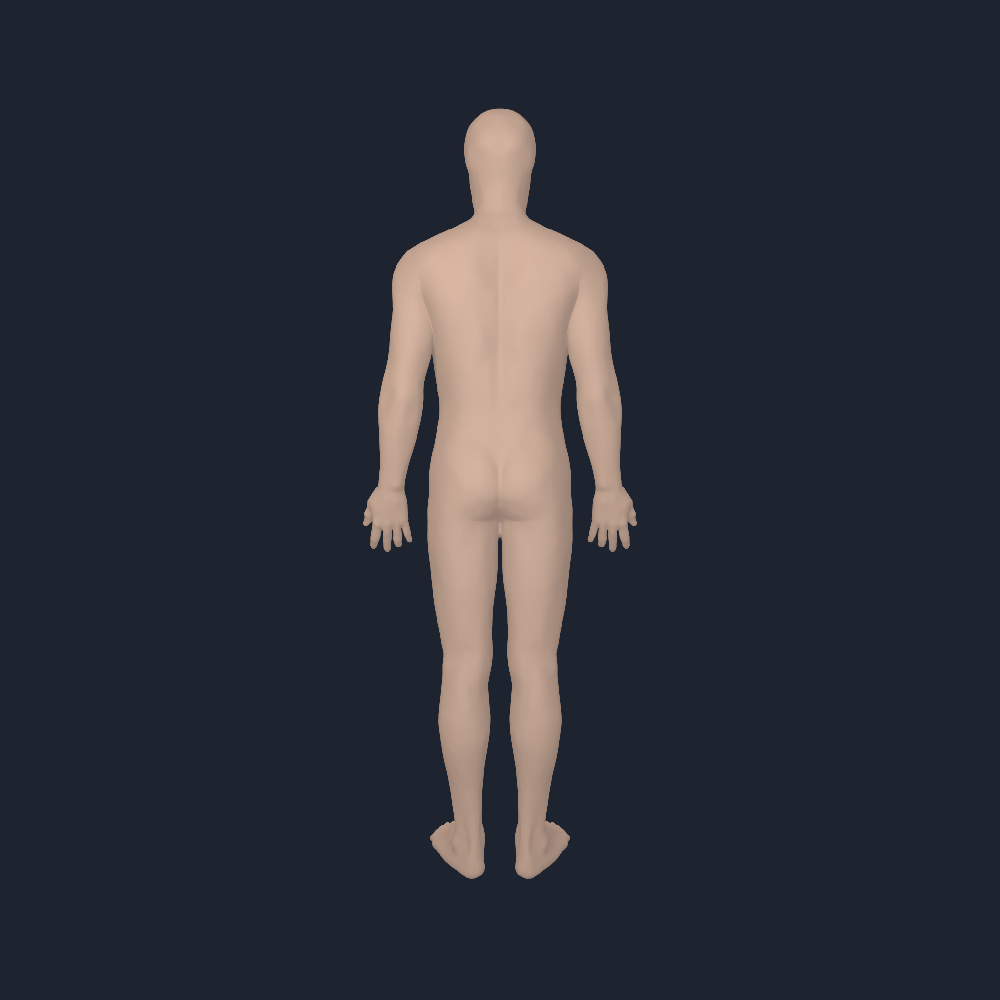
</p>

The source skin is a materially better whole-human visual context than the
small bone/tendon inspection meshes: 102,467 vertices and 203,382 triangles
from exact BodyParts3D member `FJ2810`. The native C++/Metal preview now builds
a camera-relative three-point studio rig per view, avoiding the old fixed key
that overexposed the front and flattened the rear. The Apple M4 capture is
2048 × 2048 and retains 425,068, 277,323, and 440,136 covered pixels in its
front, oblique, and rear frames respectively; its transcript and output hashes
are retained beside the images.

This improves visual legibility, not mechanics. The skin mesh has no authored
MyoSim weights, contact geometry, constitutive parameters, or volume. It is a
source-static native reference and must stay separate from the articulated
muscle/bone runtime until those data are established.

## Device-resident full-body muscle-force projection — 2026-08-27

The visual captures below now have a stronger mechanical companion check. The
Apple M4 native probe evaluates the 416 authored MyoSim MuJoCo muscle routes,
their static actuator forces, each route's `J^T` generalized-force contribution,
and the deterministic full-body force reduction in one Metal command-buffer
sequence. It compares the results with the FP64 Core reference at the same
source-default pose: maximum per-muscle generalized-force error is
`0.00471758869298`, and the summed 128-DoF vector differs by
`0.00642352090836`.

This means the device no longer stops at a visual muscle route or scalar force:
its force projection follows the current source attachments and wrapped path
segments. The next boundary is deliberately explicit: the 157-body/128-DoF
Human exceeds the current Metal **dynamics** bucket, so CPU FP64 still owns the
bounded forward-dynamics state step and support contact. This validation does
not claim a device-resident full-body integrator, tendon continuum, deformable
soft tissue, gait, or clinical anatomy.

## Focused right upper-limb actuation — 2026-08-27

<p align="center">
  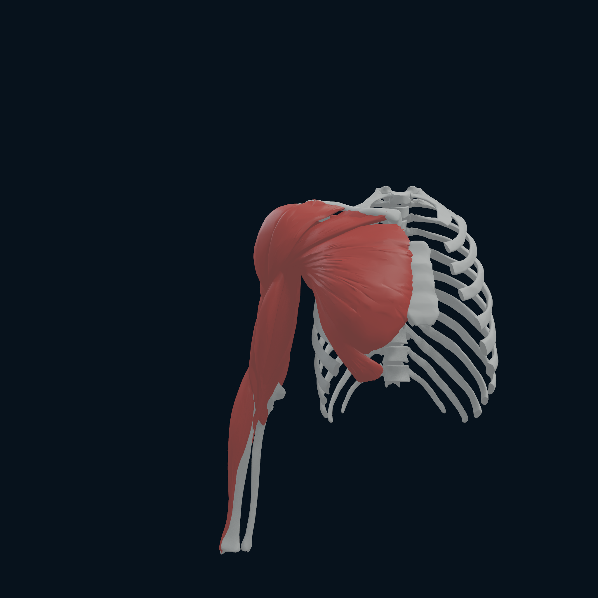
  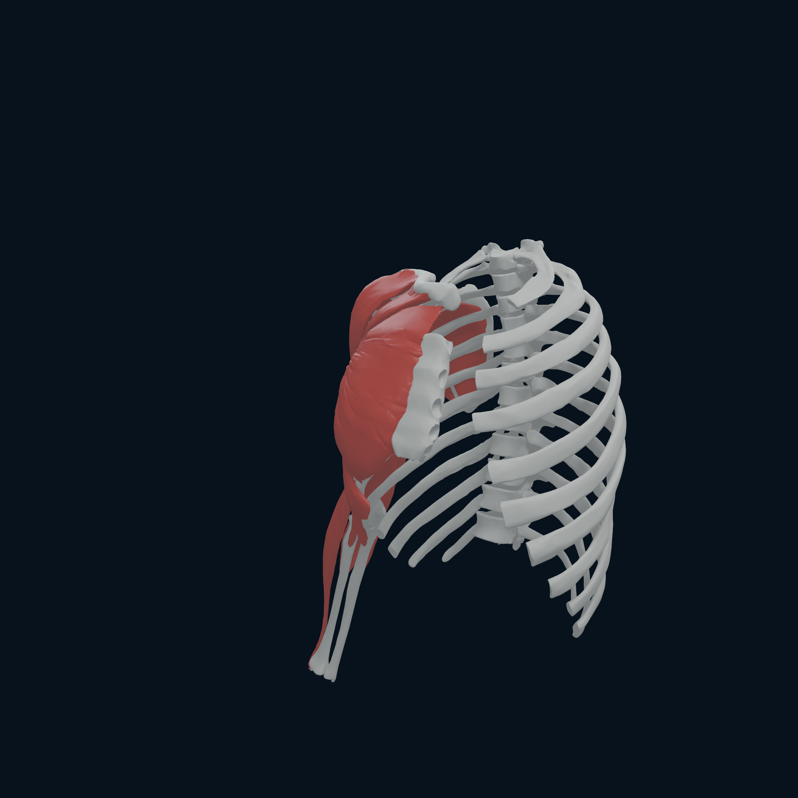
  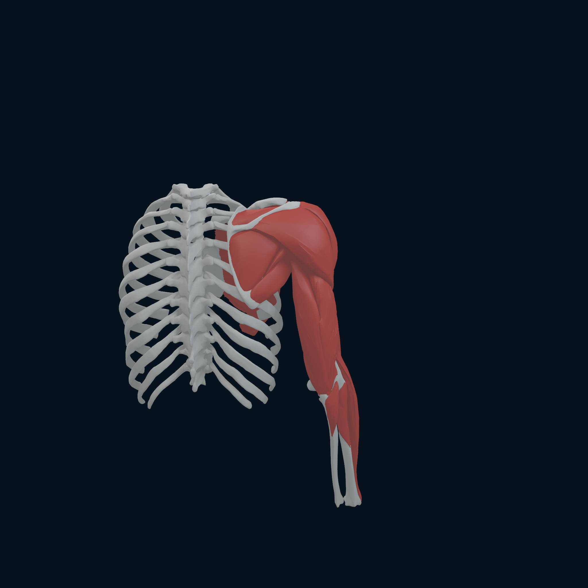
</p>

This native 2048 px inspection focuses on the right torso, clavicle, scapula,
humerus, ulna, and radius—not a separate animated arm. It shows 42 exact
BodyParts3D bone meshes and 21 selected source surfaces: pectoralis major,
deltoid, rotator cuff, teres, coracobrachialis, triceps, anconeus, supinator,
biceps, brachialis, and brachioradialis. The oblique view exposes the
shoulder/scapular relationship that a full-body frame hides.

The driven capture takes eight 100 microsecond Core FP64 steps. Every step
evaluates all 416 authored MyoSim muscle paths and then sends the resulting
pose to the Apple M4 Metal operator and renderer. Its maximum active/passive
configuration difference is 0.00106265418885 rad/m; it applied 720 wrapped
path contacts across the sequence. The
[capture transcript](media/myosim-native-upper-limb-inspection-2048/capture.transcript.txt)
pins the source package and all output hashes.

This is source geometry through a bounded all-muscle free-dynamics update. It
does not establish upper-limb contact, a deformable tendon or skin model,
surface-force transfer, stable movement, or clinical registration.

## Focused posterior-chain attachment and bounded muscle update — 2026-08-27

<p align="center">
  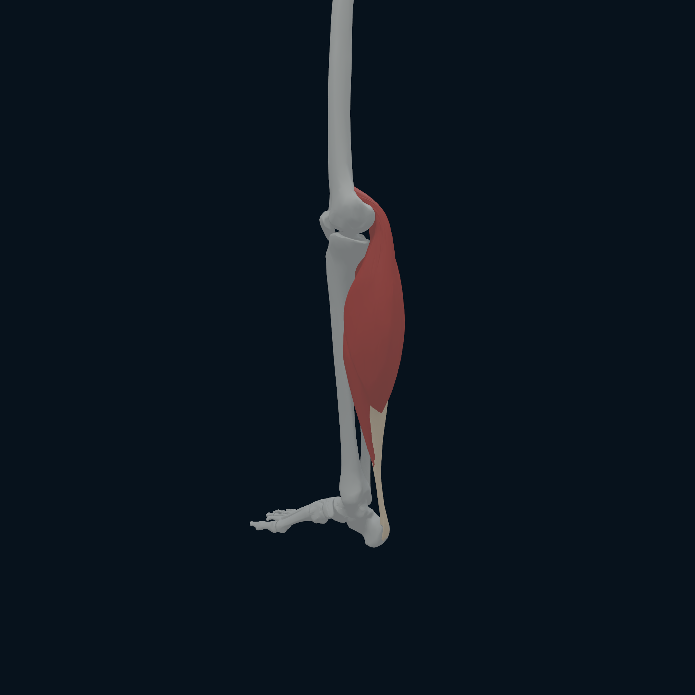
  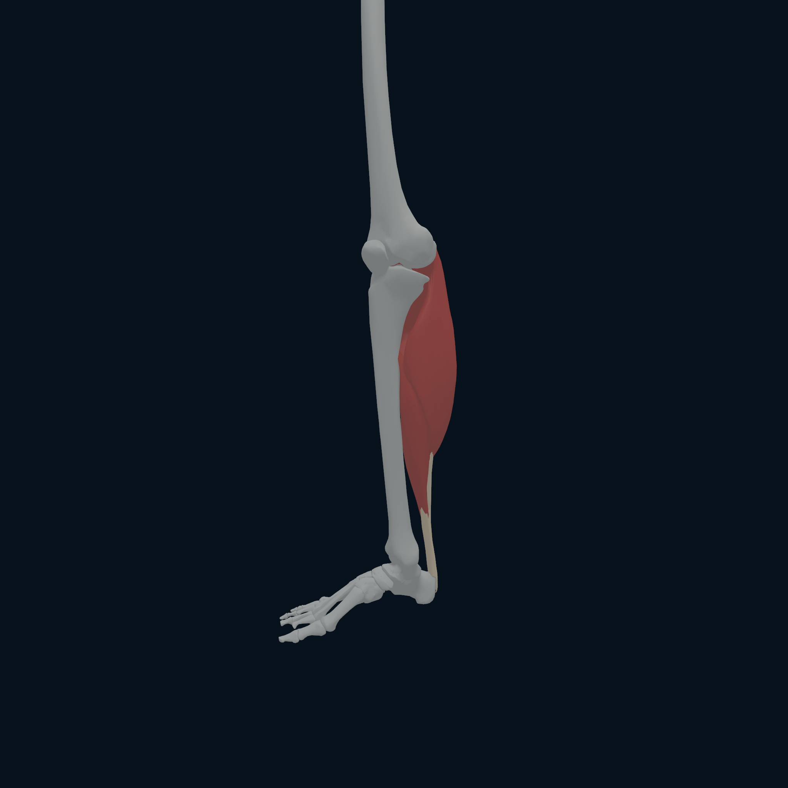
  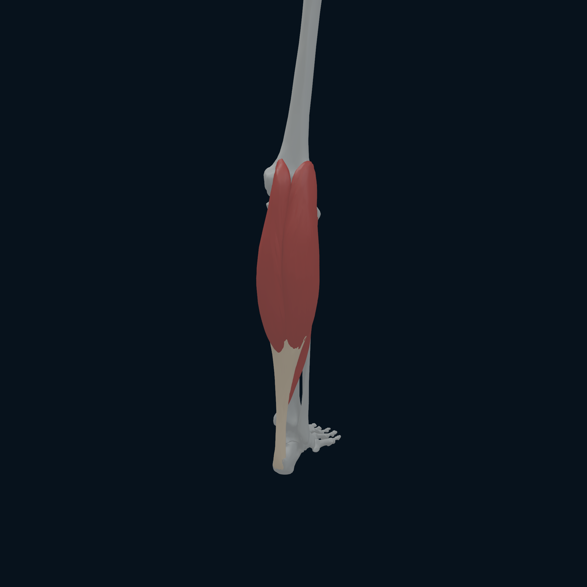
</p>

The broad images below are retained as source coverage, not the current Human
presentation. This 2048 px inspection filters the native scene to 30 meshes
on six exact source bone parents (right femur, tibia/fibula, talus, calcaneus,
toes, and patella) plus four exact surfaces: right lateral gastrocnemius,
right medial gastrocnemius, right soleus, and right calcaneal tendon. The
side, oblique, and rear views expose the calcaneal insertion instead of
hiding it behind the full body.

The bounded comparison takes eight 100 microsecond steps. Each step evaluates
all 416 source muscle-tendon paths, reprojects the ten authored source-foot
witnesses against their plane, and activates the six witnesses that reach the
plane. The result reports a maximum configuration difference of
0.00106110731348 rad/m from the zero-activation baseline, six active support
contacts, and a minimum plane gap of -0.000000190044077062 m. Pose and
renderer execute on Apple M4; the current 157-body articulation is explicitly
not admitted to the installed Metal contact bucket, so contact is Core FP64
for this capture.

The [capture transcript](media/myosim-native-posterior-tendon-inspection-2048/capture.transcript.txt)
pins the exact inputs, options, output hashes, and limitations. This is visual
continuity of source geometry through a bounded update. It does not establish
a tendon continuum, tendon-to-bone force transfer, deformable tissue, stable
standing or gait, general collision, skin, or clinical registration.

## Presentation correction — 2026-08-27

The earlier native route galleries below are retained only for renderer
regression and source-coverage evidence; they are **retired as anatomy
presentation**. They drew every MyoSim route as a straight line between sites
and wrap centres, which can cut through a sphere/cylinder wrap and visibly miss
an anatomical surface. They are not acceptable tendon imagery.

The current native renderer keeps routes hidden by default. Its opt-in focused
inspection starts and ends at exact source sites, uses the source solver's
tangent contacts, and samples the wrapped sphere/cylinder arc. Surface-anchor
caps make the projected origin/insertion points readable at the bone without
changing the force path. That remains an alignment diagnostic, not tendon
surface geometry or a medical registration. The reviewed showcase below uses
the separate exact BodyParts3D muscle/tendon surfaces instead of that route
diagnostic.

## Geometry-framed full-body source anatomy — 2026-08-27

<p align="center">
  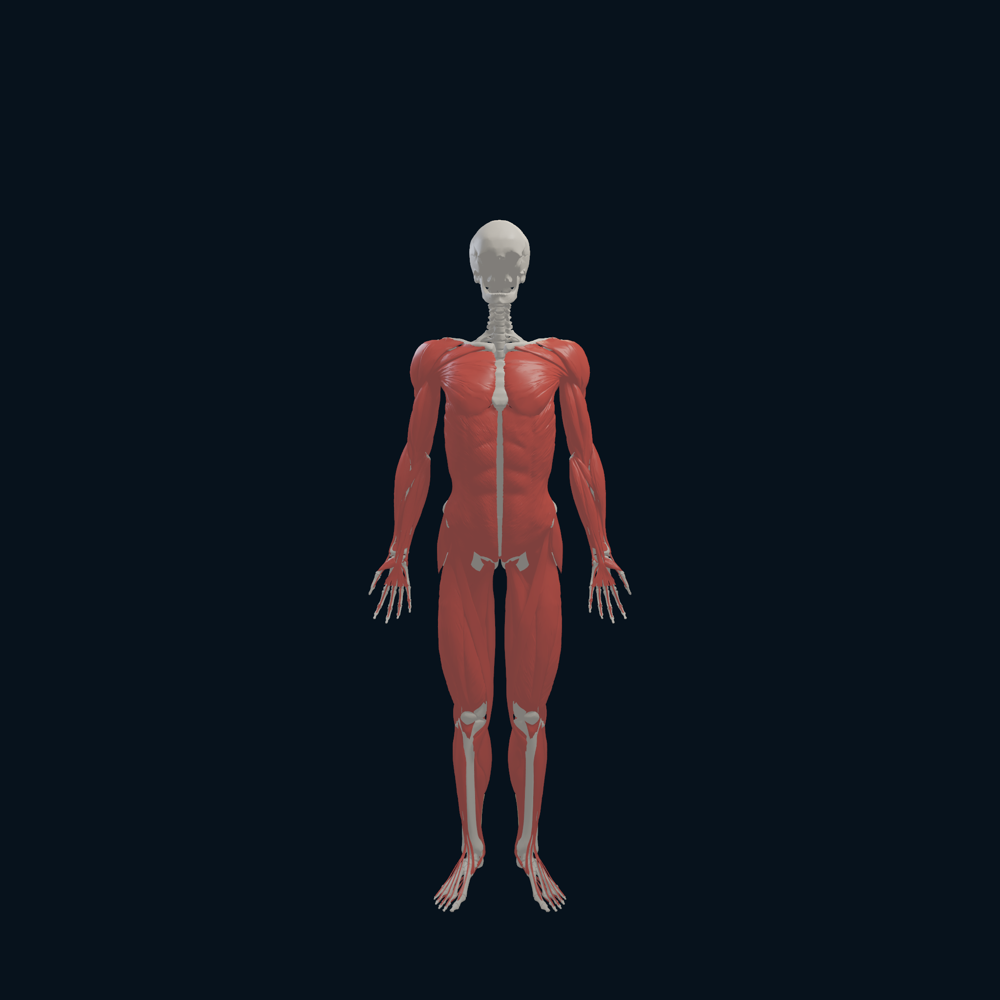
  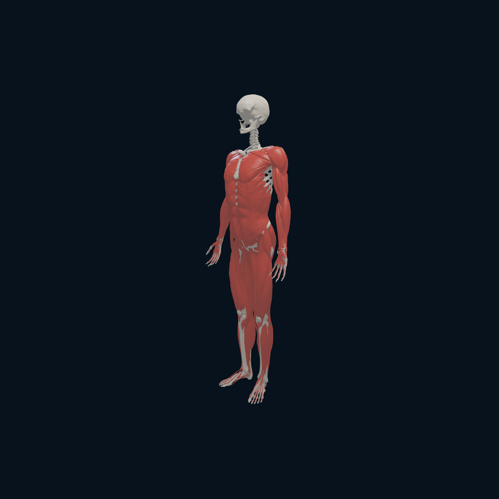
  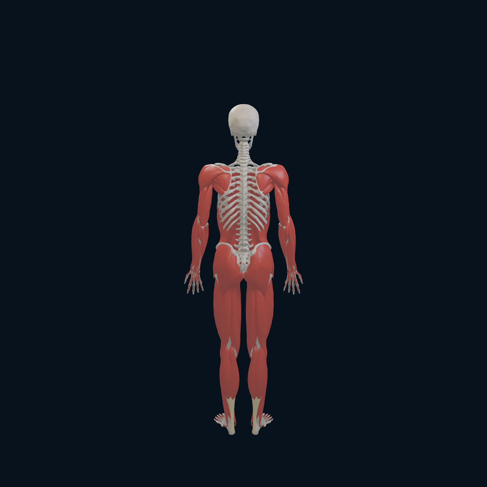
</p>

The prior broad muscle-surface capture focused camera body 128, which made
the source anatomy read as an unhelpful torso close-up. The new native
`myosim-native-fullbody-soft-tissue-visuals` entry point builds the visual
pack first, evaluates its exact current world-space source geometry bounds,
and targets each camera at the rendered-vertex centroid. It is not a
camera-distance guess from rigid-body centres or an AABB midpoint in empty
oblique-view space.

The reviewed 2048 × 2048 M4 capture contains 184 BodyParts3D bone meshes and
150 source tissue surfaces (148 muscle, two calcaneal tendon). The source
geometry extent was 1.72125351429 m and the native camera distance is
1.85895383358 m. Every view has nonzero bone, muscle, and tendon coverage:

| View | Bone / muscle / tendon pixels |
| --- | ---: |
| Front | 56,105 / 240,748 / 101 |
| Oblique | 52,332 / 198,083 / 660 |
| Side | 41,616 / 118,125 / 619 |
| Rear | 79,396 / 215,071 / 5,502 |

The full [capture transcript](media/myosim-native-fullbody-geometry-framed-2048/capture.transcript.txt)
pins the rendered input hashes and output frames. This repairs presentation
framing only: it is a Metal articulated-pose snapshot with visual two-body
muscle/tendon surfaces, not a deformable-tissue solve, contact qualification,
controller, rollout, or medical registration.

## Triangle-locked calcaneal tendon inspection — 2026-08-27

<p align="center">
  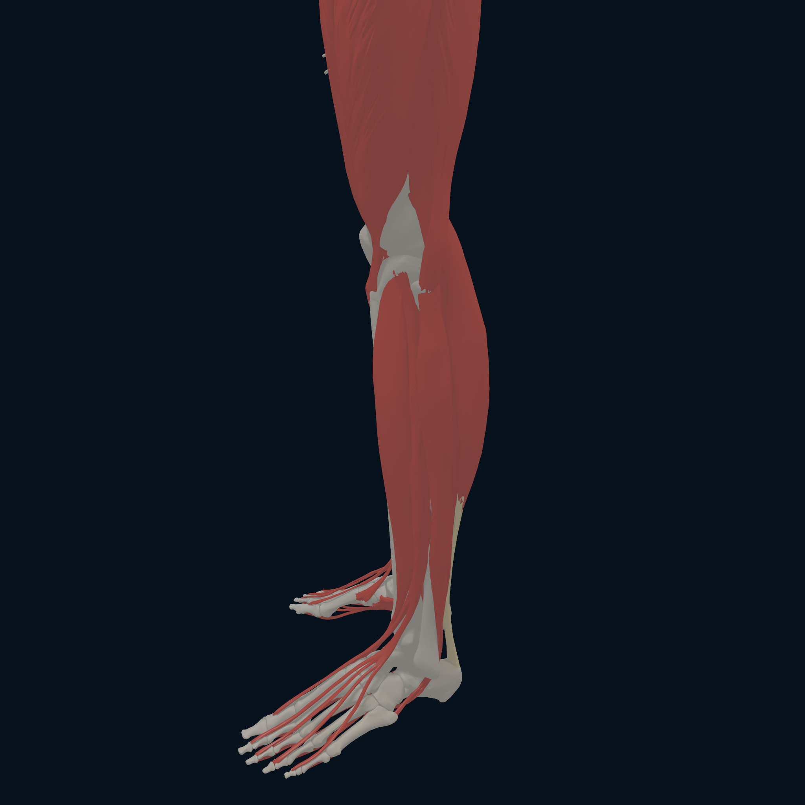
  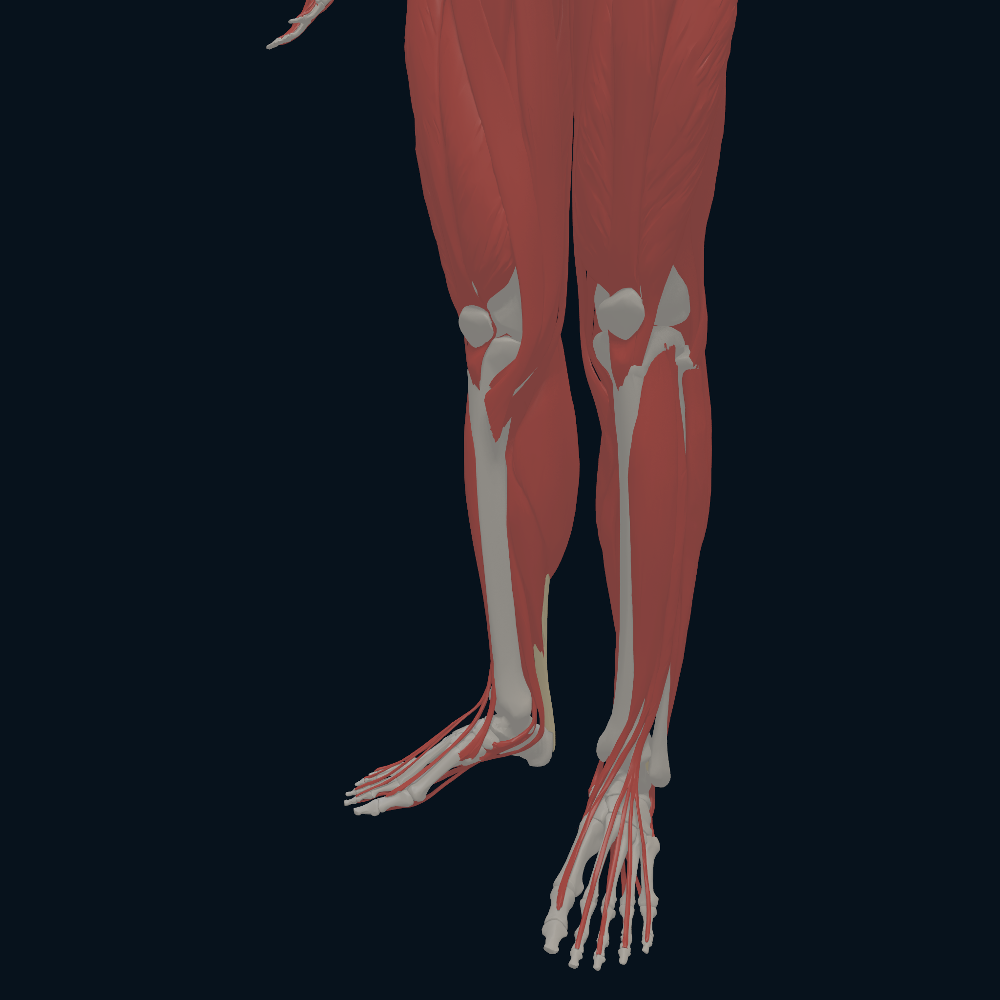
  
</p>

The old nearest-vertex test left sparsely tessellated areas of a tendon eligible
to blend with the wrong body even when they sat on the calcaneal surface. The
current package measures exact closest points to the named BodyParts3D
calcaneus triangles. Vertices within 3 mm are fully calcaneus-bound and the
3–15 mm band is feathered: 944 locked + 26 feathered on the right, and 943 +
25 on the left. The four native 2048 px views all contain bone, muscle, and
tendon pixels; the rear tendon coverage is 46,393 pixels. See the
[capture transcript](media/myosim-native-calcaneal-tendon-triangle-lock-2048/capture.transcript.txt).

This is a source-default Metal-pose inspection that prevents a visible
two-body presentation seam at the named insertion. It does not constitute a
tendon weld, force transfer, a constitutive model, deformable tissue, or a
medical attachment claim.

## Supported tendon attachment review — 2026-08-27

<p align="center">
  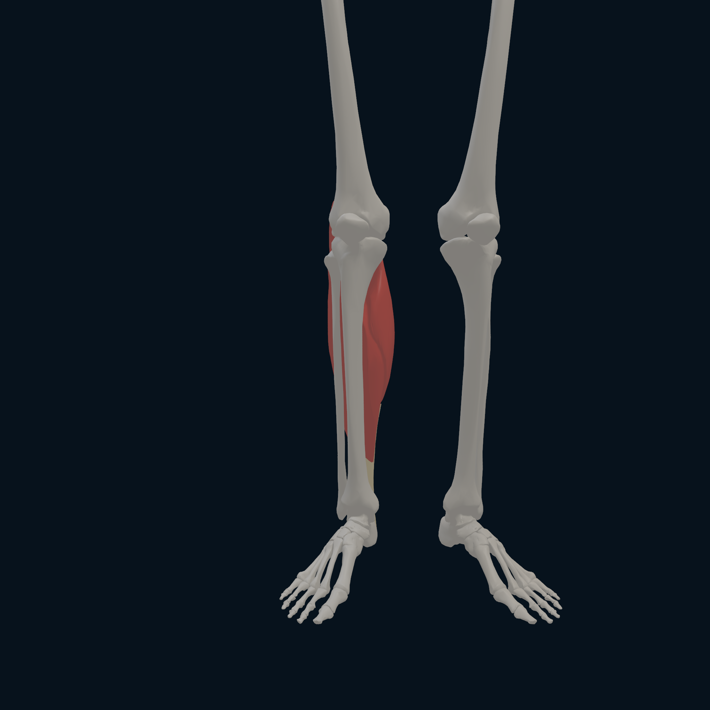
  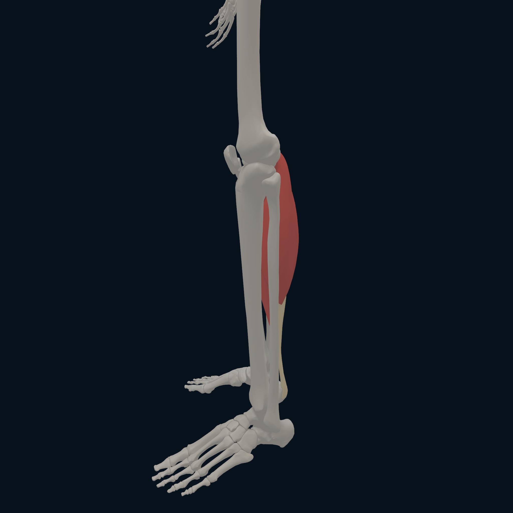
  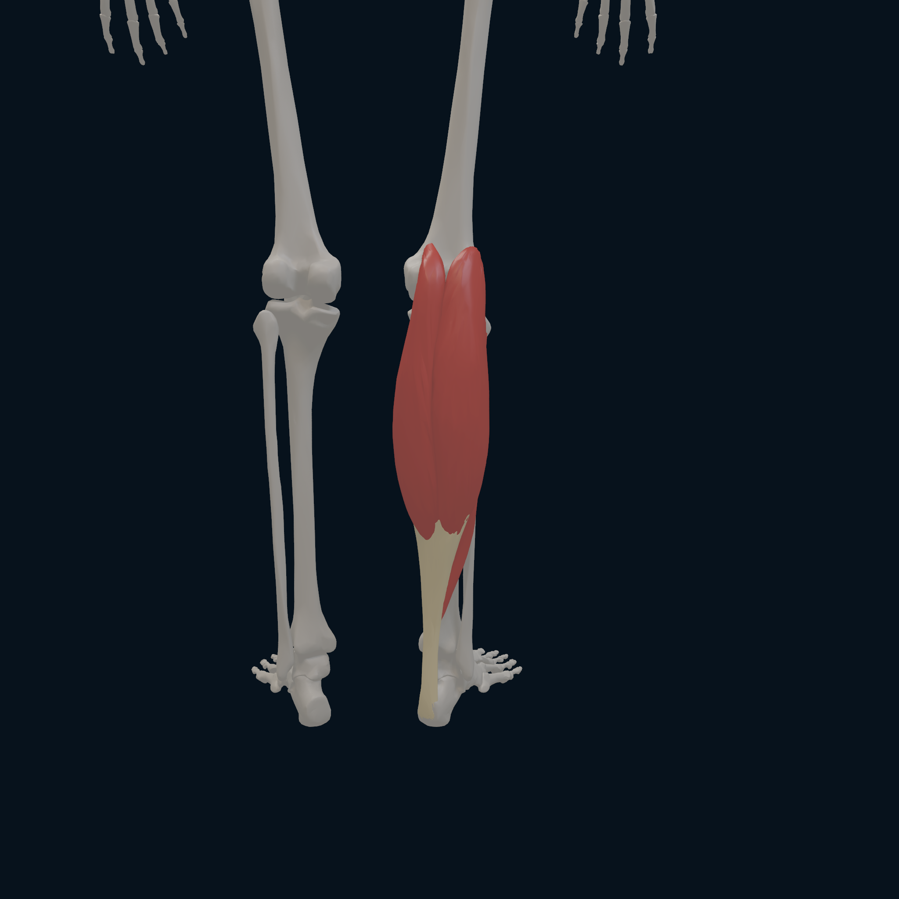
</p>

These four inspected 2048 × 2048 Apple M4 frames replace the earlier
free-body posterior-chain stress picture. The active pose applies the
zero-baseline-subtracted 5% activation to all 416 MyoSim muscles for 1 ms,
then resolves two bilateral support witnesses from MyoSim's own authored foot
collision primitives in Core FP64 exact-cone contact before Metal produces the
final pose and native renderer frame.

The BodyParts3D calcaneal-tendon surfaces preserve their exact triangles, but
the generic two-body blend has been corrected where it matters: source vertices
within 3 mm of the named calcaneus mesh are fully calcaneus-bound and the next
12 mm is feathered. That locks 341 right and 492 left tendon vertices, with
629 and 476 feathered vertices. It prevents an active pose from visibly
pulling an insertion off the bone while retaining a smooth tendon surface.

| View | Bone / muscle / tendon pixels | Review |
| --- | ---: | --- |
| Front | 343,512 / 42,216 / 1,654 | insertion and anterior ankle remain visible |
| Oblique | 380,943 / 64,287 / 5,480 | lateral tendon contour remains continuous |
| Side | 304,884 / 45,081 / 6,373 | posterior insertion remains attached to calcaneus |
| Rear | 247,926 / 121,337 / 22,281 | complete calf → Achilles → heel chain is legible |

The companion opt-in route image makes the force-path ownership readable:

<p align="center">
  
</p>

Its cyan curves are the posed MyoSim gastrocnemius lateralis, gastrocnemius
medialis, and soleus routes, including the source wrap arcs; cyan caps are
nearest registered-bone endpoint cues. They demonstrate the route-to-bone
relationship without pretending that a line is tendon geometry. The route is
naturally occluded in the lateral camera by the anatomy it passes beneath, so
the diagnostic now requires visibility in at least one reviewed angle rather
than silently failing valid anatomy views.

This is a bounded supported snapshot, not stable standing or gait. The
full-body Metal contact program explicitly rejected the 157-body connected
articulation as larger than its current dynamics bucket, so the capture uses
the native FP64 contact result and labels GPU contact as not admitted. It does
not claim general collision, a controller, repeated integration, deformable
tendon mechanics, force transfer from triangles, or clinical registration.

## Reviewed native full-body muscle-surface inspection — 2026-08-27

<p align="center">
  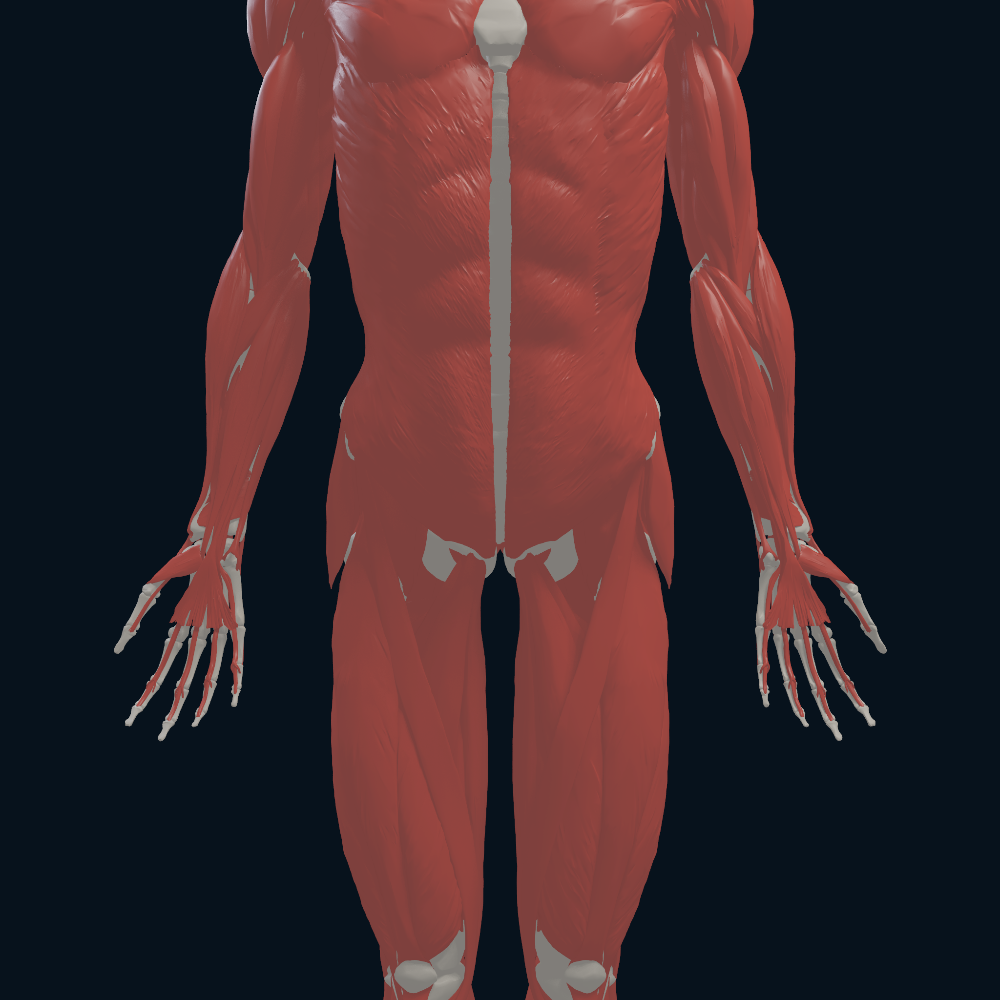
  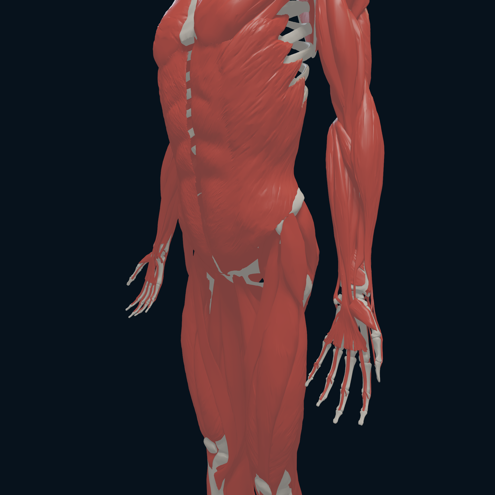
  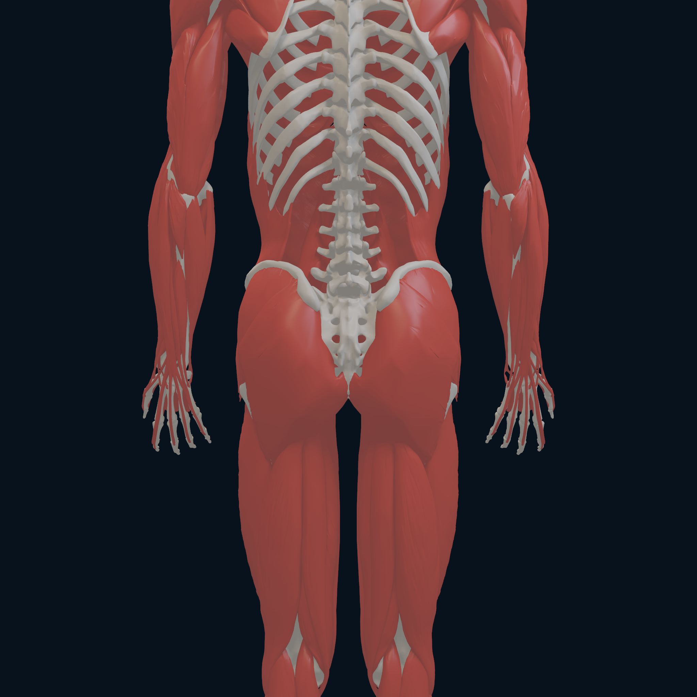
</p>

This earlier torso-focused capture is retained as a close surface inspection;
the geometry-framed capture above is now the main Human anatomical view. The
native Apple M4 capture poses 150 exact BodyParts3D surfaces over the 184-mesh
articulated skeleton: 148 muscle surfaces across both limbs,
shoulders, arms, forearms, hands, abdomen, pelvis, and legs; plus two
calcaneal tendon surfaces. The 19.9 MB `NHTISS2` package has 438,491 vertices
and 1,894,392 indices.

The offline package checks each source FJ member and FMA name against the
versioned map. For each ordinary muscle, it reads the first and final site of
the named MyoSim actuator route from the compiled `NHMYO1` source payload and
uses those exact Core bodies as the two skinning parents. Partitioned source
muscles such as gluteus and adductor magnus require all named MyoSim routes to
agree on the endpoint pair. Only the bilateral calcaneal tendon is an
explicitly labelled anatomical shared-tendon pair, because gastrocnemius and
soleus routes have distinct proximal links.

| View | PNG SHA-256 | Bone / muscle / tendon pixels |
| --- | --- | ---: |
| Front | `c3f2eaeddefb8308cb300ecdbe71278982356a68a20b619e36036faf4ea9c153` | 132,739 / 1,586,546 / 0 |
| Oblique | `f050fcf464c93818273a1b2d72a0cb4c1259e4180e759461a7a326af53f617ad` | 118,157 / 1,315,689 / 0 |
| Side | `138b4422a645713ff4fa0b1b56537736fe6ddc3a2210fad2f4fad792fd65bc30` | 74,180 / 775,656 / 0 |
| Rear | `1582eb21926cdcaeeeac42ddd22e2166f093dca7bba1591fc57c74d187e60677` | 353,793 / 1,201,421 / 0 |

The close camera is deliberately torso-centred, so the Achilles surfaces are
occluded in those four views. The geometry-framed replacement above retains
nonzero tendon coverage from every direction; a separate lower-leg capture
retains high-detail tendon coverage, including 11,613 pixels in the rear view.
The complete older close-capture command, payload/map hashes, device, coverage,
and bounded 416-muscle incremental-activation coupling smoke are in the
[capture transcript](media/myosim-native-fullbody-muscle-surfaces-2048/default/capture.transcript.txt).

This validates source surface → named MyoSim endpoint bodies → Metal pose →
native renderer. It does not claim force transfer from surface triangles,
continuum muscle/tendon deformation, collision/contact, a controller, gait,
or medical registration. The active bounded force step is retained as a
coupling smoke only; unsupported free-body co-activation is not presentation
motion.

The active check now applies 5% activation/excitation to all 416 source
muscles for 1 ms after subtracting the force at the source-default
zero-activation state. That reports the activation-induced force rather than
mistaking passive pre-stress for a control signal. It produces a finite maximum
configuration difference of `0.00720064735327` and retains tendon coverage in
all four lower-leg cameras (383 / 1,288 / 1,497 / 11,635 pixels):

<p align="center">
  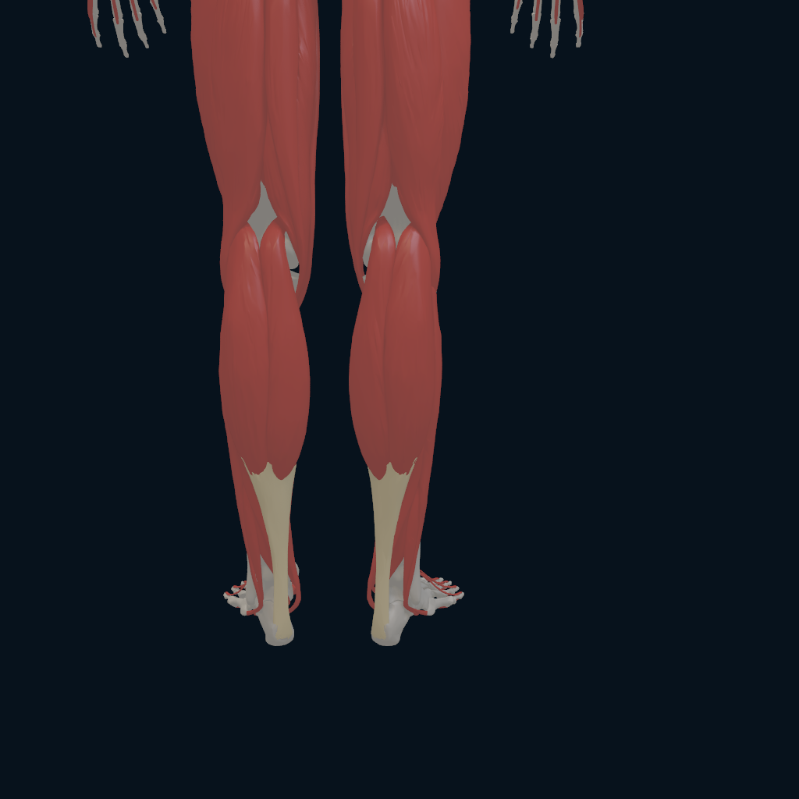
  
</p>

This is a one-step incremental-activation coupling check, not stable standing
or motion: support/contact, a posture controller, and time-series stability
are still required before a rollout can be claimed.

## Reviewed native posterior-calf source-surface inspection — 2026-08-27

<p align="center">
  
  
  
</p>

These are reviewed native 2048 × 2048 reference frames of the exact
BodyParts3D 4.0 right lateral/medial gastrocnemius, soleus, and calcaneal
tendon surfaces over the 184-mesh BodyParts3D skeleton. The posterior view
shows the gold tendon surface continuing from the calf surfaces to the
calcaneus; it no longer uses a straight route line as a visual stand-in. The
four source surfaces contain 10,348 vertices and 45,582 indices. Muscle is
red, tendon gold, and bone ivory solely as presentation labels.

The four surfaces use the same fitted BodyParts3D → MyoSim source-default
frame as the skeleton. The gastrocnemius meshes use a femur-to-calcaneus
per-vertex blend; soleus and the calcaneal tendon use tibia-to-calcaneus.
At rest, both body-frame evaluations reproduce the same source vertex; after a
posed skeleton update, the native renderer blends the two evaluations before
rendering the world-surface snapshot. This prevents the old one-rigid-parent
shear at a crossing structure's two ends. It does not prove a watertight
biological attachment, deformable tissue, force-path transfer, or a mechanical
tendon constraint.

The local Apple M4 native probe uses one fresh reference renderer per camera;
the occupied Mac mini was not touched. All four cameras report nonzero bone,
muscle-surface, and tendon-surface coverage. Exact payload, runtime, and image
hashes are in the [transcript](media/myosim-native-posterior-chain-2048/default/capture.transcript.txt).

| Camera | PNG SHA-256 | Bone / muscle / tendon pixels |
| --- | --- | ---: |
| Front | `b919bb34c872f92d1adc9bca89407c73497a7f5b3858bb25041cbd5d0b076e0f` | 343,221 / 42,225 / 1,656 |
| Oblique | `cc8a60d00eb1fcc0ae99412e78a4eb06287f5ea04bcaa1bf66d49c3e83c1df2c` | 379,512 / 64,441 / 5,467 |
| Side | `f06ab2d6e9ef05b39c0c8c7643093e502289681963c77c3fbc44da465caf0cd1` | 302,924 / 45,325 / 6,384 |
| Rear | `623745bf6c83d712fbe083d5fdc7b341fb791134f1101404ab873fee465382eb` | 247,853 / 121,509 / 22,255 |

This is the current focused source-anatomy presentation. It is not a full Human
beauty render, skin, organ/vessel/nerve view, articulated continuum
deformation, muscle-driven rollout, or medically validated attachment model.
The active 1 ms all-muscle free-body stress frame was also checked from all
four angles but is intentionally not presented: without contact or a posture
controller, unsupported skeletal parts separate. Those claims remain separate
from this source-default visual binding.

## Reviewed native 184-mesh full skeleton — 2026-08-27

<p align="center">
  
  
  
</p>

Core `1e247dd` rendered four inspected 2048 × 2048 reference frames on the
local Apple M4 from a `NHBONES1` package with 184 exact BodyParts3D 4.0 source
meshes (250,721 vertices, 1,370,928 indices). The package binds 17 conservative
fit landmarks plus 9 major extensions, 8 cranial/mandibular bones, 24 ribs, 10
mid-foot tarsals, atlas, axis, both triquetra, 52 wrists/hands/digits, 38
feet/toes, and 22 axial vertebrae to 86 named MyoSim parents in the active
157-body pose. `FJ1282`, the retired
"skull" selection, was an ocular component from a broad `part_of` listing; it
was removed and replaced by explicitly named cranial and mandibular source
bones before this capture.

The visual probe creates one native reference renderer per fixed camera, so a
2048 px camera cannot reuse an earlier camera's in-flight workspace. The
default view deliberately hides route lines. All source mesh instances are
attached to their current Core articulated parent pose; where the source model
has only one torso or toes body, ribs or foot meshes share that real parent
instead of receiving fabricated joint mechanics.

| View | Default-pose SHA-256 | Bone pixels | 1 ms complete-muscle SHA-256 | Bone pixels |
| --- | --- | ---: | --- | ---: |
| Front | `133a26781ad42893f69849073900a2827c30e85e7e49a06de55c917e5014d1d6` | 85,215 | `ddbd1d97118ffe6001be63f61721fe5c89d8378d78560c9712edb78977865095` | 85,171 |
| Oblique | `db8e1aa49a897f66882937be27456c6c0bef9c60ae5e06a7614a3033c6b37c8c` | 76,658 | `19c07753e142ef6064cf904eb0d50949c665688e79f5d627e95a11afa87db575` | 77,029 |
| Side | `44630a447c9865bef5cd22eb80113dd376a51419737e983b03af1b1b11de40f4` | 53,566 | `6ba8e9f0b87de0a64b886bfdfd6de5ca86a1ce1bab5e1c66fe6369c2249bc152` | 53,742 |
| Rear | `6d39289f874ae87bb13f09751aa2c764943ad5401334fe0b3aa165f537627b17` | 88,448 | `efea614d06ffbe41e02ec7d288fac3c34eb50ff5fc728c0fbb17341b21e0a912` | 88,256 |

The paired muscle-driven frames use the complete 416 source muscle-tendon
force set, 90 applied wraps, and one 1 ms CPU-FP64 free-body sensitivity step
before Metal poses the final 184 visual meshes. Exact commands, device,
payload/registration hashes, and every image hash are in the
[default-pose transcript](media/myosim-native-full-skeleton-184-2048/default/capture.transcript.txt)
and [muscle-driven transcript](media/myosim-native-full-skeleton-184-2048/muscle-driven/capture.transcript.txt).
The Mac mini was running an unrelated BirdFlow workload, so this is a bounded
local Apple M4 fallback; it is not an M4 Pro qualification.

This validates `full source visual skeleton → active MyoSim rigid parent →
Metal pose → native renderer`, and separately a bounded `416 source muscles →
one free-body step → Metal pose → the same skeleton` chain. It does not
validate skinning, tendons as surface geometry, organs, vessels, nerves,
collision/contact, a controller, a replay, gait, deformable tissue, or medical
registration.

## Retired full-body source validation snapshot — 2026-08-27

These images are retained source-provenance artifacts from the pinned MyoHub
`myo_sim` `33c89c2bde282553dde3f526768eb3bdcfaa7649` source. They are 640 ×
480 default-pose renders of the composed `myofullbody` model, and are retired
from presentation because their framing and generic source geometry do not
make a credible anatomical tendon view. The source is Apache-2.0; its
attribution and exact pin are in [third-party notices](../THIRD_PARTY_NOTICES.md).

| View | SHA-256 | Inspection result |
| --- | --- | --- |
| Anterior | `136d27ebbbae009997abfdd761bbb0ae2375a3f76210f0b5d8e2ff4509a09d39` | head, bilateral shoulders/arms/hands, thorax, pelvis, legs, and feet visible |
| Lateral | `a5b3a27de38d143384d623d082643a32c43ab31d37fc471b79a1229d1cb0a52a` | continuous skull–spine–pelvis–leg posture with intact foot profile |
| Posterior | `59b98823de79643b1b7f2688d2f261bb74904fbed8a2cfd7bacef3d7f16bd97a` | posterior spine, scapular region, gluteal/hamstring chains, calves, and feet visible |

The images matter because the active mechanics source now covers the whole
body rather than treating lower-body, upper-body, and neck imports as separate
animated shells. They are visual evidence of the source model only. They do
not show native Core rendering, mesh registration, skinning, contact,
locomotion, deformable anatomy, or biological validation.

## Retired native articulated route snapshot — 2026-08-27

Core `79cc34a` captured these 640 × 640 default-pose views on an Apple M4 using
`numi human myosim-native-visuals`. The command directly reads `NHRIGID2` and
`NHMYO1`, runs the Metal articulated operator, then renders the published pose
through Core's native visual renderer. The pale shapes are intentionally simple
inertial-body proxies; red geometry is 1,815 source attachment sites plus 1,432
straight route-centreline segments. It remains a historical coverage artifact,
not a tendon rendering or a path-to-bone attachment assessment.

| View | SHA-256 | Rendered coverage | Inspection result |
| --- | --- | --- | --- |
| Front | `b11acf05f0f6a46d1fabd5474d4db7266d431d6f8060e30ed7a74c939f6eba47` | `17,415` body / `641` site / `1,147` route pixels | bilateral torso, pelvis, legs, feet, and routed lower-body chains visible |
| Side | `ce2b2fc5d86437d0646bc6de0644cb0a9597b7b9faaed5544d3add0c3551d484` | `9,844` body / `521` site / `850` route pixels | continuous profile with shoulder, torso, pelvis, lower-leg, and foot route evidence |
| Rear | `c5067eccb567b71319f7ee49084005f114af71476d478359ccfcaf970380c91b` | `16,873` body / `1,070` site / `2,200` route pixels | posterior trunk, pelvic, calf, and bilateral route coverage visible |

This is native pose-bound visual evidence, not a human anatomy beauty render.
It proves neither BodyParts3D registration nor skin/organ deformation, live
device-buffer presentation, contact, motion, muscle-force feedback in a
rollout, or clinical validation. The tracked visual-pack manifest records the
scene provenance alongside the three frames. Its pack and manifest SHA-256
values are `633ddb213167c1cc47b733ae80d8f25a7af36d86bf830fbf67a625f16e2a8b59`
and `8d21b2f3a265285655dde72f3611891c69a187248627419dc1be2788b101734f`.

## Retired native BodyParts3D 27-major-bone route-overlay snapshot — 2026-08-27

Core `2aab522f92f44644c35bbde1a8ea3fd85356b027` captured this exact
`NHBONES1` package on the Apple M4 Pro on `macmini`. The native C++ program
read the compiled `NHRIGID2`/`NHMYO1` payloads plus 27 source-derived
BodyParts3D major-bone meshes (56,995 vertices; 322,074 indices), dispatched
the Metal articulated operator, and bound each mesh to its named Core
inertial-body pose. It also rendered all 1,815 compiled muscle sites and
1,432 straight route-centreline segments in a now-retired diagnostic overlay.

The offline rest-frame fit is deliberately unchanged: its original 18
unambiguous segment anchors enumerate 24 proper signed axis maps and select
the identity axis map with positive scale `1.007736155369` after mm→m
conversion. Its equal-weight mesh-vertex-centroid to source-inertial-COM score
is `0.059372888 m` RMS (`0.123618266 m` maximum). The nine additions are
bilateral hip bones, fibulae, tali, patellae, and sternum body. They inherit
that fitted common frame instead of re-fitting to less meaningful centroids;
the fibulae attach visually to their ipsilateral tibial link because MyoSim has
no separate fibular segment. A mesh centroid and an inertial COM are not
homologous anatomical landmarks, so these remain common-frame plausibility
diagnostics—not surface-registration accuracy or a medical registration claim.

| View | PNG SHA-256 | Bone / site / route pixels | Inspection result |
| --- | --- | --- | --- |
| Front | `a611906f2f92ba02cc271e53cd095d14535d340a5d6a17bc4c942aed418dbc66` | `4,529 / 1,035 / 3,195` | bilateral hip bones, patellae, fibulae, and both leg/foot chains are visible with the complete path overlay |
| Oblique | `9eec3e986be00463e6f6482a4faa8427dba8952c01155606e9a34694d23ac04d` | `3,654 / 936 / 2,911` | sternum, shoulder/scapular depth, pelvis, and distal-leg additions are visible without a mirrored frame |
| Side | `4cd9519bcb1520cd368b50ebedf4540dcd19cd8cff5b645835d52fd78508139b` | `2,017 / 714 / 1,855` | sagittal skull–sternum–pelvis–patella–leg–foot sequence is continuous |
| Rear | `d8f1ae245b74b1f119289e1b3aace0eba5bc6645310473e5288f4ee929818eaf` | `4,797 / 1,003 / 3,558` | posterior bilateral limbs, fibulae, and sacral/pelvic connection are visible |

The native [transcript](media/myosim-native-bodyparts-major-bones-27/native-articulated-major-bones-27.transcript.txt),
visual-pack manifest, and `.mrvpack` accompany the four frames. This validates
the historical `Metal pose → articulated BodyParts3D bone instance → native
renderer` chain at the source default pose. The red overlay does **not**
validate tendon attachment and is not current showcase material.

## Retired bounded muscle-driven 27-bone route-overlay snapshot — 2026-08-27

Core `2aab522f92f44644c35bbde1a8ea3fd85356b027` captured these 640 × 640
frames on the Apple M4 Pro on `macmini`. The new native visual mode reads the
same verified `NHRIGID2`, `NHMYO1`, and `NHBONES1` inputs as the default-pose
binding, reconstructs all 416 source MuJoCo muscle definitions, projects their
source-default `0.5` excitation / `0.5` activation forces in Core FP64, and
advances one free-body step. Metal then computes the final 157-body pose; Core
bound the 27 BodyParts3D bone instances and complete site/route overlay to
that pose for rendering. There is no Python process in this capture, but its
straight-line overlay is retired for the same reason as the default-pose view.

The selected 1 ms step is deliberately a bounded visual sensitivity probe. It
applies all 90 source-default wraps and changes the active state relative to
the identically integrated passive state by maximum velocity
`71.4839058782` and configuration `0.0714839058782`. This large
co-activation response is exactly why the capture is **not** called a posture,
trajectory, gait, or physiological prediction: there is no controller,
contact, repeated integration, or stability qualification.

| View | PNG SHA-256 | Bone / site / route pixels | Inspection result |
| --- | --- | --- | --- |
| Front | `1c4f91fa09c4b1bba7482040a00e8f7d2a03d86941c079fde95222c454449c7a` | `4,525 / 1,044 / 3,237` | bilateral hip bones, patellae, fibulae, and limb chains remain coherent with the complete path overlay |
| Oblique | `359d06e9fc1f6107f0335e91e2d1c9360f42dc710b7813ec2cc77304ad29a405` | `3,697 / 931 / 2,943` | sternum, shoulder girdles, pelvic depth, and distal-leg additions remain visible after the force-driven state change |
| Side | `1d26bc3ef918e74c865a71b256d3581ae6565427ec28723ba32eba5211efd2eb` | `2,047 / 723 / 1,873` | sagittal skull–sternum–pelvis–patella–leg–foot sequence remains continuous |
| Rear | `d27152ce837f7eaec25cfd34f4422b6531d19fb2abea9423b16e9d1fe04c3c15` | `4,802 / 1,007 / 3,542` | posterior bilateral limbs, fibulae, and sacral/pelvic connection remain present |

The native [transcript](media/myosim-native-muscle-driven-major-bones-27/native-articulated-muscle-driven-major-bones-27.transcript.txt),
visual-pack manifest, and `.mrvpack` accompany the four frames. This closes the
bounded `complete 416-muscle force → articulated state step → Metal pose →
BodyParts3D bone renderer` evidence chain. It is not valid tendon-attachment
imagery and does not make the provisional bone transforms colliders; prove
deformable muscle bellies, skinning, organs, vessels, nerves, contact, a
sustained muscle-force rollout, or clinical anatomy separately.

## Native mechanics progress

```text
MyoSim source composition (offline)
              |
              v
 NHRIGID2 articulated tree + NHMYO1 muscle-route payloads
              |
              v
 C++ Core: kinematics -> spatial tendon routes -> muscle force -> J^T scatter
              |
              v
             forward dynamics (FP64 reference)
              |
              +--> Metal: poses + analytic point Jacobians -> 416 routes + static force
```

The native probe at Core `86790f3` passed with:

| Native property | Measured result |
| --- | --- |
| Source bodies / Core bodies | 103 / 157 (54 exact zero-inertia serial transform carriers) |
| Configuration / velocity dimensions | 129 / 128 |
| Active muscle-tendon elements | 416 |
| Route sites / materialized wrap geometries | 1,815 / 143 |
| Default-pose position / orientation error | `6.27e-08 m` / `9.88e-08 rad` |
| Source-oracle muscle length / force error | `2.56e-08 m` / `4.89e-04 N` |
| Inverse/forward dynamics round-trip error | `4.92e-13` |
| 416-muscle 1 µs state-coupling delta | `7.15e-02` velocity / `7.15e-08` configuration |

The last row is an unconstrained FP64 sensitivity comparison against the same
passive state, not a standing, walking, contact, or physiological-stability
result.

Run that exact native path without a Python process:

```sh
numi human myosim-native-probe Build/myosim-fullbody
```

## Apple-GPU full-body mechanics progress

The same fixed source pose is checked through the native Metal
kinematics/Jacobian plus MyoSim route-force route:

```sh
numi human myosim-native-probe Build/myosim-fullbody --metal
```

On the local Apple M4, this dispatched one 157-body / 128-DoF Human and
compared all body poses plus one nonzero point query per body against Core.

| GPU parity property | Measured maximum error |
| --- | --- |
| Body position | `6.3206736356e-07 m` |
| Body orientation component | `1.42935285885e-07` |
| Point position | `6.54161804947e-07 m` |
| Analytic point Jacobian | `7.34255547086e-07` |
| Spatial-muscle path length | `7.45058059692e-07 m` |
| Static actuator force | `2.62451171875e-03 N` |
| Applied spatial wraps | `90 / 90` |

This is actual Apple-GPU articulated execution, not a compile-only claim. The
kinematics-only route admits up to 192 bodies and 160 DoF because it does not
reserve the dense mass-factor scratch space. The 128-DoF dense mass solve,
MyoSim `J^T` scatter, and forward-dynamics stages remain the CPU reference
owner; no contact or locomotion is claimed here.

## Remaining visual/mechanical steps

1. Resolve the remaining C1/C2 and triquetrum source-geometry gaps, then review
   their parent-body choice before adding them; matching anatomical labels alone
   remain insufficient evidence.
2. Add the deformable skin path after the reviewed skeletal attachments; do
   not replace it with rigid-bone parenting.
3. Resolve the Mortensen spine-to-`cervical_spine` rest registration and make
   an explicit MyoSim neck/head replacement decision before applying its 72
   cervical/hyoid muscle forces.
4. Replace the one-step sensitivity capture with a deterministic native
   free-body replay: persist `q`/`v` and the 416 activation states, advance
   source-defined activation dynamics from an explicit recorded control stream,
   emit a bounded frame sequence, and compare it with the matched passive
   replay. Until a controller and contact are validated, call that evidence a
   free-body response—not a posture or gait.
5. Move the complete MyoSim `J^T` force scatter and dense forward-dynamics
   update to a measured device-resident path, preserving CPU-vs-Metal replay
   parity before promoting the native capture to a live presentation sidecar.
6. Add registered anatomical colliders and calibrated contact before any
   standing or walking qualification.

This ordering keeps the Human more realistic by retaining source mechanics and
by refusing to turn a visually plausible mesh into an uncalibrated physical
body.
