# NumiLab Human visual progress

## Active full-body source validation — 2026-08-27

<p align="center">
  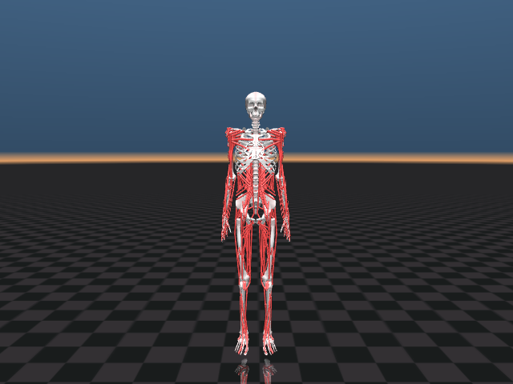
  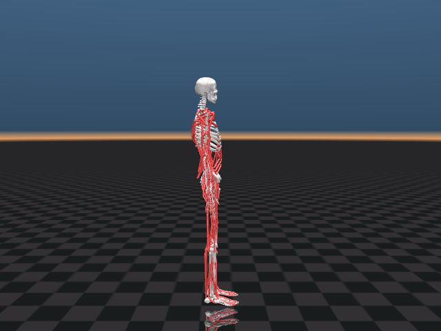
  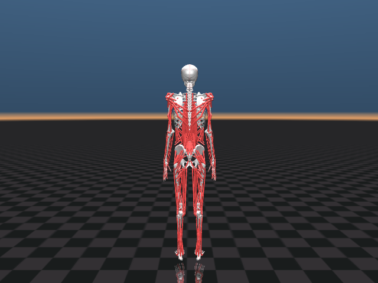
</p>

These three images are retained visual-progress artifacts from the pinned
MyoHub `myo_sim` `33c89c2bde282553dde3f526768eb3bdcfaa7649` source. They
are 640 × 480 default-pose renders of the composed `myofullbody` model. The
source is Apache-2.0; its attribution and the exact pin are in
[third-party notices](../THIRD_PARTY_NOTICES.md).

| View | SHA-256 | Inspection result |
| --- | --- | --- |
| Anterior | `136d27ebbbae009997abfdd761bbb0ae2375a3f76210f0b5d8e2ff4509a09d39` | head, bilateral shoulders/arms/hands, thorax, pelvis, legs, and feet visible |
| Lateral | `a5b3a27de38d143384d623d082643a32c43ab31d37fc471b79a1229d1cb0a52a` | continuous skull–spine–pelvis–leg posture with intact foot profile |
| Posterior | `59b98823de79643b1b7f2688d2f261bb74904fbed8a2cfd7bacef3d7f16bd97a` | posterior spine, scapular region, gluteal/hamstring chains, calves, and feet visible |

The images matter because the active mechanics source now covers the whole
body rather than treating lower-body, upper-body, and neck imports as separate
animated shells. They are visual evidence of the source model only. They do
not show native Core rendering, mesh registration, skinning, contact,
locomotion, deformable anatomy, or biological validation.

## Native articulated route snapshot — 2026-08-27

<p align="center">
  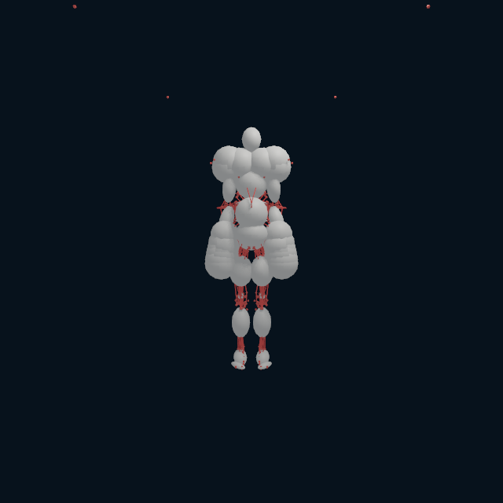
  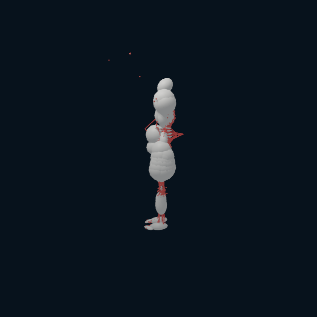
  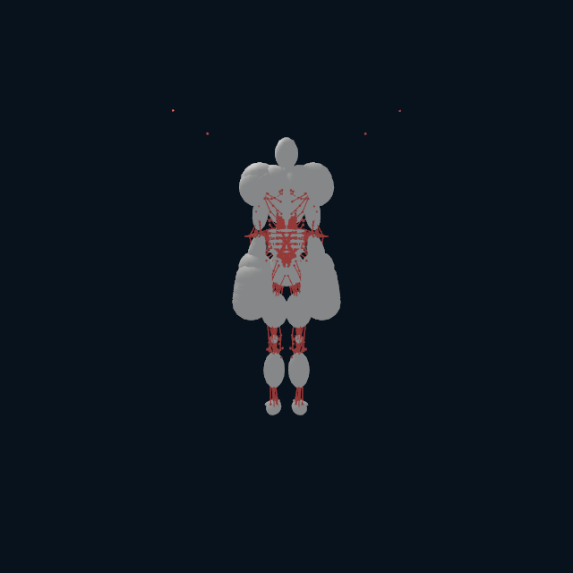
</p>

Core `79cc34a` captured these 640 × 640 default-pose views on an Apple M4 using
`numi human myosim-native-visuals`. The command directly reads `NHRIGID2` and
`NHMYO1`, runs the Metal articulated operator, then renders the published pose
through Core's native visual renderer. The pale shapes are intentionally simple
inertial-body proxies; red geometry is 1,815 source attachment sites plus 1,432
straight route-centreline segments. Wrap traversal remains owned by the muscle
probe; the visual centreline is a compact inspection representation, not a
claim of exact tangent geometry.

| View | SHA-256 | Rendered coverage | Inspection result |
| --- | --- | --- | --- |
| Front | `b11acf05f0f6a46d1fabd5474d4db7266d431d6f8060e30ed7a74c939f6eba47` | `17,415` body / `641` site / `1,147` route pixels | bilateral torso, pelvis, legs, feet, and routed lower-body chains visible |
| Side | `ce2b2fc5d86437d0646bc6de0644cb0a9597b7b9faaed5544d3add0c3551d484` | `9,844` body / `521` site / `850` route pixels | continuous profile with shoulder, torso, pelvis, lower-leg, and foot route evidence |
| Rear | `c5067eccb567b71319f7ee49084005f114af71476d478359ccfcaf970380c91b` | `16,873` body / `1,070` site / `2,200` route pixels | posterior trunk, pelvic, calf, and bilateral route coverage visible |

This is native pose-bound visual evidence, not a human anatomy beauty render.
It proves neither BodyParts3D registration nor skin/organ deformation, live
device-buffer presentation, contact, motion, muscle-force feedback in a
rollout, or clinical validation. The tracked visual-pack manifest records the
scene provenance alongside the three frames. Its pack and manifest SHA-256
values are `633ddb213167c1cc47b733ae80d8f25a7af36d86bf830fbf67a625f16e2a8b59`
and `8d21b2f3a265285655dde72f3611891c69a187248627419dc1be2788b101734f`.

## Native BodyParts3D major-bone binding — 2026-08-27

<p align="center">
  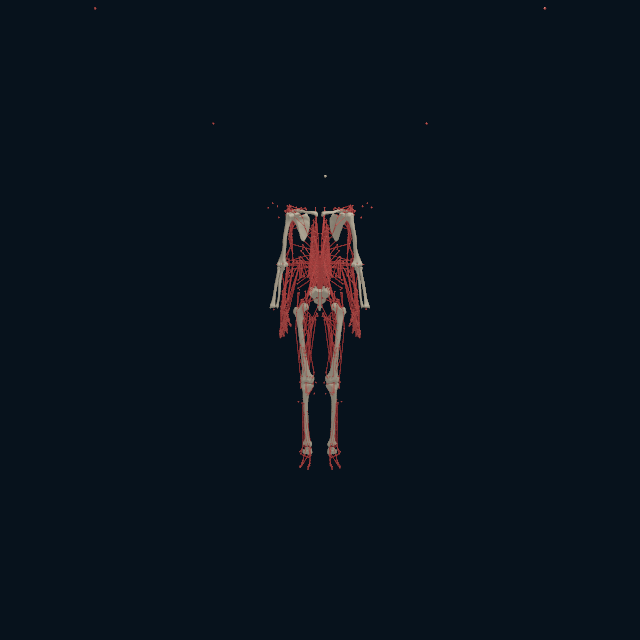
  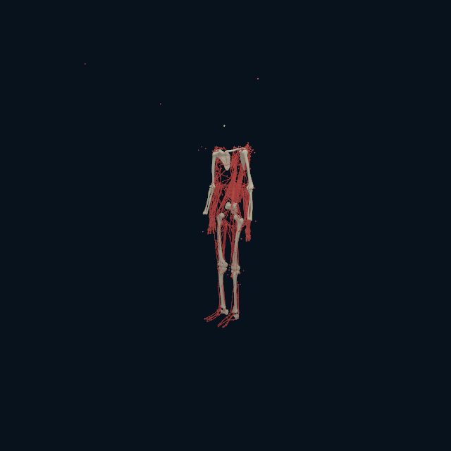
  
  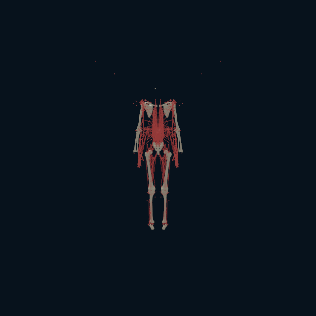
</p>

Core `818e5871f5d79f5f01b61305a49b14eac7035aae` captured this exact
`NHBONES1` package on the Apple M4 Pro on `macmini`. The native C++ program
read the compiled `NHRIGID2`/`NHMYO1` payloads plus 18 source-derived
BodyParts3D major-bone meshes (47,649 vertices; 277,164 indices), dispatched
the Metal articulated operator, and bound each mesh to its named Core
inertial-body pose. It also rendered all 1,815 compiled muscle sites and
1,432 route-centreline segments, in a thinner red inspection overlay.

The offline rest-frame fit enumerated 24 proper signed axis maps and selected
the identity axis map with positive scale `1.007736155369` after mm→m
conversion. Its equal-weight mesh-vertex-centroid to source-inertial-COM score
was `0.059372888 m` RMS (`0.123618266 m` maximum). A mesh centroid and an
inertial COM are not homologous anatomical landmarks, so these are
common-frame plausibility diagnostics—not surface-registration accuracy or a
medical registration claim.

| View | PNG SHA-256 | Bone / site / route pixels | Inspection result |
| --- | --- | --- | --- |
| Front | `e7d3700be997e623447aea1751d877c55256d114ce2fee984a2afffa977c29cf` | `3,538 / 1,067 / 3,305` | bilateral shoulders, arms, pelvis, legs, and feet are articulated together with the complete path overlay |
| Oblique | `28218653090bab514f68b2f0c70efb81190ef191d0fdde092bb35fcf9629e3e3` | `2,937 / 998 / 3,054` | shoulder/scapular and pelvic depth are visible without a mirrored frame |
| Side | `bf5e50c8895431c492cf74fb4f0aa9e44fbd0b4afe2ff38bff476bacb2c1559d` | `1,574 / 744 / 1,971` | sagittal skull–shoulder–pelvis–leg–foot sequence is continuous |
| Rear | `9ca74e452b0430703553471c3528d57dd040545a7b7dbef4c5485e4256f95b1f` | `3,618 / 1,087 / 3,753` | posterior bilateral limbs and the sacral/pelvic connection are visible |

The native [transcript](media/myosim-native-bodyparts-bones/native-articulated-bones.transcript.txt),
visual-pack manifest, and `.mrvpack` accompany the four frames. This validates
the complete `Metal pose → articulated BodyParts3D bone instance → native
renderer` chain at the source default pose. It does **not** admit those
provisional mesh transforms to collision or contact; it does not provide skin
weights, organ/vessel/nerve deformation, unregistered small bones, live
device-buffer presentation, a motion replay, gait, or clinical validation.

## Native bounded muscle-driven bone snapshot — 2026-08-27

<p align="center">
  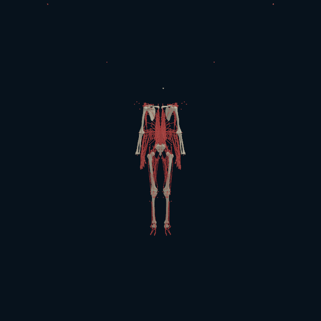
  
  
  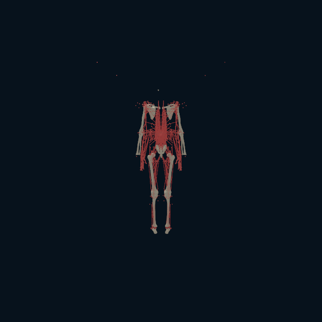
</p>

Core `2aab522f92f44644c35bbde1a8ea3fd85356b027` captured these 640 × 640
frames on the Apple M4 Pro on `macmini`. The new native visual mode reads the
same verified `NHRIGID2`, `NHMYO1`, and `NHBONES1` inputs as the default-pose
binding, reconstructs all 416 source MuJoCo muscle definitions, projects their
source-default `0.5` excitation / `0.5` activation forces in Core FP64, and
advances one free-body step. Metal then computes the final 157-body pose; Core
binds the 18 BodyParts3D bone instances and complete site/route overlay to
that pose for rendering. There is no Python process in this capture.

The selected 1 ms step is deliberately a bounded visual sensitivity probe. It
applies all 90 source-default wraps and changes the active state relative to
the identically integrated passive state by maximum velocity
`71.4839058782` and configuration `0.0714839058782`. This large
co-activation response is exactly why the capture is **not** called a posture,
trajectory, gait, or physiological prediction: there is no controller,
contact, repeated integration, or stability qualification.

| View | PNG SHA-256 | Bone / site / route pixels | Inspection result |
| --- | --- | --- | --- |
| Front | `36e56b0d77d7ded66ed248801c04a0199e3d6448c893a59d1eb65562c14c58ca` | `3,536 / 1,084 / 3,336` | bilateral major-bone skeleton, arms, pelvis, legs, and feet stay coherent with the complete path overlay |
| Oblique | `d6a609a3a1a3b214c6df31f395c5ad70e7f5b7c445fa6513539bb035f0d0eccd` | `2,942 / 995 / 3,080` | depth of both shoulder girdles and pelvis remains visible after the force-driven state change |
| Side | `4d2436a575cf8ef94312992c46ef2a1fbbf3267daad622fa7c722d46004b3340` | `1,589 / 755 / 1,981` | sagittal skull–shoulder–pelvis–leg–foot sequence remains continuous |
| Rear | `f9f081b8b18e8c2fec8d2f894bd9dabcea31e309ecaac590a15459b4c6a354cb` | `3,622 / 1,093 / 3,738` | posterior bilateral limbs and sacral/pelvic connection remain present |

The native [transcript](media/myosim-native-muscle-driven-bones/native-articulated-muscle-driven.transcript.txt),
visual-pack manifest, and `.mrvpack` accompany the four frames. This closes the
bounded `complete 416-muscle force → articulated state step → Metal pose →
BodyParts3D bone renderer` evidence chain. It does **not** make the provisional
bone transforms colliders; prove deformable muscle bellies, skinning, organs,
vessels, nerves, contact, a sustained muscle-force rollout, or clinical
anatomical validity separately.

## Native mechanics progress

```text
MyoSim source composition (offline)
              |
              v
 NHRIGID2 articulated tree + NHMYO1 muscle-route payloads
              |
              v
 C++ Core: kinematics -> spatial tendon routes -> muscle force -> J^T scatter
              |
              v
             forward dynamics (FP64 reference)
              |
              +--> Metal: poses + analytic point Jacobians -> 416 routes + static force
```

The native probe at Core `86790f3` passed with:

| Native property | Measured result |
| --- | --- |
| Source bodies / Core bodies | 103 / 157 (54 exact zero-inertia serial transform carriers) |
| Configuration / velocity dimensions | 129 / 128 |
| Active muscle-tendon elements | 416 |
| Route sites / materialized wrap geometries | 1,815 / 143 |
| Default-pose position / orientation error | `6.27e-08 m` / `9.88e-08 rad` |
| Source-oracle muscle length / force error | `2.56e-08 m` / `4.89e-04 N` |
| Inverse/forward dynamics round-trip error | `4.92e-13` |
| 416-muscle 1 µs state-coupling delta | `7.15e-02` velocity / `7.15e-08` configuration |

The last row is an unconstrained FP64 sensitivity comparison against the same
passive state, not a standing, walking, contact, or physiological-stability
result.

Run that exact native path without a Python process:

```sh
numi human myosim-native-probe Build/myosim-fullbody
```

## Apple-GPU full-body mechanics progress

The same fixed source pose is checked through the native Metal
kinematics/Jacobian plus MyoSim route-force route:

```sh
numi human myosim-native-probe Build/myosim-fullbody --metal
```

On the local Apple M4, this dispatched one 157-body / 128-DoF Human and
compared all body poses plus one nonzero point query per body against Core.

| GPU parity property | Measured maximum error |
| --- | --- |
| Body position | `6.3206736356e-07 m` |
| Body orientation component | `1.42935285885e-07` |
| Point position | `6.54161804947e-07 m` |
| Analytic point Jacobian | `7.34255547086e-07` |
| Spatial-muscle path length | `7.45058059692e-07 m` |
| Static actuator force | `2.62451171875e-03 N` |
| Applied spatial wraps | `90 / 90` |

This is actual Apple-GPU articulated execution, not a compile-only claim. The
kinematics-only route admits up to 192 bodies and 160 DoF because it does not
reserve the dense mass-factor scratch space. The 128-DoF dense mass solve,
MyoSim `J^T` scatter, and forward-dynamics stages remain the CPU reference
owner; no contact or locomotion is claimed here.

## Remaining visual/mechanical steps

1. Extend the inspected major-bone rest-frame binding to vertebrae, pelvis,
   hands/digits, toes, fibulae, talus, patellae, and the remaining named
   skeleton meshes; matching anatomical labels remain insufficient evidence.
2. Add the deformable skin path after those reviewed skeletal attachments; do
   not replace it with rigid-bone parenting.
3. Resolve the Mortensen spine-to-`cervical_spine` rest registration and make
   an explicit MyoSim neck/head replacement decision before applying its 72
   cervical/hyoid muscle forces.
4. Replace the one-step sensitivity capture with a deterministic native
   free-body replay: persist `q`/`v` and the 416 activation states, advance
   source-defined activation dynamics from an explicit recorded control stream,
   emit a bounded frame sequence, and compare it with the matched passive
   replay. Until a controller and contact are validated, call that evidence a
   free-body response—not a posture or gait.
5. Move the complete MyoSim `J^T` force scatter and dense forward-dynamics
   update to a measured device-resident path, preserving CPU-vs-Metal replay
   parity before promoting the native capture to a live presentation sidecar.
6. Add registered anatomical colliders and calibrated contact before any
   standing or walking qualification.

This ordering keeps the Human more realistic by retaining source mechanics and
by refusing to turn a visually plausible mesh into an uncalibrated physical
body.
