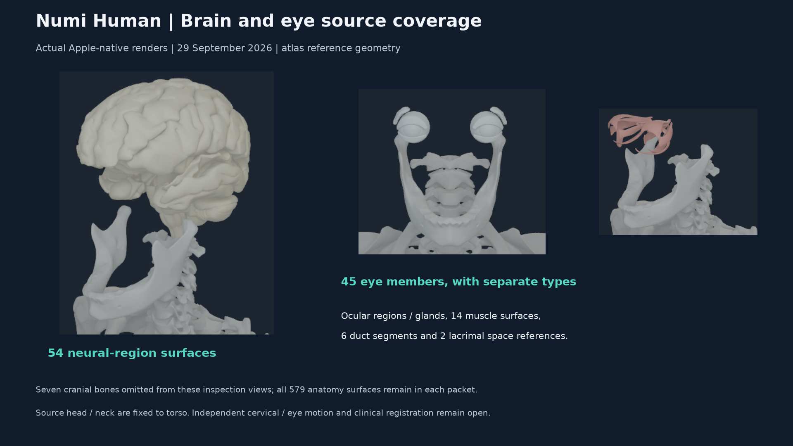
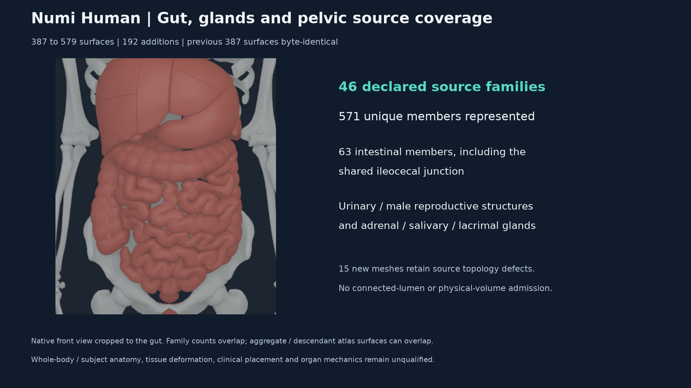

# Cumulative brain, ocular and visceral source geometry - 29 September 2026

The Human-owned source-family compiler now packages 579 surfaces, adding 192
source members to the previous 387-surface composite. All 571 unique members
of the 46 declared source families are represented. The previous 387 records,
vertices and triangles are byte-identical. The six existing Z-Anatomy thorax
surfaces and two BodyParts3D members outside the declared families remain.
This is complete membership of these source selections, not exhaustive Human
or subject anatomy.

## Source types and owners

The new selections cover brain, both complete eye families, small and large
intestines, rectum, esophagus, trachea, gallbladder, thymus, adrenal and
salivary/lacrimal glands, urinary and male reproductive structures. Spleen
was already present and is now a declared family. Family counts overlap;
shared members appear once. In particular, rectum belongs to the large
intestine family and the ileocecal junction belongs to both intestine families.

| Added source type | Surfaces | Layer | Semantic |
| --- | ---: | ---: | ---: |
| Material organ components | 85 | 1 | 51010 |
| Duct / lacrimal-duct segments | 8 | 10 | 51026 |
| Immaterial lacrimal space references | 2 | 9 | 51025 |
| Neural-region references | 54 | 11 | 51027 |
| Brain ventricular-region references | 5 | 12 | 51028 |
| Anatomical-junction reference | 1 | 13 | 51029 |
| Ocular-region references | 23 | 14 | 51030 |
| Ocular muscle references | 14 | 15 | 51031 |

Source `FMA78447` identifies the five ventricular-system regions. The source
classifies these as material/cardinal regions, so they are not relabeled as
immaterial cavities or admitted as fluid volume. `FMA5022` identifies ocular
muscle organs. The two lacrimal lakes retain their immaterial classification.
The source ileocecal junction does not establish a connected intestine lumen.
Colors identify source classes; they do not encode physiological state.

The additions use named source/Core owners: head 12/23 (108 members), neck
11/22 (one), torso 9/20 (three), Abdomen 4/7 (67), pelvis 91/128 (13). The
independent MuJoCo oracle checks the actual inertial COM frames, including
head, neck and pelvis. Eight skull anchor transformations reproduce the same
atlas-to-source-world matrix within `4.996e-15` coefficient error. This is
algebraic frame agreement, not intracranial containment or clinical placement.

The source fixes head and neck under torso and fixes pelvis under its root.
Independent cervical/eye joints are absent. The new geometry preserves that
behavior; no eye or cervical motion is invented. Esophagus, trachea and
ureters remain declared single-link references, without calibrated regional
deformation or mechanical attachments.

## Native execution and independent proof

NHANAT1 ABI 5 retains the binary layout and adds layers 11-15. The mask range
is 1-32767; ABI-5 default is 32767. Earlier ABI defaults remain unchanged, and
masks beyond an earlier ABI's admitted range fail before capture. Native
source geometry capacity remains 1024 surfaces, one million vertices and six
million indices. The new payload has 738,379 vertices and 3,869,040 indices.

The auditor reconstructs source triangle fans with an independent OBJ parser,
computes normals through NumPy, and uses source MuJoCo frames. It compares
every native triangle, vertex, normal, owner, semantic and visibility flag.
The prior 387-surface and 310/304-surface proofs run against the same extended
native packet; their scope/counts remain explicit. Pose owner identities are
unique and the full composite has exact pose-owner coverage. Prefix proofs
allow the additional owners while checking every original owner.

All 579 surfaces pass in raw rest, projected neutral and coupled torso pose.
Maximum added native/source position error is `1.832e-7 m` (0.1832 micrometres)
under the unchanged `2e-5 m` gate. The COM/orientation witness gate remains
`1e-6`. Separate masks inspect all five new semantic layers. Seven cranial
bones are omitted only from head inspection packets; the original bone
payload is unchanged and every anatomy surface remains in every packet.
Individual surfaces may be occluded. Eleven profiles retain 44 native PNGs.
The physics library and shaders are unchanged; shared-host timing is not
performance evidence.

The [receipt](media/whole-visceral-coverage-20260929/receipt.json) binds exact
source/configuration, binary/runtime, native command, packet and pose hashes,
independent audits, terminal tests and immutable executed-source copies.
Retained raw evidence is `Build/whole-visceral-coverage-20260929`. The first
repeat-compose check stopped because a diagnostic path changed from relative
to absolute; payload bytes and all other manifest data agree. The first
prefix audit exposed a legacy two-owner assumption. Its failure and the
interrupted initial test run remain separate from the corrected final runs.
No source geometry or numerical tolerance was altered to obtain acceptance.

The final regression run passes 43 distinct checks without skips. These cover
source omissions/type conflicts, an independently detected compiler face-winding
bug, hash-repaired native/payload corruption, head/neck/pelvic pose tampering,
unknown ABI/layer/mask refusal before capture and byte-identical historical
ABI 1-4 native geometry through the new reader.

## Remaining anatomy gaps

Fifteen added meshes retain exact-coordinate quotient topology defects:
`FJ1320`, `FJ1337`, `FJ1340`, `FJ1357`, `FJ1368`, `FJ1371`, `FJ1758`,
`FJ1780`, `FJ1822`, `FJ1828`, `FJ2568`, `FJ2569`, `FJ2570`, `FJ3132`,
`FJ3134`. The other 177 are closed-oriented candidates; neither group is
admitted as physical volume. Raw authored seams are retained. Self and
interdomain intersections are not checked by this increment. Previous heart,
liver, lung-envelope, knee-range and shoulder/skin gaps remain open.

Thyroid and other unselected structures, subject/female/population coverage,
intracranial/ocular clearance, tissue deformation, connected lumens, material
and mass ownership, cervical/ocular actuation, physiological coupling and
whole-Human anatomy remain unqualified. Source totals cannot close these gates.
Source-derived images retain [attribution](media/whole-visceral-coverage-20260929/ATTRIBUTION.md).

The board pack appends two slides to the existing 28-slide suite deck. Earlier
slides and their dates remain. The included 10-second standing video is the
28 September run and predates these anatomy changes.
