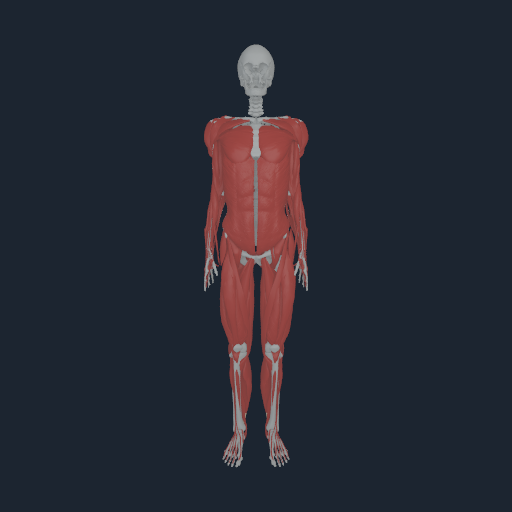
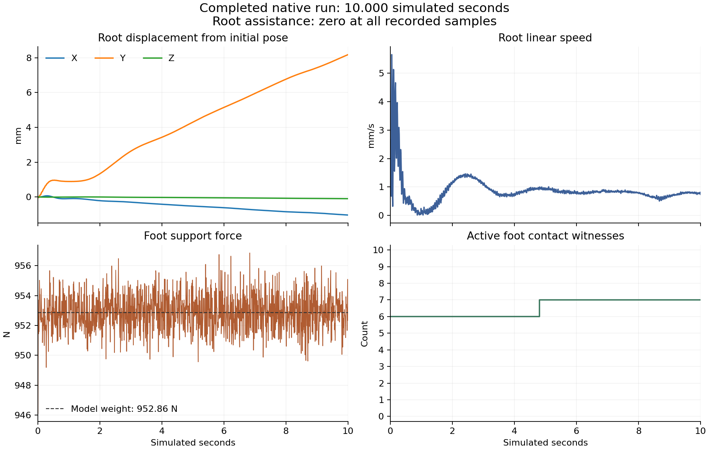

# Native Human: ten seconds of unassisted standing

On 2026-09-22 the persistent native Human completed **10,000 accepted 1 ms steps**, remained upright, and rendered its terminal state on an Apple M4 Pro. The process exited 0. All 1,250 eight-step submissions completed contiguously; no standing-horizon submission was rejected. Initial setup includes separate parity and rollback checks.

**This is functional standing, not 1:1 biomechanical qualification.** Whole-horizon physical force/energy closure remains unverified. In particular, the large -42.588 kJ equality impulse-work diagnostic requires accounting alongside the force predictor; it cannot be treated as physical dissipation or hidden by the small visible motion.



The model contains 157 articulated bodies, 128 velocity DoFs, 416 muscle routes, 832 tendon endpoints, and 51 source joint equalities. The render contains 185 bone meshes and 150 muscle/soft-tissue meshes. Native MyoSim owns current route geometry, compliant fibre/tendon state, activation dynamics and force. Source-path feedback observes accepted joint q/v and changes muscle excitation only. Gravity, passive joint forces, joint limits and unilateral foot contacts stay in the same native world. No root wrench, generalized preload, artificial root pose lock or added direct joint controller torque was used. All 64 contact sweeps were retained.

| Measured quantity | Result |
|---|---:|
| Simulated duration | 10.000 s |
| Wall time, including initialization and rendering | 2249.71 s (37 min 29.71 s) |
| Native horizon time | 2184.177 s |
| Maximum root assistance force / torque | 0 N / 0 Nm |
| Final horizontal root drift | 8.246 mm |
| Final vertical root change | -0.0935 mm |
| Final root orientation change | 0.25354 degrees |
| Final root linear speed | 0.7427 mm/s |
| Foot force at final step / model weight | 952.572 N / 952.864 N |
| Recorded foot-force range, sampled every 8 ms | 946.105–956.859 N |
| Recorded active foot contacts | 6–7 |
| Maximum foot penetration across accepted steps | 2.18299 micrometres |
| Maximum tendon transfer force / moment residual | 0.000136958 N / 0.00000203988 Nm |
| Tendon endpoint transfers | 8,320,000 |
| Maximum equality position / velocity error | 3.72529e-9 m-or-rad / 9.47453e-10 m/s-or-rad/s |
| Maximum generalized accepted acceleration | 29.20148 (mixed translational/angular units) |
| Maximum published velocity increment | 0.02920148 (mixed units), DOF 109 |
| Maximum muscle excitation correction at recorded samples | 0.07896; configured bound 0.2 |

The complete terminal q/v is finite. All raw progress and native diagnostics are retained in [stdout.txt.gz](stdout.txt.gz), with [wall-time output](stderr.txt) and [input/binary hashes](input-binary-sha256.txt). The accepted trajectory is plotted below; the image is a terminal-state render, not a video or a substitute for the run.



## Reproduction and comparison

Native runtime source: [58cc13b](https://github.com/Numi2/numi-lab/commit/58cc13b2e74737dece400a9be7c48c295aebad3b). Human command: [ec74757](https://github.com/Numi2/numilab-human/commit/ec74757925fea48b8d4942ed71767544914383c4). All five changed runtime source/header files matched the remote build source byte for byte. The skill update is [f611ee8](https://github.com/Numi2/numi-lab/commit/f611ee8e5bf17f973dd478fe7301e26070a6525d).

Use the hashed source package and visual payloads with the native build:

```sh
NUMI_LAB_ROOT=/path/to/numi-lab NUMI_BUILD_DIR=/path/to/native-build   .numi/commands/human stand "$inputs" "$bones" "$tendons" "$contacts" "$output"   --execute --steps 10000 --timestep 0.001 --dimension 512   --muscle-path-feedback 10 1 --soft-tissue-payload "$muscle_surfaces"
```

On the execution host, the exact launch is `/Users/n/human-standing-20260922/run-path-feedback-scene.sh`; the complete output, including the native visual pack, is `/Users/n/human-standing-20260922/path-feedback-10-seconds/`. The reusable local launcher is `/Users/home/human-standing-20260922/launch-standing.command`; it creates a fresh output directory and downloads the resulting images.

The 64 ms prefix with the same controller replayed bitwise ([output](short-replay.stdout.txt.gz)). The full ten-second run was executed once, not replayed. The earlier same-input open-loop run was stopped while falling at 2.384 s: root speed 2.13465 m/s, support 468.845 N, three contacts ([retained output](unassisted-fall.stdout.txt.gz)). At 2.384 s the feedback run had speed 0.001445 m/s and six contacts. The open-loop executable predates the feedback feature; this is not a same-binary paired ten-second experiment. Higher gains 40/4 were unstable and stopped at 1.240 s ([retained output](path-feedback-strong-stopped.stdout.txt.gz)).

## Physical limits retained

This establishes ten-second standing in the existing source-articulated Human path. It does **not** establish real-time operation, complete 1:1 human physiology, calibrated whole-body materials, disturbance recovery, gait, whole-body volumetric FEM, or integration with NumiBrain/Matter. The 40-entry upper-joint passive coupling and inferred musculotendon architecture remain experimental. The controller uses a fixed local source-path calibration; the force solver still evaluates current muscle geometry.

Unconstrained force acceleration before equality/contact reactions reached 9949.585 mixed units at DOF 112, with constraint velocity correction 9.949586; the accepted maximum above is reported separately. The native initial force residual diagnostic was 0.371141 N, not an all-time force-closure certificate. Signed impulse-work diagnostics were normal contact -60.2519 J, tangential contact -13.1244 J, equality -42588.4453 J, source limit -10.6096 J. Absolute normal-contact impulse work was 7990.2114 J and absolute equality work 42588.4453 J. These measure the effective response operator including implicit passive terms, not physical kinetic energy by themselves. No full-horizon mechanical-energy closure or metabolic claim is made. The large internal equality work remains a limitation for physical qualification and must not be hidden by the small accepted motion.

Source inspection shows that equality work uses `0.5 * delta_lambda * (row_velocity_before + row_velocity_after)` around each **intermediate `candidateV` correction**, including equality reactions induced by source-limit corrections ([kernel](https://github.com/Numi2/numi-lab/blob/58cc13b2e74737dece400a9be7c48c295aebad3b/src/metal/NumiHumanStand.metal#L1320)). These are solver-iterate velocities, not the two accepted time-step endpoint velocities. For example, a locked coordinate starting at zero velocity with predictor `v*=h*f/M_eff`, then corrected to zero, reports `W_eq=-h²*f²/(2*M_eff)` despite zero accepted kinetic-energy change. The diagnostic therefore includes predictor cancellation; establishing actual physical dissipation requires a matched force/potential/kinetic/passive-work accounting that this ten-second run does not record. Its final exact coordinate projection is also outside that impulse-work diagnostic.

BodyParts3D, © The Database Center for Life Science licensed under CC Attribution 4.0 International. These images are derived from registered BodyParts3D surfaces. MyoSim `myofullbody` source is Apache-2.0; see the repository [third-party notices](../../../THIRD_PARTY_NOTICES.md).
