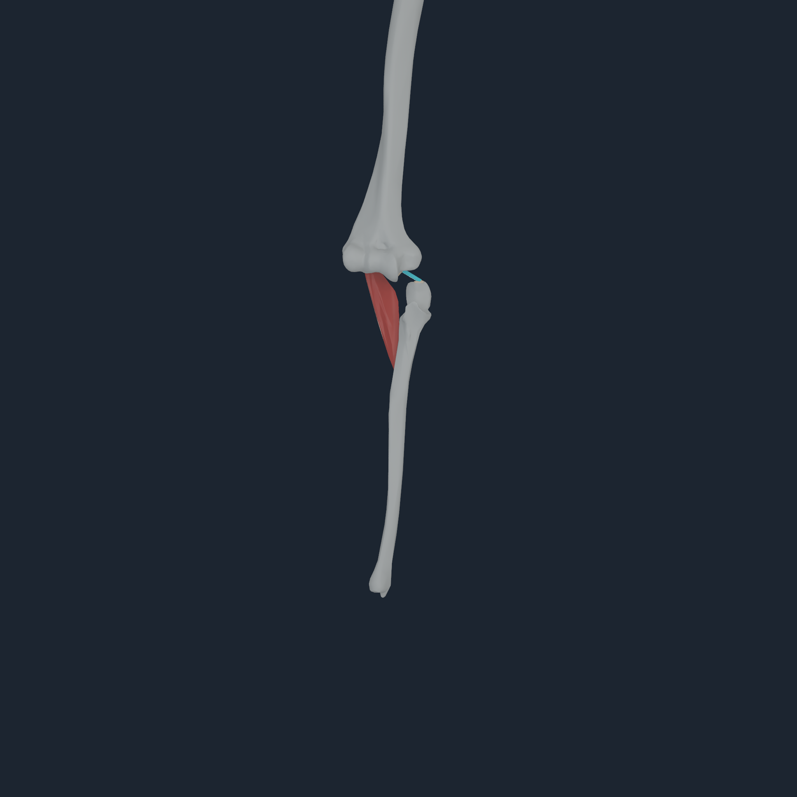
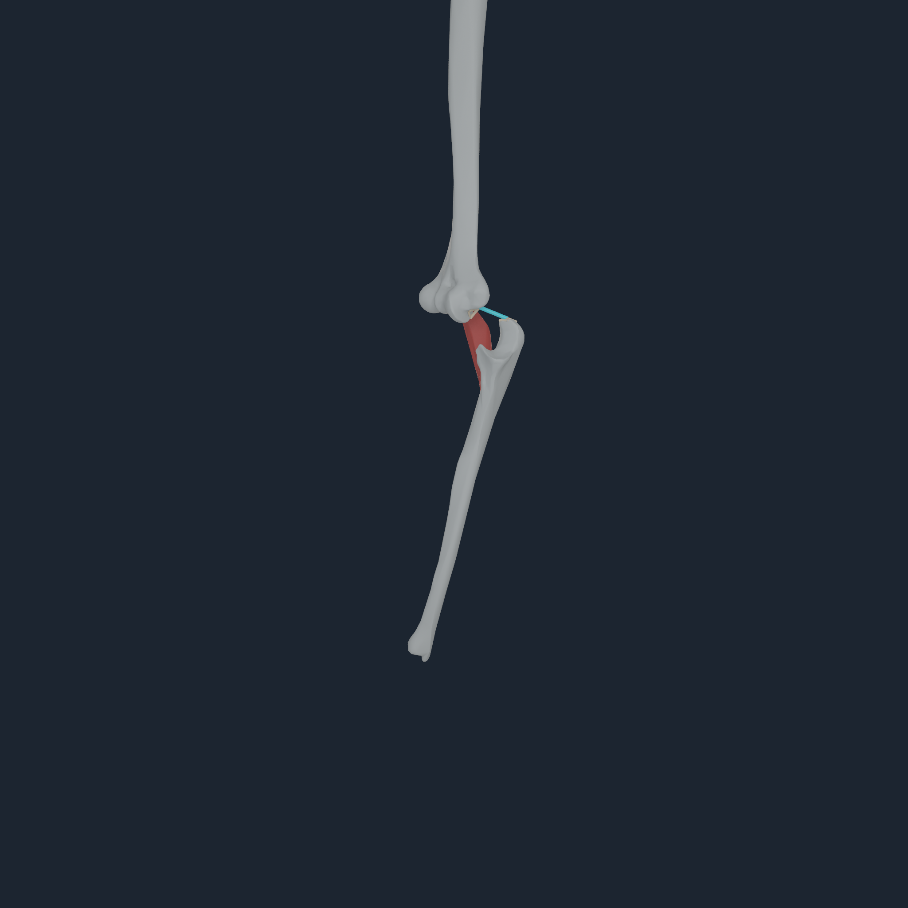
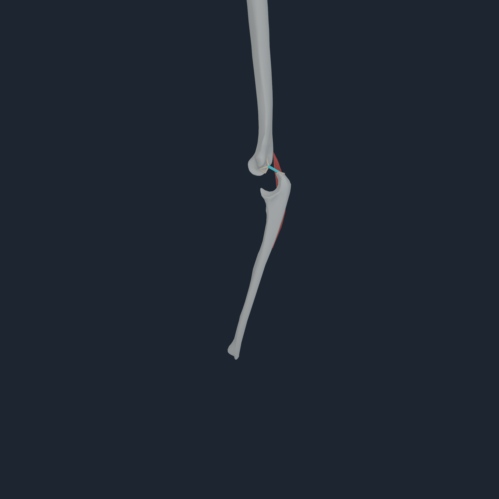
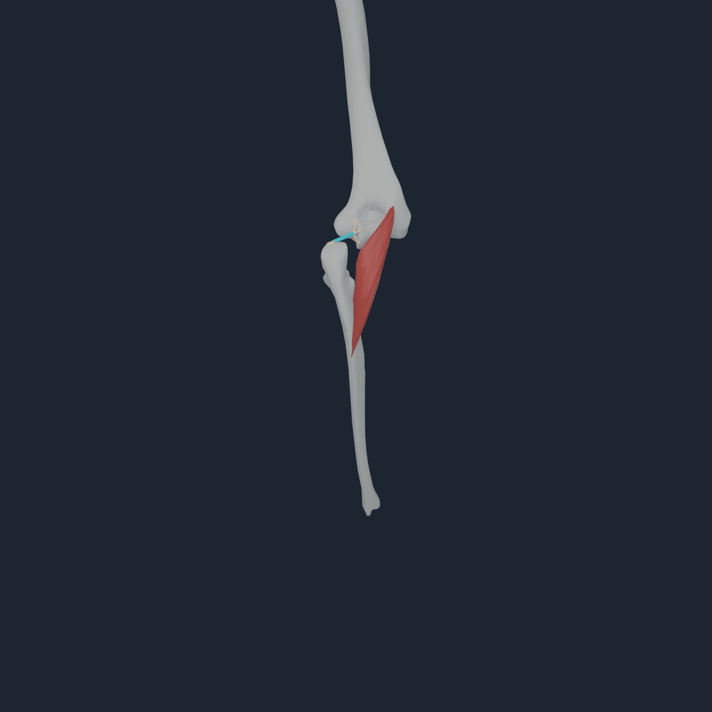

# NumiLab Human v1

An Apple-native, muscle-driven Human foundation for Numi Lab. The active
full-body mechanical source is **MyoSim `myofullbody`** (416 authored
muscle-tendon actuators); the Core owns the articulated state, muscle route
evaluation, force scatter, and forward dynamics. There is no Python process in
the native Human execution path.

| Role | Source | Status |
| --- | --- | --- |
| Active full-body mechanics | MyoSim `myofullbody` | 103 source bodies, 416 muscles, native Core reference |
| Cervical/hyoid mechanics | Mortensen 2018 | complete 72-muscle OpenSim 3 source IR; merge registration remains explicit |
| Anatomy/visual layers | BodyParts3D 4.0 | named geometry/hierarchy; 184 source bone meshes are pose-bound for native visual inspection |
| Regional fascia mechanics | BodyParts3D + human pectoralis-fascia literature + Matter | six load-driven pectoral regions; explicit generated NHFASC1 fallback, not a source segmentation |
| Detailed calf visual supplement | Z-Anatomy | four right-calf surfaces plus the matching calcaneus overlay; CC-BY-SA geometry rigidly bound to the existing BodyParts3D/MyoSim `calcn_r` body |
| Comparative lower-body mechanics | RajagopalLaiUhlrich2023 | retained source-faithful bounded Metal path |
| Comparative upper extremities | MoBL-ARMS | authenticated bimanual import or pinned public unimanual 4.1 source variant |

The current standing milestone is native and persistent: `numi human stand`
executes current-pose force from all 416 routes, activation, 157-body gravity
dynamics, ten authored foot witnesses, an assisted phase, and a zero-root-wrench
phase on Apple Metal. `NHTENDON2` now also produces and validates all 832
terminal-to-bone load records inside every accepted step, with rollback-safe
same-command-buffer exposure for a downstream deformable consumer. The live
Metal solve retains source passive DoF damping, uses bounded
acceleration-weighted recruitment, and requires one-step FP64 parity,
no-direct-torque identity, bitwise replay, and four-angle visual review. See
[Human Stand v1](Docs/HUMAN_STAND_V1.md) and the
[per-step tendon transaction](Docs/HUMAN_TENDON_STEP_TRANSACTION.md).

The next completed regional layer is deformable pectoralis fascia: six named
MyoSim/NHTENDON2 loads drive a 326-node Matter FEM solid with a human uniaxial
GOH mean fit, deterministic replay, and rejection rollback. The resulting
bounded displacement is presented on the exact 15,971-vertex BodyParts3D
pectoralis surfaces. Its mechanics geometry, anchors, and 10% load share are
explicit fallbacks because BodyParts3D has no pectoral-fascia mesh. See
[deformable pectoralis fascia v1](Docs/PECTORALIS_FASCIA_V1.md).

The importer preserves upstream records locally. The tracked MyoSim,
BodyParts3D, and explicitly marked Z-Anatomy validation media are attributed
derivatives; all other raw or derived source artifacts remain local. See
[third-party notices](THIRD_PARTY_NOTICES.md).

## Visual progress

The current lead recovers 82 endpoints that were already close to the correct
bone but rejected by sparse or ill-conditioned source topology. A deterministic
exact-surface quadrature raises distributed tendon-to-bone coverage from
282/832 to 364/832 without moving any authored endpoint or relaxing the 12 mm
and force-amplification gates. Its actual transfer footprints were inspected
from four angles at 2048 px on Apple M4 Pro. The coherent elbows, wrists, hands,
fingers, knees, feet, and all five toe chains remain unchanged. The source meshes
retain one BodyParts3D rest arrangement per limb while the existing MyoSim
articulation is preserved; fail-closed gates cover 82 declared limb
transitions. The pectoralis compiler also
locks only the exact BodyParts3D humeral insertion band to the arm and keeps
the broad abdominal/sternocostal origin on its thoracoabdominal route body;
the inferior-origin gate rejects any residual humerus ownership. The clean
views also show corrected hand chains and big-toe insertion surfaces, while
the mechanical-anatomy diagnostics expose the unchanged MyoSim EHL/FHL route
and four-node `NHTENDON2` transfer footprint on the exact distal hallux
phalanx.
Neither set is a photorealistic skin render: the clean gallery reviews source
surface continuity, while the diagnostic proves that force terminates on the
actual transfer program rather than a floating decorative tendon. See
[visual progress](Docs/VISUAL_PROGRESS.md) and the
[topology-aware enthesis record](Docs/TOPOLOGY_AWARE_ENTHESES_V1.md). The
[completion gap ledger](Docs/HUMAN_COMPLETION_GAP_LEDGER.md) keeps mechanics,
materials, contact, control, and validation gaps independently visible.

The exposed source anatomy is used to inspect muscles and tendons against
named bones. The BodyParts3D exterior remains a static source mesh only: it
has no authored skin weights and is not passed off as a finished realistic
muscle-driven Human exterior.

### Body-part control

`numi human control-list Build/nheq1` lists every Core body crossed
by an exact source muscle route. `numi human control ... <part-name>` then
resolves that name to the source actuator rows and adds a capped activation
increment over the compiled full-body posture. The persistent Apple Metal
operator reevaluates all 416 routes and publishes all 832 terminal loads inside
each accepted/rollback-safe `NHTENDON2` transaction. A matched zero-increment
run proves that the selected input changes state. The same fail-closed compiler
validates all ten bilateral toe chains and their exact hallux versus lesser-toe
terminal identities. See [transactional part control v2](Docs/PART_CONTROL_V2.md).
This is an inspectable coactivation and tendon force-transfer interface, not
yet a learned movement controller, deformable tendon, or independent
finger/toe articulation.

### Tendon-to-bone presentation

For the detailed right-calf inspection, the matching free Z-Anatomy
`Calcaneus.r` replaces only the visible calcaneus and is rigidly attached to
the same MyoSim `calcn_r` body. This optional derivative is visual-only and is
not the current tendon-quality reference.

For the primary BodyParts3D `FJ1405`/`FJ3360` tendons, the importer now retains
only the dominant exact source-connected sheet, drops disconnected source
slivers, and removes fully interior terminal-cap faces. It then adds a narrow,
explicitly inferred visual enthesis strip from that opened source boundary to
the named calcaneus, projected to its exact triangles with a 0.35 mm exterior
display offset. This makes the bone
insertion continuous in the render, but does not create a tendon continuum,
weld, force-transfer law, or photorealistic anatomy.

The bilateral BodyParts3D EHL/FHL surfaces now receive the same strict source
topology treatment: only each dominant exact connected sheet is retained.
FHL already reaches its named hallux bone; the 7.4 mm EHL source display gap is
closed by feathering only its terminal visual band onto exact `FJ3182`/`FJ3192`
triangles. This is explicitly visual registration; the MyoSim sites and v5
force-transfer law remain unchanged. See the [hallux v8 record](Docs/HALLUX_ENTHESIS_V8.md).
The three hallux bones and terminal patch deliberately share the existing
`toes_l`/`toes_r` rigid transform; no independent toe joint is needed for this
continuity repair, and compilation fails if that compound is split or shifted
to an adjacent toe. Exact maximum inter-bone source gaps are 0.727 mm right and
0.629 mm left.

`NHTENDON2` gives all 832 origin/insertion endpoints a fail-closed
tendon-to-bone law without moving an authored route site. After restoring the
source-coherent anatomy and resolving exact same-body hip/tibia/fibula plus
source-named thoracic vertebra/rib ownership, then resolving sparse source
topology without changing anatomy, 364 endpoints admit distributed
BodyParts3D bone-surface envelopes and 468 remain explicit body-owned
source-point laws (43.75% surface coverage).
The owning Metal route kernel publishes its exact
wrapped terminal directions, and a second Metal pass distributes those forces
while conserving their resultant and source-point moment. The coherent-body
Apple M4 Pro replay transferred all endpoints through 16 assisted and 16
assistance-removed steps (26,624 transfers), with 11,648 envelope and 14,976
point transfers, maximum residuals of `1.9601e-4 N` and `1.8631e-6 N m`,
rollback preservation, and bitwise replay. The remaining fallback count stays
visible: the older
independent mesh translations had hidden real BodyParts3D-to-MyoSim
registration disagreement. See the
[topology-aware exact-surface record](Docs/TOPOLOGY_AWARE_ENTHESES_V1.md).

The first inferred bilateral Achilles surface candidate was deliberately not
admitted: its current cross-source registration would move the six terminal
sites by about 49 mm, changing default muscle force by as much as 181 N. The
source point attachments therefore remain authoritative until the anatomical
registration improves. See [tendon attachment v2](Docs/TENDON_ATTACHMENT_V2.md)
and the legacy [point/triangle analysis](Docs/TENDON_FORCE_TRANSFER.md).

<p align="center">
  
  
  
  
</p>

This Mac-mini run executes eight assisted and eight zero-root-wrench 100 us
steps while Apple Metal reevaluates all 416 routes. It validates 13,312
terminal loads, including 4,720 four-node envelopes, and preserves bitwise
`q`/`v` identity against the output-only no-tendon path. The borrowed consumer,
rollback, and replay gates pass. The warm footprints/fans are the actual
four-node transfer program; cyan is the unchanged source route. Exact counters
and hashes are retained in the [capture record](Docs/media/numi-human-tendon-step-transaction-v3-2048/anconeus/capture.transcript.txt)
and [checksum set](Docs/media/numi-human-tendon-step-transaction-v3-2048/checksums.sha256).
This is per-step force-path and attachment-program evidence, not photorealistic
skin, clinical anatomy, or a deformable tendon continuum.

### Muscle-driven torso anatomy

The native `NHANAT1` path adds 12 exact BodyParts3D components to the exposed
Human: one source component from the heart group, stomach, pancreas, both
kidneys, four named aortic segments, both caval segments, and spinal cord.
Thoracic components follow MyoSim `torso`; abdominal components follow
`Abdomen`. The Apple-M4 2K capture applies all 416 MyoSim paths for one
100 µs bounded update before rendering all four angles. It is a source-bound
kinematic anatomy view—not a complete organ inventory, photorealistic body,
deformable organ/vessel model, or medical registration. See the
[capture record](Docs/media/myosim-native-torso-anatomy-2048/capture.transcript.txt).

### Exterior source boundary

BodyParts3D `FJ2810` contains nested source sheets. The importer selects its
exact outer connected sheet for a clean, source-derived exterior reference;
it has no upstream physical skin weights, material model, or deformation
qualification. The high-resolution animated-shell path remains retired after
oblique/rear failures.

### Muscle-driven full-body anatomy

The active four-angle source check evaluates all 416 MyoSim paths throughout a
64-step assisted phase followed by 64 steps with root assistance removed, then
renders the named bones and soft tissues at 1024 px on Apple M4 Pro. `NHTISS4`
retains every named route body for shared digital surfaces and stores up to
four sparse route-proximity influences per vertex. This fixes the old
middle-finger-only binding failure but remains kinematic presentation data,
not a deformable tissue or tendon result.

The hand registration now preserves exact BodyParts3D common-frame chain
displacements when an unsupported thumb or distal phalanx follows a
site-refined parent. Measured transformed mesh gaps are 0.5/0.3 mm for the
right thumb joints, 0.4/0.1 mm for the left, and 0.3--0.7 mm at the corrected
distal finger joints. The toe review confirmed five coherent bone chains. Its
first pass corrected a lesser-toe ambiguity; the reported defect was then
correctly isolated to the hallux and repaired by the v8 EHL/FHL visual
registration. The mechanical source still has one
articulated `toes` body per side, so the individual BodyParts3D toe bones are
not independent toe actuators. See the [hallux record](Docs/HALLUX_ENTHESIS_V8.md),
the historical [lesser-toe record](Docs/TOE_ENTHESIS_V5.md), and the
[current visual review](Docs/VISUAL_PROGRESS.md#hallux-insertion-continuity--2026-08-29).

### Shared-tendon, source-body attachment review

The `NHTISS3` source-surface payload binds each exact BodyParts3D Achilles
surface to its femur, tibia, and calcaneus owners. Proximal weights are
inherited from the named gastrocnemius/soleus source surfaces; the distal
source band is locked to the named calcaneus triangles. This remains a
kinematic visual surface, not a tendon continuum, weld, force-transfer law,
contact result, gait result, or clinical attachment certificate.

### Selective muscle-to-bone route review

This is the mechanical counterpart to the collagen-surface review. Only the
current pinned MyoSim gastrocnemius lateralis/medialis and soleus actuators
(348/349/369) receive `0.5` excitation for one 100 µs step; Metal still
evaluates all 416 authored paths before the bounded dynamics step. Cyan is the resolved source
spatial muscle–tendon route with endpoint cues projected to the articulated
BodyParts3D bones, so its rear and oblique views make the actual calcaneal
endpoints inspectable. The [capture record](Docs/media/myosim-native-three-body-achilles-2048/capture.transcript.txt)
contains the device counters and frame hashes. This is a force-path diagnostic,
not a tendon mesh, continuum, force-transfer certificate, gait, or clinical
attachment claim.

### Retired two-body tendon imagery

The older isolated tibia–calcaneus tendon images are retained only as
reproducibility artifacts. They are not presented as current anatomy because
they omit the gastrocnemius femoral ownership now represented in the shared
three-body review above.

### Source skin provenance

The exact 102,467-vertex, 203,382-triangle BodyParts3D `FJ2810` shell remains
the exterior source. It has no upstream skin weights, so proximity-derived
articulation is a rejected diagnostic rather than a Human presentation. It is
not a deformable-shell mechanics result or a human-quality textured avatar.

### Selective upper-limb source-actuator drive

This torso–scapula–humerus–forearm view uses 42 source bone meshes on
six articulated bodies and 20 exact BodyParts3D muscle surfaces. It excites
only ten named MyoSim sources: three pectoralis-major slips, anterior and
acromial deltoid, coracobrachialis, both biceps heads, brachialis, and
brachioradialis. The remaining 406 are set to zero excitation, but Metal still
evaluates all 416 authored routes at every one of the 64 × 100 µs updates.
The active/passive configuration difference is `0.0446275454086`; the
[capture record](Docs/media/myosim-native-right-upper-limb-flexion-drive-2048/capture.transcript.txt)
contains exact muscle indices, device counters, and frame hashes. This is a
bounded Apple-M4 muscle-force/free-dynamics inspection—not contact, a
controller, deformable soft tissue, tendon continuum, stable movement, or
clinical-registration evidence.

### Reviewed full-skeleton native inspection

This four-angle 2048 × 2048 native inspection binds 184 exact BodyParts3D
bone meshes—cranial bones, vertebrae, ribs, hands, feet, and the major
limbs—to 86 active MyoSim rigid parents and the Metal-computed 157-body pose.
A separate four-angle 1 ms snapshot uses all 416 source muscle-tendon forces
before the final native render. These are visual-skeleton and bounded
force-to-pose evidence, respectively; neither makes skin, tendons, organs,
contact, gait, or clinical-registration claims. See [visual progress](Docs/VISUAL_PROGRESS.md#reviewed-native-184-mesh-full-skeleton--2026-08-27).

### Native anatomy presentation reset

The previous native red-line galleries are retained as diagnostic artifacts but
are no longer presented as Human anatomy. They drew every source route as a
straight segment between sites and wrap centres, so a line could cut through a
wrap object or visibly miss a BodyParts3D surface. That is not an acceptable
tendon view.

The current native renderer resolves the source tangent contacts and samples
the selected sphere/cylinder wrap arcs at the rendered pose. Its default
anatomy view hides route lines; its focused inspection mode renders only a
chosen muscle set around one MyoSim link at 1024 × 1024, with source-site
endpoints visually projected to the nearest matching BodyParts3D bone triangle.
That projection never alters the force solver. The offline BodyParts3D
registration also has a visual-only per-bone attachment-site refinement. These
are inferred correspondences—not tendon-surface geometry or a medical
attachment certificate—so refined captures are reviewed before replacing the
gallery. See [visual progress](Docs/VISUAL_PROGRESS.md) for the exact boundary.

## Native full-body execution

After a local artifact has been acquired and compiled, the production-facing
reference needs only the Apple-native Numi Core executable:

```sh
# No Python process is started by this command. `--metal` additionally
# executes full-body pose/Jacobians plus all MyoSim route and static-force
# evaluations on the Apple GPU.
numi human myosim-native-probe Build/myosim-fullbody --metal

# Render the same compiled payload through the native articulated-marker view.
# This command starts no Python process.
numi human myosim-native-visuals \
  Build/myosim-fullbody \
  Docs/media/myosim-native-articulated

# Offline source registration/package preparation, followed by a native
# C++/Metal visual-skeleton capture.  The final command starts no Python
# process. The attachment refinement is optional and reserved for focused
# source-site inspection; the broad visual skeleton uses the common-frame
# candidate directly.
numi human myosim-bodyparts-registration \
  --sources Sources --artifact Build/myosim-fullbody \
  --output Build/myosim-fullbody/bodyparts3d-major-bone-registration.candidate.json
numi human myosim-bodyparts-bone-payload \
  --sources Sources \
  --registration Build/myosim-fullbody/bodyparts3d-major-bone-registration.candidate.json \
  --output Build/bodyparts3d-myosim-major-bones
numi human myosim-native-bone-visuals \
  Build/myosim-fullbody \
  Build/bodyparts3d-myosim-major-bones/bodyparts3d-myosim-major-bones.nhbones \
  Docs/media/myosim-native-full-skeleton-184-2048/default \
  --dimension 2048

# Native bounded force-to-pose sensitivity capture (no Python process).  The
# 1 ms limit is an inspection step, not an uncontrolled rollout duration.
numi human myosim-native-muscle-bone-visuals \
  Build/myosim-fullbody \
  Build/bodyparts3d-myosim-major-bones/bodyparts3d-myosim-major-bones.nhbones \
  Docs/media/myosim-native-full-skeleton-184-2048/muscle-driven \
  --muscle-step-seconds 0.001 --dimension 2048

# Inspect a named source subset by its manifest actuator indices. This native
# diagnostic resolves tangent contacts and wrap arcs; it is not a rendered
# muscle belly or a surface-attachment certificate. 348/349/369/371 are the
# right gastrocnemius lateralis/medialis, soleus, and tibialis anterior in the
# current pinned MyoSim manifest; body 136 is its right tibia.
numi human myosim-native-route-inspection \
  Build/myosim-fullbody \
  Build/bodyparts3d-myosim-major-bones/bodyparts3d-myosim-major-bones.nhbones \
  Build/route-inspection-right-lower-leg \
  136 348 349 369 371

# To inspect a real selective contraction, add a bounded step. The command
# excites the listed source actuators while still evaluating all 416 MyoSim
# paths on Metal, retains the source-foot support fallback when present, and
# draws the resolved route plus its endpoint cues on the linked bones. It does
# not turn the route diagnostic into a deformable tendon surface.
numi human myosim-native-route-inspection \
  Build/myosim-fullbody \
  Build/bodyparts3d-myosim-major-bones/bodyparts3d-myosim-major-bones.nhbones \
  Build/route-inspection-right-calf-selective-contraction \
  136 348 349 369 \
  --muscle-step-seconds 0.0001 --muscle-step-count 64 \
  --muscle-activation 0.5 --dimension 2048

# Prepare exact BodyParts3D posterior-calf muscle/tendon surfaces in the same
# source-default frame, then render them over the focused native skeleton.
# The current package requires the complete v2 184-mesh registration and uses
# a kinematic two-body bind, not deformable tissue mechanics.
numi human myosim-bodyparts-right-posterior-chain-payload \
  --sources Sources \
  --registration Build/myosim-fullbody/bodyparts3d-major-bone-registration.candidate.json \
  --output Build/bodyparts3d-myosim-right-posterior-chain
numi human myosim-native-soft-tissue-visuals \
  Build/myosim-fullbody \
  Build/bodyparts3d-myosim-major-bones/bodyparts3d-myosim-major-bones.nhbones \
  Build/bodyparts3d-myosim-right-posterior-chain/bodyparts3d-myosim-right-posterior-chain.nhtissue \
  Docs/media/myosim-native-posterior-chain-2048/default \
  136 --dimension 2048

# The same exact surfaces after a bounded all-416-muscle *incremental*
# activation step. Zero-activation source pre-stress is subtracted before the
# force step; this remains a coupling check, not stable/contact-qualified motion.
numi human myosim-native-muscle-soft-tissue-visuals \
  Build/myosim-fullbody \
  Build/bodyparts3d-myosim-major-bones/bodyparts3d-myosim-major-bones.nhbones \
  Build/bodyparts3d-myosim-right-posterior-chain/bodyparts3d-myosim-right-posterior-chain.nhtissue \
  Build/myosim-native-posterior-chain-muscle-stress \
  136 --muscle-step-seconds 0.001 --muscle-activation 0.05 --dimension 2048

# The source-authored foot primitives provide a bounded support-contact
# snapshot before the final Metal pose/render. This native command reports
# whether contact was admitted to Metal; the full 157-body tree currently uses
# the Core FP64 exact-cone fallback and never claims GPU contact when rejected.
numi human myosim-native-supported-muscle-soft-tissue-visuals \
  Build/myosim-fullbody \
  Build/bodyparts3d-myosim-major-bones/bodyparts3d-myosim-major-bones.nhbones \
  Build/bodyparts3d-myosim-right-posterior-chain/bodyparts3d-myosim-right-posterior-chain.nhtissue \
  Docs/media/myosim-native-supported-posterior-chain-attachment-2048 \
  136 --muscle-step-seconds 0.001 --muscle-activation 0.05 --dimension 2048

# Package the audited full-body muscle-surface map. The offline importer
# verifies every ordinary surface against its exact BodyParts3D FJ mesh and
# named MyoSim route endpoints; the native capture remains Python-free.
numi human myosim-bodyparts-fullbody-muscle-surface-payload \
  --sources Sources \
  --registration Build/myosim-fullbody/bodyparts3d-major-bone-registration.candidate.json \
  --artifact Build/myosim-fullbody \
  --output Build/bodyparts3d-myosim-fullbody-muscle-surfaces
numi human myosim-native-fullbody-soft-tissue-visuals \
  Build/myosim-fullbody \
  Build/bodyparts3d-myosim-major-bones/bodyparts3d-myosim-major-bones.nhbones \
  Build/bodyparts3d-myosim-fullbody-muscle-surfaces/bodyparts3d-myosim-fullbody-muscle-surfaces.nhtissue \
  Docs/media/myosim-native-fullbody-geometry-framed-2048 \
  --dimension 2048

# Optional detailed right-calf geometry. Blender is used only for this
# offline, CC-BY-SA source export; neither native inspection command starts
# Blender or Python. The payload retains MyoSim/BodyParts3D body bindings.
# For this scoped inspection its matching free Calcaneus.r replaces only the
# visible BodyParts3D calcaneus, while remaining rigidly bound to the existing
# `calcn_r` body; this avoids warping the authored tendon onto a different mesh.
# The optional derivative is visual-only. It smooths the atlas tendon, then
# the importer carries only its named terminal lock band 1.5 mm inside the
# matching calcaneus triangles so opaque bone hides the artificial closed cap.
# It never changes a MyoSim parameter or force route.
/opt/homebrew/bin/blender --background /path/to/Startup.blend \
  --python tools/export_zanatomy_calf.py -- Build/zanatomy-calf-export.json \
  --tendon-subdivision-level 1 --tendon-insertion-depth-mm 8
# Reuse the same exact source lowerer, but emit just the three right-calf
# muscles and their shared Achilles surface. Stable IDs remain 1/3/5/7, so no
# attachment is inferred from unrelated whole-body meshes.
numi human myosim-bodyparts-fullbody-muscle-surface-payload \
  --sources Sources \
  --registration Build/myosim-fullbody/bodyparts3d-major-bone-registration.candidate.json \
  --artifact Build/myosim-fullbody \
  --stable-id 1 --stable-id 3 --stable-id 5 --stable-id 7 \
  --output Build/bodyparts3d-myosim-calf-base
numi human zanatomy-calf-visual-supplement-payload \
  --sources Sources \
  --registration Build/myosim-fullbody/bodyparts3d-major-bone-registration.candidate.json \
  --base-payload Build/bodyparts3d-myosim-calf-base/bodyparts3d-myosim-fullbody-muscle-surfaces.nhtissue \
  --zanatomy-export Build/zanatomy-calf-export.json \
  --output Build/zanatomy-calf-myosim-tissues
numi human myosim-native-zanatomy-calf-inspection \
  Build/myosim-fullbody \
  Build/bodyparts3d-myosim-major-bones/bodyparts3d-myosim-major-bones.nhbones \
  Build/zanatomy-calf-myosim-tissues/zanatomy-calf-myosim-tissues.nhtissue \
  Docs/media/myosim-native-zanatomy-calf-2048 --dimension 2048
numi human myosim-native-zanatomy-calcaneal-insertion \
  Build/myosim-fullbody \
  Build/bodyparts3d-myosim-major-bones/bodyparts3d-myosim-major-bones.nhbones \
  Build/zanatomy-calf-myosim-tissues/zanatomy-calf-myosim-tissues.nhtissue \
  Docs/media/myosim-native-zanatomy-calf-2048/calcaneal-insertion --dimension 2048

# Default whole-body, ground-supported muscle-force presentation. This starts
# no Python process: all 416 MyoSim routes and activation sidecars run on
# Metal; the present 157-body contact island uses the explicitly reported
# Core-FP64 contact fallback before the final native Metal render.
numi human myosim-native-supported-fullbody-muscle-visuals \
  Build/myosim-fullbody \
  Build/bodyparts3d-myosim-major-bones/bodyparts3d-myosim-major-bones.nhbones \
  Build/bodyparts3d-myosim-fullbody-muscle-surfaces/bodyparts3d-myosim-fullbody-muscle-surfaces.nhtissue \
  Docs/media/myosim-native-fullbody-supported-metal-force-2048 \
  --muscle-step-seconds 0.0001 --muscle-step-count 32 \
  --muscle-activation 0.05 --dimension 2048

# Build the exact exterior BodyParts3D shell for source-static inspection only.
# The source has no anatomical skin weights. The optional proximity binding is
# a rejected diagnostic, not current muscle-driven gallery or motion evidence.
numi human myosim-bodyparts-skinned-shell-payload \
  --sources Sources \
  --registration Build/myosim-fullbody/bodyparts3d-major-bone-registration.candidate.json \
  --output Build/bodyparts3d-myosim-skinned-shell
numi human myosim-native-supported-skinned-fullbody-visuals \
  Build/myosim-fullbody \
  Build/bodyparts3d-myosim-major-bones/bodyparts3d-myosim-major-bones.nhbones \
  Build/bodyparts3d-myosim-skinned-shell/bodyparts3d-myosim-skinned-shell.nhskin \
  Docs/media/myosim-native-skinned-fullbody-metal-force-2048 \
  --muscle-step-seconds 0.0001 --muscle-step-count 32 \
  --muscle-activation 0.05 --dimension 2048

# Four-angle calcaneal insertion review. This consumes a single matched pair
# of source-prepared visual payloads; the native executable rejects a mixed
# visual-registration pair before rendering. No Python process is started.
numi human myosim-native-calcaneal-tendon-detail \
  Build/myosim-fullbody \
  Build/bodyparts3d-myosim-major-bones/bodyparts3d-myosim-major-bones.nhbones \
  Build/bodyparts3d-myosim-fullbody-muscle-surfaces/bodyparts3d-myosim-fullbody-muscle-surfaces.nhtissue \
  Docs/media/myosim-native-calcaneal-tendon-detail-2048 \
  --dimension 2048

# Run the named right shoulder/elbow flexion set. Its ten source actuators are
# explicit; every one of the 416 MyoSim routes is still evaluated natively.
# This command starts no Python runtime.
numi human myosim-native-right-upper-limb-flexion-drive \
  Build/myosim-fullbody \
  Build/bodyparts3d-myosim-major-bones/bodyparts3d-myosim-major-bones.nhbones \
  Build/bodyparts3d-myosim-fullbody-muscle-surfaces/bodyparts3d-myosim-fullbody-muscle-surfaces.nhtissue \
  Docs/media/myosim-native-right-upper-limb-flexion-drive-2048 \
  --dimension 2048

# Export a separate exact BodyParts3D rest-frame reference for the right lower
# leg. It contains source bone, muscle, and calcaneal-tendon surfaces and is
# intentionally not claimed as an articulated or physical attachment. Render
# it with `metalrobo_bodyparts3d_visual_probe --dimension 1024
# --focus-lower-third` for a useful muscle/tendon inspection scale.
numi human right-lower-leg-anatomy-preview \
  --sources Sources \
  --output Build/bodyparts3d-right-lower-leg-anatomy

# A more focused posterior-chain source inspection. It preserves authored OBJ
# normals, excludes anatomy that would hide the tendon, and is static only.
numi human right-calcaneal-tendon-continuity-preview \
  --sources Sources \
  --output Build/bodyparts3d-right-calcaneal-tendon-continuity
```

This loads the `NHRIGID2` and `NHMYO2` payloads directly into Core, validates
the 128-DoF floating articulated tree, evaluates every muscle route, applies
the resulting generalized force, and executes forward dynamics. With `--metal`,
the same command buffer also evaluates all 416 MuJoCo-source spatial routes,
their damped compliant fiber/tendon forces, and the complete source
`J^T` generalized-force projection on the Apple GPU, without restaging poses
through the CPU. The same native transaction can then advance every valid
MyoSim activation sidecar by one explicit `100 µs` Metal step; the probe uses
non-equilibrium source states and requires the reusable command-buffer path to
publish the same next state as the one-shot path. On Apple M4, the device’s
maximum per-muscle force-vector
error is `0.152346560456 N` against a `1238.3975863 N` maximum reference
force; the deterministic all-416 generalized-force reduction differs by
`0.146845914025` against a `4358.68440349` reference scale. The reference command still
returns its one-step activation result for inspection. The separate
`numi human stand` path now keeps activation, current-pose route force,
128-DoF large-state dynamics, and authored foot support on device across a
bounded horizon; its exact high-velocity bias, joint limits, general collision,
skin/organ solvers, and clinical qualification remain separate work.

The bounded `--muscle-step-*` visual path now consumes that same retained
Metal force transaction for both the active and zero-activation baseline at
each step. Core FP64 still receives only the two returned 128-DoF force
vectors to advance the current full-body state; the final pose and all camera
renders remain native Metal. This removes the former host loop that projected
416 individual muscle paths during a visual update, without overstating the
remaining dynamics/contact boundary.

The same native reference also compares one unconstrained 1 µs FP64 state step
with the complete 416-muscle generalized force against the identical passive
state. The active route force changes velocity by `0.0714839058782` and
configuration by `7.14839058782e-08`; this is a bounded state-coupling smoke
test, not stable movement, contact, gait, or physiological calibration.

## Offline source import

MyoSim's own upstream composition API is Python. It is used *only* to acquire
and serialize source values into immutable native payloads; it is not part of
the Numi runtime, control loop, or physics execution. Keep it isolated in the
source environment:

```sh
python3 -m venv .venv
.venv/bin/pip install -e .

# Fetch the pinned Apache-2.0 MyoSim and MIT Mortensen source checkouts.
numi human myosim-fetch --output Sources

# Offline source compilation only; generated payloads then run natively above.
numi human myosim-build \
  --sources Sources \
  --python .venv-myosim/bin/python \
  --output Build/myosim-fullbody

numi human mortensen-neck \
  --sources Sources \
  --output Build/mortensen-neck/mortensen-neck-source.ir.json

# `numi human` is this repository's workspace capability. It fetches only
# BodyParts3D 4.0 and the pinned Rajagopal model; it never tries
# to bypass the SimTK login required for MoBL-ARMS.
numi human fetch --output Sources

# Download the original bimanual MoBL-ARMS archive while signed into SimTK,
# then build a local Human v1 manifest.
numi human build \
  --sources Sources \
  --upper-archive /path/to/MobL_ARMS_OpenSim3_bimanual_model.zip \
  --accept-upper-noncommercial-terms \
  --output Build/human-v1

# For non-commercial research, the pinned public unimanual MoBL-ARMS 4.1
# source variant can be fetched and imported explicitly. It does not replace
# the original authenticated bimanual release above.
numi human fetch \
  --output Sources \
  --include-public-mobl-41 \
  --accept-upper-noncommercial-terms
numi human build \
  --sources Sources \
  --upper-public-mobl-41 \
  --accept-upper-noncommercial-terms \
  --output Build/human-v1-public-unimanual

# Audit the selected free foundation separately from the authenticated-bimanual
# manifest and from the active MyoSim full-body route. This marks the public
# MoBL source correctly as a non-commercial unimanual upper-body variant.
numi human audit \
  --sources Sources \
  --upper-public-mobl-41 \
  --runtime-root /path/to/MetalRobo \
  --output Build/human-v1-gates.json

# Fingerprint every separate BodyParts3D OBJ and conservatively preflight its
# surface topology. This does not repair or convert a source mesh.
numi human geometry-audit --sources Sources --output Build/bodyparts3d-topology.json

# Export the exact BodyParts3D full-skin OBJ as a source-static visual preview.
# This is intentionally unregistered to OpenSim frames and has no physics semantics.
numi human visual-preview --sources Sources --output Build/bodyparts3d-skin-preview

# Emit the source-derived mobile pelvis and 80-muscle learned-walking contract.
# It records the bounded synthetic contact-response path but leaves anatomical
# collider registration/contact calibration as gated work.
numi human walking-contract --sources Sources --output Build/rajagopal-walking-contract.json

# Build and run the immediate goal: a mobile, muscle-driven lower body on
# flat ground. The four simple foot pads are temporary engineering scaffolding,
# not anatomical BodyParts3D foot geometry.
numi human pilot --sources Sources --output Build/lower-body-pilot --smoke

# Produce review-only lower-body anatomy attachment and foot-collider work items.
numi human attachment-worklist --sources Sources --output Build/lower-body-attachments.json

# Create the provenance-pinned, fail-closed hand-off for the four source foot
# bodies. A reviewer must add transforms and collider/calibration receipts;
# this command never infers them from names.
numi human foot-registration-template --sources Sources --output Build/foot-registration-template.json

# Derive hash-pinned, source-local enclosing-box candidates for the same foot
# meshes. These are not OpenSim-frame colliders until the reviewed transform
# and contact-calibration receipts are supplied.
numi human foot-collider-preflight --sources Sources --output Build/foot-collider-preflight.json

# Combine the exact source identities and source-local boxes into one blank,
# provenance-pinned reviewer receipt. It still cannot supply transforms or
# calibrated contact values on the reviewer's behalf.
numi human foot-registration-receipt-template --sources Sources --output Build/foot-registration-receipt-template.json

# After a reviewer completes the receipt, verify its source hashes, rigid
# transform math, three-view evidence, and contact-field completeness. This
# does not turn the review into a physics or walking qualification.
numi human foot-registration-receipt-check --sources Sources --receipt Build/reviewed-foot-receipt.json --output Build/reviewed-foot-receipt-validation.json

# Export exact source-static skin, bone, muscle, vessel, and nerve layer previews.
numi human visual-layers --sources Sources --output Build/bodyparts3d-layers

The five source-static anatomy layers have passed three-angle Apple M4 Pro
inspection; see [visual validation](Docs/VISUAL_VALIDATION.md). This confirms
geometry cooking and visibility only—not registration, deformation, contact,
or walking.

# Produce one source-derived distal-leg PinJoint URDF for native compiler
# validation. It intentionally has no collision geometry or muscle lowering.
numi human preview --sources Sources --side right --output Build/right-pin-preview

# Preserve and evaluate all Rajagopal CustomJoint function tables as compiler
# IR and default-value test vectors. The matching Core revision executes the
# bounded FunctionBased tree, mobile pelvis root, and source Millard effort in MetalWorld
# free motion or a synthetic streamed-contact probe; this command remains the
# provenance compiler for that source program.
numi human kinematics --sources Sources --output Build/custom-joint-ir

# Compile the entire Rajagopal rigid tree into the provenance-locked Core CPU
# reference payload. This is neither a RobotPack nor an accelerated rollout.
numi human core-reference --sources Sources --output Build/rajagopal-core-reference
```

## What the first manifest means

| Source data | NumiLab Human v1 role | Current physical boundary |
| --- | --- | --- |
| OpenSim bodies, joints, masses, inertias | articulated rigid-body specification | bounded FunctionBased free motion and synthetic source-contact response are device-qualified for the fixed tree and a fail-closed source-default mobile pelvis-root reducer; anatomical registration/contact remain separate |
| OpenSim muscle paths and Hill-type parameters | active muscle–tendon specification | 80 Rajagopal Millard elements accept an explicit control stream or a fail-closed, complete ordered native-task excitation surface, then update activation on device for the fixed tree or source-default mobile root in the synthetic source-contact probe; OpenSim equivalence remains open |
| BodyParts3D bones and muscles | named geometry attached to semantic anatomy | visual/anatomical geometry, not a new independent physical source |
| BodyParts3D skin, organs, vessels, nerves | deformable/anatomical geometry candidates | no material constants or volumetric meshes are supplied upstream |
| tendons, ligaments, cartilage | nonlinear tensile / compliant-contact candidates | only OpenSim tendon parameters are active-source data; all other constitutive data needs a cited calibration |

See [the architecture](Docs/ARCHITECTURE.md), [import procedure](Docs/IMPORT.md),
[bounded execution evidence](Docs/EXECUTION_EVIDENCE.md),
[source-static visual validation](Docs/VISUAL_VALIDATION.md), and
[third-party notices](THIRD_PARTY_NOTICES.md) before building or publishing
derived data.
