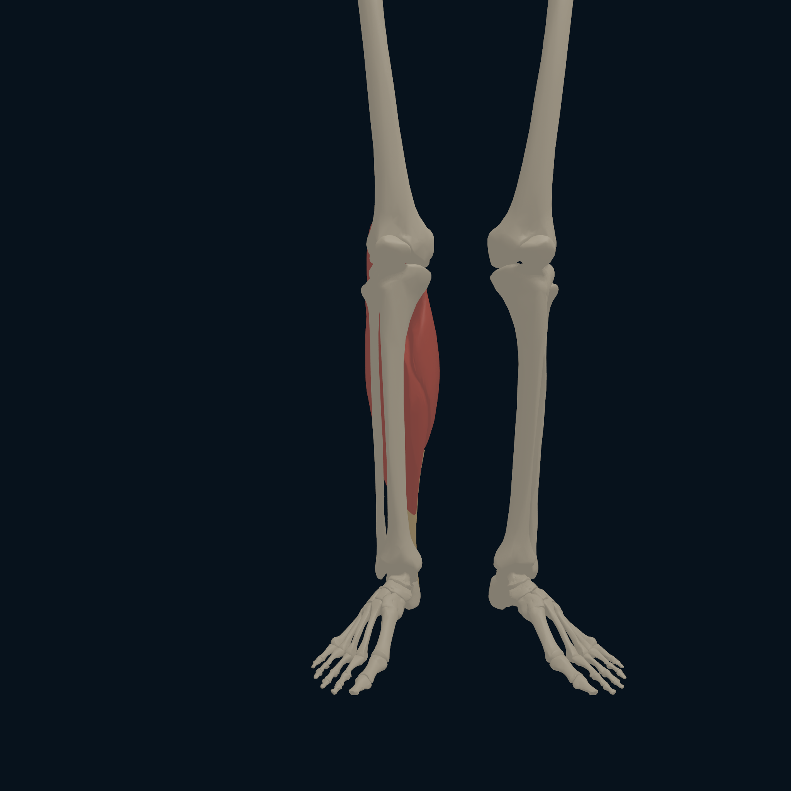
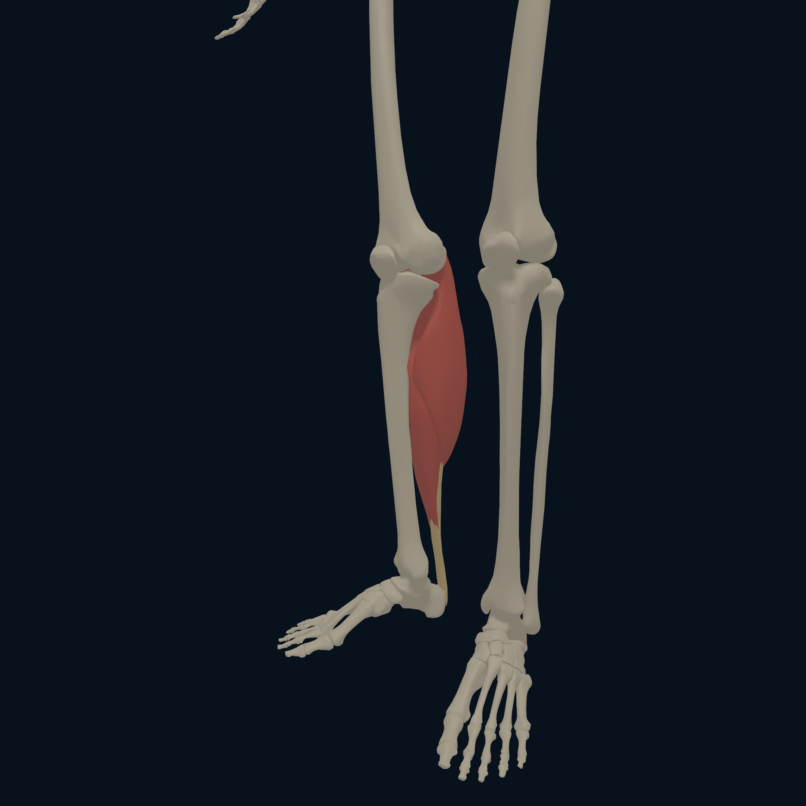
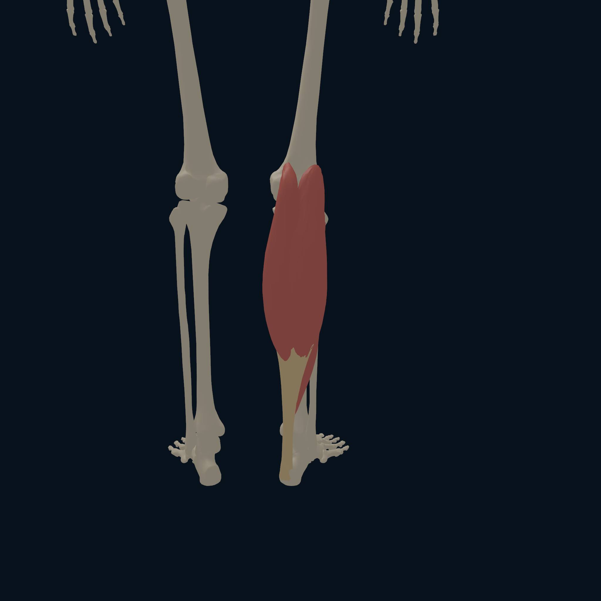

# NumiLab Human v1

An Apple-native, muscle-driven Human foundation for Numi Lab. The active
full-body mechanical source is **MyoSim `myofullbody`** (416 authored
muscle-tendon actuators); the Core owns the articulated state, muscle route
evaluation, force scatter, and forward dynamics. There is no Python process in
the native Human execution path.

| Role | Source | Status |
| --- | --- | --- |
| Active full-body mechanics | MyoSim `myofullbody` | 103 source bodies, 416 muscles, native Core reference |
| Cervical/hyoid mechanics | Mortensen 2018 | complete 72-muscle OpenSim 3 source IR; merge registration remains explicit |
| Anatomy/visual layers | BodyParts3D 4.0 | named geometry/hierarchy; 184 source bone meshes are pose-bound for native visual inspection |
| Comparative lower-body mechanics | RajagopalLaiUhlrich2023 | retained source-faithful bounded Metal path |
| Comparative upper extremities | MoBL-ARMS | retained authenticated OpenSim source import |

The importer preserves upstream records locally. The tracked MyoSim and
BodyParts3D validation media below are attributed derivatives; all other raw
or derived source artifacts remain local. See
[third-party notices](THIRD_PARTY_NOTICES.md).

## Visual progress

The previous 640 × 480 source-model images have been withdrawn from the
showcase. They remain provenance artifacts, but their framing and tendon
appearance are not the quality bar for NumiLab Human. The replacement uses
exact BodyParts3D muscle/tendon surfaces in the same source-default frame as
the articulated skeleton; it keeps a force-path diagnostic separate from
anatomy presentation. See [visual progress](Docs/VISUAL_PROGRESS.md) for the
evidence boundary.

### Reviewed posterior-calf tendon attachment inspection

<p align="center">
  
  
  
</p>

This 2048 × 2048 four-angle native inspection binds the exact BodyParts3D
right lateral/medial gastrocnemius, soleus, and calcaneal-tendon meshes over
the 184-mesh articulated skeleton. At the shared source-default pose, the
posterior view visibly carries the tendon from the calf surfaces to the
calcaneus rather than substituting a route line. The muscle and tendon meshes
are exact source triangles; their current single-parent visual bindings are
not deformable tissue, force transfer, or a medical attachment claim.

### Reviewed full-skeleton native inspection

<p align="center">
  
  
  
</p>

This four-angle 2048 × 2048 native inspection binds 184 exact BodyParts3D
bone meshes—cranial bones, vertebrae, ribs, hands, feet, and the major
limbs—to 86 active MyoSim rigid parents and the Metal-computed 157-body pose.
A separate four-angle 1 ms snapshot uses all 416 source muscle-tendon forces
before the final native render. These are visual-skeleton and bounded
force-to-pose evidence, respectively; neither makes skin, tendons, organs,
contact, gait, or clinical-registration claims. See [visual progress](Docs/VISUAL_PROGRESS.md#reviewed-native-184-mesh-full-skeleton--2026-08-27).

### Native anatomy presentation reset

The previous native red-line galleries are retained as diagnostic artifacts but
are no longer presented as Human anatomy. They drew every source route as a
straight segment between sites and wrap centres, so a line could cut through a
wrap object or visibly miss a BodyParts3D surface. That is not an acceptable
tendon view.

The current native renderer resolves the source tangent contacts and samples
the selected sphere/cylinder wrap arcs at the rendered pose. Its default
anatomy view hides route lines; its focused inspection mode renders only a
chosen muscle set around one MyoSim link at 1024 × 1024, with source-site
endpoints visually projected to the nearest matching BodyParts3D bone triangle.
That projection never alters the force solver. The offline BodyParts3D
registration also has a visual-only per-bone attachment-site refinement. These
are inferred correspondences—not tendon-surface geometry or a medical
attachment certificate—so refined captures are reviewed before replacing the
gallery. See [visual progress](Docs/VISUAL_PROGRESS.md) for the exact boundary.

## Native full-body execution

After a local artifact has been acquired and compiled, the production-facing
reference needs only the Apple-native Numi Core executable:

```sh
# No Python process is started by this command. `--metal` additionally
# executes full-body pose/Jacobians plus all MyoSim route and static-force
# evaluations on the Apple GPU.
numi human myosim-native-probe Build/myosim-fullbody --metal

# Render the same compiled payload through the native articulated-marker view.
# This command starts no Python process.
numi human myosim-native-visuals \
  Build/myosim-fullbody \
  Docs/media/myosim-native-articulated

# Offline source registration/package preparation, followed by a native
# C++/Metal visual-skeleton capture.  The final command starts no Python
# process. The attachment refinement is optional and reserved for focused
# source-site inspection; the broad visual skeleton uses the common-frame
# candidate directly.
numi human myosim-bodyparts-registration \
  --sources Sources --artifact Build/myosim-fullbody \
  --output Build/myosim-fullbody/bodyparts3d-major-bone-registration.candidate.json
numi human myosim-bodyparts-bone-payload \
  --sources Sources \
  --registration Build/myosim-fullbody/bodyparts3d-major-bone-registration.candidate.json \
  --output Build/bodyparts3d-myosim-major-bones
numi human myosim-native-bone-visuals \
  Build/myosim-fullbody \
  Build/bodyparts3d-myosim-major-bones/bodyparts3d-myosim-major-bones.nhbones \
  Docs/media/myosim-native-full-skeleton-184-2048/default \
  --dimension 2048

# Native bounded force-to-pose sensitivity capture (no Python process).  The
# 1 ms limit is an inspection step, not an uncontrolled rollout duration.
numi human myosim-native-muscle-bone-visuals \
  Build/myosim-fullbody \
  Build/bodyparts3d-myosim-major-bones/bodyparts3d-myosim-major-bones.nhbones \
  Docs/media/myosim-native-full-skeleton-184-2048/muscle-driven \
  --muscle-step-seconds 0.001 --dimension 2048

# Inspect a named source subset by its manifest actuator indices. This native
# diagnostic resolves tangent contacts and wrap arcs; it is not a rendered
# muscle belly or a surface-attachment certificate. 348/349/369/371 are the
# right gastrocnemius lateralis/medialis, soleus, and tibialis anterior in the
# current pinned MyoSim manifest; body 136 is its right tibia.
numi human myosim-native-route-inspection \
  Build/myosim-fullbody \
  Build/bodyparts3d-myosim-major-bones/bodyparts3d-myosim-major-bones.nhbones \
  Build/route-inspection-right-lower-leg \
  136 348 349 369 371

# Prepare exact BodyParts3D posterior-calf muscle/tendon surfaces in the same
# source-default frame, then render them over the focused native skeleton.
# This is a visual source-surface binding, not deformable tissue mechanics.
numi human myosim-bodyparts-right-posterior-chain-payload \
  --sources Sources \
  --registration Build/myosim-fullbody/bodyparts3d-major-bone-registration.candidate.json \
  --output Build/bodyparts3d-myosim-right-posterior-chain
numi human myosim-native-soft-tissue-visuals \
  Build/myosim-fullbody \
  Build/bodyparts3d-myosim-major-bones/bodyparts3d-myosim-major-bones.nhbones \
  Build/bodyparts3d-myosim-right-posterior-chain/bodyparts3d-myosim-right-posterior-chain.nhtissue \
  Docs/media/myosim-native-posterior-chain-2048/default \
  136 --dimension 2048

# Export a separate exact BodyParts3D rest-frame reference for the right lower
# leg. It contains source bone, muscle, and calcaneal-tendon surfaces and is
# intentionally not claimed as an articulated or physical attachment. Render
# it with `metalrobo_bodyparts3d_visual_probe --dimension 1024
# --focus-lower-third` for a useful muscle/tendon inspection scale.
numi human right-lower-leg-anatomy-preview \
  --sources Sources \
  --output Build/bodyparts3d-right-lower-leg-anatomy

# A more focused posterior-chain source inspection. It preserves authored OBJ
# normals, excludes anatomy that would hide the tendon, and is static only.
numi human right-calcaneal-tendon-continuity-preview \
  --sources Sources \
  --output Build/bodyparts3d-right-calcaneal-tendon-continuity
```

This loads the `NHRIGID2` and `NHMYO1` payloads directly into Core, validates
the 128-DoF floating articulated tree, evaluates every muscle route, applies
the resulting generalized force, and executes forward dynamics. With `--metal`,
the same command buffer also evaluates all 416 MuJoCo-source spatial routes
and their default-state static actuator forces on the Apple GPU, without
restaging poses through the CPU; each result is compared with the source oracle.
Dense 128-DoF mass dynamics, muscle `J^T` force scatter, contact, skin/organ
solvers, and clinical qualification remain separate work; this is not a full
Metal rollout.

The same native reference also compares one unconstrained 1 µs FP64 state step
with the complete 416-muscle generalized force against the identical passive
state. The active route force changes velocity by `0.0714839058782` and
configuration by `7.14839058782e-08`; this is a bounded state-coupling smoke
test, not stable movement, contact, gait, or physiological calibration.

## Offline source import

MyoSim's own upstream composition API is Python. It is used *only* to acquire
and serialize source values into immutable native payloads; it is not part of
the Numi runtime, control loop, or physics execution. Keep it isolated in the
source environment:

```sh
python3 -m venv .venv
.venv/bin/pip install -e .

# Fetch the pinned Apache-2.0 MyoSim and MIT Mortensen source checkouts.
numi human myosim-fetch --output Sources

# Offline source compilation only; generated payloads then run natively above.
numi human myosim-build \
  --sources Sources \
  --python .venv-myosim/bin/python \
  --output Build/myosim-fullbody

numi human mortensen-neck \
  --sources Sources \
  --output Build/mortensen-neck/mortensen-neck-source.ir.json

# `numi human` is this repository's workspace capability. It fetches only
# BodyParts3D 4.0 and the pinned Rajagopal model; it never tries
# to bypass the SimTK login required for MoBL-ARMS.
numi human fetch --output Sources

# Download the original bimanual MoBL-ARMS archive while signed into SimTK,
# then build a local Human v1 manifest.
numi human build \
  --sources Sources \
  --upper-archive /path/to/MobL_ARMS_OpenSim3_bimanual_model.zip \
  --accept-upper-noncommercial-terms \
  --output Build/human-v1

# Audit the active MyoSim full-body route separately from the legacy stitched
# BodyParts3D + Rajagopal + authenticated MoBL-ARMS manifest.
numi human audit \
  --sources Sources \
  --runtime-root /path/to/MetalRobo \
  --output Build/human-v1-gates.json

# Fingerprint every separate BodyParts3D OBJ and conservatively preflight its
# surface topology. This does not repair or convert a source mesh.
numi human geometry-audit --sources Sources --output Build/bodyparts3d-topology.json

# Export the exact BodyParts3D full-skin OBJ as a source-static visual preview.
# This is intentionally unregistered to OpenSim frames and has no physics semantics.
numi human visual-preview --sources Sources --output Build/bodyparts3d-skin-preview

# Emit the source-derived mobile pelvis and 80-muscle learned-walking contract.
# It records the bounded synthetic contact-response path but leaves anatomical
# collider registration/contact calibration as gated work.
numi human walking-contract --sources Sources --output Build/rajagopal-walking-contract.json

# Build and run the immediate goal: a mobile, muscle-driven lower body on
# flat ground. The four simple foot pads are temporary engineering scaffolding,
# not anatomical BodyParts3D foot geometry.
numi human pilot --sources Sources --output Build/lower-body-pilot --smoke

# Produce review-only lower-body anatomy attachment and foot-collider work items.
numi human attachment-worklist --sources Sources --output Build/lower-body-attachments.json

# Create the provenance-pinned, fail-closed hand-off for the four source foot
# bodies. A reviewer must add transforms and collider/calibration receipts;
# this command never infers them from names.
numi human foot-registration-template --sources Sources --output Build/foot-registration-template.json

# Derive hash-pinned, source-local enclosing-box candidates for the same foot
# meshes. These are not OpenSim-frame colliders until the reviewed transform
# and contact-calibration receipts are supplied.
numi human foot-collider-preflight --sources Sources --output Build/foot-collider-preflight.json

# Combine the exact source identities and source-local boxes into one blank,
# provenance-pinned reviewer receipt. It still cannot supply transforms or
# calibrated contact values on the reviewer's behalf.
numi human foot-registration-receipt-template --sources Sources --output Build/foot-registration-receipt-template.json

# After a reviewer completes the receipt, verify its source hashes, rigid
# transform math, three-view evidence, and contact-field completeness. This
# does not turn the review into a physics or walking qualification.
numi human foot-registration-receipt-check --sources Sources --receipt Build/reviewed-foot-receipt.json --output Build/reviewed-foot-receipt-validation.json

# Export exact source-static skin, bone, muscle, vessel, and nerve layer previews.
numi human visual-layers --sources Sources --output Build/bodyparts3d-layers

The five source-static anatomy layers have passed three-angle Apple M4 Pro
inspection; see [visual validation](Docs/VISUAL_VALIDATION.md). This confirms
geometry cooking and visibility only—not registration, deformation, contact,
or walking.

# Produce one source-derived distal-leg PinJoint URDF for native compiler
# validation. It intentionally has no collision geometry or muscle lowering.
numi human preview --sources Sources --side right --output Build/right-pin-preview

# Preserve and evaluate all Rajagopal CustomJoint function tables as compiler
# IR and default-value test vectors. The matching Core revision executes the
# bounded FunctionBased tree, mobile pelvis root, and source Millard effort in MetalWorld
# free motion or a synthetic streamed-contact probe; this command remains the
# provenance compiler for that source program.
numi human kinematics --sources Sources --output Build/custom-joint-ir

# Compile the entire Rajagopal rigid tree into the provenance-locked Core CPU
# reference payload. This is neither a RobotPack nor an accelerated rollout.
numi human core-reference --sources Sources --output Build/rajagopal-core-reference
```

## What the first manifest means

| Source data | NumiLab Human v1 role | Current physical boundary |
| --- | --- | --- |
| OpenSim bodies, joints, masses, inertias | articulated rigid-body specification | bounded FunctionBased free motion and synthetic source-contact response are device-qualified for the fixed tree and a fail-closed source-default mobile pelvis-root reducer; anatomical registration/contact remain separate |
| OpenSim muscle paths and Hill-type parameters | active muscle–tendon specification | 80 Rajagopal Millard elements accept an explicit control stream or a fail-closed, complete ordered native-task excitation surface, then update activation on device for the fixed tree or source-default mobile root in the synthetic source-contact probe; OpenSim equivalence remains open |
| BodyParts3D bones and muscles | named geometry attached to semantic anatomy | visual/anatomical geometry, not a new independent physical source |
| BodyParts3D skin, organs, vessels, nerves | deformable/anatomical geometry candidates | no material constants or volumetric meshes are supplied upstream |
| tendons, ligaments, cartilage | nonlinear tensile / compliant-contact candidates | only OpenSim tendon parameters are active-source data; all other constitutive data needs a cited calibration |

See [the architecture](Docs/ARCHITECTURE.md), [import procedure](Docs/IMPORT.md),
[bounded execution evidence](Docs/EXECUTION_EVIDENCE.md),
[source-static visual validation](Docs/VISUAL_VALIDATION.md), and
[third-party notices](THIRD_PARTY_NOTICES.md) before building or publishing
derived data.
