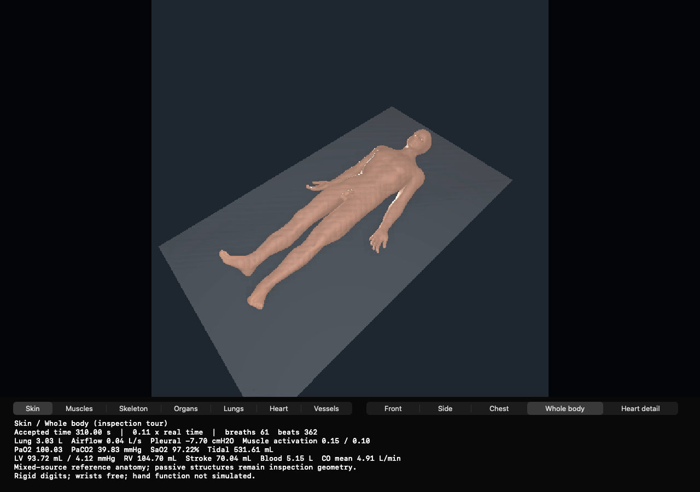
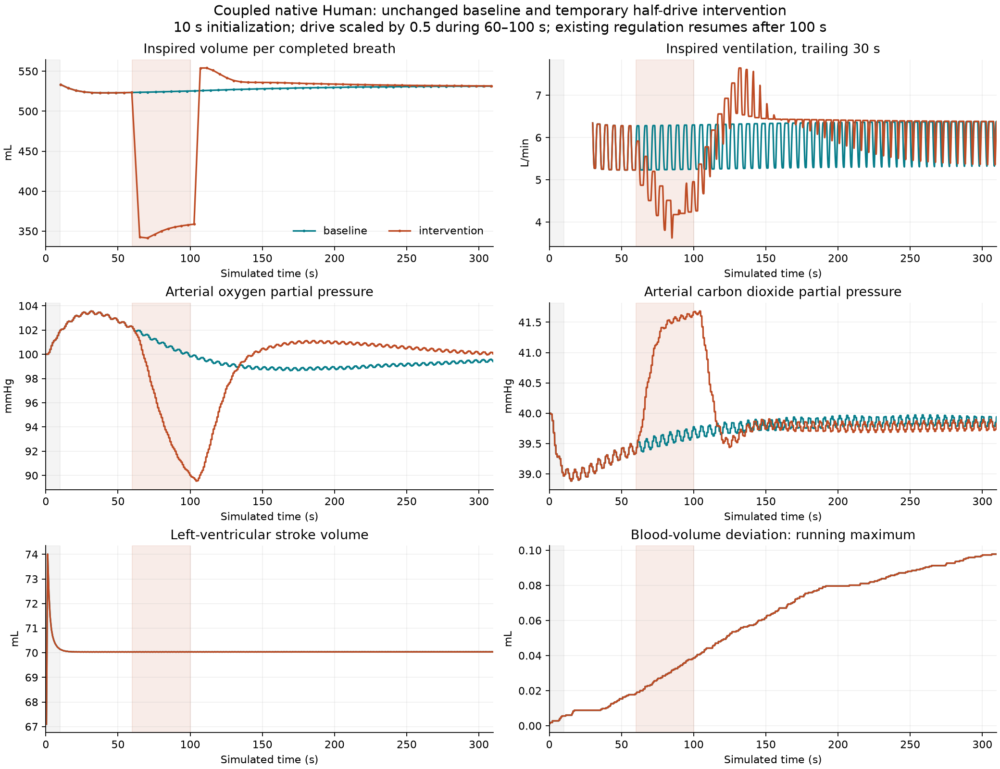
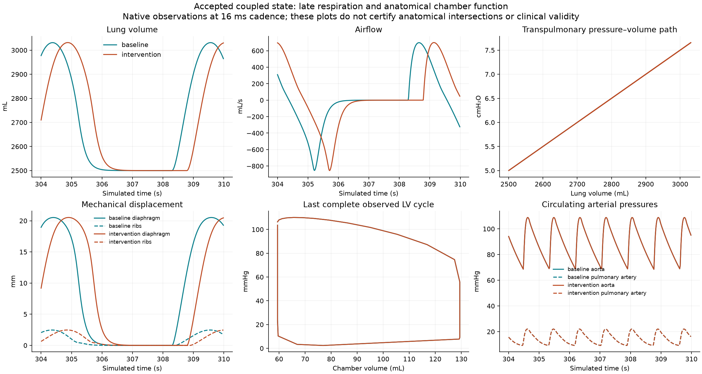

# Native resting human: matched 310-second pair 011

On the SSH Mac Mini, the integrated native scene completed two 310-second
accepted trajectories: an unchanged baseline and a reversible respiratory-drive
intervention. Each includes 300 seconds after the analysis boundary at 10 seconds,
repeated mechanically driven breaths, 350 complete cardiac
filling/ejection cycles, forward pulmonary/systemic flow, and accepted-state
oxygen/CO2 exchange with NumiBrain respiratory regulation.

This is a working integrated functional increment. **Whole-body anatomy
acceptance remains false**, and a live desktop window was not verified while the
Mini's console was locked. No claim of clinical validation or completion of the
full anatomical deliverable is made.



## Launch the retained native scene

Run on the Mac Mini with its existing pinned assets and runtime:

```sh
ssh macmini '/usr/bin/python3 /Users/n/numi-human-signed-winding-1273/tools/evidence/native-resting-matched-pair-011/analysis/reproduce_native_pair_011.py --arm baseline'
```

Use `--arm intervention` for the 60–100 second, 0.5-times respiratory-drive arm.
Add `--prepare-only` to validate and prepare without running Metal. The launcher
creates a fresh output directory, checks 8,052 pinned inputs, checks free space,
and reuses the existing owner launcher and single-native-owner lock. It refuses
changed inputs or reused output directories. It is specific to this retained
Mini installation; this repository bundle alone is not an asset installer.

The new convenience wrapper's prepare-only path was exercised against all 8,052
inputs and checked for equivalent normalized owner/native commands and
environment. Its unchanged underlying launcher executed both completed arms.
A further native run through the convenience wrapper was not performed.

## Measured response

All values below come from the matched accepted-state traces. Windows are
70–100 seconds for dose and 280–310 seconds for recovery.

| Measurement | Baseline dose | Intervention dose | Baseline recovery | Intervention recovery |
|---|---:|---:|---:|---:|
| Inspired ventilation, L/min, fixed-window positive-flow integration | 6.2967 | 4.9543 | 6.3749 | 6.3779 |
| Mean last complete tidal volume, mL | 524.40 | 350.46 | 531.22 | 531.75 |
| Mean arterial CO2, mmHg | 39.589 | 41.424 | 39.860 | 39.797 |
| Mean arterial O2, mmHg | 100.678 | 93.677 | 99.407 | 100.151 |

Pre-dose retained physiology, mechanics, surface, and support rows match
exactly. The dose differences are -1.3424 L/min ventilation, +1.8352 mmHg CO2,
and -7.0014 mmHg O2. Recovery differences are 0.04705% ventilation,
-0.06294 mmHg CO2, and +0.74428 mmHg O2. All declared direction/recovery
checks passed. Representation-rounding intervals exclude zero in both expected
gas directions; these intervals do not bound integration or biological error.

Response criteria were unchanged from the analyzer pinned **before intervention
launch, while baseline was already running**. Retained chronology corrections
take precedence over inherited “pre-pair” wording. Postflight corrections
validated the owner's intervention fingerprint transform and exact movie output
paths and fixed report assembly; they did not change response windows or gates.
Failed analysis attempts and original reports remain in this bundle. Archived analysis and launch-source snapshots keep their exact bytes with a .py.txt suffix. This preserves failed drafts and their original Mini paths without treating them as executable repository code; reproduce_native_pair_011.py is the supported scene launcher.





The fixed-window ventilation above differs from the complete-breath event-ledger
estimate because their interval endpoints differ. Baseline recovery complete
breaths give 11.5625 breaths/min and 6.1424 L/min. Do not interchange these
measurements.

## Execution and ownership

The original flat support and its actual contact forces were retained, with
64 contact iterations, 72 kg total physical mass, initialization release, rigid
hands, and 0.01 postural activation cap. There is no replacement contoured bed.
The scene uses registered mixed-source reference anatomy; it does not represent
all assets as measurements of a single individual.

The rendered anatomy derives from **BodyParts3D, © The Database Center for Life
Science**, version 4.0, under [CC Attribution 4.0 International](https://dbarchive.biosciencedbc.jp/en/bodyparts3d/lic.html).
[Source archive](https://dbarchive.biosciencedbc.jp/data/bodyparts3d/LATEST/).
Numi applies registration, posing, deformation and declared inferred surface
corrections. Muscle-tendon source data derive from
[MyoHub/myo_sim](https://github.com/MyoHub/myo_sim/tree/33c89c2bde282553dde3f526768eb3bdcfaa7649),
revision 33c89c2b, under Apache-2.0. The existing source-lock license entries,
archive hashes and active-scene provenance are retained in
`analysis/source-rights-and-attribution-001.json`.

Existing Metal articulated dynamics, MyoSim activation/mechanics and compliant
tendons, anatomical attachments, HumanIO/NumiBrain sensing and excitation,
thoracic pressure/compliance/resistance, anatomical chamber/valve circulation,
tissue gas metabolism, and accepted-state presentation retain their existing
owners. The physical, physiological, and controller update path remains Metal;
the Python scripts in this bundle prepare or analyze evidence offline.

| Owner/source | Exact revision |
|---|---|
| Human CLI used by these runs | 9e7d384d944acea41cdf5799722ba330909e90fe |
| Numi Lab native viewer/runtime source | f47429c30289fef2de2cade0962a2e2d8d91fe44 |
| NumiBrain | a1cf7218fae5d26f9aed9d845047fc6c472ad596 |
| Human offline geometry work preceding this evidence | 6b71f7c7fce6f6d7cba00a3e4afc91b104a44081 |

The retained native build was made from its recorded parent plus one dirty app
source whose bytes match f47429c. Build provenance is retained; this is not an
independent reproducible-build claim. Native binary SHA256:
`e051343771dd48acb83704bc1ef2c470530d5b3a5790f7342349f5fcc6c434b4`.
Library SHA256:
`9c307105bdb3627efd2b5ec7c73dc35bf2b1811d59baf4d73d93f89e3bec0193`.
Full argv, environment, source revisions, compiled shader identities, asset
identities, reference/inferred parameters, and launch receipts are retained.

Device: Apple M4 Pro, 12 CPU / 16 GPU cores, 24 GB, macOS 26.6, Xcode 26.6.
Both arms accepted 155,000 steps at Float32 dt approximately 0.002 seconds,
reaching 310.000014724 seconds. The post-10-second analysis interval contains
56 complete baseline breaths and 59 intervention breaths, excluding the cycle
that began before that boundary. Raw counter increments are 57 and 60. Both
contain 350 complete filling/ejection cycles and approximately 24.513 L aortic /
24.512 L pulmonary forward flow. The 10-second boundary is an analysis allowance,
not a declared runtime initialization duration or proof of steady state.

| Timing boundary | Baseline | Intervention |
|---|---:|---:|
| Owner process, seconds | 2727.727 | 2714.650 |
| Owner-process real-time factor | 0.11365x | 0.11420x |
| Outer launch wrapper, seconds | 2734.232 | 2718.066 |

Each run retained 21,563 physical submissions and 4,846 video frames. Physical
submission GPU timers account for about 94.7–94.9% of owner-process wall time;
host copies about 0.04–0.05%; render GPU about 2.3%. These nested timer shares
must not be summed. CPU anatomy audits overlapped execution; this is complete
run profiling, not an isolated per-kernel benchmark. No 0.5x claim is made.

## Numerical checks and physiological limits

Both accepted trajectories passed the source-bound gas accounting guards and
pressure-flow/compliance identities. Running maximum total blood-volume
deviation was 0.09779 mL relative to 5,150 mL. Running maximum O2 and CO2 budget
defects were 0.000233 and 0.000466 mL STPD. These are descriptive maxima, not
summed drift or independent biological validation. A monotonic running maximum
does not demonstrate monotonic physical drift.

Startup rejection checks cover the recorded in-memory physical, respiratory,
Brain/history, and presentation predecessor. Fresh-context replay is checked;
same-context retry after the multi-root rejection remains unsupported. This
does not establish general checkpoint/archive rollback or pixel rollback.

Late captured root mass-row/free-velocity products matched an offline Float32
FMA reconstruction. A remaining five-second root momentum residual of
[0.001684, -0.002003, -0.01252649] N s remains unexplained. No hidden root force
was identified; static equilibrium and full momentum closure are not claimed.

Recovery baseline means were approximately 70 beats/min, 70 mL stroke volume,
4.91 L/min cardiac output, 89.12 mmHg mean aortic pressure, and 14.77 mmHg mean
pulmonary pressure. These are described against the unchanged source-specific
reference comparisons in the owner report. The late baseline respiratory rate
11.56/min is below the cited generic 12–18/min range. Early baseline O2 and
late intervention O2 slightly exceed the chosen 100 mmHg upper comparison.
Pulmonary pressure is below the AACN 15–20 mmHg comparison; the healthy supine
review's 14 ± 3.3 mmHg cohort context supplements, and does not replace, that
failed comparison.

Reference sources: [MedlinePlus resting vital signs](https://medlineplus.gov/ency/article/002341.htm),
[AACN hemodynamic and gas reference ranges](https://aacn.s3-us-west-2.amazonaws.com/Courses/ecco/course-resources/resources/common-resources/Normal_Ranges.pdf),
[supine respiratory cohort, Table 2](https://pmc.ncbi.nlm.nih.gov/articles/PMC7253877/),
and [healthy supine pulmonary-pressure review](https://pubmed.ncbi.nlm.nih.gov/19324955/).
Model plausibility, numerical consistency, and clinical validation are separate.

The cardiovascular operating point uses fixed approximately 70/min pacing with
no autonomic cardiovascular regulation or dynamic pleural-pressure feedback
into circulation. Consequently, cardiac traces overlap between arms. Gas
exchange uses one ventilation/perfusion compartment, Hill O2 binding and
fixed-pH linear CO2, without Haldane chemistry or regional V/Q. Two aggregate
MyoSim respiratory actuators represent diaphragm/intercostal action.
Most noncardiopulmonary organs and major passive muscle surfaces are anatomical
representations, not fully simulated organ physiology.

Earlier 60-second ±20% metabolism / CO2-slope runs are linked by exact reference
configuration and matching baseline output prefix. Their runtime revisions
differ, their gas-guard identity was not verified, and 60 seconds is below the
120-second central-control time constant. They are supporting transient
parameter evidence, not a steady-state or current-pair sensitivity qualification.

## Geometry and viewer boundaries

Each arm's eight actual accepted geometry captures are steps
0, 47519, 151999, 152607, 153215, 153823, 154431, and 155000. Audits compare skin
against all 859 declared targets, test skin self-intersection and invalid
geometry, and additionally test selected muscle surfaces 63/64. Late samples
span a breathing cycle; eight captures cannot certify every intermediate step.
The early recovery overshoot near 110 seconds was not geometry-captured.
Stale original audit text saying “ten” captures is corrected by retained
sidecars; the actual schedule has eight.

These sampled skin checks do not close all passive-muscle self/inter-organ
interfaces. Prior full muscle screening found unresolved folds, including EHL
and subscapularis defects. Offline source-union repairs that failed after posing
were rejected and did not enter this pair. Achilles rows are intentionally open
at their declared calcaneal entheses; both arms retain identical reviewed
intersection sets there. Maximum posed attachment-to-bone distances of 0.455
and 0.399 mm exceed an earlier static 0.35 mm receipt bound. No closed-solid,
depth, containment, or force-weld certification follows from this check.

Both continuous native framebuffer recordings have 4,846 ordered image frames
plus five timing markers; encoded time follows wall time, approximately 45
minutes per arm. Reviews bind movie hashes, timestamps, frame counts, native
surface observations, and extracted whole-body/heart/lung views. The whole
body, original support, seven anatomical layer controls, five cameras, and
synchronized physiology are present in retained frames. Some footer text is
clipped in the reviewed lung and final whole-body frames. The locked console reported no window drawable;
onscreen interaction remains unverified.

## Evidence layout and storage

- `COPY-MANIFEST.json`: byte hashes for copied artifacts and lossless gzip
  round-trip identities.
- `native/`: both exact declarations, execution receipts, metadata, logs,
  complete coupled traces and surface traces.
- `analysis/`: final paired analysis, prior failed attempts, gas guards,
  profiles, plots, recording review and source-provenance corrections.
- `geometry/`: accepted-pose audits and declared Achilles interface evidence.
- `recording/`: movie inspection results and extracted PNG frames.
- `external-artifacts.json`: exact Mini paths, sizes and SHA256 for retained
  continuous movies, MRV accepted geometry, and larger diagnostic streams.
- `storage/`: cleanup manifests and recovery verification.

Before the pair, 13,229,129,728 measured bytes were recovered by sparse-removing
verified, clean, tracked documentation/media from obsolete worktrees. Git
recovery blobs were verified, unrelated dirty files remained unchanged, and
active assets, runtimes, accepted packs and sole research inputs were retained.
The prior worktree content is recoverable with `git sparse-checkout disable`.
